# Projects Overview

## Executive Summary

Mississippi is a .NET 9.0 event sourcing framework built on Microsoft Orleans. It provides a complete solution for:

1. **Event Sourcing** - Brooks (event streams), Aggregates, Reducers, Snapshots
2. **CQRS/Projections** - UxProjections for read models
3. **Real-time Updates** - Inlet + Aqueduct for SignalR/Orleans integration
4. **Client State Management** - Reservoir (Redux-style for Blazor)

## Solution Organization

The repository contains two solution files:

| Solution | Purpose | Projects |
|----------|---------|----------|
| `mississippi.slnx` | Core framework + tests | ~45 source + ~35 test projects |
| `samples.slnx` | Sample applications + tests | Cascade (chat), Crescent (counter) |

---

## Framework Modules (src/)

### Common (Foundation Layer)

| Project | Purpose | Dependencies |
|---------|---------|--------------|
| `Common.Abstractions` | Shared types: MississippiDefaults, IMapper<T,U>, service keys | None |
| `Common.Cosmos.Abstractions` | IRetryPolicy for Cosmos operations | None |
| `Common.Cosmos` | CosmosRetryPolicy implementation | Common.Cosmos.Abstractions |

### Aqueduct (SignalR + Orleans)

Provides Orleans-backed SignalR integration for scalable real-time messaging.

| Project | Purpose | Dependencies |
|---------|---------|--------------|
| `Aqueduct.Abstractions` | Grain interfaces, keys, options | Orleans.Sdk |
| `Aqueduct.Grains` | Orleans grain implementations | Aqueduct.Abstractions |
| `Aqueduct` | ASP.NET SignalR integration, HubLifetimeManager | Aqueduct.Abstractions, ASP.NET SignalR |

### EventSourcing.Aggregates

Command handling and aggregate management for event sourcing.

| Project | Purpose | Dependencies |
|---------|---------|--------------|
| `EventSourcing.Aggregates.Abstractions` | CommandHandlerBase, OperationResult, interfaces | Orleans.Sdk |
| `EventSourcing.Aggregates` | GenericAggregateGrain, RootCommandHandler, registries | Aggregates.Abstractions, Brooks, Reducers, Snapshots |
| `EventSourcing.Aggregates.Api` | ASP.NET controller/service base classes | Aggregates.Abstractions |
| `EventSourcing.Aggregates.Generators` | C# source generator for aggregate services | Roslyn |

### EventSourcing.Brooks (Event Streams)

Core event stream infrastructure - "Brook" is the term for an event stream.

| Project | Purpose | Dependencies |
|---------|---------|--------------|
| `EventSourcing.Brooks.Abstractions` | BrookKey, BrookEvent, storage interfaces, attributes | Orleans.Sdk |
| `EventSourcing.Brooks` | BrookWriterGrain, BrookReaderGrain, BrookCursorGrain | Brooks.Abstractions, Serialization |
| `EventSourcing.Brooks.Cosmos` | Cosmos DB storage provider, distributed locking | Brooks.Abstractions, Azure.Storage.Blobs, Azure.Cosmos |

### EventSourcing.Reducers

Pure function reducers that transform events into state.

| Project | Purpose | Dependencies |
|---------|---------|--------------|
| `EventSourcing.Reducers.Abstractions` | EventReducerBase, IEventReducer, IRootReducer | None |
| `EventSourcing.Reducers` | DelegateEventReducer, RootReducer, DI registration | Reducers.Abstractions |

### EventSourcing.Serialization

Event serialization abstractions and implementations.

| Project | Purpose | Dependencies |
|---------|---------|--------------|
| `EventSourcing.Serialization.Abstractions` | ISerializationProvider, reader/writer interfaces | None |
| `EventSourcing.Serialization.Json` | System.Text.Json implementation | Serialization.Abstractions |

### EventSourcing.Snapshots

Snapshot storage and caching for optimized aggregate rehydration.

| Project | Purpose | Dependencies |
|---------|---------|--------------|
| `EventSourcing.Snapshots.Abstractions` | ISnapshotCacheGrain, ISnapshotPersisterGrain, SnapshotEnvelope | Orleans.Sdk, Brooks.Abstractions |
| `EventSourcing.Snapshots` | SnapshotCacheGrain, SnapshotPersisterGrain, SnapshotStateConverter | Snapshots.Abstractions |
| `EventSourcing.Snapshots.Cosmos` | Cosmos DB snapshot storage | Snapshots.Abstractions, Azure.Cosmos |

### EventSourcing.UxProjections

Read-model projections for UI consumption.

| Project | Purpose | Dependencies |
|---------|---------|--------------|
| `EventSourcing.UxProjections.Abstractions` | IUxProjectionGrain, keys, subscription types | Orleans.Sdk, Brooks.Abstractions |
| `EventSourcing.UxProjections` | UxProjectionGrain, UxProjectionCursorGrain, subscription grains | UxProjections.Abstractions, Brooks |
| `EventSourcing.UxProjections.Api` | ASP.NET controller base, endpoint extensions | UxProjections.Abstractions |
| `EventSourcing.UxProjections.Api.Generators` | Source generator for projection APIs | Roslyn |

### Inlet (Projection Subscriptions)

Client-side projection subscription and update notification system.

| Project | Purpose | Dependencies |
|---------|---------|--------------|
| `Inlet.Projection.Abstractions` | ProjectionPathAttribute | None |
| `Inlet.Abstractions` | IInletStore, IProjectionRegistry, actions | Reservoir.Abstractions |
| `Inlet` | InletStore, ProjectionRegistry | Inlet.Abstractions |
| `Inlet.Orleans` | Orleans integration, InletSubscriptionGrain | Inlet.Abstractions, UxProjections |
| `Inlet.Orleans.SignalR` | InletHub for SignalR notifications | Inlet.Orleans, Aqueduct |
| `Inlet.Blazor.Server` | In-process projection notifier for Blazor Server | Inlet.Abstractions |
| `Inlet.Blazor.WebAssembly` | SignalR effect, auto-fetcher for Blazor WASM | Inlet.Abstractions, SignalR.Client |

### Reservoir (Blazor State Management)

Redux-style state management for Blazor applications.

| Project | Purpose | Dependencies |
|---------|---------|--------------|
| `Reservoir.Abstractions` | IStore, IAction, IActionReducer, IEffect, IMiddleware | None |
| `Reservoir` | Store implementation, RootReducer, DelegateActionReducer | Reservoir.Abstractions |
| `Reservoir.Blazor` | StoreComponent base class for Blazor | Reservoir.Abstractions, Blazor Components |

---

## Sample Applications (samples/)

### Cascade (Chat Application)

A full-featured chat application demonstrating the complete Mississippi stack.

| Project | Purpose |
|---------|---------|
| `Cascade.AppHost` | .NET Aspire hosting with Cosmos, Blob, Orleans |
| `Cascade.Client` | Blazor WebAssembly chat UI with Reservoir state |
| `Cascade.Contracts` | DTOs for API and projections |
| `Cascade.Domain` | Event sourcing domain: Channel, User, Conversation aggregates |
| `Cascade.Domain.L0Tests` | Unit tests for domain handlers/reducers |
| `Cascade.Grains.Abstractions` | Sample Orleans grain interfaces |
| `Cascade.L0Tests` | Unit tests for contracts/grains |
| `Cascade.L2Tests` | Aspire integration tests |
| `Cascade.Server` | ASP.NET Web API + SignalR hub |
| `Cascade.Silo` | Orleans silo host |

### Crescent (Counter Sample)

A minimal counter sample for Aspire integration testing.

| Project | Purpose |
|---------|---------|
| `Crescent.AppHost` | Aspire host with Cosmos emulator |
| `Crescent.L2Tests` | Integration tests with embedded Counter domain |

---

## Test Projects (tests/)

### Test Levels

| Level | Purpose | Infrastructure |
|-------|---------|----------------|
| L0Tests | Unit tests, pure in-memory | None |
| L1Tests | Light integration | In-memory Orleans |
| L2Tests | Full integration | Aspire + emulators |

### Architecture Tests

`Architecture.L0Tests` enforces architectural rules using ArchUnitNET:

- Naming conventions
- Layering (abstractions ↛ implementations)
- Orleans grain patterns
- Logging patterns
- Access control

### Testing Utilities

`Testing.Utilities` provides shared test infrastructure:

- `ClusterFixtureBase` for Orleans test clusters
- `InMemoryBrookStorage` for in-memory event storage
- `GrainContextMockBuilder` for mocking grain contexts

---

## Dependency Diagram

```mermaid
graph TB
    subgraph "Common Layer"
        CA[Common.Abstractions]
        CCA[Common.Cosmos.Abstractions]
        CC[Common.Cosmos]
    end

    subgraph "Reservoir (State Management)"
        RA[Reservoir.Abstractions]
        R[Reservoir]
        RB[Reservoir.Blazor]
    end

    subgraph "Event Sourcing Core"
        direction TB
        subgraph "Serialization"
            SA[Serialization.Abstractions]
            SJ[Serialization.Json]
        end
        subgraph "Reducers"
            REA[Reducers.Abstractions]
            RE[Reducers]
        end
        subgraph "Brooks (Streams)"
            BA[Brooks.Abstractions]
            B[Brooks]
            BC[Brooks.Cosmos]
        end
        subgraph "Snapshots"
            SNA[Snapshots.Abstractions]
            SN[Snapshots]
            SNC[Snapshots.Cosmos]
        end
        subgraph "Aggregates"
            AGA[Aggregates.Abstractions]
            AG[Aggregates]
            AGAPI[Aggregates.Api]
            AGGEN[Aggregates.Generators]
        end
        subgraph "UxProjections"
            UXA[UxProjections.Abstractions]
            UX[UxProjections]
            UXAPI[UxProjections.Api]
            UXGEN[UxProjections.Api.Generators]
        end
    end

    subgraph "Aqueduct (SignalR)"
        AQA[Aqueduct.Abstractions]
        AQG[Aqueduct.Grains]
        AQ[Aqueduct]
    end

    subgraph "Inlet (Projections)"
        IPA[Inlet.Projection.Abstractions]
        IA[Inlet.Abstractions]
        I[Inlet]
        IO[Inlet.Orleans]
        IOS[Inlet.Orleans.SignalR]
        IBS[Inlet.Blazor.Server]
        IBW[Inlet.Blazor.WebAssembly]
    end

    %% Common dependencies
    CC --> CCA

    %% Reservoir
    R --> RA
    RB --> RA

    %% Serialization
    SJ --> SA

    %% Reducers
    RE --> REA

    %% Brooks
    B --> BA
    B --> SA
    BC --> BA
    BC --> CA

    %% Snapshots
    SN --> SNA
    SN --> BA
    SNC --> SNA

    %% Aggregates
    AG --> AGA
    AG --> BA
    AG --> REA
    AG --> SNA
    AGAPI --> AGA
    AGGEN -.-> AGA

    %% UxProjections
    UX --> UXA
    UX --> BA
    UXAPI --> UXA
    UXGEN -.-> UXA

    %% Aqueduct
    AQG --> AQA
    AQ --> AQA

    %% Inlet
    IA --> RA
    IA --> IPA
    I --> IA
    IO --> IA
    IO --> UXA
    IOS --> IO
    IOS --> AQA
    IBS --> IA
    IBW --> IA

    %% Styling
    classDef abstractions fill:#e1f5fe
    classDef implementations fill:#c8e6c9
    classDef generators fill:#fff3e0

    class CA,CCA,RA,SA,REA,BA,SNA,AGA,UXA,AQA,IA,IPA abstractions
    class CC,R,RB,SJ,RE,B,BC,SN,SNC,AG,AGAPI,UX,UXAPI,AQG,AQ,I,IO,IOS,IBS,IBW implementations
    class AGGEN,UXGEN generators
```



---

## Entry Points

### Framework Consumers

1. **Orleans Silo Configuration**
   - Call registration methods from `*Registrations.cs` classes
   - Configure storage providers (Cosmos, Blob)

2. **ASP.NET API**
   - Use `AggregateControllerBase` or `UxProjectionControllerBase`
   - Register Aqueduct for SignalR scaling

3. **Blazor Client**
   - Configure Reservoir store with reducers and effects
   - Use Inlet components for projection subscriptions

### Key Registration Patterns

```csharp
// Orleans Silo
siloBuilder
    .AddEventSourcingBrooks()
    .AddAqueductGrains()
    .UseCosmosEventStorage(options => ...)
    .UseCosmosSnapshotStorage(options => ...);

// ASP.NET Services
services
    .AddAqueduct<THub>()
    .AddInletOrleans()
    .AddJsonSerialization();

// Blazor WebAssembly
services
    .AddReservoir()
    .AddInletBlazorWebAssembly();
```

---

## Build & Quality Infrastructure

### MSBuild Configuration

- `Directory.Build.props` - Shared project settings, analyzers, test framework
- `Directory.Packages.props` - Central Package Management (CPM)
- `global.json` - SDK version pinning

### Key Build Features

1. **Central Package Management** - All versions in one file
2. **Zero Warnings Policy** - Analyzers fail build on warnings
3. **Automatic InternalsVisibleTo** - Test projects can access internals
4. **Nullable Reference Types** - Enabled globally
5. **XML Documentation** - Generated for all projects

### Analyzers Configured

- StyleCop.Analyzers (code style)
- SonarAnalyzer.CSharp (code quality)
- IDisposableAnalyzers (resource management)
- Microsoft.VisualStudio.Threading.Analyzers (async patterns)
- Microsoft.CodeAnalysis.NetAnalyzers (.NET best practices)
