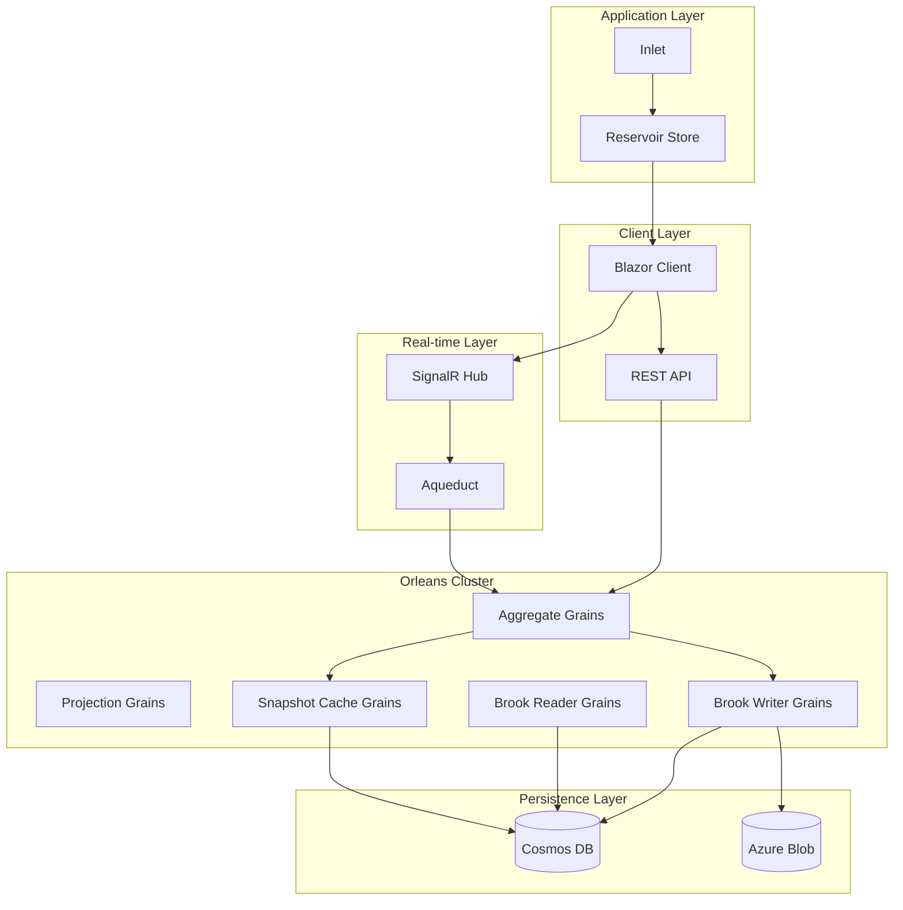
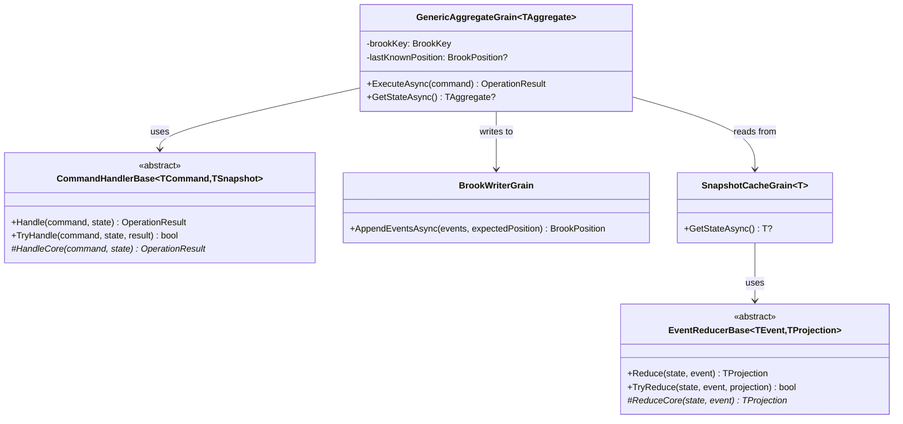
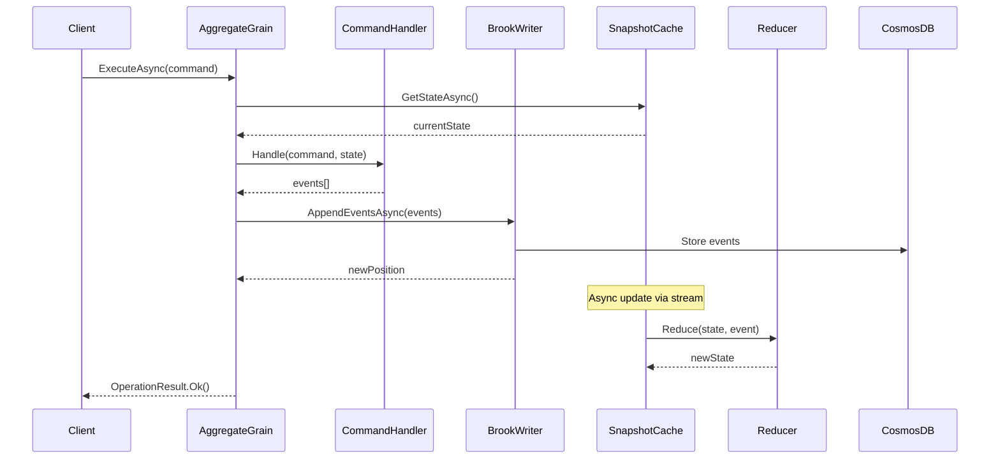
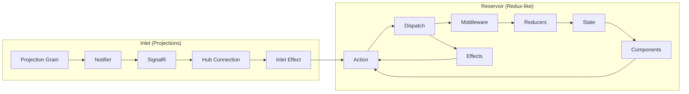
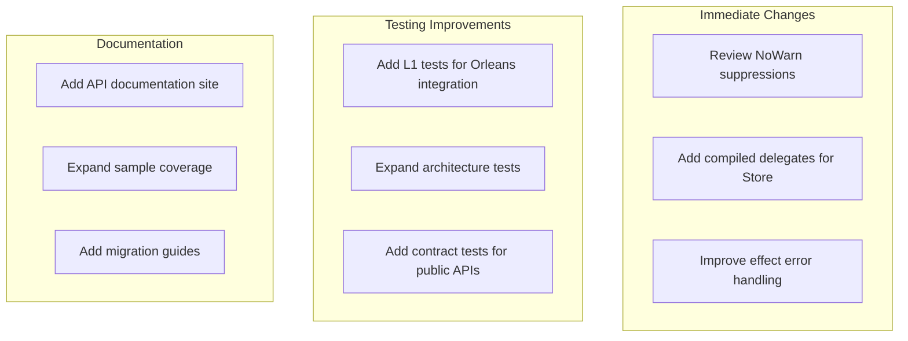
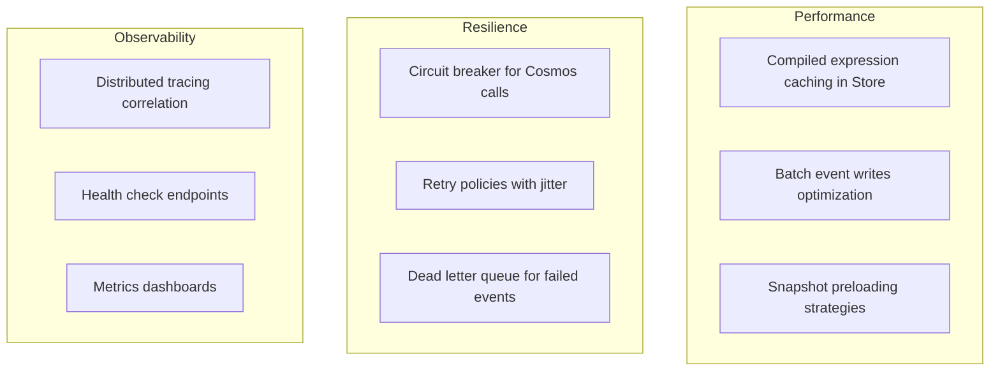
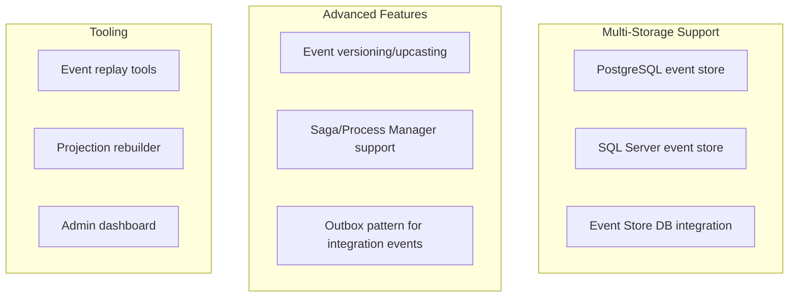
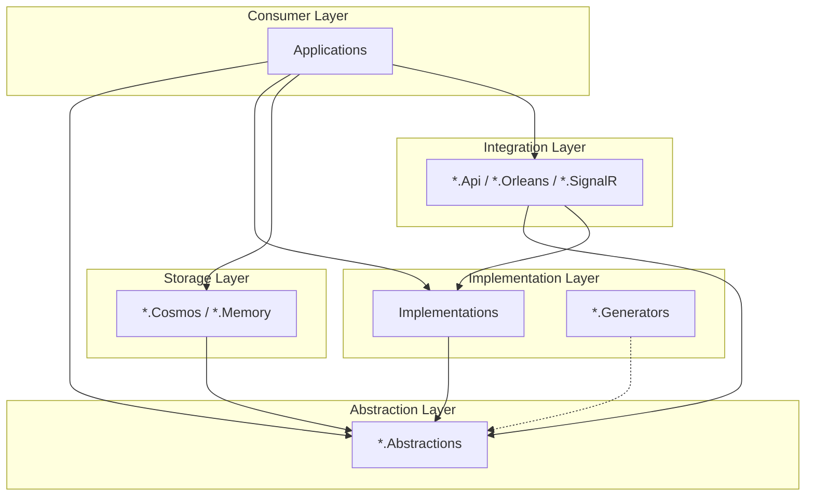

# Architecture Analysis

## Current Architecture (As-Is)

### High-Level Overview

Mississippi is an event sourcing framework built on Microsoft Orleans, following a clean layered architecture with clear separation of concerns.

### Core Domain Architecture

### Event Flow Architecture

### State Management Architecture (Blazor)

---

## Architectural Patterns Identified

### 1. CQRS Pattern

- **Command Side**: `GenericAggregateGrain` + `CommandHandlerBase` + `BrookWriterGrain`
- **Query Side**: `UxProjectionGrain` + `SnapshotCacheGrain` + Reducers

### 2. Event Sourcing Pattern

- **Event Storage**: Brooks (Cosmos DB event streams)
- **State Derivation**: Pure function reducers
- **Snapshotting**: Cached materialized views at specific versions

### 3. POCO Grain Pattern (Orleans 7+)

- Grains implement `IGrainBase` (not inherit from `Grain`)
- Dependencies injected via constructor
- Properties use get-only pattern

### 4. Abstractions Layering

- Every module has `.Abstractions` project with interfaces
- Implementations reference abstractions
- Consumers can depend on abstractions only

### 5. LoggerExtensions Pattern

- All logging via `[LoggerMessage]` source generators
- Structured, high-performance logging
- Consistent naming: `{Component}LoggerExtensions`

### 6. Redux-like State Management

- Reservoir provides Flux/Redux pattern for Blazor
- Actions, Reducers, Effects, Middleware
- Inlet integrates projections into Reservoir

---

## Architectural Strengths

### ✅ Excellent Separation of Concerns

- Clean abstractions layer for every module
- Consumers can mock/substitute at any boundary
- Test utilities provide in-memory implementations

### ✅ Type-Safe Command Handling

- Generic dispatch with compile-time type checking
- Pattern matching for command routing
- OperationResult for explicit error handling (no exceptions for business logic)

### ✅ Immutability Enforcement

- `EventReducerBase` throws if reducer returns same reference
- Aggregates are immutable records
- Events are immutable records

### ✅ Comprehensive Architecture Testing

- ArchUnitNET tests enforce patterns
- Naming conventions, layering, grain patterns all tested
- Automated enforcement prevents drift

### ✅ Observable & Instrumented

- OpenTelemetry metrics throughout
- Structured logging with LoggerExtensions
- Diagnostics classes in each module

### ✅ Developer Experience

- Central Package Management
- Comprehensive instruction files
- Sample applications demonstrate patterns

---

## Architectural Concerns

### ⚠️ Potential Issues

1. **Reflection in Store.cs (Lines 295-302)**
   - Uses reflection to call `Reduce` on generic root reducers
   - Performance concern for high-frequency dispatches
   - Could use compiled expression trees or source generators

2. **Exception Swallowing in Effects (Lines 333-340)**
   - Effects that throw exceptions are silently ignored
   - Could lose critical error information
   - Should emit error actions or log

3. **NoWarn List Size**
   - 19 analyzer rules suppressed globally
   - Some may hide legitimate issues (e.g., CA2007 ConfigureAwait)

4. **Missing Async Flow in Reducers**
   - Reducers are synchronous
   - Cannot perform async operations during reduction
   - This is correct for Redux but may cause patterns where async work is awkwardly handled

---

## Proposed Architecture (To-Be)

### Short-Term Improvements

### Medium-Term Improvements

### Long-Term Vision

---

## Layering Rules

### Allowed Dependencies

### Forbidden Dependencies

- Abstractions MUST NOT depend on implementations
- Storage providers MUST NOT depend on each other
- Source generators MUST NOT depend on runtime implementations
- Test utilities MUST NOT be referenced by production code

---

## Module Responsibility Matrix

| Module | Responsibility | Key Abstractions | Key Implementations |
|--------|---------------|------------------|---------------------|
| Common | Shared utilities, constants | IMapper, MississippiDefaults | Mappers |
| Brooks | Event stream storage | IBrookStorageProvider | CosmosRepository |
| Aggregates | Command handling | ICommandHandler, IGenericAggregateGrain | GenericAggregateGrain |
| Reducers | State derivation | IEventReducer, IRootReducer | DelegateEventReducer |
| Snapshots | Materialized views | ISnapshotCacheGrain | SnapshotCacheGrain |
| UxProjections | Read models | IUxProjectionGrain | UxProjectionGrain |
| Aqueduct | SignalR scaling | IAqueductNotifier | AqueductHubLifetimeManager |
| Inlet | Projection subscriptions | IInletStore | InletStore |
| Reservoir | Blazor state | IStore, IAction | Store |

---

## Technology Stack Assessment

| Technology | Version | Assessment | Recommendation |
|------------|---------|------------|----------------|
| .NET | 9.0 | ✅ Current LTS | Maintain |
| Orleans | 9.2.1 | ✅ Latest stable | Maintain |
| Azure Cosmos | 3.54.1 | ✅ Current | Maintain |
| .NET Aspire | 13.1.0 | ✅ Latest | Maintain |
| xUnit | 2.9.3 | ✅ Current | Maintain |
| Moq | 4.20.72 | ⚠️ Consider NSubstitute | Evaluate |
| FluentAssertions | 8.3.0 | ✅ Current | Maintain |
