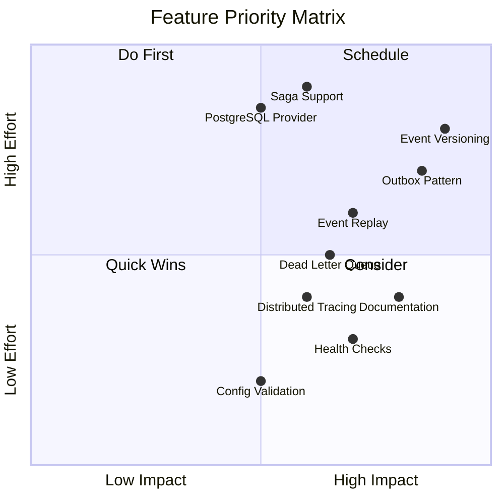

# Missing Functionality Analysis

This document identifies suspected missing capabilities in the Mississippi framework based on evidence from the repository review.

---

## Confirmed Missing Features

### 1. Event Versioning/Upcasting

**Evidence:**
- No version field in `BrookEvent` structure
- No upcaster interface or registration
- `EventStorageNameAttribute` has version parameter but no migration tooling

**File References:**
- `src/EventSourcing.Brooks.Abstractions/BrookEvent.cs` - No version field
- `src/EventSourcing.Brooks.Abstractions/Attributes/EventStorageNameAttribute.cs` - Has version parameter

**Impact:** High - Critical for production systems that need to evolve event schemas

**Recommendation:** Implement:
- Event version tracking in storage
- Upcaster interface for transforming old events
- Registration system for upcasters
- Migration tooling for batch updates

---

### 2. Outbox Pattern for Integration Events

**Evidence:**
- No outbox table/collection in storage models
- No transactional event publication mechanism
- Events written directly to Cosmos without guaranteed external publication

**File References:**
- `src/EventSourcing.Brooks.Cosmos/Storage/EventDocument.cs` - No outbox fields
- `src/EventSourcing.Brooks.Cosmos/Brooks/EventBrookWriter.cs` - Direct write only

**Impact:** High - Risk of lost integration events if external systems fail

**Recommendation:** Implement:
- Outbox collection in Cosmos
- Background processor for outbox messages
- Integration event interface
- At-least-once delivery guarantees

---

### 3. Saga/Process Manager Support

**Evidence:**
- No saga or process manager abstractions
- No compensation logic framework
- No multi-aggregate workflow coordination

**File References:**
- `src/EventSourcing.Aggregates.Abstractions/` - Only single-aggregate patterns

**Impact:** Medium - Limits complex workflow scenarios

**Recommendation:** Implement:
- ISaga/IProcessManager interfaces
- Saga state persistence
- Compensation command pattern
- Timeout handling

---

### 4. Event Replay Tooling

**Evidence:**
- No replay service or command-line tool
- No projection rebuild mechanism
- No point-in-time replay capability

**File References:**
- `src/EventSourcing.Brooks.Cosmos/Brooks/BrookRecoveryService.cs` - Recovery exists but no replay

**Impact:** Medium - Operational challenge for rebuilding projections

**Recommendation:** Implement:
- CLI tool for event replay
- Projection rebuild service
- Selective replay (by stream, time range)
- Progress tracking

---

### 5. Dead Letter Queue

**Evidence:**
- No dead letter queue configuration
- Failed events silently dropped or retried indefinitely
- No poison message handling

**File References:**
- `src/EventSourcing.Brooks/` - No DLQ references

**Impact:** Medium - Risk of losing track of problematic events

**Recommendation:** Implement:
- DLQ storage (separate container)
- Configurable retry policies before DLQ
- DLQ monitoring/alerting
- Manual replay from DLQ

---

### 6. Alternative Storage Providers

**Evidence:**
- Only Cosmos DB implementation exists
- No PostgreSQL, SQL Server, or EventStoreDB support
- In-memory storage only in tests

**File References:**
- `src/EventSourcing.Brooks.Cosmos/` - Only Cosmos
- `tests/Testing.Utilities/Storage/InMemoryBrookStorage.cs` - Test-only

**Impact:** Medium - Limits adoption for non-Azure scenarios

**Recommendation:** Implement:
- Storage provider abstraction refinement
- PostgreSQL provider
- SQL Server provider
- Development-focused in-memory provider

---

### 7. Event Store Compaction

**Evidence:**
- No compaction mechanism for long-running streams
- No archival strategy for old events
- Snapshots exist but no stream cleanup

**File References:**
- `src/EventSourcing.Snapshots/` - Snapshots but no compaction

**Impact:** Low-Medium - Performance degradation over time for very long streams

**Recommendation:** Implement:
- Compaction policy configuration
- Archive storage for compacted events
- Metadata preservation
- Compaction progress tracking

---

## Partially Implemented Features

### 1. Distributed Tracing

**Status:** Metrics exist but correlation may be incomplete

**Evidence:**
- OpenTelemetry metrics in Diagnostics classes
- No explicit Activity/TraceContext propagation in grains

**File References:**
- `src/EventSourcing.Aggregates/Diagnostics/AggregateMetrics.cs`
- `src/EventSourcing.Brooks/Diagnostics/BrookMetrics.cs`

**Gap:** Add Activity propagation through grain calls

---

### 2. Health Checks

**Status:** No framework-provided health checks

**Evidence:**
- No IHealthCheck implementations
- Aspire hosts work but no built-in health endpoints

**File References:**
- `samples/Cascade/Cascade.Server/Program.cs` - No health checks configured

**Gap:** Add IHealthCheck implementations for Cosmos, Blob, Orleans

---

### 3. Configuration Validation

**Status:** Options exist but validation may be incomplete

**Evidence:**
- Options classes use default values
- No IValidateOptions implementations visible

**File References:**
- `src/EventSourcing.Brooks.Cosmos/BrookStorageOptions.cs`
- `src/EventSourcing.Snapshots.Cosmos/SnapshotStorageOptions.cs`

**Gap:** Add options validation with meaningful error messages

---

## Documentation Gaps

### 1. API Reference

**Status:** XML docs exist but no generated reference site

**Evidence:**
- `GenerateDocumentationFile` enabled in Directory.Build.props
- No docfx or similar API site generation

**Recommendation:** Add API reference generation to CI

---

### 2. Docusaurus Content

**Status:** Only Reservoir documented

**Evidence:**
- `docs/Docusaurus/docs/reservoir/` exists
- No equivalent for Brooks, Aggregates, etc.

**File References:**
- `docs/Docusaurus/docs/` - Limited content

**Recommendation:** Expand to cover all modules

---

### 3. Migration Guides

**Status:** No upgrade guidance

**Evidence:**
- README notes "EARLY ALPHA" but no version migration docs
- No breaking change documentation

**Recommendation:** Create upgrade guides for each version

---

## Security Considerations

### 1. No Built-in Authorization

**Status:** Not implemented

**Evidence:**
- No authorization attributes on grains
- No claims/roles checking in command handlers

**Impact:** Medium - Consumers must implement their own authorization

**Recommendation:** Consider adding:
- Authorize attribute for grains
- Command authorization hooks
- Audit logging for commands

---

### 2. No Event Encryption

**Status:** Not implemented

**Evidence:**
- Events stored as plain JSON
- No encryption-at-rest beyond Cosmos default

**Impact:** Low-Medium - May be required for sensitive data

**Recommendation:** Consider:
- Field-level encryption option
- Customer-managed keys support
- Sensitive data handling patterns

---

## Comparison with Marten/EventStoreDB

| Feature | Mississippi | Marten | EventStoreDB |
|---------|-------------|--------|--------------|
| Event Versioning | ❌ Missing | ✅ Full | ✅ Full |
| Upcasting | ❌ Missing | ✅ Full | ✅ Full |
| Projections | ✅ UxProjections | ✅ Inline/Async | ✅ Built-in |
| Subscriptions | ✅ Inlet | ✅ Daemon | ✅ Persistent |
| Multi-tenancy | ❌ Not explicit | ✅ Built-in | ✅ Built-in |
| Compaction | ❌ Missing | ✅ Archiving | ✅ Scavenging |
| Outbox | ❌ Missing | ✅ Built-in | ❌ External |
| Sagas | ❌ Missing | ❌ External | ❌ External |
| Real-time | ✅ SignalR/Aqueduct | ❌ External | ✅ gRPC streams |
| Orleans Integration | ✅ Native | ❌ None | ❌ None |

---

## Priority Matrix

