# Clean Squad Workflow Diagram

This document is a visual companion to [WORKFLOW.md](WORKFLOW.md).

- It MUST mirror the current workflow exactly.
- It MUST NOT add, remove, simplify, reinterpret, or improve any workflow step, loop, responsibility, or policy.
- If this diagram and `WORKFLOW.md` ever differ, `WORKFLOW.md` is authoritative.

```mermaid
flowchart TD
    Authority["Authority note:<br/>WORKFLOW.md is authoritative.<br/>This Mermaid file is a visual companion only."]
    Principles["Cross-cutting note:<br/>All agents apply first principles and CoV.<br/>cs Product Owner is the only human-facing agent."]
    SharedState["Cross-cutting note:<br/>All agents share state through .thinking/&lt;task&gt;/.<br/>Activity-log and handover updates are mandatory."]
    Delegation["Cross-cutting note:<br/>Before every runSubagent, verify the approved Agent Roster in WORKFLOW.md.<br/>If no approved fit exists, stop, record the blocker, and ask the user how to proceed."]

    subgraph EntryPoint["Entry Point"]
        User([User request]) --> ProductOwner["cs Product Owner is the only human entry point"]
    end

    subgraph Phase1["Phase 1: Intake & Discovery"]
        P1Setup["Create .thinking/&lt;date&gt;-&lt;task-slug&gt;/, state.json, activity-log.md, and 00-intake.md"]
        P1Ask["Ask 5 discovery questions"]
        P1Clear{"Requirements sufficiently clear?"}
        P1Analyze["Invoke cs Requirements Analyst for gap analysis and the next 5 questions"]
        P1Record["Record answers and ask the next 5 questions"]
        P1Synthesis["Write 01-discovery/requirements-synthesis.md"]

        P1Setup --> P1Ask --> P1Clear
        P1Clear -- No --> P1Analyze --> P1Record --> P1Clear
        P1Clear -- Yes --> P1Synthesis
    end

    subgraph Phase2["Phase 2: Three Amigos + Adoption"]
        P2Invoke["Invoke cs Business Analyst, cs Tech Lead, cs QA Analyst, and cs Developer Evangelist one at a time"]
        P2Outputs["Each sub-agent writes its perspective document"]
        P2Synthesis["Write 02-three-amigos/synthesis.md"]
        P2Gaps{"Critical gaps identified?"}
        P2Questions["Ask the user additional questions before proceeding"]

        P2Invoke --> P2Outputs --> P2Synthesis --> P2Gaps
        P2Gaps -- Yes --> P2Questions
    end

    subgraph Phase3["Phase 3: Architecture & Design"]
        P3Architect["Invoke cs Solution Architect"]
        P3Design["Produce 03-architecture/solution-design.md"]
        P3C4["Invoke cs C4 Diagrammer"]
        P3Diagrams["Produce Context and Container diagrams, plus Component or omission rationale"]
        P3Adr["Invoke cs ADR Keeper"]

        P3Architect --> P3Design --> P3C4 --> P3Diagrams --> P3Adr
    end

    subgraph Phase4["Phase 4: Planning & Review Cycles"]
        P4Draft["Combine outputs into 04-planning/draft-plan-v1.md"]
        P4Review["Invoke approved planning reviewers from the Agent Roster"]
        P4Feedback["Each reviewer reads the plan and produces feedback"]
        P4Synth["Invoke cs Plan Synthesizer to categorize feedback"]
        P4Revise["Revise the plan"]
        P4More{"More review cycles needed?"}
        P4Final["Write 04-planning/final-plan.md"]

        P4Draft --> P4Review --> P4Feedback --> P4Synth --> P4Revise --> P4More
        P4More -- Yes --> P4Review
        P4More -- No --> P4Final
    end

    subgraph Phase5["Phase 5: Implementation"]
        P5Branch["Create a feature branch from main"]
        P5Lead["Invoke cs Lead Developer with the next slice of work"]
        P5Code["cs Lead Developer writes a small, focused increment"]
        P5Tests["Invoke cs Test Engineer to write or validate tests"]
        P5Build["Run the build and verify zero warnings"]
        P5RunTests["Run tests and verify they pass"]
        P5Guard["Invoke cs Commit Guardian"]
        P5Issues{"cs Commit Guardian issues found?"}
        P5Remediate["cs Lead Developer remediates cs Commit Guardian findings in the current increment"]
        P5Commit["Commit with a scoped message and record increment artifacts"]
        P5More{"More plan items to implement?"}
        P5Full["After all increments, run the full build, full tests, and mutation tests if Mississippi"]

        P5Branch --> P5Lead --> P5Code --> P5Tests --> P5Build --> P5RunTests --> P5Guard --> P5Issues
        P5Issues -- Yes --> P5Remediate --> P5Tests
        P5Issues -- No --> P5Commit --> P5More
        P5More -- Yes --> P5Lead
        P5More -- No --> P5Full
    end

    subgraph Phase6["Phase 6: Comprehensive Code Review"]
        P6Diff["Use git diff main...HEAD to identify changed files"]
        P6Review["Invoke cs Reviewer Pedantic, cs Reviewer Strategic, cs Reviewer Security, cs Reviewer DX, cs Reviewer Performance, and cs Developer Evangelist in sequence"]
        P6Experts["Invoke relevant approved domain experts from the Agent Roster"]
        P6Synthesis["Synthesize all review output"]
        P6Findings{"Review findings remain?"}
        P6Remediate["Fix each finding or document why it was declined"]

        P6Diff --> P6Review --> P6Experts --> P6Synthesis --> P6Findings
        P6Findings -- Yes --> P6Remediate --> P6Review
    end

    subgraph Phase7["Phase 7: QA Validation"]
        P7Lead["Invoke cs QA Lead to review test strategy and coverage"]
        P7Exploratory["Invoke cs QA Exploratory"]
        P7Mutation["Invoke cs Test Engineer for mutation testing validation"]
        P7Gaps{"QA gaps identified?"}
        P7Remediate["Feed QA gaps back for remediation of the current increment"]

        P7Lead --> P7Exploratory --> P7Mutation --> P7Gaps
        P7Gaps -- Yes --> P7Remediate
    end

    subgraph Phase8["Phase 8: Documentation"]
        P8Scope["Assess documentation scope from the branch diff and .thinking artifacts"]
        P8UserFacing{"User-facing changes exist?"}
        P8Skip["Record the documentation skip reason in scope-assessment.md"]
        P8Writer["Invoke cs Technical Writer"]
        P8Drafts["Create the evidence map, classify page types, draft pages, and publish verified pages"]
        P8Review["Run the documentation review cycle with cs Doc Reviewer and cs Developer Evangelist"]
        P8MustFix{"cs Doc Reviewer Must Fix findings remain?"}
        P8Fixes["Re-invoke cs Technical Writer for each Must Fix or Should Fix finding and record remediation"]
        P8Validate["Validate the documentation quality gates"]

        P8Scope --> P8UserFacing
        P8UserFacing -- No --> P8Skip
        P8UserFacing -- Yes --> P8Writer --> P8Drafts --> P8Review --> P8MustFix
        P8MustFix -- Yes --> P8Fixes --> P8Review
        P8MustFix -- No --> P8Validate
    end

    subgraph Phase9["Phase 9: PR Creation & Merge Readiness"]
        P9Scribe["Invoke cs Scribe to compile the thinking trail"]
        P9Manager["Invoke cs PR Manager to create the PR and monitor CI"]
        P9Wait["After pushing to an open PR, wait 300 seconds"]
        P9Poll["Poll for unresolved review comments"]
        P9Comments{"New unaddressed comments?"}
        P9Scope{"Comment is in scope?"}
        P9Address["Fix, commit, push, reply with evidence, and resolve the thread"]
        P9OutOfScope["Reply with reasoned explanation and leave the thread open for the reviewer"]
        P9Cap{"Iteration cap reached?"}
        P9Ready["Merge readiness confirmed"]
        P9Stop(["Stop and report remaining unresolved threads for human review"])
        P9Done([Done])

        P9Scribe --> P9Manager --> P9Wait --> P9Poll --> P9Comments
        P9Comments -- Yes --> P9Scope
        P9Scope -- Yes --> P9Address --> P9Cap
        P9Scope -- No --> P9OutOfScope --> P9Cap
        P9Cap -- No --> P9Wait
        P9Cap -- Yes --> P9Stop
        P9Comments -- No --> P9Ready --> P9Done
    end

    P2Gaps -- No --> P3Architect
    P2Questions --> P3Architect
    P1Synthesis --> P2Invoke
    P3Adr --> P4Draft
    P4Final --> P5Branch
    P5Full --> P6Diff
    P6Findings -- No --> P7Lead
    P7Remediate --> P5Tests
    P7Gaps -- No --> P8Scope
    P8Skip --> P9Scribe
    P8Validate --> P9Scribe

    Authority -.-> ProductOwner
    Principles -.-> ProductOwner
    SharedState -.-> P1Setup
    Delegation -.-> ProductOwner

    P3AdrNote["Architecture note:<br/>For each significant architectural decision, invoke cs ADR Keeper to publish an ADR."]
    P3ExpertNote["Architecture note:<br/>The Product Owner may invoke approved domain experts from the Agent Roster when specialist architectural input is needed."]
    P4Note["Planning note:<br/>Repeat for 3 to 5 review cycles total.<br/>The reviewer subset varies by task complexity."]
    P5Note["Implementation note:<br/>Each increment is small enough to review like its own PR and includes relevant tests.<br/>TDD is used where practical."]
    P6Note["Code review note:<br/>Every changed file is reviewed by at least cs Reviewer Pedantic and cs Reviewer Strategic."]
    P8Note["Documentation note:<br/>Documentation may be skipped only when all documented skip criteria are true and the evidence is recorded."]
    P9Note["PR note:<br/>Merge readiness also requires a PR, green CI, no unresolved review comments, and no open review threads."]

    P3AdrNote -.-> P3Adr
    P3ExpertNote -.-> P3Design
    P4Note -.-> P4Review
    P5Note -.-> P5Lead
    P6Note -.-> P6Review
    P8Note -.-> P8UserFacing
    P9Note -.-> P9Ready
```

