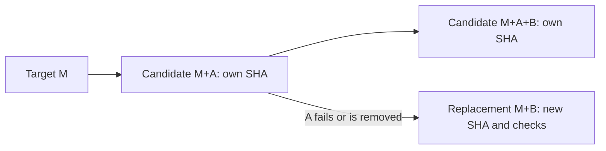

# CI and merge-queue operations

This runbook describes the fresh CI stack tracked in [#1030](https://github.com/Gibbs-Morris/mississippi/issues/1030). Source and settings were audited on 2026-10-08. Settings, memberships, branch revisions and hosted results must be refreshed before rollout. Merging the code does not deploy credentials or activate a production queue.

## What the queue validates

A queue candidate has its own SHA. With target revision M and queued changes A then B, the first candidate contains M+A and the next contains M+A+B. A docs-only B can therefore contain A's code changes. Cleanup and issue-reference validation must consider the complete candidate prefix, not only the newest PR or the payload's predecessor base. If the trusted queue resolver is unavailable, the issue-reference check fails closed; associated-PR discovery cannot establish candidate validation.

Removal, failure, reordering or target movement can invalidate work and produce replacement candidates. An old result does not validate a new SHA. Candidate workflows need `merge_group` independently of PR/push triggers. [GitHub's queue guide](https://docs.github.com/en/repositories/configuring-branches-and-merges-in-your-repository/configuring-pull-request-merges/managing-a-merge-queue) explains rebuilding and the distinction between build concurrency and merge limits.

[Native stacks](https://docs.github.com/en/pull-requests/get-started/about-stacked-prs) inherit the bottom target's protections and PR CI. Intermediate `codex/` bases do not require widening workflow branch filters. Use `gh stack` for the reviewed prefix; preparation, merge authorization and queue activation are separate decisions.

## Production protection contract

At the audit, active ruleset **3461650** supplied all six effective `main` rules. It had no merge queue and no bypass actors. Preserve deletion/force-push protection, linear history and the complete review contract: zero general approvals configured, CODEOWNER approval required, stale approvals dismissed, all threads resolved, extra approval for unattributed changes, last-push approval disabled and squash-only merges. Zero general approvals does not waive CODEOWNER review.

Required checks are strict/current-base checks, enforced on branch creation. All eleven exact context/provider pairs must remain:

| Required context | GitHub App ID |
| --- | --- |
| `SonarCloud Code Analysis` | 12526 (Sonar) |
| `Build (ubuntu-latest, mississippi.slnx)` | 15368 (Actions) |
| `Build (ubuntu-latest, samples.slnx)` | 15368 (Actions) |
| `L0 Unit Tests (ubuntu-latest, mississippi.slnx)` | 15368 (Actions) |
| `L0 Unit Tests (ubuntu-latest, samples.slnx)` | 15368 (Actions) |
| `L1 Light Infrastructure Tests (ubuntu-latest, mississippi.slnx)` | 15368 (Actions) |
| `L1 Light Infrastructure Tests (ubuntu-latest, samples.slnx)` | 15368 (Actions) |
| `L2 Integration Tests (Aspire) (ubuntu-latest, mississippi.slnx)` | 15368 (Actions) |
| `L2 Integration Tests (Aspire) (ubuntu-latest, samples.slnx)` | 15368 (Actions) |
| `cleanup (ubuntu-latest, mississippi.slnx)` | 15368 (Actions) |
| `cleanup (ubuntu-latest, samples.slnx)` | 15368 (Actions) |

Retain SonarCloud code-scanning protection with `security_alerts_threshold: high_or_higher` and `alerts_threshold: errors`. [GitHub excludes merge groups from code-scanning merge protection](https://docs.github.com/en/code-security/concepts/code-scanning/merge-protection); the genuine candidate Sonar gate needs a live security negative control. An Actions job named like Sonar cannot satisfy app 12526.

The assigned Sonar gate, `mississippi-sdlc` (126237), retains eight criteria: new security, reliability and maintainability ratings A; 100% reviewed new hotspots; new duplication threshold 6%; zero new code smells and violations; new coverage threshold 60%. Evaluation can omit a metric with no eligible new data. An omitted coverage result is not measured coverage or permission to change the assigned policy.

[CODEOWNERS](CODEOWNERS) uses the visible, write-enabled `@Gibbs-Morris/owners` team. At audit it had one member and the organization had one owner. A second team maintainer and organization owner are still needed for recovery if that account becomes unavailable; a team name alone does not create another administrator.

### Additional gates required before queue release

The eleven pairs above describe today's settings. A workflow running on `merge_group` does not make its result a merge requirement. Before releasing the pilot Hold, the separately approved ruleset diff must also require these nine exact candidate contexts: the eight test/lint/build/metadata contexts from Actions app **15368**, and the issue-reference status from a separately reviewed dedicated trusted publisher whose expected app ID must be established before deployment.

| Additional required context | Producer |
| --- | --- |
| `pwsh-tests (ubuntu-latest)` | PowerShell Tests |
| `pwsh-tests (windows-latest)` | PowerShell Tests |
| `AppHost locked restore (ubuntu-latest)` | Aspire AppHost Locked Restore |
| `AppHost locked restore (windows-latest)` | Aspire AppHost Locked Restore |
| `L3 Spring E2E (Smoke)` | L3 Tests |
| `Markdown Lint` | Markdown Lint |
| `Build Docusaurus Site` | Docusaurus Build |
| `Validate src csproj descriptions` | Src Csproj Description Check |
| `PR Issue Reference` | Dedicated trusted publisher; implementation/deployment required |

Current repository readiness tooling expects the `Validate repository issue reference` job check. The proposed trusted-publisher production gate instead requires the published `PR Issue Reference` commit status; neither context is among today's eleven configured production requirements. On `pull_request_target`, the job belongs to the base revision while the workflow explicitly posts this status to the PR merge/head SHA; on `merge_group` it posts to the candidate SHA. The current Actions-produced status is not sufficient for the proposed trusted-publisher binding: another candidate workflow can publish that same context through the shared Actions app.

The dedicated publisher must validate current PR issue references or the complete live candidate prefix using immutable default-branch validators outside candidate-controlled execution, recheck source identity, and publish on the exact PR merge/head or candidate SHA. Its credential must remain outside candidate workflows; forwarding an unauthenticated candidate result or accepting the shared Actions app does not provide this boundary. Review its implementation and installed app ID, and prove invalid/missing issue references and wrong-provider successes cannot permit landing on both paths before Hold release.

Publisher implementation/deployment and retirement of the existing Actions status writer are explicit remaining prerequisites tracked in #1030. Deploy the dedicated publisher and, in a separate source-Action change, permanently rename the context in `pr-issue-reference.yml` to `PR Issue Reference (validator)` while retaining the workflow name/validation triggers used for source correlation. Pause publication, block old-definition reruns, drain all old source attempts, deploy and verify the rename, then obtain fresh dedicated-app-only `PR Issue Reference` evidence before binding the required context. [Combined commit status selects the latest state per context](https://docs.github.com/en/rest/commits/statuses#get-the-combined-status-for-a-specific-reference); an old shared-provider write must not race with the dedicated publisher. No default-off flag may restore the legacy required-context writer after binding. This runbook does not implement or deploy that migration; incomplete retirement or an unavailable trusted publisher keeps release blocked.

Preserve every existing pair and protection. The twenty individual contexts above are a proposal, not settings already applied. [GitHub accepts skipped and neutral required checks](https://docs.github.com/en/repositories/configuring-branches-and-merges-in-your-repository/managing-protected-branches/about-protected-branches#require-status-checks-before-merging), so requiring those contexts and their providers alone cannot enforce actual execution.

Before Hold release, also implement, deploy and require the `Merge Queue Required Checks` commit status from a separately reviewed trusted aggregate publisher with an established dedicated App binding. This makes twenty-one proposed requirements. Its trusted default-branch code must authenticate the exact current PR/queue candidate and current workflow attempts, and post success only when every individual promoted gate has an actual success result from its expected provider on that candidate. Missing, pending, failed, canceled, skipped, neutral, stale, ambiguous or wrong-provider evidence must yield a blocking status. Candidate-controlled code and the shared Actions app must have no aggregate publishing authority. A local readiness report or candidate Actions aggregate is insufficient. The aggregate implementation, credentials, provider binding and live proof remain explicit prerequisites in #1030; none is supplied by this runbook.

Verify exact names, expected providers and fresh candidate-SHA results after deployment. Deliberately fail each individual gate, and exercise skipped/neutral and wrong-provider aggregate inputs under the enforced Hold. Obtain gate-specific unmasked evidence that the trusted aggregate remains blocking, then prove all-success permits its success. Non-landing while the Hold fails is not proof that another gate independently blocks merging.

Delivery policy still requires all applicable PR checks. Docusaurus reports on every applicable ordinary PR and queue candidate; readiness tooling uses the verified native stack trunk for applicability and rejects malformed or changing trunk metadata. Project descriptions still have a workflow-level PR path filter, which their separate Action PR must remove. Deploy both stable reporters before their required-context promotions; implementation, deployment and live proof remain mandatory release prerequisites tracked in #1030. Keep the Hold enforced while either reporter, any required provider binding or its live failure proof is missing. Other inventory results are not automatic queue protections; any further intended candidate gate needs an enforceable required context before Hold release.

Readiness selects the current check within each provider, check name, workflow and event. Duplicate Actions checks are bound to authenticated workflow-run metadata and ordered by current check execution time or fresh queued/unstarted attempt metadata, with unique positive workflow run numbers breaking equal-time ties between first attempts; reruns within one run use check start time. A later attempt of an older run cannot be hidden by a newer-created success; equal-time ties involving reruns remain blocking. A newer queued, failed or cancelled run remains blocking. Evidence from another provider, workflow or event is retained, and unavailable or ambiguous ordering fails closed. Both snapshots select current checks independently and include check IDs and provider IDs in their stability fingerprints, so a successful replacement during collection still requires a fresh snapshot.

## Workflow inventory

There are 25 workflow files: 24 executable YAML definitions and the guideline workflow's Markdown authoring source. The repaired stack has 19 distinct external Action references using 16 unique repository/commit pairs, all verified against upstream commits. This inventory describes source behavior, not proof of live candidate execution.

In the table, **PR** means targets `main`, `feature/**` and `topic/**` unless stated otherwise; **queue** means `merge_group` (`checks_requested` for the explicitly filtered definitions); **manual** means `workflow_dispatch`. Additional checks run when applicable and must pass under delivery policy. They are not among today's eleven configured required contexts; the additional-gate section above defines mandatory promotion and Hold-release requirements.

| Workflow source | Events | Role and important behavior |
| --- | --- | --- |
| [full-build.yml](workflows/full-build.yml) | PR, queue, manual | Required Build contexts; Ubuntu, both solutions, Release, warnings as errors, independent restore/build. |
| [l0-tests.yml](workflows/l0-tests.yml) | PR, queue, manual | Required L0 contexts; both solutions, own restore/build followed by real L0 execution. |
| [l1-tests.yml](workflows/l1-tests.yml) | PR, queue, manual | Required L1 contexts; Mississippi executes `Inlet.Client.L1Tests`. Samples has no declared L1 projects and records N/A after build; adding an L1 project executes tests. |
| [l2-tests.yml](workflows/l2-tests.yml) | PR, queue on main, manual | Required L2 contexts; both solutions, own build and real infrastructure tests; test failure fails the job. |
| [cleanup.yml](workflows/cleanup.yml) | PR, queue on main, manual | Required cleanup contexts; verifies exact checkout/payload and cumulative ancestry/range, literal changed paths and native errors; fails on tracked cleanup churn. Manual scope is full. |
| [sonar-cloud.yml](workflows/sonar-cloud.yml) | PR, queue on main, push main, manual | Existing Sonar source identity/name/path (workflow 141036039). Routing off: legacy scanner executes. Routing on: fixed tokenless source completion; trusted controller supplies genuine Sonar. |
| [sonar-trusted-analysis.yml](workflows/sonar-trusted-analysis.yml) | Completed SonarCloud `workflow_run`; manual source-run ID | Additional controller workflow; automatic intake defaults off, runs trusted default-branch code and verifies fresh genuine app 12526 evidence. |
| [powershell-tests.yml](workflows/powershell-tests.yml) | PR, queue, manual | Additional Windows/Ubuntu canonical PowerShell suites; Pester 5.7.1+ installation is not an exact version pin. Measured Sonar collection uses 5.7.1. |
| [aspire-locked-restore.yml](workflows/aspire-locked-restore.yml) | PR, queue, manual | Additional Windows/Ubuntu locked restores for four AppHost projects. |
| [l3-tests.yml](workflows/l3-tests.yml) | PR, queue, manual | Additional Spring browser tests; Smoke by default, manual Full option, Ubuntu 24.04, 25-minute job, diagnostic artifacts. |
| [markdown-lint.yml](workflows/markdown-lint.yml) | PR, queue on main, manual | Additional full-repository Markdown validation through pinned Super-Linter. |
| [docusaurus.yml](workflows/docusaurus.yml) | PR opened/synchronize/reopened/edited/stacked, queue on main, push main, manual | Additional Node 24 site build and Playwright tests; PR and queue runs have no paths filter. Pages upload/deploy only on push main using `github-pages`. |
| [src-csproj-description-check.yml](workflows/src-csproj-description-check.yml) | PR/push with `src/**/*.csproj` paths and no target filter, queue on main, manual | Additional project description metadata validation; queue runs without a paths filter. |
| [pr-issue-reference.yml](workflows/pr-issue-reference.yml) | PR target opened/edited/reopened/synchronize, no target filter; queue | Metadata-only required-by-policy issue reference check; not a configured required context. Trusted default-branch script, complete live queue prefix and rechecks; never executes candidate code. |
| [pr-labeler.yml](workflows/pr-labeler.yml) | PR opened/synchronize/reopened/edited, no target filter | File labels. Title/body edits skip before job concurrency; base edits still run. No queue validator. |
| [pr-semver-labeler.yml](workflows/pr-semver-labeler.yml) | PR target opened/reopened/edited, no target filter | Title metadata/semver labels with the established inline JS integration; no candidate checkout or queue validator. |
| [pr-metrics.yml](workflows/pr-metrics.yml) | PR opened/reopened/synchronize, no target filter | Advisory metrics with `continue-on-error`; no queue validator. |
| [issue-contract.yml](workflows/issue-contract.yml) | Issues opened/edited/labeled/reopened | Trusted default-branch validator for agent-task, `[Task]` or ContractV1 issues. Repaired checkout pin; no PR/queue/manual trigger. |
| [copilot-setup-steps.yml](workflows/copilot-setup-steps.yml) | PR/push with setup/SDK/client-lock/tooling paths and no target filter; manual | Development environment setup, including Core/Docs prerequisites. No queue validator or configured required context. |
| [project-reference-hygiene-gate.yml](workflows/project-reference-hygiene-gate.yml) | Manual only | Both solutions with ReferenceTrimmer 3.4.5; additional reference-hygiene check, not queue CI. |
| [stryker.yml](workflows/stryker.yml) | Sunday 03:17 UTC; manual | Weekly report-only mutation analysis, 180-minute timeout. Execution/report failures matter; no repository-wide mandatory mutation score. |
| [nuget-release.yml](workflows/nuget-release.yml) | Push `release/**` | Package build/pack/artifacts and OIDC publication through `nuget-release`; no queue publication. |
| [nuget-prerelease.yml](workflows/nuget-prerelease.yml) | Manual only | Build/pack may start on a selected ref. Publication environment `nuget-prerelease` has an exact main branch policy; an explanatory comment is not a workflow trigger filter. |
| [csharp-guideline-improver.md](workflows/csharp-guideline-improver.md), [csharp-guideline-improver.lock.yml](workflows/csharp-guideline-improver.lock.yml) | Weekdays 19:06 UTC; manual | Markdown authoring plus generated executable lock; creates draft PRs/decision issues through safe outputs. No queue validator. Maintain the source and regenerate the lock. |

Build/L0/L1/L2 each restore and build independently. Test `--no-build` follows that job's own build; there is no cross-job build reuse. [Directory.Build.props](../Directory.Build.props) creates dependency lock files, but ordinary solution restores are not explicit locked-mode restores. Aspire validation and the trusted controller explicitly use locked restore.

L0/L1/L2 use the shared solution-test contract and per-project reports; declared suites cannot silently run zero tests. L1 N/A and cleanup no-op decisions still happen after preparation. The stack's correctness fixes do not deliver earlier decisions or measured throughput gains. Use the [local command mapping](../eng/src/agent-scripts/README.md#github-actions-mapping) and each workflow for exact command/environment differences.

## Sonar routing and cancellation

Read the [trusted controller design and deployment contract](merge-queue-sonar-controller.md) before changing routing or credentials. `SONAR_TRUSTED_ANALYSIS_ENABLED` was absent at audit. Off/absent preserves legacy analysis; true routes source events to a fixed, credential-free message and the default-branch controller. Source success and the skipped `Build (ubuntu-latest)` worker are not the required Sonar check.

A completed source is correlated by repository, run ID/attempt, event, ref, head and current PR/live queue membership. Host scripts come from an attested immutable default-branch checkout. The controller's `sonar-analysis` environment requires the exact default branch, no tags/wildcards, and a unique `SONAR_ANALYSIS_TOKEN`. Globally accessible analysis tokens are rejected. Candidate build/test stages have no analysis token, host socket, upload cache or writable tooling; protected begin/end use fresh containers and a bounded validated report handoff. Report validation protects credentials but does not prove malicious build code cannot forge analysis data; review remains necessary.

The Sonar source workflow cancels superseded PR runs, not distinct queue refs. The labeler excludes irrelevant edits before joining concurrency. Protected uploads serialize by validated PR/branch identity with cancellation disabled; GitHub can replace a pending request with the newest one. Fresh identity checks reject stale queued work. Do not cancel unrelated queue candidates or reuse provider evidence from a canceled/rebuilt SHA.

Intake has a five-minute job bound and analysis a 120-minute bound. Automatic baseline waiting has up to 31 attempts and thirty one-minute sleeps per pass, before execution and before upload; API/runner/build/provider time is additional. Source and provider updates are not atomic. An ordinary PR's passing time does not establish fit within a queue timeout.

## Reviewed rollout proposal

The following is a proposal requiring separate operational approval and live proof. Production queue activation, credential migration and delivery merges were not authorized by stack preparation.

1. Obtain every applicable current-head/base CI result and review/CODEOWNER approval, then land the reviewed code. Audit effective rules, team permissions, secret visibility, environments, Action definitions, Sonar assignment/classification and main baseline again. Issue-contract execution using the repaired definition needs a qualifying issue event after landing.
2. Prepare and execute the separately approved credential/routing transition in this order:
   - Confirm both source/controller definitions are deployed on the default branch. Prepare and verify the exact-main `sonar-analysis` policy and a newly generated, unique environment token distinct from every legacy token; retain reviewed inventories identifying each legacy provider credential and its owner without recording token values.
   - Hold landing and explicitly block manual dispatch of both `sonar-trusted-analysis.yml` and the credential-bearing `sonar-cloud.yml`, as well as automatic admissions and candidate-code execution. Under the separately approved plan, record workflow IDs/states, [disable both workflows](https://docs.github.com/en/actions/how-tos/manage-workflow-runs/disable-and-enable-workflows), and verify their disabled state before draining. Disabling new triggers alone does not establish that queued starts or reruns are blocked: prevent reruns/re-enabling through the reviewed operator and automation controls, then drain or explicitly cancel all old runs and protected uploads using complete run/attempt inventories. Keep manual dispatch and reruns blocked until provider revocation, policy checks and protected-analysis draining are verified. If any dispatch/rerun block or pause/drain cannot be established, stop the migration and keep the genuine check blocking.
   - While admission is paused, explicitly set `SONAR_TRUSTED_ANALYSIS_ENABLED` to `true` and verify its value. This switches newly admitted sources to tokenless completion and enables automatic controller intake; it does not protect a still-global credential. Never start candidate-code execution during this intermediate state.
   - While still paused, after the legacy runs/uploads have drained and the new protected credential is ready, revoke every inventoried legacy analysis token at SonarQube Cloud. Removing a GitHub secret does not invalidate its provider token or an earlier exfiltrated copy. Use the owning account's token management; for a personal token, [My account > Access tokens > Personal Tokens > Revoke](https://docs.sonarsource.com/sonarqube-cloud/managing-your-account/managing-tokens#revoking-a-personal-token). Re-read the provider inventory and retain a sanitized revocation receipt identifying the old token, owner/type and revocation time, separately from the new token. If a separately approved authentication-only negative check is needed, run it in a trusted credential context without printing token values or submitting analysis; do not execute candidate code with the old token to verify revocation. Unknown identity, inaccessible provider inventory or failed revocation keeps admission and landing blocked.
   - Remove only globally visible credential copies, verify repository/organization visibility and the unique protected environment policy, then restore the reviewed workflow states and resume admissions/manual dispatch only after provider revocation, policy checks and complete protected-analysis draining are verified. Restore trusted-controller admission before source admission; account for missed events before unblocking reruns. Confirm a fresh source executes only the fixed tokenless job and the trusted controller supplies genuine analysis with the new token. Do not resume if any credential inventory, revocation or policy check is unknown or inconsistent.
   - Redispatch only still-current source identities when the pause caused a missed completed-run event. Legacy analysis without its old token, intake with visible global copies, missing provider evidence or interrupted migration leaves landing blocked; no flag-only transition or fabricated success is acceptable.
3. Analyze exact current main through the trusted controller. Dispatch the trusted default definition with the completed source-run ID; do not choose candidate workflow code. Verify actual main LONG/isMain revision and all eight assigned criteria.
4. For a separately approved held default-branch pilot, first establish the trusted Hold contract below. Review the full sanitized ruleset payload and before/after diff. Retain all existing rules, thresholds, provider IDs and empty bypass lists. Deploy stable ordinary-PR reporting for Docusaurus and project descriptions before requiring their contexts. Add `merge_queue`, all nine additional individual candidate context/provider pairs and the required trusted aggregate status/provider binding above and `Merge Queue Pilot Hold` bound to the reviewed dedicated app ID on the exact target. An absent or null `integration_id`, an any-source binding, or the shared Actions provider is not an acceptable Hold. Do not enqueue or release the Hold without verified enforcement. Keep strict checks, all review settings and code-scanning protection unchanged.
5. Re-fetch the active Hold and its expected app ID before any approved enqueue. Probe PR admission needs separate authorization; the trusted app must distinguish the freshly verified PR test-merge/head commit that GitHub evaluates from every queue candidate SHA; **never publish Hold success on a candidate**. Verify the complete queue and provider evidence throughout each control. Obtain required CODEOWNER approval; preparation authorization is not an approval waiver.
6. Execute the held controls and separately approved, independently contained unmasked gate phase below. Outside that bounded phase, remove probes/candidates before removing or restoring the reviewed hold/queue delta. Production activation is a later approval after the evidence, timing, all twenty-one required context/provider pairs, including the trusted aggregate, and rollback are reviewed. A running additional workflow is not proof that its result blocks a merge.

These conservative parameters match the existing temporary-target pilot; production does not currently use them:

| `merge_queue` parameter | Proposed value |
| --- | --- |
| `grouping_strategy` | `ALLGREEN` |
| `merge_method` | `SQUASH` |
| `max_entries_to_build` | 2 |
| `min_entries_to_merge` | 1 |
| `max_entries_to_merge` | 1 |
| `min_entries_to_merge_wait_minutes` | 0 |
| `check_response_timeout_minutes` | 120 |

Build concurrency is a dispatch limit, not purchased runner capacity. The 120-minute queue timeout and controller bound still need measured runner-wait/build/baseline/provider fit. Do not increase a timeout or weaken a gate to disguise a missing result.

## Trusted pilot Hold

The held pilot requires a dedicated expected GitHub App whose publishing credential and execution stay outside candidate-controlled workflows and repository status writers. Review its installed app ID, narrowly scoped permissions, credential custody and PR-admission implementation separately. [GitHub can evaluate the PR test-merge commit instead of the head](https://docs.github.com/en/pull-requests/how-tos/merge-and-close-pull-requests/troubleshooting-required-status-checks#conflicts-between-head-commit-and-test-merge-commit). For an explicitly approved current PR, the app may acknowledge that freshly verified test-merge SHA, or the head when GitHub evaluates the head. Re-fetch the open PR, exact base/head and test-merge parents, identify the evaluated revision, and prove the selected SHA is not a live queue candidate before publication. Recheck before enqueue; changed or unknown identity stops admission. The app must never emit a successful Hold for any queue candidate. Neither an unbound status nor binding to Actions app 15368 provides this separation, because candidate Actions jobs use that provider too.

Before enqueue, establish that GitHub accepts the expected app binding, then re-read the effective rule with that exact non-null app ID and empty bypass list. If the app or binding is unavailable, stop: this stack does not deploy a Hold app or establish that prerequisite. Under the verified binding, prove a same-named success from another writer cannot satisfy the Hold, and retain each candidate's missing or non-successful trusted Hold result with its exact SHA/provider. A claim of provider isolation is not established by an empty bypass list alone.

The existing temporary pilot's Hold is unbound. It is insufficient against another status writer and must not be reused for new enqueue or release proof until a separately approved trusted binding is deployed and verified. No temporary or production settings were changed by this runbook correction.

## Held controls and receipts

For each control retain exact target/base/candidate/source SHAs, source workflow/run/attempt, complete paginated queue prefix, check name/provider/ID/conclusion, Sonar branch/baseline/criteria, timestamps and the effective hold. A missing, failed, canceled, skipped, neutral, stale or wrong-provider promoted result must keep the trusted aggregate blocking.

### Unmasked required-gate phase

A failing Hold masks the reason a candidate cannot land. Before claiming independent enforcement, separately review and approve a bounded phase with an independently enforced target-update restriction and no bypass that prevents landing even if the tested check is broken. Verify that containment independently of the tested check before admitting the fixture; if it cannot be established, keep the Hold and production activation blocked. This phase is not authorized by the earlier held-enqueue approval.

With the candidate still live and every unrelated individual requirement successful, retain one deliberately failed/missing/skipped/neutral/wrong-provider gate and its expected blocking trusted aggregate result. For skipped or neutral checks, GitHub may accept the individual result; the separately required aggregate must still reject it. Temporarily remove only the Hold requirement from the approved pilot delta; never publish Hold success on a candidate. Re-fetch effective bindings and obtain GitHub rejection/rule-evaluation evidence explicitly attributing failure to the tested context/provider or the trusted aggregate on the exact candidate SHA, separately from the containment rejection. Record both the individual result and aggregate response; aggregate rejection alone does not prove the individual context/provider binding, which requires its own attributable evaluation. [Rule-suite receipts](https://docs.github.com/en/rest/repos/rule-suites#get-a-repository-rule-suite) expose individual rule evaluations, but their availability and sufficient gate attribution must be verified live; a generic blocked state, timeout or containment failure is insufficient. If the platform cannot supply that evidence safely, record the gap and stop; do not claim the unmasked control passed.

Restore and verify the dedicated-provider Hold while containment remains enforced, then remove and verify absence of every fixture/candidate before restoring the separately approved containment delta. Repeat each promoted gate with its own receipt. Retain before/after settings, candidate continuity and unchanged target revision; any unexpected landing or loss of containment stops the pilot and production activation.

| Control | Required observation |
| --- | --- |
| Ordinary PR/main/manual, queue disabled and enabled | Correct source identity, ordinary behavior retained, genuine provider and exact target baseline. |
| Code predecessor plus docs follower; multiple entries | Cumulative validation includes predecessor code; no workflow-level path shortcut or cross-cancellation. |
| Failed/removed predecessor; target movement/reordering | Replacement SHA receives new checks; landed-prefix proof accepts only verified contiguous membership. |
| Deliberate test/cleanup failure, missing/stale/wrong-provider Sonar | Queue remains blocked; no fabricated success or skipped required analysis. |
| Deliberate security/gate failure | Genuine candidate Sonar blocks the reviewed security criteria despite merge-group code-scanning exclusion. |
| Candidate token probe/environment denial/report tampering | No protected credential during candidate execution; untrusted ref cannot enter analysis environment; invalid handoff fails. |
| Baseline lag, outage and concurrency | Bounded waits, fresh source rechecks, no overlapping uploads for one identity, timeout/cancellation behavior measured. |
| Coordinated rollback | Protected uploads drained; pending source identities handled explicitly; current checks/protections retained. |

At audit, temporary ruleset **24644667** protected `codex/merge-queue/pilot-20261007` with unchanged production-equivalent rules, the queue parameters above and an unbound Hold. Approved enqueue attempts for [#1045](https://github.com/Gibbs-Morris/mississippi/pull/1045)/[#1046](https://github.com/Gibbs-Morris/mississippi/pull/1046) failed CODEOWNER review. The queue was empty: no candidate SHA or protected controller execution was proved. A temporary target cannot prove the controller's exact-default-branch deployment path.

The approved legacy manual Sonar probe passed on #1045 but initially recorded that revision as Sonar main. A later genuine main analysis restored the exact GitHub main baseline. This is diagnostic evidence for explicit identity, not candidate readiness. The proposed pilot-only review waiver remains unanswered; do not retry or relax protection on that basis.

## Coordinated rollback

Record the reviewed pre-change ruleset, variable, environment policies, credential inventories and exact Sonar main revision. Block manual dispatch, reruns and automatic source/controller admission as in the reviewed transition, and remove held queue work. Verify that block before draining protected analysis and account for source runs that completed during the transition before changing the reviewed queue/Hold delta; retain every original provider/review/code-scanning rule.

Keep manual dispatch blocked unless an individually reviewed recovery run is needed. Before each redispatch, independently re-fetch the approved Sonar source workflow/run/attempt, event, ref and SHA, and prove it identifies either the current revision of an open PR with verified current merge parents, a live queue candidate with its complete prefix, or an explicitly approved current-default-branch baseline refresh. Confirm the matching PR/queue/baseline analysis mode and recheck immediately before dispatch through the trusted default-branch definition. An unrelated manual branch-to-SHA match alone is insufficient; missing, inconsistent or unavailable provenance keeps redispatch blocked. Never restore a revoked legacy token or reintroduce any globally readable analysis credential. If the protected replacement must be rotated, separately review a fresh unique token in the same verified environment while admission remains paused. If there is no reviewed safe legacy fallback, leave genuine analysis missing/blocked and repair the trusted path. A flag-only fallback is not a tested rollback. Repeat exact-head provider/baseline/protection checks after any transition; rollback has not yet been rehearsed.

## Delivery status and follow-up

The replacement layers are [cleanup #1031](https://github.com/Gibbs-Morris/mississippi/pull/1031), [team #1034](https://github.com/Gibbs-Morris/mississippi/pull/1034), [measured coverage #1051](https://github.com/Gibbs-Morris/mississippi/pull/1051), [labeler #1041](https://github.com/Gibbs-Morris/mississippi/pull/1041), [issue reference #1050](https://github.com/Gibbs-Morris/mississippi/pull/1050), [trusted controller #1056](https://github.com/Gibbs-Morris/mississippi/pull/1056), [admission #1059](https://github.com/Gibbs-Morris/mississippi/pull/1059), [source routing #1060](https://github.com/Gibbs-Morris/mississippi/pull/1060) and [issue pin #1061](https://github.com/Gibbs-Morris/mississippi/pull/1061), followed by this runbook. Final refreshed-head results belong in each PR and #1030, not in this dated settings snapshot.

Record implementation, publication, final-head validation, approvals, landing, credential deployment, held candidate proof and activation separately. Ordinary green PR CI and causal local fixtures prove only the paths they execute. Security review is currently unavailable under the account limit; human approvals still gate landing.

[#1030](https://github.com/Gibbs-Morris/mississippi/issues/1030) retains unfulfilled ideas from [#773](https://github.com/Gibbs-Morris/mississippi/issues/773): early L1/cleanup applicability, immutable build-reuse equivalence/fallback experiments, refreshed runner capacity/pricing and comparable before/after runner wait, wall time, runner-minutes, reruns, cancellation/rebuild and external provider/landing measurements. No throughput improvement is claimed by this stack.

Old queue [#792](https://github.com/Gibbs-Morris/mississippi/pull/792) and measured-coverage [#851](https://github.com/Gibbs-Morris/mississippi/pull/851) are supersession candidates after replacement validation and links. Preserve independent campaigns [#850](https://github.com/Gibbs-Morris/mississippi/issues/850)/[#966](https://github.com/Gibbs-Morris/mississippi/issues/966). The old #851 -> #523 -> #524 -> #1016 native chain needs its own dependency migration to the fresh collector/cumulative cleanup; preserve those branches and verify their metadata after closure. The new collector does not ship the old unmerged converter API or arbitrary root-script coverage. Keep separate Node 24 [#827](https://github.com/Gibbs-Morris/mississippi/pull/827) and unrelated changes outside this stack.

The [workflow-run security contract](https://docs.github.com/en/actions/reference/workflows-and-actions/events-that-trigger-workflows#workflow_run) explains why a privileged successor must treat source code and artifacts as untrusted. Controller details, rejection paths and operational prerequisites are in [the controller design](merge-queue-sonar-controller.md); the live tracker carries outstanding evidence and approvals.
