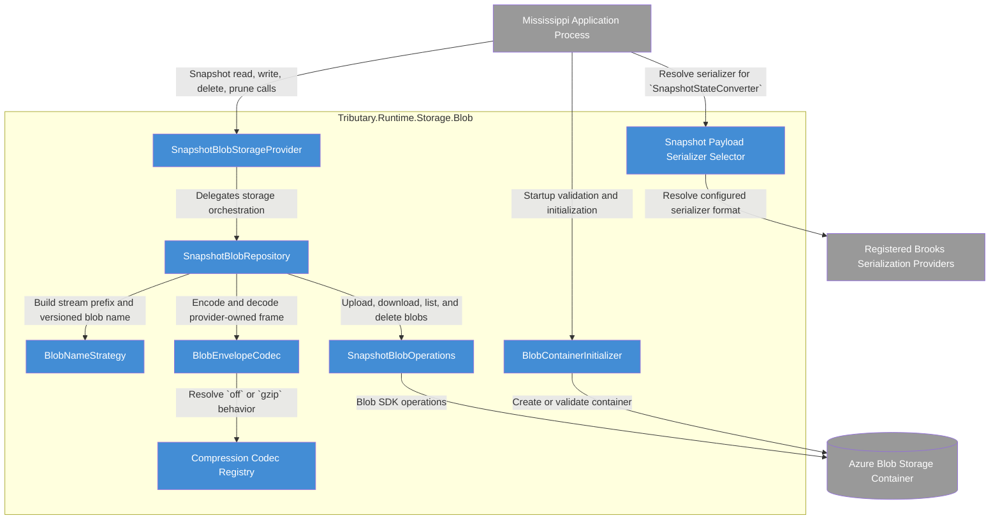

# C4 Component Diagram: Tributary.Runtime.Storage.Blob

## Purpose

Show the meaningful internal structure of the `Tributary.Runtime.Storage.Blob` container so implementers can validate responsibility splits, dependency direction, and the Azure/serializer seams called out in the architecture.

## Scope

- Audience: developers implementing and reviewing the provider library.
- Container in focus: `Tributary.Runtime.Storage.Blob`.
- Included elements: the documented internal components and the external collaborators they directly depend on.
- Excluded elements: blob frame field-by-field layout, detailed retry policies, and test-specific helper code.

## Diagram

## Legend

| Color | Meaning |
|-------|---------|
| Blue | Internal component |
| Grey | External system or container |

## Elements

| Element | Type | Technology | Description |
|---------|------|------------|-------------|
| Mississippi Application Process | External container | .NET application process | Calls the provider, runs startup initialization, and resolves the configured snapshot serializer. |
| SnapshotBlobStorageProvider | Component | `ISnapshotStorageProvider` implementation | Facade that preserves the public contract and delegates to repository orchestration. |
| SnapshotBlobRepository | Component | Internal repository abstraction | Coordinates read, write, delete, delete-all, and prune behavior without leaking Azure SDK concerns upward. |
| BlobNameStrategy | Component | Internal naming strategy | Canonicalizes stream identity and builds bounded prefixes and versioned blob names. |
| BlobEnvelopeCodec | Component | Internal codec | Encodes and decodes the provider-owned blob frame and validates payload integrity. |
| Compression Codec Registry | Component | Internal compression abstraction | Resolves provider-wide compression behavior for `off` and `gzip`. |
| Snapshot Payload Serializer Selector | Component | Internal composition abstraction | Resolves the `ISerializationProvider` and persisted serializer identity for snapshot payload bytes. |
| SnapshotBlobOperations | Component | Azure Blob SDK boundary | Performs upload, download, prefix listing, and delete operations with request conditions and paging. |
| BlobContainerInitializer | Component | Hosted service | Creates or validates the target container during startup according to initialization mode. |
| Registered Brooks Serialization Providers | External system | `ISerializationProvider` registrations | Supply the candidate serializers that the selector resolves. |
| Azure Blob Storage Container | External container | Azure Blob Storage container | Stores the provider-owned snapshot blob frame. |

## Relationship Notes

| From | To | Why This Relationship Exists |
|------|----|------------------------------|
| Mississippi Application Process | SnapshotBlobStorageProvider | Runtime code calls the provider through the existing snapshot storage contract. |
| Mississippi Application Process | BlobContainerInitializer | Startup behavior must create or validate the container before runtime operations begin. |
| Mississippi Application Process | Snapshot Payload Serializer Selector | Snapshot conversion resolves one concrete serializer format before producing `SnapshotEnvelope.Data`. |
| SnapshotBlobStorageProvider | SnapshotBlobRepository | The facade delegates all storage behavior to the repository seam. |
| SnapshotBlobRepository | BlobNameStrategy | Repository operations need deterministic stream prefixes, blob names, and version parsing. |
| SnapshotBlobRepository | BlobEnvelopeCodec | Repository operations persist and restore the provider-owned frame through the codec. |
| SnapshotBlobRepository | SnapshotBlobOperations | The repository relies on a dedicated Blob SDK seam for I/O, paging, and request conditions. |
| BlobEnvelopeCodec | Compression Codec Registry | The codec applies payload-only compression and decompression through the registry. |
| Snapshot Payload Serializer Selector | Registered Brooks Serialization Providers | The selector resolves the configured serializer format to a concrete serializer and persisted identifier. |
| SnapshotBlobOperations | Azure Blob Storage Container | SDK operations read, write, list, and delete the snapshot blobs. |
| BlobContainerInitializer | Azure Blob Storage Container | Initialization creates the container or verifies that it exists. |

## CoV: Diagram Accuracy

1. Every internal component shown is named directly from the architecture document's component inventory.
2. Every dependency shown follows the documented architecture overview, contract definitions, data flow, or DI and configuration sections.
3. No extra repository helpers, telemetry wrappers, or undocumented Azure abstractions were introduced into the diagram.
