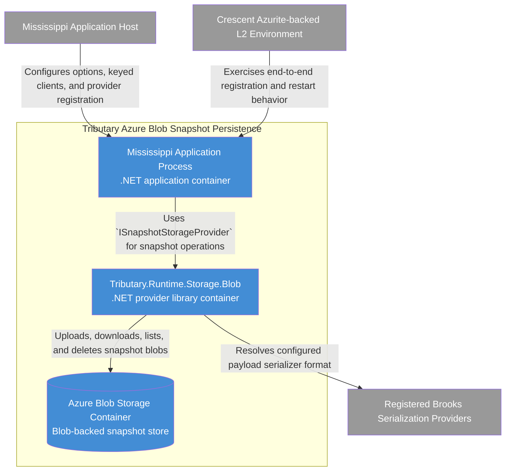

# C4 Container Diagram: Tributary Azure Blob Snapshot Persistence

## Purpose

Show the runtime and storage containers that make up the Blob-backed Tributary snapshot persistence solution so developers can validate deployment shape, dependency direction, and the external integration points.

## Scope

- Audience: developers and architects planning implementation and deployment.
- System in focus: the Blob-backed Tributary snapshot persistence solution described in the final architecture.
- Included elements: the documented internal containers and the external systems that configure, exercise, or supply serializer selection.
- Excluded elements: internal class-level structure inside `Tributary.Runtime.Storage.Blob`, blob frame internals, and detailed Azure SDK request handling.

## Diagram

## Legend

| Color | Meaning |
|-------|---------|
| Blue | Internal container |
| Grey | External system or actor |

## Elements

| Element | Type | Technology | Description |
|---------|------|------------|-------------|
| Mississippi Application Host | External system | .NET host configuration | Supplies registration, options binding, and keyed Blob clients. |
| Mississippi Application Process | Container | .NET application process | Hosts Tributary runtime snapshot cache and persister grains and invokes snapshot persistence. |
| Tributary.Runtime.Storage.Blob | Container | .NET provider library | Implements Blob-backed snapshot persistence, startup initialization, naming, codec, and Blob SDK orchestration. |
| Azure Blob Storage Container | Container | Azure Blob Storage container | Stores one logical snapshot record per blob using the provider-owned frame. |
| Registered Brooks Serialization Providers | External system | `ISerializationProvider` registrations | Supply the concrete serializer used for snapshot payload bytes. |
| Crescent Azurite-backed L2 Environment | External system | Azurite test environment | Provides end-to-end functional validation of the provider. |

## Relationship Notes

| From | To | Why This Relationship Exists |
|------|----|------------------------------|
| Mississippi Application Host | Mississippi Application Process | The host composes the process with provider options, keyed `BlobServiceClient`, and initialization mode. |
| Mississippi Application Process | Tributary.Runtime.Storage.Blob | The application process calls the provider through the unchanged `ISnapshotStorageProvider` contract. |
| Tributary.Runtime.Storage.Blob | Registered Brooks Serialization Providers | The design resolves a concrete serializer format and persisted serializer identifier for snapshot payloads. |
| Tributary.Runtime.Storage.Blob | Azure Blob Storage Container | The provider library performs conditional writes, reads, stream-local listing, and deletes against Blob storage. |
| Crescent Azurite-backed L2 Environment | Mississippi Application Process | L2 tests validate the integrated registration and persistence behavior through the real runtime path. |

## CoV: Diagram Accuracy

1. The internal containers match the architecture document's explicit container list: application process, provider library, and Blob storage container.
2. External systems shown are limited to the documented host, serializer registrations, and Crescent L2 environment.
3. Class-level components are omitted here because the architecture explicitly reserves them for the provider-library component diagram.
