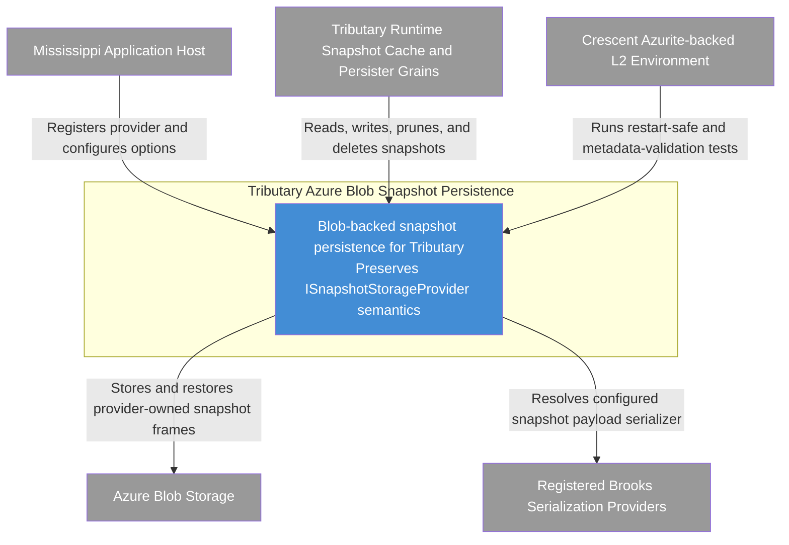

# C4 Context Diagram: Tributary Azure Blob Snapshot Persistence

## Purpose

Show how the Blob-backed Tributary snapshot persistence capability fits into its surrounding Mississippi runtime and operational environment so reviewers can validate the system boundary and the external dependencies it must honor.

## Scope

- Audience: architects, reviewers, and developers validating the feature boundary.
- System in focus: the Blob-backed Tributary snapshot persistence capability described in the final architecture.
- Included elements: documented external actors and systems that configure, call, persist through, or validate the Blob snapshot provider.
- Excluded elements: internal provider components, blob frame structure, and stream naming internals.

## Diagram

## Legend

| Color | Meaning |
|-------|---------|
| Blue | Internal system |
| Grey | External system or actor |

## Elements

| Element | Type | Technology | Description |
|---------|------|------------|-------------|
| Mississippi Application Host | External system | .NET host process | Registers the Blob snapshot provider and supplies configuration and clients. |
| Tributary Runtime Snapshot Cache and Persister Grains | External system | Orleans runtime grains | Calls the provider through the existing snapshot storage contract. |
| Tributary Azure Blob Snapshot Persistence | System | Mississippi runtime capability | Persists Tributary snapshots in Blob storage while preserving current storage semantics. |
| Registered Brooks Serialization Providers | External system | .NET DI registrations | Provide the concrete serializer format used for snapshot payload bytes. |
| Azure Blob Storage | External system | Azure Storage Blobs | Stores and returns the snapshot blobs. |
| Crescent Azurite-backed L2 Environment | External system | Azurite test environment | Validates end-to-end behavior, restart safety, and metadata visibility in L2. |

## Relationship Notes

| From | To | Why This Relationship Exists |
|------|----|------------------------------|
| Mississippi Application Host | Tributary Azure Blob Snapshot Persistence | The host wires up `AddBlobSnapshotStorageProvider` and runtime options. |
| Tributary Runtime Snapshot Cache and Persister Grains | Tributary Azure Blob Snapshot Persistence | Grains use the provider through `ISnapshotStorageProvider` for snapshot lifecycle operations. |
| Tributary Azure Blob Snapshot Persistence | Registered Brooks Serialization Providers | The design requires explicit serializer selection and a persisted serializer identifier. |
| Tributary Azure Blob Snapshot Persistence | Azure Blob Storage | Each logical snapshot is stored as a provider-owned blob frame in Blob storage. |
| Crescent Azurite-backed L2 Environment | Tributary Azure Blob Snapshot Persistence | L2 coverage validates real SDK integration, metadata behavior, and restart compatibility. |

## CoV: Diagram Accuracy

1. Every element in the diagram is named from the architecture document's C4 readiness, integration, or testing sections.
2. Every relationship shown comes directly from the documented registration, runtime, storage, serializer-selection, or L2 validation flows.
3. Internal repository, codec, naming, and operations details are intentionally omitted at this level because they belong to lower C4 levels.
