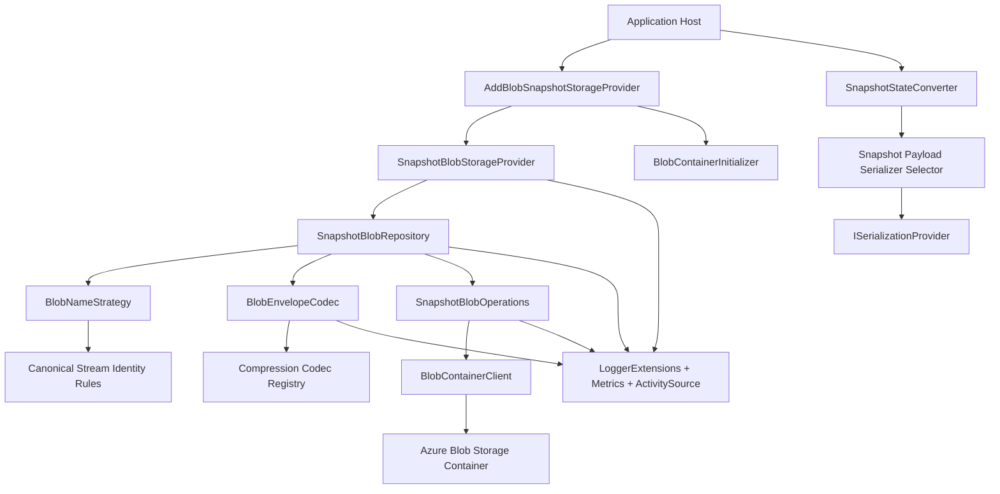
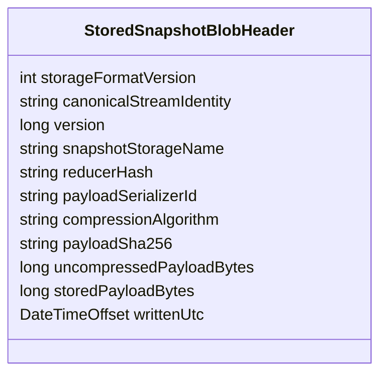
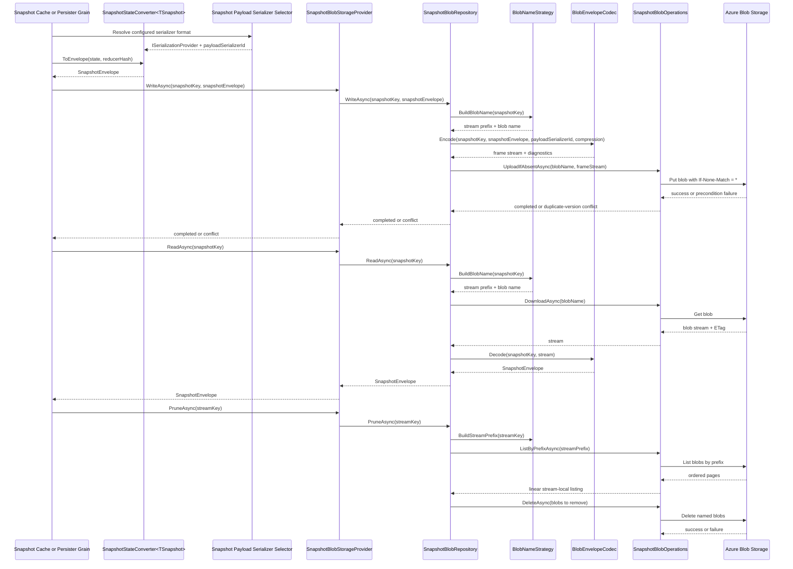

# Solution Architecture

## Governing Thought

Provide a Blob-backed Tributary snapshot provider that preserves the existing Mississippi storage contract and Cosmos-like adoption model while making persisted snapshots explicitly self-describing, overwrite-safe, and operationally diagnosable for larger payload scenarios.

## First Principles Decomposition

- Actual requirements:
  - Add a new Tributary snapshot storage provider backed by Azure Blob Storage.
  - Preserve the current `ISnapshotStorageProvider` contract and keep setup close to `Tributary.Runtime.Storage.Cosmos`.
  - Treat Blob as an app-level alternative provider in v1, not a mixed-provider orchestration feature.
  - Store one logical snapshot record per blob.
  - Use stream-scoped prefix listing plus naming conventions for delete-all, prune, and any required stream-local discovery.
  - Support provider-wide compression with `off` and `gzip` in v1.
  - Support pluggable snapshot payload serialization with JSON as the default.
  - Persist provider-owned metadata that identifies frame version, serializer identity, compression algorithm, and snapshot contract identity.
  - Deliver comprehensive L0 coverage and, if feasible, a Crescent L2 path that proves restart-safe behavior.
- Fundamental constraints:
  - The existing storage contract already works on `SnapshotEnvelope`, so the provider receives opaque payload bytes rather than typed snapshot state.
  - No new public storage abstraction is justified for v1; the new provider must fit the existing layering.
  - Blob stream enumeration must remain stream-safe even when logical stream keys share human-readable prefixes.
  - Blob names must be bounded and deterministic even when `SnapshotStreamKey` values are long.
  - Stored records must remain readable after restart and after default serializer or compression settings change.
  - Large payloads increase sensitivity to redundant copies, partial writes, and ambiguous decode failures.
  - Azure Blob Storage overwrites by default unless access conditions are applied explicitly.
- Assumptions challenged:
  - Reuse `SnapshotKey.ToString()` as the blob name. Verdict: reject. It is not a bounded naming contract and is unsafe for durable stream-prefix semantics.
  - Compress the whole blob body. Verdict: reject. Metadata must stay inspectable and `Content-Encoding` must not misrepresent a partially compressed custom frame.
  - Introduce a generalized multi-provider abstraction first. Verdict: reject. A second provider does not justify a broader redesign.
  - Let the Blob provider serialize typed snapshot state itself. Verdict: reject. Typed state serialization already belongs upstream in Tributary through `ISerializationProvider`.
  - Store compatibility metadata only in blob metadata or tags. Verdict: reject. Provider correctness must depend on the body header, not Azure-side metadata features.
  - Treat prefix listing as a cheap index. Verdict: reject. Azure list operations are strongly consistent but remain linear per stream prefix.

## Architecture Overview

## C4 Readiness

- System under design: Tributary Azure Blob snapshot storage provider.
- External actors and systems:
  - Mississippi application host
  - Tributary runtime snapshot cache and persister grains
  - Azure Blob Storage
  - Registered Brooks serialization providers
  - Crescent Azurite-backed L2 environment
- Containers:
  - Mississippi application process
  - `Tributary.Runtime.Storage.Blob` provider library
  - Azure Blob Storage container
- Containers requiring component diagrams:
  - `Tributary.Runtime.Storage.Blob`

## Components

### Component 1: SnapshotBlobStorageProvider

- Responsibility: `ISnapshotStorageProvider` facade that preserves the existing contract, emits diagnostics, and delegates storage behavior.
- Contracts: implements `ISnapshotStorageProvider`.
- Dependencies: `ISnapshotBlobRepository`, `ILogger<SnapshotBlobStorageProvider>`.
- Data: none.

### Component 2: SnapshotBlobRepository

- Responsibility: orchestrate read, write, delete, delete-all, and prune while keeping Azure SDK details out of upper layers.
- Contracts: internal `ISnapshotBlobRepository`.
- Dependencies: `ISnapshotBlobOperations`, `IBlobNameStrategy`, `IBlobEnvelopeCodec`, `ILogger<SnapshotBlobRepository>`.
- Data: none; operates on `SnapshotKey`, `SnapshotStreamKey`, and `SnapshotEnvelope`.

### Component 3: BlobNameStrategy

- Responsibility: canonicalize stream identity, compute bounded stream prefixes, create versioned blob names, and parse version tokens during listing.
- Contracts: internal `IBlobNameStrategy`.
- Dependencies: hashing utility only.
- Data: canonical stream identity representation, stream hash rules, and version token rules.

### Component 4: BlobEnvelopeCodec

- Responsibility: encode and decode the provider-owned blob frame, validate the binary prelude, apply compression to the payload segment only, and verify payload integrity.
- Contracts: internal `IBlobEnvelopeCodec`.
- Dependencies: compression codec registry, serializer identity accessor, `ILogger<BlobEnvelopeCodec>`.
- Data: frame prelude, stored header, payload stream, and payload checksum.

### Component 5: Compression Codec Registry

- Responsibility: resolve provider-wide compression behavior for `off` or `gzip` and isolate codec-specific logic from repository flow.
- Contracts: internal `IBlobCompressionCodec` plus registry or resolver.
- Dependencies: framework compression APIs only.
- Data: algorithm name, compress behavior, and decompress behavior.

### Component 6: Snapshot Payload Serializer Selector

- Responsibility: resolve the single `ISerializationProvider` used by Tributary snapshot conversion when multiple Brooks serializers are registered, with JSON as the default configuration path.
- Contracts: internal composition abstraction such as `ISnapshotPayloadSerializerSelector`.
- Dependencies: registered `IEnumerable<ISerializationProvider>`, `IOptions<SnapshotBlobStorageOptions>`.
- Data: configured serializer format and resolved persisted serializer identifier.

### Component 7: SnapshotBlobOperations

- Responsibility: own the Azure Blob SDK boundary for upload, download, delete, and prefix listing, including request conditions, paging, retries, and transfer tuning.
- Contracts: internal `ISnapshotBlobOperations`.
- Dependencies: keyed `BlobServiceClient`, `BlobContainerClient`, `IOptions<SnapshotBlobStorageOptions>`, `ILogger<SnapshotBlobOperations>`.
- Data: container handle, blob client, request conditions, and listing page state.

### Component 8: BlobContainerInitializer

- Responsibility: validate Blob configuration at startup and either create the container or verify that it exists, depending on the configured initialization mode.
- Contracts: hosted service only.
- Dependencies: keyed `BlobServiceClient`, `IOptions<SnapshotBlobStorageOptions>`.
- Data: none.

## Storage Model

### Blob Naming and Stream Identity

- Canonical stream identity is a provider-owned persisted representation derived from `SnapshotStreamKey`; it must be stable, UTF-8 encoded, and must not rely on `ToString()`.
- Stream prefix formula: `{BlobPrefix}{Sha256Hex(canonicalStreamIdentity)}/`.
- Blob name formula: `{streamPrefix}v{version:D20}.snapshot`.
- Rationale:
  - Hash-based prefixes keep names bounded even when stream keys are long.
  - Stream-local prefixes keep delete-all and prune scoped to one logical stream.
  - Zero-padded versions preserve lexical ordering for stream-local scans.
- Integrity rule:
  - The canonical stream identity is stored in the blob header.
  - On read, the provider validates that the header stream identity matches the requested stream key.
- Discovery rule:
  - Prefix listing is acceptable in v1 only as a stream-local linear scan.
  - The design does not treat prefix listing as a cheap index and keeps manifest or pointer designs open for a later revision.

### Stored Blob Frame

- Each blob stores one provider-owned frame.
- The frame is versioned independently from the upstream snapshot payload bytes.
- The frame layout for v1 is fixed and little-endian:

| Segment | Type | Size | Notes |
|---------|------|------|-------|
| Magic | ASCII bytes | 8 bytes | Fixed marker identifying a Tributary snapshot blob frame. |
| FrameVersion | unsigned integer | 2 bytes | `1` for the initial format. |
| Flags | unsigned integer | 2 bytes | Reserved; all bits `0` in v1 and must be validated. |
| HeaderLength | unsigned integer | 4 bytes | Length of the UTF-8 header JSON in bytes. |
| HeaderJson | UTF-8 bytes | variable | Uncompressed provider-owned header. |
| PayloadBytes | bytes | variable | Exact `SnapshotEnvelope.Data` bytes, optionally compressed. |

- Validation rules:
  - `HeaderLength` must be greater than `0` and less than or equal to the configured maximum header size.
  - A 64 KiB maximum header size is the v1 default limit.
  - Unknown frame versions fail closed.
  - Non-zero reserved flags fail closed in v1.

### Stored Header

- The header remains uncompressed.
- `compressionAlgorithm` applies only to `PayloadBytes`.
- The provider must not set blob `Content-Encoding` when only the payload segment is compressed.
- The payload segment stores the exact `SnapshotEnvelope.Data` bytes produced upstream by Tributary.
- The header carries the authoritative persisted metadata:

| Field | Purpose | Authority |
|-------|---------|-----------|
| `storageFormatVersion` | Provider-owned frame version | Authoritative |
| `canonicalStreamIdentity` | Stable persisted stream identity | Authoritative |
| `version` | Snapshot version token | Authoritative |
| `snapshotStorageName` | Stable snapshot contract identity | Authoritative |
| `reducerHash` | Reducer provenance and validation context | Contextual |
| `payloadSerializerId` | Concrete serializer identity that produced the payload bytes | Authoritative |
| `compressionAlgorithm` | Payload codec identifier | Authoritative |
| `payloadSha256` | Integrity checksum over uncompressed payload bytes | Authoritative |
| `uncompressedPayloadBytes` | Payload size after decompression | Authoritative |
| `storedPayloadBytes` | Stored payload segment size | Authoritative |
| `writtenUtc` | Write timestamp for diagnostics and operations | Authoritative |

- Optional Azure blob metadata may duplicate a tiny diagnostic subset such as stream hash, version, serializer id, compression algorithm, and written time.
- Any duplicated blob metadata is diagnostic only and is never authoritative for restore behavior.

### Versioning Rules

- `storageFormatVersion` changes only when the provider-owned outer frame changes incompatibly.
- Additive header properties do not require a frame-version bump when older readers can safely ignore them.
- `snapshotStorageName` remains the stable persisted identity of the snapshot contract and must not be repurposed as serializer identity.
- Serializer evolution is expressed through `payloadSerializerId`, not through `storageFormatVersion`.

### Forward-Compatibility Rules

- Readers must require the magic bytes, a supported frame version, valid reserved flags, and all required header properties.
- Readers must ignore unknown header properties.
- Readers must reject unknown compression algorithms.
- Readers must reject unknown serializer identifiers.
- Readers must log the stored frame version, serializer id, compression algorithm, and blob identity on every decode failure.

## Data Flow

## Contract Definitions

### Public Surface

- `AddBlobSnapshotStorageProvider()`
  - Registers the provider using an externally supplied keyed `BlobServiceClient` and configured options.
- `AddBlobSnapshotStorageProvider(string blobConnectionString, Action<SnapshotBlobStorageOptions>? configureOptions = null)`
  - Registers a keyed `BlobServiceClient`, binds options, and installs the provider.
- `AddBlobSnapshotStorageProvider(Action<SnapshotBlobStorageOptions> configureOptions)`
  - Mirrors the Cosmos provider registration pattern.
- `AddBlobSnapshotStorageProvider(IConfiguration configuration)`
  - Binds options from configuration.
- `SnapshotBlobStorageOptions`
  - `ContainerName`
  - `BlobServiceClientServiceKey`
  - `BlobPrefix`
  - `ListPageSizeHint`
  - `Compression`
  - `PayloadSerializerFormat`
  - `ContainerInitializationMode`
  - `MaximumHeaderBytes`
- `SnapshotBlobCompression`
  - `Off`
  - `Gzip`
- `SnapshotBlobContainerInitializationMode`
  - `CreateIfMissing`
  - `ValidateExists`

### Internal Contracts

- `ISnapshotBlobRepository`
  - Domain-level read, write, delete, delete-all, and prune orchestration.
- `ISnapshotBlobOperations`
  - Upload, download, delete, and prefix list against Azure Blob Storage.
- `IBlobNameStrategy`
  - Canonicalize stream identity, build stream prefixes and versioned blob names, and parse version tokens.
- `IBlobEnvelopeCodec`
  - Encode and decode the stored blob frame.
- `IBlobCompressionCodec`
  - Compression behavior for `off` and `gzip`.
- `ISnapshotPayloadSerializerSelector`
  - Resolve the intended `ISerializationProvider` and its persisted serializer id by configured format name.

## DI and Configuration Shape

| Option | Purpose | Default | Notes |
|--------|---------|---------|-------|
| `ContainerName` | Blob container used for snapshots | `tributary-snapshots` | Mirrors Cosmos `ContainerId` intent. |
| `BlobServiceClientServiceKey` | Key used to resolve the `BlobServiceClient` | provider default constant | Matches the keyed-service pattern already used by Cosmos and Brooks. |
| `BlobPrefix` | Optional logical root inside the container | `snapshots/` | Useful when sharing a container with other assets. |
| `ListPageSizeHint` | Page size hint for stream-local listing | `500` | Bounded enumeration for prune and delete-all; not an indexing feature. |
| `Compression` | Provider-wide compression mode | `Off` | `Gzip` compresses only the payload segment. |
| `PayloadSerializerFormat` | Snapshot payload serializer format name | `json` | Configuration input used by runtime composition to select the upstream serializer. |
| `ContainerInitializationMode` | Startup container behavior | `CreateIfMissing` | `ValidateExists` supports least-privilege, IaC-managed environments. |
| `MaximumHeaderBytes` | Upper bound on header length | `65536` | Protects decode from malformed or abusive payloads. |

- Registration shape mirrors Cosmos closely:
  - keyed client registration
  - options binding
  - provider facade registration via `RegisterSnapshotStorageProvider<TProvider>()`
  - hosted initializer
  - internal SDK-operations abstraction
- No new abstractions project is required.
- `BlobServiceClient` and `BlobContainerClient` are singleton-style infrastructure dependencies reused through DI.
- If multiple `ISerializationProvider` implementations are registered, the composition root must select one explicitly for Tributary snapshots rather than relying on DI registration order.

## Integration Points

| System | Direction | Protocol | Error Handling |
|--------|-----------|----------|----------------|
| Tributary runtime snapshot conversion | Inbound to provider | `SnapshotEnvelope` contract via `ISnapshotStorageProvider` | Validate that the resolved serializer selection maps to a concrete persisted serializer id. |
| Brooks serialization providers | Inbound to runtime composition | .NET DI, `ISerializationProvider` | Fail startup if the configured serializer format cannot be resolved uniquely to a concrete serializer id. |
| Azure Blob Storage | Outbound | Azure Storage Blobs SDK | Use SDK retries for transient faults, explicit access conditions for writes, and no custom retry for domain or format failures. |
| Hosted startup initialization | Inbound from host | `IHostedService` | Fail startup on invalid configuration, missing keyed client registration, or missing container when `ValidateExists` is selected. |
| Azure account lifecycle settings | Outbound operational dependency | Account configuration | Document that soft delete and blob versioning change physical purge and reclamation behavior. |
| Crescent Azurite environment | Test-only outbound | Azurite via Blob SDK | Treat emulator failures as test-environment failures and do not treat Azurite as proof of Azure error parity or scale behavior. |

## Error Handling Strategy

- Startup validation:
  - Fail fast if `ContainerName` is blank, the keyed `BlobServiceClient` is missing, or `PayloadSerializerFormat` cannot be resolved.
  - Respect `ContainerInitializationMode` at startup rather than lazily on first write.
- Read behavior:
  - Missing blob returns `null`, matching the current storage contract.
  - Unsupported frame version, invalid prelude, unknown compression algorithm, unknown serializer id, checksum mismatch, or corrupt payload throws `InvalidDataException` with structured logs.
  - Stored serializer mismatch after restart is a hard failure and must not silently fall back to the ambient default serializer.
- Write behavior:
  - Upload is all-or-nothing from the provider perspective.
  - Writes must use Azure access conditions with `If-None-Match = *` so an existing stream-version blob cannot be overwritten silently.
  - Precondition failure is a domain-relevant duplicate-version conflict, not a transient retry candidate.
- Delete behavior:
  - Deleting a missing blob is a no-op success.
  - Delete-all and prune fail if prefix enumeration fails; they do not continue from partial listings.
  - The provider contract deletes the current named blob only; it does not guarantee irreversible purge when storage-account soft delete or blob versioning is enabled.
- Retry behavior:
  - Keep retry behavior inside `SnapshotBlobOperations` so repository logic stays deterministic.
  - Use Azure SDK retry configuration for transient service faults.
  - Do not retry corrupt-envelope, checksum, configuration, or duplicate-version failures.

## Observability Strategy

- Logging:
  - Use `LoggerExtensions` source-generated methods only.
  - Log write, read, delete, delete-all, and prune start and completion.
  - Log duplicate-version conflicts separately from transient storage failures.
  - Log decode failures with stream hash, version, frame version, serializer id, compression algorithm, ETag, request ID, and retry count where available.
- Metrics:
  - Read latency, write latency, list latency, and delete latency.
  - Bytes written and bytes read.
  - Compression ratio when `gzip` is enabled.
  - Prefix listing count, pages per prune or delete-all, and blobs deleted.
  - Duplicate-version conflict count.
  - Checksum failure count.
- Tracing:
  - Emit an `ActivitySource` span per storage operation.
  - Tag spans with snapshot storage name, compression mode, payload serializer id, blob container, ETag, and request ID when available.
- Alerting:
  - Repeated checksum or decode failures.
  - Elevated retry counts or sustained transient storage failures.
  - Unexpected duplicate-version conflicts.
  - Unexpected prune deletions above normal baselines.

## Testing Implications

- L0 focus areas:
  - Blob name generation is bounded, deterministic, and stream-safe.
  - Canonical stream identity is stable and independent from `ToString()`.
  - Version parsing works across ordering boundaries such as `9`, `10`, `11`, and `100`.
  - Frame encode and decode preserve payload bytes, serializer id, checksum, reducer hash, and size values.
  - `Compression=Off` and `Compression=Gzip` both round-trip correctly.
  - Invalid prelude, oversize header, corrupt gzip payload, unsupported frame version, unknown compression, unknown serializer id, and checksum mismatch all fail deterministically.
  - Conditional-write failures are surfaced as duplicate-version conflicts.
  - Prune retains modulus-matching versions and always retains the highest version.
- L1 focus areas:
  - Repository behavior with paged listings and injected Azure failures.
  - Large-payload stream handling without relying on Azurite.
  - Restart-style decode using persisted blob bytes and a rebuilt service provider.
  - Container initialization behavior for `CreateIfMissing` and `ValidateExists`.
- L2 focus areas in Crescent:
  - End-to-end registration with the real provider against Azurite.
  - One happy path with JSON plus `gzip`.
  - One path with a non-default serializer format.
  - Blob inspection that asserts frame prelude, header metadata, and the absence of misleading `Content-Encoding`.
  - Restart or reload compatibility.
  - Delete-all and prune against real Blob APIs.
  - Azurite coverage is treated as functional persistence validation only, not proof of cloud-scale retry or exact Azure error behavior.

## Architecture Risks

| Risk | Why It Matters | Mitigation |
|------|----------------|------------|
| Hash-only prefixes reduce container browseability | Operators cannot infer stream identity from the blob name alone | Persist canonical stream identity in the uncompressed header and allow optional diagnostic metadata duplication. |
| `SnapshotEnvelope` still materializes payload bytes in memory | Very large snapshots can still create allocation pressure before storage begins | Keep provider internals stream-oriented and document operational payload-size expectations. |
| Explicit serializer selection requires a small Tributary composition change | Without it, multiple registered serializers remain ambiguous | Introduce a dedicated serializer selector that resolves a concrete persisted serializer id. |
| Prefix listing cost grows with snapshots per stream | Prune and delete-all performance degrade for long-lived streams | Keep listing stream-local in v1 and leave manifest or pointer strategies open for a later revision. |
| Storage account lifecycle settings alter delete semantics | Teams may expect immediate physical purge or exact storage reclamation | Document soft delete and blob versioning effects explicitly in the provider contract and deployment guidance. |
| Conditional writes are omitted or implemented incorrectly | Duplicate versions can overwrite prior blobs silently | Make `If-None-Match = *` a non-optional write rule in the architecture and implementation plan. |

## Technology Decisions

| Decision | Choice | Rationale | Trade-offs |
|----------|--------|-----------|------------|
| Provider package shape | New `Tributary.Runtime.Storage.Blob` provider project with Cosmos-like layering | Lowest adoption and maintenance risk; no abstraction redesign required | Some naming and registration code intentionally duplicates Cosmos patterns. |
| Blob naming | Hashed stream prefix plus zero-padded version token over a canonical stream identity | Bounded names, stream-safe enumeration, predictable ordering | Human-readable identity moves from the blob name into the header and optional diagnostic metadata. |
| Stored frame | Fixed binary prelude plus uncompressed JSON header and payload segment | Durable decoding contract without base64 inflation; inspectable metadata | Slightly more custom format work than a plain JSON document. |
| Compression scope | Compress payload segment only | Keeps metadata readable, avoids misleading whole-blob compression semantics, and supports restart-safe inspection | Requires explicit codec boundary and checksum validation. |
| Serializer boundary | Select serializer upstream for `SnapshotStateConverter` and persist `payloadSerializerId` in the header | Respects the existing `SnapshotEnvelope` contract and keeps payload evolution separate from frame evolution | Requires a focused composition enhancement when multiple serializers exist. |
| Write correctness | Azure conditional create with `If-None-Match = *` | Prevents silent overwrite of duplicate snapshot versions | Duplicate-version conflicts must be handled distinctly from transient failures. |
| Container initialization | Hosted startup initializer with configurable `CreateIfMissing` or `ValidateExists` | Preserves Cosmos-like ergonomics while supporting least-privilege environments | Adds one more option and deployment decision surface. |

## ADR Candidates

- ADR 1: Canonical stream identity and hashed blob naming strategy for Tributary snapshot blobs.
- ADR 2: Provider-owned blob frame contract, including binary prelude, header evolution rules, and maximum header size.
- ADR 3: Serializer selection boundary and persisted `payloadSerializerId` requirements for snapshot payload bytes.
- ADR 4: Payload-only compression and payload integrity checksum policy for stored snapshot blobs.
- ADR 5: Azure conditional-write semantics and delete-semantics contract under soft delete and blob versioning.
- ADR 6: Container initialization mode selection for Cosmos-like ergonomics versus least-privilege deployments.

## CoV: Architecture Verification

1. Does the architecture satisfy all functional requirements?

Yes. It preserves the existing storage contract, keeps setup Cosmos-like, stores one logical snapshot per blob, supports `off` and `gzip`, persists self-describing metadata, keeps serializer pluggability with JSON as the default, and preserves stream-local maintenance operations.

1. Does it satisfy non-functional requirements?

Yes for the confirmed v1 bar. The design improves payload-size headroom versus Cosmos, eliminates silent overwrite risk through conditional writes, strengthens persisted-format durability with an explicit frame contract, and improves operational diagnosability through checksum and richer telemetry.

1. Is the component boundary correct?

Yes. Public contracts remain unchanged. Blob naming, canonical stream identity, frame encoding, compression, checksum validation, and Azure SDK interaction all stay internal to the new provider project.

1. Is the dependency direction clean?

Yes. The new provider depends downward on Tributary abstractions, Brooks serializer registrations, and Azure SDK packages. No implementation detail leaks back into abstractions, and Azure-specific logic is isolated behind internal operations and codec seams.

1. Evidence

The revised design preserves the confirmed requirements from synthesis, mirrors the existing Cosmos-provider adoption model, incorporates the cloud review's Azure correctness and lifecycle concerns, and incorporates the serialization review's persisted-format, serializer-identity, checksum, and forward-compatibility requirements.
