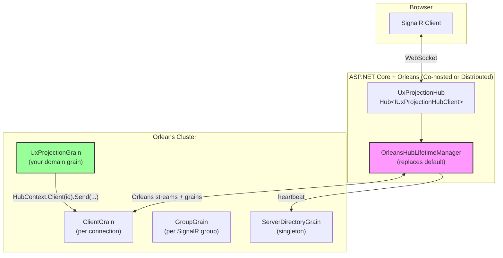
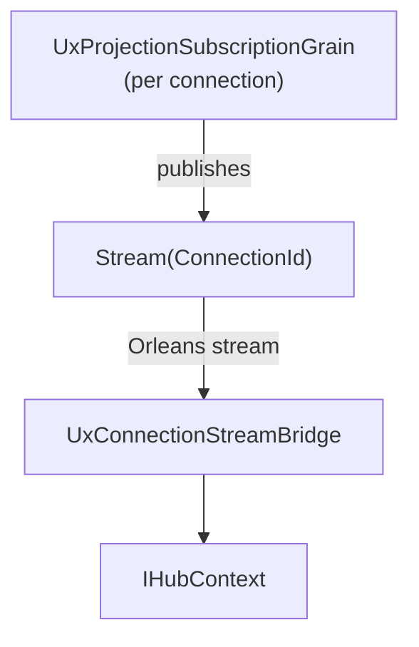

# SignalR ↔ Orleans Integration Strategy

**Status**: 🔵 Design Complete  
**Priority**: HIGH – This is the foundational decision for real-time projection notifications

## Executive Summary

This document describes our approach for bridging SignalR and Orleans for real-time projection updates. We will **build our own Orleans-based SignalR backplane** inspired by the [SignalR.Orleans](https://github.com/OrleansContrib/SignalR.Orleans) architectural patterns, using **aggregate grains** for all stateful components.

> ⚠️ **We are NOT using the SignalR.Orleans package.** We are building our own implementation following the same proven patterns, integrated with Mississippi's aggregate and event-sourcing infrastructure.

## Design Principles

1. **Aggregate Grains for State**: Client, Group, and ServerDirectory grains are **aggregate grains** with persisted state
2. **Orleans Streams for Pub/Sub**: Use Orleans streams for server-targeted messages and disconnect events
3. **Custom HubLifetimeManager**: Replace SignalR's default manager to route through Orleans
4. **HubContext for Grains**: Enable any grain to push messages to SignalR clients
5. **No External Dependencies**: Orleans IS the backplane – no Redis, no Azure SignalR

## Approaches Comparison

| Approach | Complexity | Scale-out | Grain Push | External Deps | Recommended |
| ---------- | ------------ | ----------- | ------------ | --------------- | ------------- |
| **A: Custom Orleans Backplane** | Medium | Excellent | ✅ Native | None | ✅ **Build This** |
| B: Orleans Stream as Hop | Medium | Good | Via stream | None | Fallback |
| C: External Backplane (Redis/Azure) | Medium | Good | Via service | Redis or Azure SignalR | Not recommended |

---

## Approach A: Custom Orleans Backplane (Build This)

### Overview

Build our own Orleans-based SignalR backplane following the proven patterns from SignalR.Orleans. Key insight: **all stateful grains are aggregate grains** that persist their state and can be event-sourced if needed.

### Why Build Our Own

1. **Aggregate Grain Integration**: Stateful grains use Mississippi's aggregate pattern with persistence
2. **No External Dependencies**: Orleans IS the backplane – no Redis, no Azure SignalR Service
3. **Grains Are First-Class Citizens**: Any grain can push to clients via `HubContext<THub>`
4. **Full Control**: We own the implementation and can optimize for our specific patterns
5. **Event Sourcing Ready**: Aggregate grains can emit events for audit/replay if needed

### Architecture



### Aggregate Grains (We Build These)

| Grain | Key | Purpose | State |
| ------- | ----- | --------- | ------- |
| `IUxClientGrain` | Hub:ConnectionId | Tracks hosting server; routes messages | `UxClientState` |
| `IUxGroupGrain` | Hub:GroupName | Tracks group membership; handles broadcasts | `UxGroupState` |
| `IUxServerDirectoryGrain` | Singleton | Tracks active servers; detects failures | `UxServerDirectoryState` |

> 💡 All three grains are **aggregate grains** with persisted state using Mississippi's patterns.

### Grain State Definitions

```csharp
[GenerateSerializer]
public sealed record UxClientState
{
    [Id(0)] public string ConnectionId { get; init; } = string.Empty;
    [Id(1)] public string HubName { get; init; } = string.Empty;
    [Id(2)] public string ServerId { get; init; } = string.Empty;
    [Id(3)] public DateTimeOffset ConnectedAt { get; init; }
}

[GenerateSerializer]
public sealed record UxGroupState
{
    [Id(0)] public string GroupName { get; init; } = string.Empty;
    [Id(1)] public string HubName { get; init; } = string.Empty;
    [Id(2)] public ImmutableHashSet<string> ConnectionIds { get; init; } = [];
}

[GenerateSerializer]
public sealed record UxServerDirectoryState
{
    [Id(0)] public ImmutableDictionary<string, ServerInfo> ActiveServers { get; init; } 
        = ImmutableDictionary<string, ServerInfo>.Empty;
}

[GenerateSerializer]
public sealed record ServerInfo
{
    [Id(0)] public string ServerId { get; init; } = string.Empty;
    [Id(1)] public DateTimeOffset LastHeartbeat { get; init; }
    [Id(2)] public int ConnectionCount { get; init; }
}
```

### Key Components

#### 1. OrleansHubLifetimeManager (We Build This)

Replaces the default `HubLifetimeManager<THub>` and bridges SignalR with Orleans:

- **OnConnected**: Registers connection with `UxClientGrain`, subscribes to server streams
- **OnDisconnected**: Cleans up grain state, unsubscribes from streams
- **SendToConnection**: Routes via `UxClientGrain` which knows the hosting server
- **SendToGroup**: Delegates to `UxGroupGrain` which fans out to all connections

```csharp
public class OrleansHubLifetimeManager<THub> : HubLifetimeManager<THub>
    where THub : Hub
{
    private IGrainFactory GrainFactory { get; }
    private IClusterClient ClusterClient { get; }
    private string ServerId { get; } = Guid.NewGuid().ToString("N");
    
    public override async Task OnConnectedAsync(HubConnectionContext connection)
    {
        var clientGrain = GrainFactory.GetGrain<IUxClientGrain>(
            $"{typeof(THub).Name}:{connection.ConnectionId}");
        await clientGrain.ConnectAsync(typeof(THub).Name, ServerId);
        
        // Subscribe to server stream for messages targeted at this server
        await SubscribeToServerStreamAsync();
    }
    
    public override async Task SendConnectionAsync(
        string connectionId, 
        string methodName, 
        object?[] args,
        CancellationToken cancellationToken = default)
    {
        var clientGrain = GrainFactory.GetGrain<IUxClientGrain>(
            $"{typeof(THub).Name}:{connectionId}");
        await clientGrain.SendMessageAsync(methodName, args);
    }
}
```

#### 2. HubContext for Grains

Orleans grains can inject `HubContext<THub>` to push to clients:

```csharp
public class UxProjectionGrain : Grain, IUxProjectionGrain
{
    private HubContext<UxProjectionHub> HubContext { get; }
    
    public async Task NotifySubscribersAsync(string entityId, long newVersion)
    {
        // Push directly to a group (all subscribers to this projection)
        await HubContext.Group($"projection:{entityId}")
            .SendAsync("OnProjectionChanged", entityId, newVersion);
    }
}
```

#### 3. Orleans Streams for Pub/Sub

- **Server Streams**: Each server subscribes to its stream for targeted messages
- **All-Clients Stream**: For broadcasts to all connections on a hub
- **Disconnect Streams**: For cleanup when clients or servers disconnect

### Integration with Mississippi UX Projections

```mermaid
flowchart LR
    subgraph Domain
        agg["Aggregate<br/>emits event"]
    end
    
    subgraph Projections
        reducer["UxReducer"]
        cursor["Cursor Stream"]
    end
    
    subgraph CustomBackplane["Custom Orleans Backplane"]
        projGrain["UxProjectionGrain<br/>(subscribes to cursor)"]
        hubCtx["HubContext&lt;UxProjectionHub&gt;"]
        groupGrain["UxGroupGrain<br/>(aggregate)"]
    end
    
    subgraph Clients
        browser["Browser"]
    end
    
    agg -->|"event"| reducer
    reducer -->|"new version"| cursor
    cursor -->|"stream event"| projGrain
    projGrain -->|"Group(entityId).Send()"| hubCtx
    hubCtx -->|"via"| groupGrain
    groupGrain -->|"WebSocket"| browser
```



### Configuration

#### Silo Configuration

```csharp
siloBuilder
    .AddMemoryGrainStorage("PubSubStore") // Or Azure Table, Cosmos, etc.
    .AddMemoryStreams("UxProjectionStreams")
    .AddUxSignalRBackplane() // Our custom extension method
    .ConfigureServices(services =>
    {
        services.AddSingleton<IHostedService, ServerHeartbeatService>();
    });
```

#### ASP.NET Core Configuration

```csharp
builder.Services
    .AddSignalR()
    .AddOrleansBackplane(); // Our custom extension that registers OrleansHubLifetimeManager

app.MapHub<UxProjectionHub>("/hubs/projections");
```

### Message Flow: Grain → Client

1. `UxProjectionGrain` receives cursor stream event (projection updated)
2. Grain calls `HubContext.Group("projection:abc123").SendAsync(...)`
3. `UxGroupGrain` (aggregate) looks up connection IDs in its persisted state
4. For each connection, calls `UxClientGrain.SendMessageAsync(...)`
5. `UxClientGrain` publishes to the hosting server's stream
6. `OrleansHubLifetimeManager` on that server receives the stream event
7. Manager writes to the client's WebSocket

### Aggregate Grain Interfaces

```csharp
public interface IUxClientGrain : IGrainWithStringKey
{
    Task ConnectAsync(string hubName, string serverId);
    Task DisconnectAsync();
    Task SendMessageAsync(string methodName, object?[] args);
    Task<string?> GetServerIdAsync();
}

public interface IUxGroupGrain : IGrainWithStringKey
{
    Task AddConnectionAsync(string connectionId);
    Task RemoveConnectionAsync(string connectionId);
    Task SendAllAsync(string methodName, object?[] args);
    Task<ImmutableHashSet<string>> GetConnectionsAsync();
}

public interface IUxServerDirectoryGrain : IGrainWithStringKey
{
    Task RegisterServerAsync(string serverId);
    Task HeartbeatAsync(string serverId, int connectionCount);
    Task UnregisterServerAsync(string serverId);
    Task<ImmutableList<string>> GetDeadServersAsync(TimeSpan timeout);
}
```

### Resilience Features

| Feature | How It Works |
| --------- | -------------- |
| **Server Failure Detection** | `UxServerDirectoryGrain` detects missing heartbeats → publishes disconnect event |
| **Client Cleanup** | `UxClientGrain` subscribes to server disconnect stream → auto-cleans on server death |
| **Group Cleanup** | `UxGroupGrain` subscribes to client disconnect stream → removes dead connections |
| **Aggregate Persistence** | Connection/group state persisted via aggregate storage providers |

### Trade-offs

**Advantages:**

- No external dependencies (Redis, Azure SignalR)
- Grains are first-class – can push anytime
- Automatic distributed routing
- Full control over implementation
- Aggregate grains integrate with Mississippi's patterns
- Event sourcing ready if needed

**Considerations:**

- We own the implementation (but that's a feature)
- Group fan-out happens via grain calls (slightly more latency than stream broadcast for huge groups)

---

## Approach B: Orleans Stream as Hop (Fallback)

### Stream Hop Overview

The current design in [05-notification-bridge.md](./05-notification-bridge.md). A per-connection grain subscribes to projection streams and publishes to a per-connection output stream. A bridge service consumes the stream and forwards to `IHubContext`.



### When to Use

- If custom backplane implementation encounters blockers
- If you need custom stream processing between grain and SignalR
- Simpler for initial prototyping

### Stream Hop Trade-offs

**Advantages:**

- Pure Orleans streams (no custom HubLifetimeManager)
- More control over stream processing
- Simpler initial implementation

**Disadvantages:**

- Manual bridge service to maintain
- Grains can't push directly; must publish to stream
- More moving parts than custom backplane

---

## Approach C: External Backplane (Not Recommended)

Using Redis or Azure SignalR as the backplane with a separate Orleans → backplane bridge.

**Why Not Recommended:**

- Adds external dependency (Redis or Azure SignalR)
- Extra network hop Orleans → backplane → SignalR
- More infrastructure to manage
- We already have Orleans – use it!

---

## Implementation Plan

### Phase 1: Create Core Grain Interfaces

1. Define `IUxClientGrain`, `IUxGroupGrain`, `IUxServerDirectoryGrain` interfaces
2. Define state records with `[GenerateSerializer]` attributes
3. Place in `EventSourcing.UxProjections.Abstractions` project

### Phase 2: Implement Aggregate Grains

```csharp
[GrainType("ux-client")]
public class UxClientGrain : Grain<UxClientState>, IUxClientGrain
{
    private IStreamProvider StreamProvider { get; }
    
    public async Task ConnectAsync(string hubName, string serverId)
    {
        State = State with 
        { 
            HubName = hubName, 
            ServerId = serverId,
            ConnectedAt = DateTimeOffset.UtcNow 
        };
        await WriteStateAsync();
    }
    
    public async Task SendMessageAsync(string methodName, object?[] args)
    {
        var serverId = State.ServerId;
        if (string.IsNullOrEmpty(serverId)) return;
        
        var stream = StreamProvider.GetStream<ServerMessage>(
            StreamId.Create("server", serverId));
        await stream.OnNextAsync(new ServerMessage(
            State.ConnectionId, methodName, args));
    }
}
```

### Phase 3: Create OrleansHubLifetimeManager

```csharp
public class OrleansHubLifetimeManager<THub> : HubLifetimeManager<THub>
    where THub : Hub
{
    private IGrainFactory GrainFactory { get; }
    private string ServerId { get; }
    private ConcurrentDictionary<string, HubConnectionContext> Connections { get; } = new();
    
    public override async Task OnConnectedAsync(HubConnectionContext connection)
    {
        Connections[connection.ConnectionId] = connection;
        
        var clientGrain = GrainFactory.GetGrain<IUxClientGrain>(
            $"{typeof(THub).Name}:{connection.ConnectionId}");
        await clientGrain.ConnectAsync(typeof(THub).Name, ServerId);
    }
    
    public override async Task SendGroupAsync(
        string groupName,
        string methodName,
        object?[] args,
        CancellationToken cancellationToken = default)
    {
        var groupGrain = GrainFactory.GetGrain<IUxGroupGrain>(
            $"{typeof(THub).Name}:{groupName}");
        await groupGrain.SendAllAsync(methodName, args);
    }
}
```

### Phase 4: Create UxProjectionHub

```csharp
public class UxProjectionHub : Hub<IUxProjectionHubClient>
{
    private IGrainFactory GrainFactory { get; }
    
    public async Task SubscribeToProjectionAsync(string projectionType, string entityId)
    {
        var groupName = $"projection:{projectionType}:{entityId}";
        
        // Add to Orleans-managed group
        await Groups.AddToGroupAsync(Context.ConnectionId, groupName);
        
        // Optionally track in grain for rehydration on reconnect
        var grain = GrainFactory.GetGrain<IUxProjectionSubscriptionGrain>(Context.ConnectionId);
        await grain.TrackSubscriptionAsync(projectionType, entityId);
    }
}
```

### Phase 5: Wire Projection Grains to Push

```csharp
public class ChannelProjectionGrain : Grain, IChannelProjectionGrain
{
    private HubContext<UxProjectionHub> HubContext { get; }
    
    private async Task OnProjectionUpdatedAsync(string entityId, long newVersion)
    {
        // Push version notification to all subscribers
        await HubContext.Group($"projection:ChannelProjection:{entityId}")
            .OnProjectionChangedAsync("ChannelProjection", entityId, newVersion);
    }
}
```

### Phase 6: Client Reconnection

```csharp
public override async Task OnConnectedAsync()
{
    // Optionally: if client sends subscription list, rejoin groups
    await base.OnConnectedAsync();
}

// Client can call this after reconnect
public async Task ResubscribeAsync(ImmutableList<SubscriptionInfo> subscriptions)
{
    foreach (var sub in subscriptions)
    {
        await Groups.AddToGroupAsync(Context.ConnectionId, $"projection:{sub.Type}:{sub.EntityId}");
    }
}
```

---

## Migration Path from Current Design

If the current stream-based design is already implemented:

1. **Keep existing abstractions** (`IUxProjectionSubscriptionGrain`, etc.)
2. **Build custom backplane** with aggregate grains
3. **Simplify**: Remove `UxConnectionStreamBridge` – grains push directly
4. **Groups replace per-connection output streams** – SignalR groups handle fan-out

---

## Decision

✅ **Build Custom Orleans Backplane (Approach A)** as the primary integration strategy.

**Rationale:**

- Eliminates external dependencies
- Enables powerful grain-to-client push pattern
- All stateful grains are aggregate grains with persistence
- Full control over implementation
- Integrates with Mississippi's aggregate patterns
- Event sourcing ready if needed
- Simplifies architecture (no bridge service needed)

**Fallback Plan:**
If custom backplane implementation encounters blockers, fall back to Approach B (stream-as-hop) which is already designed.

---

## References

- [SignalR.Orleans GitHub](https://github.com/OrleansContrib/SignalR.Orleans) – Architecture inspiration (we build our own)
- [Original ChatGPT Analysis](https://chatgpt.com/s/dr_6954992033208191a6edb6cedbe6a4ef) – Detailed architecture breakdown
- [Current Stream Design](./05-notification-bridge.md) – Fallback approach
