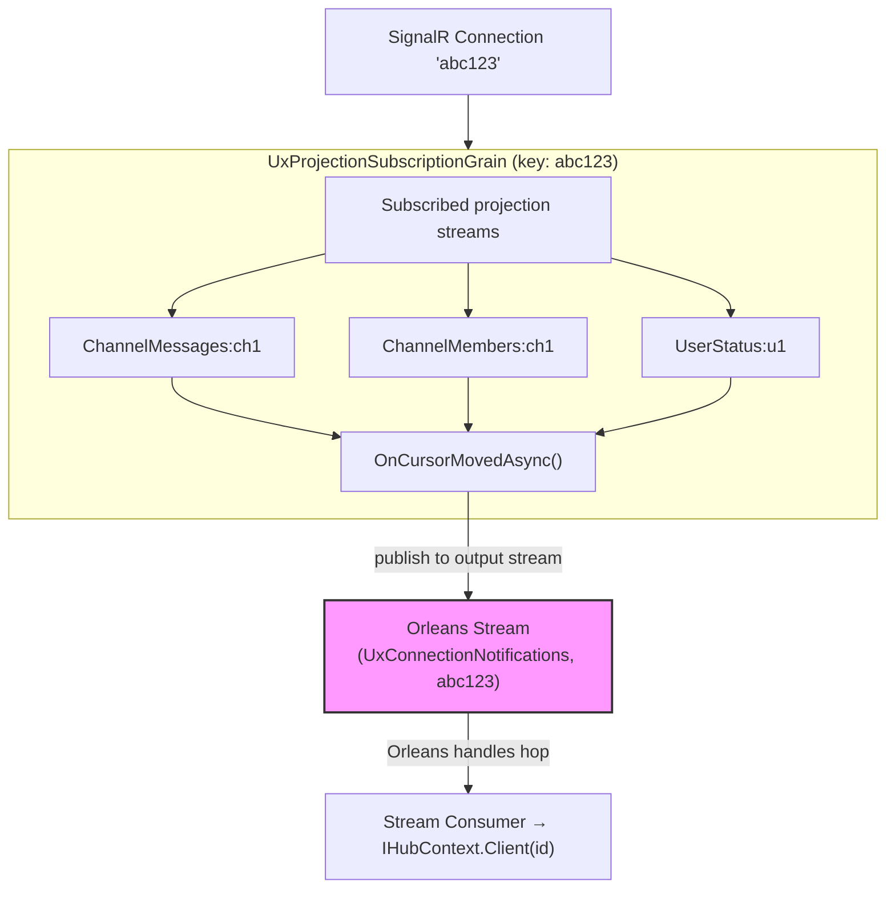

# Task 1.2: Per-Connection Subscription Grain

**Status**: ⬜ Not Started  
**Depends On**: [1.1 Abstractions](./01-abstractions.md)

## Goal

Implement `UxProjectionSubscriptionGrain` in `src/EventSourcing.UxProjections/` **keyed by SignalR ConnectionId**. This grain manages all projection subscriptions for a single connection, forwarding updates to a per-connection output stream.

## Architecture



## Acceptance Criteria

- [ ] Grain implements `IUxProjectionSubscriptionGrain` **keyed by ConnectionId**
- [ ] `SubscribeAsync(projectionKey)` subscribes to that projection's cursor stream
- [ ] Maintains set of active projection subscriptions in grain state
- [ ] On any cursor move, publishes `UxProjectionChangedEvent` to **per-connection output stream**
- [ ] `UnsubscribeAsync(projectionKey)` removes subscription
- [ ] `ClearAllAsync()` cleans up all subscriptions (called on disconnect)
- [ ] Uses `[LoggerMessage]` for all logging
- [ ] L0 tests cover add/remove subscriptions and event forwarding

## Implementation Details

### Grain Key

Key format: SignalR `ConnectionId` (e.g., `"abc123"`)

### Subscribe to a Projection

```csharp
public async Task<string> SubscribeAsync(UxProjectionSubscriptionRequest request)
{
    var subscriptionId = Ulid.NewUlid().ToString();
    var projectionKey = new UxProjectionKey(request.ProjectionType, request.BrookType, request.EntityId);
    
    // Subscribe to that projection's cursor stream
    var cursorStream = this.GetStreamProvider("BrookStreams")
        .GetStream<BrookCursorMovedEvent>(StreamId.Create("BrookCursorUpdates", projectionKey.ToString()));
    
    var handle = await cursorStream.SubscribeAsync(OnCursorMovedAsync);
    
    // Track subscription
    State.Subscriptions[subscriptionId] = new ActiveSubscription
    {
        Request = request,
        ProjectionKey = projectionKey,
        StreamHandle = handle
    };
    
    await WriteStateAsync();
    return subscriptionId;
}
```

### Forward to Per-Connection Output Stream

```csharp
private async Task OnCursorMovedAsync(BrookCursorMovedEvent evt, StreamSequenceToken? token)
{
    // Find which subscription this cursor event belongs to
    var projectionKey = /* extract from evt */;
    
    // Publish to THIS connection's output stream (keyed by ConnectionId)
    var outputStream = this.GetStreamProvider("BrookStreams")
        .GetStream<UxProjectionChangedEvent>(StreamId.Create(
            "UxConnectionNotifications", 
            this.GetPrimaryKeyString()));  // ConnectionId
    
    await outputStream.OnNextAsync(new UxProjectionChangedEvent
    {
        ProjectionKey = projectionKey,
        NewVersion = evt.NewPosition,
        Timestamp = DateTimeOffset.UtcNow
    });
}
```

### State

```csharp
[GenerateSerializer]
internal sealed class UxProjectionSubscriptionState
{
    /// <summary>Active subscriptions keyed by subscription ID.</summary>
    [Id(0)] public Dictionary<string, ActiveSubscription> Subscriptions { get; init; } = [];
}

[GenerateSerializer]
internal sealed class ActiveSubscription
{
    [Id(0)] public required UxProjectionSubscriptionRequest Request { get; init; }
    [Id(1)] public required UxProjectionKey ProjectionKey { get; init; }
    
    // Note: StreamSubscriptionHandle is not serialized - rehydrated on activation
    [NonSerialized]
    public StreamSubscriptionHandle<BrookCursorMovedEvent>? StreamHandle;
}
```

### Rehydrate Subscriptions on Activation

```csharp
public override async Task OnActivateAsync(CancellationToken ct)
{
    await base.OnActivateAsync(ct);
    
    // Resubscribe to all projection streams from persisted state
    foreach (var (id, sub) in State.Subscriptions)
    {
        var cursorStream = this.GetStreamProvider("BrookStreams")
            .GetStream<BrookCursorMovedEvent>(StreamId.Create(
                "BrookCursorUpdates", 
                sub.ProjectionKey.ToString()));
        
        sub.StreamHandle = await cursorStream.SubscribeAsync(OnCursorMovedAsync);
    }
}
```

### Clear All on Disconnect

```csharp
public async Task ClearAllAsync()
{
    foreach (var sub in State.Subscriptions.Values)
    {
        if (sub.StreamHandle is not null)
        {
            await sub.StreamHandle.UnsubscribeAsync();
        }
    }
    
    State.Subscriptions.Clear();
    await WriteStateAsync();
    
    // Grain can deactivate since no subscriptions
    DeactivateOnIdle();
}
```

## TDD Steps

1. **Red**: Create `UxProjectionSubscriptionGrainTests` in `tests/EventSourcing.UxProjections.L0Tests/`
   - Test: `SubscribeAsync_AddsSubscriptionToState`
   - Test: `SubscribeAsync_SubscribesToProjectionStream`
   - Test: `UnsubscribeAsync_RemovesSubscriptionAndUnsubscribesStream`
   - Test: `OnCursorMoved_PublishesToPerConnectionOutputStream`
   - Test: `ClearAllAsync_UnsubscribesAllAndDeactivates`
   - Test: `OnActivateAsync_RehydratesStreamSubscriptions`

2. **Green**: Implement `UxProjectionSubscriptionGrain`
   - Inherit from `Grain<UxProjectionSubscriptionState>`
   - Key by ConnectionId
   - Add `UxProjectionSubscriptionGrainLoggerExtensions` for logging

3. **Refactor**: Extract stream namespace constants; consider subscription limits

## Files to Create

- `src/EventSourcing.UxProjections/Subscriptions/UxProjectionSubscriptionGrain.cs`
- `src/EventSourcing.UxProjections/Subscriptions/UxProjectionSubscriptionState.cs`
- `src/EventSourcing.UxProjections/Subscriptions/ActiveSubscription.cs`
- `src/EventSourcing.UxProjections/Subscriptions/UxProjectionSubscriptionGrainLoggerExtensions.cs`
- `tests/EventSourcing.UxProjections.L0Tests/Subscriptions/UxProjectionSubscriptionGrainTests.cs`

## Notes

- **Grain key = ConnectionId** - one grain per SignalR connection
- Output stream key = ConnectionId - stream consumer knows which connection to notify
- Stream handles are not serializable; rehydrate on activation from persisted subscription list
- `ClearAllAsync()` called by SignalR hub on disconnect
- Consider subscription limits per connection to prevent abuse
