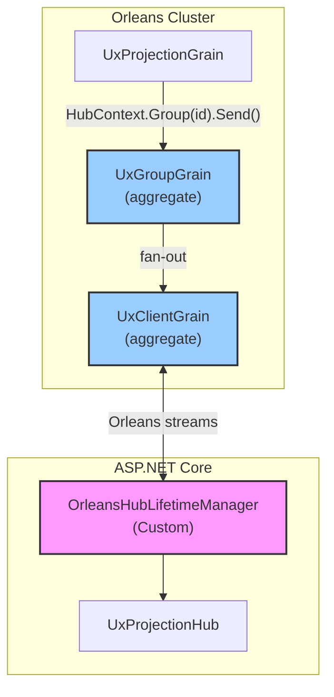

# Task 1.3: Create SignalR Project

**Status**: ⬜ Not Started  
**Depends On**: [1.1 Abstractions](./01-abstractions.md)

> **📖 See [00-signalr-orleans-integration.md](./00-signalr-orleans-integration.md) for the custom Orleans backplane approach.**

## Goal

Create a new project `src/EventSourcing.UxProjections.SignalR/` containing the SignalR hub, custom `OrleansHubLifetimeManager`, aggregate grains, and DI registration for real-time projection notifications.

> ⚠️ **We are building our own Orleans-based SignalR backplane**, not using the SignalR.Orleans package. All stateful grains are **aggregate grains** with persisted state.

## Architecture

### Custom Orleans Backplane (Build This)

Grains push directly to clients via `HubContext<THub>`. Custom `OrleansHubLifetimeManager` routes through aggregate grains.



### Fallback: Stream Bridge

Per-connection stream with bridge service. See [05-notification-bridge.md](./05-notification-bridge.md).

## Acceptance Criteria

- [ ] New project `Mississippi.EventSourcing.UxProjections.SignalR` created
- [ ] Project references `EventSourcing.UxProjections.Abstractions`, Orleans core packages
- [ ] `UxProjectionHub` strongly-typed hub implemented
- [ ] `IUxProjectionHubClient` callback interface defined
- [ ] **Custom `OrleansHubLifetimeManager<THub>` implemented**
- [ ] **Aggregate grains: `UxClientGrain`, `UxGroupGrain`, `UxServerDirectoryGrain`**
- [ ] `AddUxProjectionSignalR()` extension method for DI registration
- [ ] Silo configured with aggregate grain storage and streams
- [ ] Project builds with zero warnings
- [ ] Added to `mississippi.sln` and `mississippi.slnx`

## Types to Create

### Aggregate Grain Interfaces

```csharp
/// <summary>Tracks a single SignalR connection.</summary>
public interface IUxClientGrain : IGrainWithStringKey
{
    Task ConnectAsync(string hubName, string serverId);
    Task DisconnectAsync();
    Task SendMessageAsync(string methodName, object?[] args);
    Task<string?> GetServerIdAsync();
}

/// <summary>Tracks group membership for a SignalR group.</summary>
public interface IUxGroupGrain : IGrainWithStringKey
{
    Task AddConnectionAsync(string connectionId);
    Task RemoveConnectionAsync(string connectionId);
    Task SendAllAsync(string methodName, object?[] args);
    Task<ImmutableHashSet<string>> GetConnectionsAsync();
}

/// <summary>Tracks active SignalR servers for failure detection.</summary>
public interface IUxServerDirectoryGrain : IGrainWithStringKey
{
    Task RegisterServerAsync(string serverId);
    Task HeartbeatAsync(string serverId, int connectionCount);
    Task UnregisterServerAsync(string serverId);
    Task<ImmutableList<string>> GetDeadServersAsync(TimeSpan timeout);
}
```

### Aggregate Grain State

```csharp
[GenerateSerializer]
public sealed record UxClientState
{
    [Id(0)] public string ConnectionId { get; init; } = string.Empty;
    [Id(1)] public string HubName { get; init; } = string.Empty;
    [Id(2)] public string ServerId { get; init; } = string.Empty;
    [Id(3)] public DateTimeOffset ConnectedAt { get; init; }
}

[GenerateSerializer]
public sealed record UxGroupState
{
    [Id(0)] public string GroupName { get; init; } = string.Empty;
    [Id(1)] public string HubName { get; init; } = string.Empty;
    [Id(2)] public ImmutableHashSet<string> ConnectionIds { get; init; } = [];
}

[GenerateSerializer]
public sealed record UxServerDirectoryState
{
    [Id(0)] public ImmutableDictionary<string, ServerInfo> ActiveServers { get; init; } 
        = ImmutableDictionary<string, ServerInfo>.Empty;
}

[GenerateSerializer]
public sealed record ServerInfo
{
    [Id(0)] public string ServerId { get; init; } = string.Empty;
    [Id(1)] public DateTimeOffset LastHeartbeat { get; init; }
    [Id(2)] public int ConnectionCount { get; init; }
}
```

### `IUxProjectionHubClient`

```csharp
/// <summary>
/// Client callback interface for receiving projection change notifications.
/// </summary>
public interface IUxProjectionHubClient
{
    /// <summary>
    /// Called when a subscribed projection's version changes.
    /// Client should fetch updated data via HTTP GET.
    /// </summary>
    Task OnProjectionChangedAsync(string projectionType, string entityId, long newVersion);
}
```

### `UxProjectionHub` (Custom Backplane Approach)

```csharp
/// <summary>
/// SignalR hub for managing projection subscriptions.
/// Uses custom Orleans backplane - grains push directly via HubContext.
/// </summary>
public class UxProjectionHub : Hub<IUxProjectionHubClient>
{
    private IGrainFactory GrainFactory { get; }
    
    /// <summary>Subscribe to projection updates for an entity.</summary>
    public async Task SubscribeToProjectionAsync(string projectionType, string entityId)
    {
        // Add to SignalR group - grains push to this group
        string groupName = $"projection:{projectionType}:{entityId}";
        await Groups.AddToGroupAsync(Context.ConnectionId, groupName);
        
        // Track subscription in grain for reconnect support
        var grain = GrainFactory.GetGrain<IUxProjectionSubscriptionGrain>(Context.ConnectionId);
        await grain.TrackSubscriptionAsync(projectionType, entityId);
    }
    
    /// <summary>Unsubscribe from projection updates.</summary>
    public async Task UnsubscribeFromProjectionAsync(string projectionType, string entityId)
    {
        string groupName = $"projection:{projectionType}:{entityId}";
        await Groups.RemoveFromGroupAsync(Context.ConnectionId, groupName);
        
        var grain = GrainFactory.GetGrain<IUxProjectionSubscriptionGrain>(Context.ConnectionId);
        await grain.UntrackSubscriptionAsync(projectionType, entityId);
    }
    
    /// <summary>Restore subscriptions after reconnect.</summary>
    public async Task ResubscribeAsync(ImmutableList<SubscriptionInfo> subscriptions)
    {
        foreach (var sub in subscriptions)
        {
            string groupName = $"projection:{sub.ProjectionType}:{sub.EntityId}";
            await Groups.AddToGroupAsync(Context.ConnectionId, groupName);
        }
    }
    
    public override async Task OnDisconnectedAsync(Exception? exception)
    {
        // Clean up grain subscription tracking
        var grain = GrainFactory.GetGrain<IUxProjectionSubscriptionGrain>(Context.ConnectionId);
        await grain.ClearAllAsync();
        await base.OnDisconnectedAsync(exception);
    }
}
```

### `OrleansHubLifetimeManager<THub>` (Custom Implementation)

```csharp
/// <summary>
/// Custom HubLifetimeManager that routes SignalR operations through Orleans grains.
/// </summary>
public class OrleansHubLifetimeManager<THub> : HubLifetimeManager<THub>
    where THub : Hub
{
    private IGrainFactory GrainFactory { get; }
    private IClusterClient ClusterClient { get; }
    private string ServerId { get; } = Guid.NewGuid().ToString("N");
    private ConcurrentDictionary<string, HubConnectionContext> Connections { get; } = new();
    
    public override async Task OnConnectedAsync(HubConnectionContext connection)
    {
        Connections[connection.ConnectionId] = connection;
        
        var clientGrain = GrainFactory.GetGrain<IUxClientGrain>(
            $"{typeof(THub).Name}:{connection.ConnectionId}");
        await clientGrain.ConnectAsync(typeof(THub).Name, ServerId);
    }
    
    public override async Task OnDisconnectedAsync(HubConnectionContext connection)
    {
        Connections.TryRemove(connection.ConnectionId, out _);
        
        var clientGrain = GrainFactory.GetGrain<IUxClientGrain>(
            $"{typeof(THub).Name}:{connection.ConnectionId}");
        await clientGrain.DisconnectAsync();
    }
    
    public override async Task SendConnectionAsync(
        string connectionId, 
        string methodName, 
        object?[] args,
        CancellationToken cancellationToken = default)
    {
        var clientGrain = GrainFactory.GetGrain<IUxClientGrain>(
            $"{typeof(THub).Name}:{connectionId}");
        await clientGrain.SendMessageAsync(methodName, args);
    }
    
    public override async Task SendGroupAsync(
        string groupName,
        string methodName,
        object?[] args,
        CancellationToken cancellationToken = default)
    {
        var groupGrain = GrainFactory.GetGrain<IUxGroupGrain>(
            $"{typeof(THub).Name}:{groupName}");
        await groupGrain.SendAllAsync(methodName, args);
    }
    
    public override async Task AddToGroupAsync(
        string connectionId,
        string groupName,
        CancellationToken cancellationToken = default)
    {
        var groupGrain = GrainFactory.GetGrain<IUxGroupGrain>(
            $"{typeof(THub).Name}:{groupName}");
        await groupGrain.AddConnectionAsync(connectionId);
    }
    
    public override async Task RemoveFromGroupAsync(
        string connectionId,
        string groupName,
        CancellationToken cancellationToken = default)
    {
        var groupGrain = GrainFactory.GetGrain<IUxGroupGrain>(
            $"{typeof(THub).Name}:{groupName}");
        await groupGrain.RemoveConnectionAsync(connectionId);
    }
    
    // Additional abstract members to implement...
}
```

### DI Registration (Custom Backplane)

```csharp
public static class UxProjectionSignalRServiceCollectionExtensions
{
    /// <summary>
    /// Adds UX projection SignalR services with custom Orleans backplane.
    /// </summary>
    public static ISignalRServerBuilder AddOrleansBackplane(this ISignalRServerBuilder builder)
    {
        builder.Services.AddSingleton(typeof(HubLifetimeManager<>), typeof(OrleansHubLifetimeManager<>));
        return builder;
    }
    
    /// <summary>
    /// Adds UX projection SignalR services.
    /// </summary>
    public static IServiceCollection AddUxProjectionSignalR(this IServiceCollection services)
    {
        services.AddSignalR()
            .AddOrleansBackplane();
        return services;
    }
    
    /// <summary>
    /// Maps the UxProjection hub to the specified path.
    /// </summary>
    public static IEndpointRouteBuilder MapUxProjectionHub(
        this IEndpointRouteBuilder endpoints, 
        string pattern = "/hubs/projections")
    {
        endpoints.MapHub<UxProjectionHub>(pattern);
        return endpoints;
    }
}
```

### Silo Configuration

```csharp
siloBuilder
    .AddMemoryGrainStorage("PubSubStore") // Or Azure Table, Cosmos, etc.
    .AddMemoryGrainStorage("UxSignalRStore") // For aggregate grain state
    .AddMemoryStreams("UxProjectionStreams")
    .ConfigureServices(services =>
    {
        services.AddSingleton<IHostedService, ServerHeartbeatService>();
    });
```

## Project File

```xml
<Project Sdk="Microsoft.NET.Sdk">
  <PropertyGroup>
    <TargetFramework>net9.0</TargetFramework>
  </PropertyGroup>
  
  <ItemGroup>
    <FrameworkReference Include="Microsoft.AspNetCore.App" />
  </ItemGroup>
  
  <ItemGroup>
    <PackageReference Include="Microsoft.Orleans.Sdk" />
    <PackageReference Include="Microsoft.Orleans.Streaming" />
  </ItemGroup>
  
  <ItemGroup>
    <ProjectReference Include="..\EventSourcing.UxProjections.Abstractions\EventSourcing.UxProjections.Abstractions.csproj" />
    <ProjectReference Include="..\Core\Core.csproj" />
  </ItemGroup>
</Project>
```

> ⚠️ **Note:** We do NOT reference the `SignalR.Orleans` package. We build our own implementation.

## TDD Steps

1. **Red**: Create test project `tests/EventSourcing.UxProjections.SignalR.L0Tests/`
   - Test: `OrleansHubLifetimeManager.OnConnectedAsync` registers with `UxClientGrain`
   - Test: `OrleansHubLifetimeManager.SendGroupAsync` delegates to `UxGroupGrain`
   - Test: `UxClientGrain.ConnectAsync` persists state
   - Test: `UxGroupGrain.AddConnectionAsync` adds to membership set
   - Test: Hub `SubscribeToProjectionAsync` adds to SignalR group and tracks in grain
   - Test: Hub `UnsubscribeFromProjectionAsync` removes from group and untracks
   - Test: Hub `OnDisconnectedAsync` clears grain subscriptions
   - Test: `AddUxProjectionSignalR` registers required services

2. **Green**: Create project and implement components
   - Implement aggregate grains with state persistence
   - Implement custom `OrleansHubLifetimeManager<THub>`
   - Hub injects `IGrainFactory`
   - Uses SignalR groups for subscription targeting

3. **Refactor**: Add XML documentation; add LoggerExtensions

## Files to Create

- `src/EventSourcing.UxProjections.SignalR/EventSourcing.UxProjections.SignalR.csproj`
- `src/EventSourcing.UxProjections.SignalR/UxProjectionHub.cs`
- `src/EventSourcing.UxProjections.SignalR/IUxProjectionHubClient.cs`
- `src/EventSourcing.UxProjections.SignalR/OrleansHubLifetimeManager.cs`
- `src/EventSourcing.UxProjections.SignalR/Grains/IUxClientGrain.cs`
- `src/EventSourcing.UxProjections.SignalR/Grains/IUxGroupGrain.cs`
- `src/EventSourcing.UxProjections.SignalR/Grains/IUxServerDirectoryGrain.cs`
- `src/EventSourcing.UxProjections.SignalR/Grains/UxClientGrain.cs`
- `src/EventSourcing.UxProjections.SignalR/Grains/UxGroupGrain.cs`
- `src/EventSourcing.UxProjections.SignalR/Grains/UxServerDirectoryGrain.cs`
- `src/EventSourcing.UxProjections.SignalR/Grains/State/UxClientState.cs`
- `src/EventSourcing.UxProjections.SignalR/Grains/State/UxGroupState.cs`
- `src/EventSourcing.UxProjections.SignalR/Grains/State/UxServerDirectoryState.cs`
- `src/EventSourcing.UxProjections.SignalR/Services/ServerHeartbeatService.cs`
- `src/EventSourcing.UxProjections.SignalR/UxProjectionSignalRServiceCollectionExtensions.cs`
- `src/EventSourcing.UxProjections.SignalR/UxProjectionHubLoggerExtensions.cs`
- `tests/EventSourcing.UxProjections.SignalR.L0Tests/EventSourcing.UxProjections.SignalR.L0Tests.csproj`
- `tests/EventSourcing.UxProjections.SignalR.L0Tests/OrleansHubLifetimeManagerTests.cs`
- `tests/EventSourcing.UxProjections.SignalR.L0Tests/UxClientGrainTests.cs`
- `tests/EventSourcing.UxProjections.SignalR.L0Tests/UxGroupGrainTests.cs`
- `tests/EventSourcing.UxProjections.SignalR.L0Tests/UxProjectionHubTests.cs`

## Notes

- Hub tests use mock `IHubCallerClients` and mock `IGrainFactory`
- Grain tests use Orleans `TestCluster` or TestKit
- Consider adding `[Authorize]` attribute placeholder for future auth scenarios
- Connection ID is automatically available via `Context.ConnectionId` in hub methods
- **Custom backplane handles distributed routing** - no external packages needed
- Grains push to clients via `HubContext<UxProjectionHub>.Group(entityId).SendAsync(...)`
- All stateful grains persist state via aggregate storage provider
