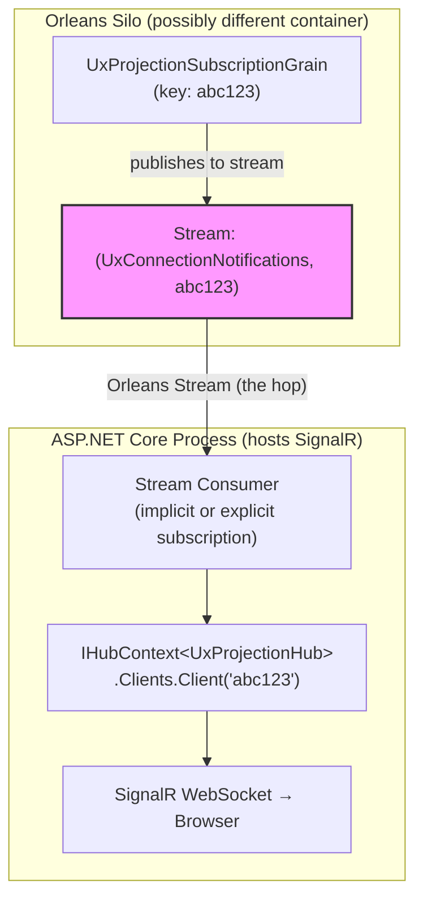

# Task 1.5: Per-Connection Stream Consumer (SignalR Bridge)

**Status**: ⬜ Not Started (Fallback Approach)  
**Depends On**: [1.2 Subscription Grain](./02-subscription-grain.md), [1.3 SignalR Project](./03-signalr-project.md)

> ⚠️ **This is the FALLBACK approach.** The preferred approach is the [Custom Orleans Backplane](./00-signalr-orleans-integration.md) which allows grains to push directly to clients without an intermediate bridge. Only implement this if the custom backplane implementation encounters blockers.

## Goal

Implement a stream consumer that picks up events from the per-connection Orleans stream and sends them to the SignalR client via `IHubContext`. **The Orleans stream handles the hop between containers** - same code works cohosted or distributed.

## When to Use This Approach

- Custom Orleans backplane implementation encounters blockers
- You need custom stream processing between grain and SignalR
- Simpler initial prototyping before building full backplane

## Architecture



## Design Decision: Implicit vs Explicit Subscription

### Option A: Implicit Subscription (Grain-based consumer)

A grain in the web server process subscribes to connection streams. Orleans routing delivers events to the grain.

```csharp
[ImplicitStreamSubscription("UxConnectionNotifications")]
public class UxConnectionNotifierGrain : Grain, IAsyncObserver<UxProjectionChangedEvent>
{
    private IHubContext<UxProjectionHub, IUxProjectionHubClient> HubContext { get; }
    
    public async Task OnNextAsync(UxProjectionChangedEvent item, StreamSequenceToken? token)
    {
        var connectionId = this.GetPrimaryKeyString();
        await HubContext.Clients.Client(connectionId)
            .OnProjectionChangedAsync(item.ProjectionKey.ProjectionType, 
                                      item.ProjectionKey.EntityId, 
                                      item.NewVersion.Value);
    }
}
```

### Option B: BackgroundService Consumer (Recommended)

A `BackgroundService` subscribes to streams for active connections. Simpler and doesn't require grain-per-connection on the web server side.

**Recommendation**: Option B - simpler, one service handles all connections.

## Acceptance Criteria

- [ ] Stream consumer subscribes to per-connection output streams
- [ ] On event, forwards to `IHubContext.Clients.Client(connectionId)`
- [ ] Manages subscriptions as connections connect/disconnect
- [ ] Handles reconnection gracefully (SignalR hub calls to re-subscribe)
- [ ] Uses `[LoggerMessage]` for all logging
- [ ] Same code path works for cohosted AND distributed deployment
- [ ] L0 tests verify event forwarding with mock hub context

## Implementation Details

### Service Structure

```csharp
/// <summary>
/// Consumes per-connection Orleans streams and forwards to SignalR.
/// Manages stream subscriptions as SignalR connections come and go.
/// </summary>
public sealed class UxConnectionStreamBridge : IDisposable
{
    private IHubContext<UxProjectionHub, IUxProjectionHubClient> HubContext { get; }
    private IClusterClient ClusterClient { get; }
    private ILogger<UxConnectionStreamBridge> Logger { get; }
    
    // Active stream subscriptions by connection ID
    private readonly ConcurrentDictionary<string, StreamSubscriptionHandle<UxProjectionChangedEvent>> subscriptions = new();
    
    public UxConnectionStreamBridge(
        IHubContext<UxProjectionHub, IUxProjectionHubClient> hubContext,
        IClusterClient clusterClient,
        ILogger<UxConnectionStreamBridge> logger)
    {
        HubContext = hubContext;
        ClusterClient = clusterClient;
        Logger = logger;
    }
}
```

### Subscribe When SignalR Connects

```csharp
/// <summary>
/// Called by UxProjectionHub.OnConnectedAsync to start receiving events.
/// </summary>
public async Task SubscribeAsync(string connectionId)
{
    var stream = ClusterClient.GetStreamProvider("BrookStreams")
        .GetStream<UxProjectionChangedEvent>(StreamId.Create(
            "UxConnectionNotifications", 
            connectionId));
    
    var handle = await stream.SubscribeAsync(
        (evt, token) => OnEventAsync(connectionId, evt));
    
    subscriptions[connectionId] = handle;
    LogSubscribed(connectionId);
}
```

### Forward Event to SignalR Client

```csharp
private async Task OnEventAsync(string connectionId, UxProjectionChangedEvent evt)
{
    try
    {
        await HubContext.Clients.Client(connectionId)
            .OnProjectionChangedAsync(
                evt.ProjectionKey.ProjectionType,
                evt.ProjectionKey.EntityId,
                evt.NewVersion.Value);
    }
    catch (Exception ex)
    {
        // Client may have disconnected
        LogNotificationFailed(connectionId, ex);
    }
}
```

### Unsubscribe When SignalR Disconnects

```csharp
/// <summary>
/// Called by UxProjectionHub.OnDisconnectedAsync to clean up.
/// </summary>
public async Task UnsubscribeAsync(string connectionId)
{
    if (subscriptions.TryRemove(connectionId, out var handle))
    {
        await handle.UnsubscribeAsync();
        LogUnsubscribed(connectionId);
    }
    
    // Also tell the grain to clean up its projection subscriptions
    var grain = ClusterClient.GetGrain<IUxProjectionSubscriptionGrain>(connectionId);
    await grain.ClearAllAsync();
}
```

## Integration with SignalR Hub

```csharp
public class UxProjectionHub : Hub<IUxProjectionHubClient>
{
    private UxConnectionStreamBridge Bridge { get; }
    private IGrainFactory GrainFactory { get; }
    
    public override async Task OnConnectedAsync()
    {
        // Start listening to this connection's output stream
        await Bridge.SubscribeAsync(Context.ConnectionId);
        await base.OnConnectedAsync();
    }
    
    public override async Task OnDisconnectedAsync(Exception? exception)
    {
        // Stop listening and clean up grain subscriptions
        await Bridge.UnsubscribeAsync(Context.ConnectionId);
        await base.OnDisconnectedAsync(exception);
    }
    
    public async Task<string> SubscribeAsync(UxProjectionSubscriptionRequest request)
    {
        // Delegate to per-connection grain
        var grain = GrainFactory.GetGrain<IUxProjectionSubscriptionGrain>(Context.ConnectionId);
        return await grain.SubscribeAsync(request);
    }
}
```

## TDD Steps

1. **Red**: Create `UxConnectionStreamBridgeTests` in `tests/EventSourcing.UxProjections.SignalR.L0Tests/`
   - Test: `SubscribeAsync_SubscribesToConnectionStream`
   - Test: `OnEvent_ForwardsToHubContext`
   - Test: `OnEvent_HandlesDisconnectedClient`
   - Test: `UnsubscribeAsync_UnsubscribesAndCleansUpGrain`

2. **Green**: Implement `UxConnectionStreamBridge`
   - Inject `IHubContext<UxProjectionHub, IUxProjectionHubClient>`
   - Inject `IClusterClient` for stream access

3. **Refactor**: Add LoggerExtensions; consider connection tracking metrics

## Files to Create

- `src/EventSourcing.UxProjections.SignalR/UxConnectionStreamBridge.cs`
- `src/EventSourcing.UxProjections.SignalR/UxConnectionStreamBridgeLoggerExtensions.cs`
- `tests/EventSourcing.UxProjections.SignalR.L0Tests/UxConnectionStreamBridgeTests.cs`

## Registration

```csharp
// In UxProjectionSignalRServiceCollectionExtensions
public static IServiceCollection AddUxProjectionSignalR(this IServiceCollection services)
{
    services.AddSignalR();
    services.AddSingleton<UxConnectionStreamBridge>();
    return services;
}
```

## Why This Design Works for Both Modes

**The Orleans stream IS the abstraction that handles cohosted vs distributed.**

- **Cohosted**: Stream producer and consumer are in the same process. Orleans optimizes to in-memory delivery. Extra hop but consistent code path.

- **Distributed**: Stream producer (silo) and consumer (web server) are in different processes. Orleans routes via its stream infrastructure (e.g., Azure Storage, memory grain, etc.).

**No need for separate `IUxProjectionNotifier` abstraction** - the stream handles it naturally.

## Notes

- `UxConnectionStreamBridge` is a singleton registered in DI
- SignalR hub calls `Bridge.SubscribeAsync/UnsubscribeAsync` on connect/disconnect
- Per-connection grain manages projection subscriptions
- Stream handles cross-process delivery when distributed
- Same code path = simple mental model for developers
