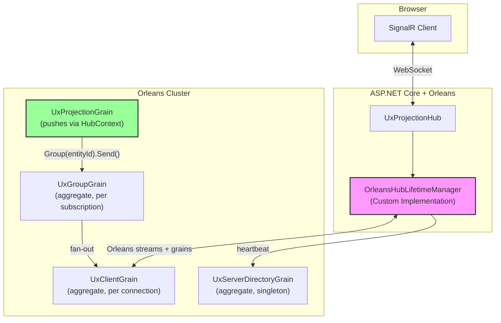

# Phase 1: Framework – Real-Time Projection Subscriptions

**Status**: 🔄 In Progress

## Goal

Extend Mississippi with a SignalR-based push notification system that notifies clients when projection versions change. Clients subscribe once and receive automatic updates; they fetch data via HTTP (no large objects over SignalR).

## Architecture (Custom Orleans Backplane – Build This)

> **📖 See [00-signalr-orleans-integration.md](./00-signalr-orleans-integration.md) for complete design analysis.**



**Key insight:** We build our own Orleans-based SignalR backplane. **All stateful grains are aggregate grains** with persisted state. Grains can push directly to clients via `HubContext<THub>`.

> ⚠️ **We are NOT using the SignalR.Orleans package.** We build our own implementation following the same proven patterns, integrated with Mississippi's aggregate infrastructure.

## Tasks

| Task | File | Status |
|------|------|--------|
| 1.0 SignalR↔Orleans Integration Strategy | [00-signalr-orleans-integration.md](./00-signalr-orleans-integration.md) | ✅ Design |
| 1.1 Add Subscription Abstractions | [01-abstractions.md](./01-abstractions.md) | ✅ |
| 1.2 Per-Connection Subscription Grain | [02-subscription-grain.md](./02-subscription-grain.md) | ⬜ |
| 1.3 Create SignalR Project | [03-signalr-project.md](./03-signalr-project.md) | ⬜ |
| 1.4 ~~Connection Grain~~ (Merged into 1.2) | [04-connection-grain.md](./04-connection-grain.md) | MERGED |
| 1.5 Per-Connection Stream Bridge (Fallback) | [05-notification-bridge.md](./05-notification-bridge.md) | ⬜ |
| 1.6 API ETag Support | [06-api-etag.md](./06-api-etag.md) | ⬜ |

## Acceptance Criteria

- [x] `IUxProjectionSubscriptionGrain` interface defined (keyed by ConnectionId)
- [x] `UxProjectionChangedEvent` serializable record created
- [ ] Per-connection grain subscribes to projection cursor streams
- [ ] Per-connection grain publishes to output stream (per connection)
- [ ] SignalR hub with `Subscribe`/`Unsubscribe` methods
- [ ] Stream bridge consumes per-connection stream and forwards to `IHubContext`
- [ ] **Same code path** works for cohosted AND distributed deployments
- [ ] API returns ETag headers; 304 on conditional GET match
- [ ] L0 tests for all new grain logic and bridge

## New Projects

- `src/EventSourcing.UxProjections.SignalR/`
- `tests/EventSourcing.UxProjections.SignalR.L0Tests/`

## Key Design Notes

1. **One Grain Per Connection**: `UxProjectionSubscriptionGrain` is keyed by SignalR `ConnectionId`. It manages ALL projection subscriptions for that connection and forwards ALL updates to a single per-connection output stream.

2. **Orleans Stream = The Hop**: The Orleans stream handles cohosted vs distributed automatically:
   - **Cohosted**: Stream delivers in-memory (extra hop but consistent code path)
   - **Distributed**: Stream routes via Orleans infrastructure (Azure Storage, etc.)

3. **Simple Mental Model**: Subscribe → grain subscribes to projection streams → forwards to per-connection stream → bridge sends to SignalR → browser

4. **Per-Connection (not per-user)**: Grain keyed by SignalR `ConnectionId` to support multiple browser windows per user.

5. **Cleanup**: On disconnect, connection grain deactivates and unsubscribes from all projection streams.

6. **No Data Over WS**: SignalR sends only `{projectionType, entityId, newVersion}`; client fetches via HTTP GET with ETag.

7. **Framework-First**: All SignalR integration code should be reusable framework code in `src/`, not sample-specific.

## Notification Delivery Pattern Decision

> **📖 See [00-signalr-orleans-integration.md](./00-signalr-orleans-integration.md) for complete analysis.**

Three approaches were evaluated for delivering notifications from Orleans grains to SignalR clients:

| Approach | Complexity | Grain Push | Recommended |
|----------|------------|------------|-------------|
| **A: Custom Orleans Backplane** | Medium | ✅ Native | ✅ **Build This** |
| B: Orleans Stream as Hop | Medium | Via stream | Fallback |
| C: External Backplane (Redis/Azure) | Medium | Via service | Not recommended |

**Critical Design Requirement:** All stateful grains (`UxClientGrain`, `UxGroupGrain`, `UxServerDirectoryGrain`) are **aggregate grains** with persisted state using Mississippi's patterns.

### Preferred: SignalR.Orleans Backplane

[SignalR.Orleans](https://github.com/OrleansContrib/SignalR.Orleans) uses Orleans as the SignalR backplane and allows grains to push directly to clients via `HubContext<THub>`:

```csharp
public class UxProjectionGrain : Grain
{
    private HubContext<UxProjectionHub> HubContext { get; }
    
    public async Task NotifySubscribersAsync(string entityId, long newVersion)
    {
        await HubContext.Group($"projection:{entityId}")
            .SendAsync("OnProjectionChanged", entityId, newVersion);
    }
}
```

**Why preferred:**
- **No external dependencies** – Orleans IS the backplane (no Redis, no Azure SignalR)
- **Grains are first-class** – any grain can push to clients anytime
- **Production proven** – active community project
- **Simpler architecture** – no bridge service or intermediate streams

### Fallback: Orleans Stream as Hop

The stream-based approach (documented in [05-notification-bridge.md](./05-notification-bridge.md)) remains available if SignalR.Orleans has compatibility issues.

> **Decision:** Adopt **SignalR.Orleans (Approach A)** as the primary strategy. Fall back to stream-as-hop only if blockers emerge.

## Aggregate Effects Pattern (Deferred)

The `IAggregateEffect` pattern for side effects after command processing is **deferred** to future work. The subscription grain can manage stream subscriptions directly without this abstraction for now.

```csharp
// DEFERRED - may add later if pattern proves valuable
public interface IAggregateEffect
{
    Task ExecuteAsync(CancellationToken ct);
}

// Example: Subscribe to a stream after processing a command
public class SubscribeToStreamEffect : IAggregateEffect
{
    public required StreamId StreamId { get; init; }
    public required IAsyncObserver<object> Observer { get; init; }
    
    public async Task ExecuteAsync(CancellationToken ct) { /* subscribe logic */ }
}
```

This pattern should be designed as a framework extension, not a one-off for this sample.
