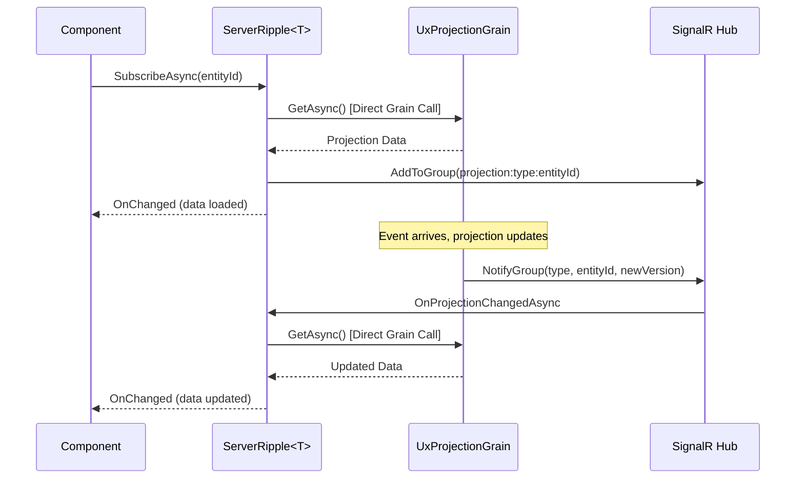
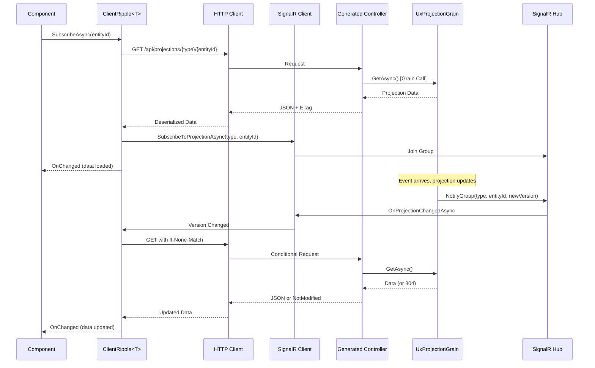

# Ripples Architecture Design

**Status**: ✅ Design Complete  
**Priority**: HIGH – Foundation document for Ripples implementation

## Executive Summary

Mississippi.Ripples is a Redux-inspired state management library designed specifically for Mississippi's event-sourcing architecture. It provides a unified developer experience across Blazor Server and Blazor WebAssembly while handling the complexity of real-time projection subscriptions.

## Design Principles

1. **Same API, Different Runtimes**: Developers write `IRipple<T>` code once; the framework handles Server vs WASM differences.
2. **Backend-First**: Unlike generic Redux libraries, Ripples is designed for server-state (projections, commands) with local-state as secondary.
3. **Automatic Lifecycle**: Subscribe on component mount, unsubscribe on dispose—developers don't manage SignalR manually.
4. **Composable**: Support list projections that spawn per-item detail projections efficiently.
5. **Framework Integration**: Tight integration with Mississippi's grains, brooks, and projections.

## Core Interface

```csharp
/// <summary>
/// Provides reactive access to a UX projection with automatic updates.
/// </summary>
/// <typeparam name="T">The projection type.</typeparam>
public interface IRipple<T> : IAsyncDisposable
    where T : class
{
    /// <summary>Current projection data.</summary>
    T? Current { get; }
    
    /// <summary>Current version from the server.</summary>
    long? Version { get; }
    
    /// <summary>True while fetching data.</summary>
    bool IsLoading { get; }
    
    /// <summary>True after first successful load.</summary>
    bool IsLoaded { get; }
    
    /// <summary>True if connected to real-time updates.</summary>
    bool IsConnected { get; }
    
    /// <summary>Last error, if any.</summary>
    Exception? LastError { get; }
    
    /// <summary>Raised when any property changes.</summary>
    event Action? OnChanged;
    
    /// <summary>Raised when an error occurs.</summary>
    event Action<Exception>? OnError;
    
    /// <summary>Subscribe to a projection entity.</summary>
    Task SubscribeAsync(string entityId, CancellationToken ct = default);
    
    /// <summary>Unsubscribe from current entity.</summary>
    Task UnsubscribeAsync(CancellationToken ct = default);
    
    /// <summary>Force refresh from source.</summary>
    Task RefreshAsync(CancellationToken ct = default);
}
```

## State Flow Diagrams

### Blazor Server Flow



### Blazor WASM Flow



## Service Registration

### Blazor Server

```csharp
// Program.cs
builder.Services.AddRipplesServer(options =>
{
    // Use direct grain access (default, fastest)
    options.UseDirectGrainAccess = true;
    
    // Optionally fall back to HTTP (for testing/consistency)
    options.FallbackToHttp = false;
});

// Later in pipeline
app.MapRipplesHub(); // Maps SignalR hub if not already mapped
```

### Blazor WASM

```csharp
// Program.cs
builder.Services.AddRipplesClient(options =>
{
    // API base URL (usually from appsettings)
    options.BaseApiUrl = builder.HostEnvironment.BaseAddress;
    
    // SignalR hub path
    options.SignalRHubPath = "/hubs/projections";
    
    // Connection resilience
    options.EnableAutoReconnect = true;
    options.ReconnectPolicy = RippleReconnectPolicy.ExponentialBackoff;
    
    // Optional: token provider for auth
    options.AccessTokenProvider = async () => await GetTokenAsync();
});
```

## Component Integration

### Base Component

```csharp
/// <summary>
/// Base component that provides Ripple integration.
/// </summary>
public abstract class RippleComponent : ComponentBase, IAsyncDisposable
{
    private readonly List<IAsyncDisposable> ripples = new();
    
    /// <summary>
    /// Registers a ripple for automatic lifecycle management.
    /// </summary>
    protected void UseRipple<T>(IRipple<T> ripple) where T : class
    {
        ripple.OnChanged += StateHasChanged;
        ripples.Add(ripple);
    }
    
    public async ValueTask DisposeAsync()
    {
        foreach (var ripple in ripples)
        {
            await ripple.DisposeAsync();
        }
        GC.SuppressFinalize(this);
    }
}
```

### Usage Example

```csharp
public partial class ChannelView : RippleComponent
{
    [Inject] private IRipple<ChannelProjection> Channel { get; set; } = null!;
    
    [Parameter] public string ChannelId { get; set; } = "";
    
    protected override async Task OnInitializedAsync()
    {
        UseRipple(Channel);
        await Channel.SubscribeAsync(ChannelId);
    }
    
    // Automatic disposal handles unsubscribe
}
```

## Source Generator Strategy

### Projection Controller Generator

**Input**: Grain with `[ExposeAsProjectionApi]` attribute

```csharp
[BrookName("CASCADE", "MESSAGING", "CHANNEL")]
[ExposeAsProjectionApi(Route = "api/projections/channels")]
public class ChannelProjectionGrain : UxProjectionGrainBase<ChannelProjection>
{ }
```

**Output**: Generated controller + route registry entry

```csharp
// ChannelProjectionController.g.cs
[GeneratedCode("Ripples.Generators", "1.0.0")]
[Route("api/projections/channels/{entityId}")]
[ApiController]
public sealed partial class ChannelProjectionController 
    : UxProjectionControllerBase<ChannelProjection>
{
    public ChannelProjectionController(
        IUxProjectionGrainFactory factory,
        ILogger<UxProjectionControllerBase<ChannelProjection>> logger)
        : base(factory, logger) { }
}
```

```csharp
// ProjectionRouteRegistry.g.cs (accumulated across all projections)
public static partial class ProjectionRouteRegistry
{
    static ProjectionRouteRegistry()
    {
        Register<ChannelProjection>("api/projections/channels");
        Register<UserProjection>("api/projections/users");
        // ... all projections
    }
}
```

### Aggregate Controller Generator

**Input**: Grain interface with `[ExposeAsCommandApi]` attribute

```csharp
[ExposeAsCommandApi(Route = "api/channels")]
public interface IChannelAggregateGrain : IAggregateGrain
{
    [HttpPost("join")]
    Task<OperationResult> JoinAsync(JoinChannelRequest request);
}
```

**Output**: Generated command controller

```csharp
// ChannelAggregateController.g.cs
[GeneratedCode("Ripples.Generators", "1.0.0")]
[Route("api/channels/{entityId}")]
[ApiController]
public sealed partial class ChannelAggregateController : ControllerBase
{
    private IGrainFactory GrainFactory { get; }
    
    [HttpPost("join")]
    public async Task<ActionResult<OperationResult>> JoinAsync(
        [FromRoute] string entityId,
        [FromBody] JoinChannelRequest request,
        CancellationToken ct = default)
    {
        var grain = GrainFactory.GetGrain<IChannelAggregateGrain>(entityId);
        var result = await grain.JoinAsync(request);
        return result.IsSuccess ? Ok(result) : BadRequest(result);
    }
}
```

## Dependencies

```
Ripples.Abstractions (netstandard2.1)
├── No dependencies (pure interfaces)

Ripples (netstandard2.1)
├── Ripples.Abstractions
└── Microsoft.Extensions.DependencyInjection.Abstractions

Ripples.Blazor (net9.0)
├── Ripples.Abstractions
└── Microsoft.AspNetCore.Components

Ripples.Server (net9.0)
├── Ripples
├── Ripples.Blazor
├── Mississippi.EventSourcing.UxProjections.Abstractions
└── Orleans.Core.Abstractions

Ripples.Client (net9.0)
├── Ripples
├── Ripples.Blazor
├── Microsoft.AspNetCore.SignalR.Client
└── System.Net.Http.Json

Ripples.Generators (netstandard2.0)
├── Microsoft.CodeAnalysis.CSharp
└── (Source generator, no runtime deps)
```

## Migration Path

### From Current Cascade Sample

1. Move `IProjectionSubscriber<T>` → `IRipple<T>` (enhanced interface)
2. Move `ProjectionSubscriber<T>` → `ClientRipple<T>` (HTTP-based)
3. Create `ServerRipple<T>` (direct grain access)
4. Update Cascade components to use `RippleComponent` base
5. Replace manual SignalR wiring with `UseRipple()` pattern

### Breaking Changes

- Interface renamed from `IProjectionSubscriber<T>` to `IRipple<T>`
- Event changed from `EventHandler` to `Action` for simplicity
- Factory pattern replaced with direct DI of `IRipple<T>`

## Testing Strategy

| Layer | Test Type | Focus |
|-------|-----------|-------|
| Abstractions | L0 Unit | Interface contracts, DTOs |
| Core Store | L0 Unit | Reducer logic, state management |
| Server | L0 Unit | Grain mocking, in-process behavior |
| Client | L0 Unit | HTTP mocking, SignalR mocking |
| Integration | L1 | Full stack with test cluster |
