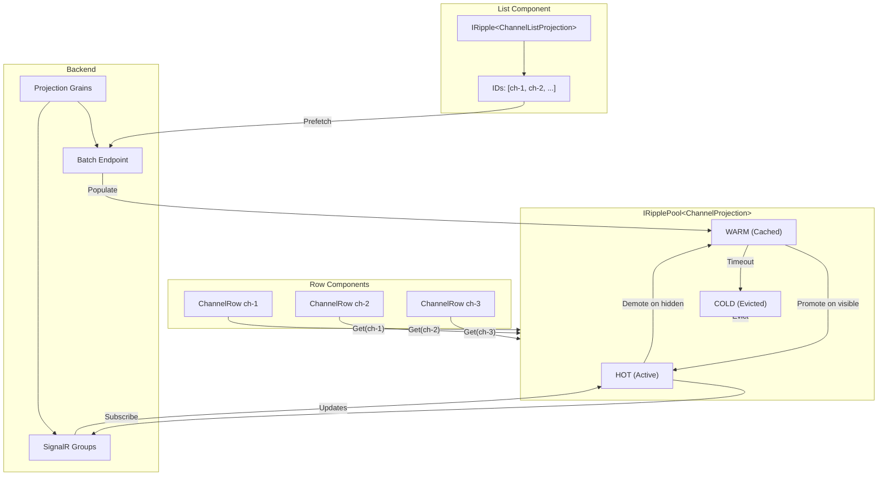

# Composable Projections Pattern

**Status**: 🔵 Design In Progress  
**Priority**: HIGH – Critical for efficient list/detail UX patterns

## Problem Statement

UX Projections are designed as building blocks. A common pattern is:

1. **List Projection**: Contains only IDs (e.g., `ChannelListProjection` with 100 channel IDs)
2. **Detail Projections**: One per item (e.g., `ChannelProjection` for each channel)

This creates a **one-to-many subscription** problem:
- One list subscription
- N detail subscriptions (one per visible row)

### Example Scenario

```
┌─────────────────────────────────────────────┐
│ Channel List (ChannelListProjection)        │
│ IDs: [ch-1, ch-2, ch-3, ..., ch-100]       │
├─────────────────────────────────────────────┤
│ ┌─────────────────────────────────────────┐ │
│ │ Row: ChannelProjection(ch-1)            │ │ ← Separate subscription
│ │ Name: "General", Members: 42            │ │
│ └─────────────────────────────────────────┘ │
│ ┌─────────────────────────────────────────┐ │
│ │ Row: ChannelProjection(ch-2)            │ │ ← Separate subscription
│ │ Name: "Random", Members: 17             │ │
│ └─────────────────────────────────────────┘ │
│ ┌─────────────────────────────────────────┐ │
│ │ Row: ChannelProjection(ch-3)            │ │ ← Separate subscription
│ │ Name: "Dev", Members: 8                 │ │
│ └─────────────────────────────────────────┘ │
│ ... (virtualized - only visible rows)      │
└─────────────────────────────────────────────┘
```

## Challenges

### 1. Subscription Explosion

If a list has 100 items and user scrolls through all:
- 100 SignalR group subscriptions
- 100 HTTP requests (initial fetch)
- 100 active `IRipple<T>` instances

### 2. Lifecycle Management

When should we unsubscribe?
- When row scrolls out of view?
- When component unmounts?
- After a timeout?

### 3. Memory Pressure

Each `IRipple<T>` holds:
- Current projection data
- Version tracking
- Event handlers
- HTTP client references

### 4. Server Load

Each subscription means:
- SignalR group membership
- Orleans grain activation potential
- Memory on server for tracking

## Design Approach: Tiered Subscriptions

### Concept: Hot, Warm, Cold

```
┌─────────────────────────────────────────────────────────────┐
│                    Ripple Subscription Tiers                 │
├─────────────────────────────────────────────────────────────┤
│  HOT (Active)     │ Currently visible rows                  │
│  - Full subscription (SignalR + data)                       │
│  - Immediate updates                                        │
├─────────────────────────────────────────────────────────────┤
│  WARM (Cached)    │ Recently visible, scrolled out          │
│  - Data cached locally                                      │
│  - No SignalR subscription                                  │
│  - Re-subscribes if becomes visible again                   │
├─────────────────────────────────────────────────────────────┤
│  COLD (Expired)   │ Not seen for a while                    │
│  - Data evicted from cache                                  │
│  - Full fetch on next view                                  │
└─────────────────────────────────────────────────────────────┘
```

### Implementation: IRipplePool<T>

Instead of individual `IRipple<T>` per row, use a **pool** that manages subscriptions:

```csharp
/// <summary>
/// Manages a pool of ripples for list/detail patterns.
/// Handles subscription lifecycle, caching, and batching.
/// </summary>
public interface IRipplePool<T> : IAsyncDisposable
    where T : class
{
    /// <summary>
    /// Gets a ripple for a specific entity. Returns cached if available.
    /// </summary>
    IRipple<T> Get(string entityId);
    
    /// <summary>
    /// Marks an entity as actively visible (promotes to HOT).
    /// </summary>
    void MarkVisible(string entityId);
    
    /// <summary>
    /// Marks an entity as no longer visible (demotes to WARM).
    /// </summary>
    void MarkHidden(string entityId);
    
    /// <summary>
    /// Prefetch data for entities (batch HTTP, no subscription).
    /// </summary>
    Task PrefetchAsync(IEnumerable<string> entityIds, CancellationToken ct = default);
    
    /// <summary>
    /// Current pool statistics.
    /// </summary>
    RipplePoolStats Stats { get; }
}

public record RipplePoolStats(
    int HotCount,      // Active subscriptions
    int WarmCount,     // Cached, no subscription
    int TotalFetches,  // HTTP requests made
    int CacheHits      // Served from cache
);
```

### Usage in List Component

```csharp
public partial class ChannelListView : RippleComponent
{
    // List projection - just the IDs
    [Inject] private IRipple<ChannelListProjection> ChannelList { get; set; } = null!;
    
    // Pool for detail projections
    [Inject] private IRipplePool<ChannelProjection> ChannelPool { get; set; } = null!;
    
    protected override async Task OnInitializedAsync()
    {
        UseRipple(ChannelList);
        await ChannelList.SubscribeAsync(userId); // User's channel list
        
        // Prefetch visible channels (batch request)
        if (ChannelList.Current?.ChannelIds is { } ids)
        {
            await ChannelPool.PrefetchAsync(ids.Take(20)); // First page
        }
    }
}
```

### Usage in Row Component

```csharp
public partial class ChannelRow : RippleComponent, IAsyncDisposable
{
    [Inject] private IRipplePool<ChannelProjection> ChannelPool { get; set; } = null!;
    
    [Parameter] public string ChannelId { get; set; } = "";
    
    private IRipple<ChannelProjection>? channel;
    
    protected override async Task OnParametersSetAsync()
    {
        // Get from pool (may be cached)
        channel = ChannelPool.Get(ChannelId);
        UseRipple(channel);
        
        // Mark as visible (promotes to HOT tier)
        ChannelPool.MarkVisible(ChannelId);
        
        // Subscribe if not already
        await channel.SubscribeAsync(ChannelId);
    }
    
    public override async ValueTask DisposeAsync()
    {
        // Mark as hidden (demotes to WARM tier)
        ChannelPool.MarkHidden(ChannelId);
        await base.DisposeAsync();
    }
}
```

## Optimization Strategies

### 1. Batch Initial Fetch

When list loads, prefetch visible rows in a single request:

```csharp
// Instead of N individual requests:
GET /api/projections/channels/ch-1
GET /api/projections/channels/ch-2
GET /api/projections/channels/ch-3

// Single batch request:
POST /api/projections/channels/batch
Body: { "ids": ["ch-1", "ch-2", "ch-3", ...] }
Response: { "ch-1": {...}, "ch-2": {...}, "ch-3": {...} }
```

**Generated Controller Method**:

```csharp
[HttpPost("batch")]
public async Task<ActionResult<Dictionary<string, TProjection>>> GetBatchAsync(
    [FromBody] BatchProjectionRequest request,
    CancellationToken ct = default)
{
    var tasks = request.Ids.Select(async id =>
    {
        var grain = Factory.GetUxProjectionGrain<TProjection>(id);
        var data = await grain.GetAsync(ct);
        return (id, data);
    });
    
    var results = await Task.WhenAll(tasks);
    return Ok(results.ToDictionary(r => r.id, r => r.data));
}
```

### 2. Subscription Batching

Instead of individual SignalR subscribe calls, batch them:

```csharp
// Hub method for batch subscription
public async Task<Dictionary<string, string>> SubscribeToBatchAsync(
    string projectionType,
    string brookType,
    IReadOnlyList<string> entityIds)
{
    var results = new Dictionary<string, string>();
    foreach (var entityId in entityIds)
    {
        var groupName = $"projection:{projectionType}:{entityId}";
        await Groups.AddToGroupAsync(Context.ConnectionId, groupName);
        results[entityId] = Guid.NewGuid().ToString("N"); // subscription ID
    }
    return results;
}
```

### 3. Virtualization Integration

For Blazor's `<Virtualize>` component, integrate with pool:

```razor
<Virtualize Items="ChannelList.Current?.ChannelIds" 
            Context="channelId"
            ItemsProvider="LoadChannels"
            OverscanCount="5">
    <ChannelRow ChannelId="@channelId" />
</Virtualize>
```

The pool automatically handles:
- Subscribe when row enters viewport
- Demote when row leaves viewport
- Keep warm for quick re-render on scroll back

### 4. Smart Cache Eviction

```csharp
public class RipplePoolOptions
{
    /// <summary>Maximum HOT subscriptions (visible rows).</summary>
    public int MaxHotSubscriptions { get; set; } = 50;
    
    /// <summary>Maximum WARM cache entries.</summary>
    public int MaxWarmEntries { get; set; } = 200;
    
    /// <summary>Time before WARM becomes COLD.</summary>
    public TimeSpan WarmTimeout { get; set; } = TimeSpan.FromMinutes(5);
    
    /// <summary>Time before COLD is evicted.</summary>
    public TimeSpan ColdTimeout { get; set; } = TimeSpan.FromMinutes(15);
}
```

## Data Flow Diagram



## Projection Design Guidelines

### List Projection (Lightweight)

```csharp
/// <summary>
/// Lightweight projection containing only entity IDs.
/// Designed for list views where details are loaded per-row.
/// </summary>
[GenerateSerializer]
public sealed record ChannelListProjection
{
    /// <summary>Ordered list of channel IDs the user can see.</summary>
    [Id(0)]
    public required ImmutableList<string> ChannelIds { get; init; }
    
    /// <summary>Total count (for pagination UI).</summary>
    [Id(1)]
    public required int TotalCount { get; init; }
    
    /// <summary>Last time the list was modified.</summary>
    [Id(2)]
    public required DateTimeOffset LastModified { get; init; }
}
```

### Detail Projection (Full Data)

```csharp
/// <summary>
/// Full projection for a single channel.
/// Loaded per-row in list views.
/// </summary>
[GenerateSerializer]
public sealed record ChannelProjection
{
    [Id(0)] public required string Id { get; init; }
    [Id(1)] public required string Name { get; init; }
    [Id(2)] public required string Description { get; init; }
    [Id(3)] public required int MemberCount { get; init; }
    [Id(4)] public required DateTimeOffset CreatedAt { get; init; }
    [Id(5)] public required string CreatedBy { get; init; }
    // ... full channel details
}
```

### Why Separate?

| Aspect | List Projection | Detail Projection |
|--------|-----------------|-------------------|
| Size | Tiny (just IDs) | Full data |
| Update Frequency | When list changes | When item changes |
| Subscription | One per user | One per visible item |
| Cache | Always full list | Tiered (hot/warm/cold) |

## Acceptance Criteria

- [ ] `IRipplePool<T>` interface defined
- [ ] HOT/WARM/COLD tier logic implemented
- [ ] Batch fetch endpoint generated
- [ ] Batch subscribe hub method added
- [ ] Integration with `<Virtualize>` documented
- [ ] Pool configuration options exposed
- [ ] L0 tests for pool logic
- [ ] Example in Cascade sample

## Open Questions

1. **Pool Scope**: Should pool be scoped per-component-tree or singleton?
   - Per-tree: Cleaner lifecycle, but duplicate caches if same list in multiple places
   - Singleton: Shared cache, but harder lifecycle management

2. **Server-Side Pool**: Does Blazor Server need the same pool, or is direct grain access cheap enough?
   - Grain calls are fast, but SignalR groups still have overhead

3. **Preload Strategy**: How far ahead should we prefetch on scroll?
   - Too little: Visible loading states
   - Too much: Wasted bandwidth and grain activations
