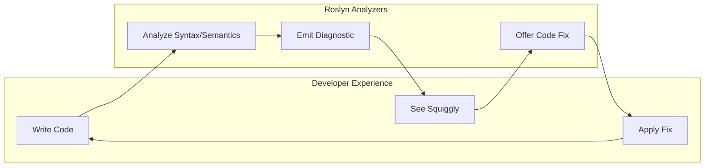

# Ripples Analyzers and Code Fixes

**Status**: 🔵 Design Document  
**Goal**: Guide developers toward best practices and prevent common mistakes at compile time

## Overview

Analyzers run during compilation to catch issues early. Code fixes provide one-click solutions.



---

## Analyzer Categories

### Category 1: Grain Interface Rules (Aggregates)

| Code | Severity | Rule | Fix Available |
|------|----------|------|---------------|
| `RP1001` | Error | `[UxAggregate]` must be on interface inheriting `IAggregateGrain` | ✅ Add inheritance |
| `RP1002` | Warning | Aggregate grain interface should follow `I{Name}AggregateGrain` naming | ✅ Rename |
| `RP1003` | Info | Consider adding `[CommandRoute]` for explicit routing | ✅ Add attribute |

### Category 2: Projection Record Rules

| Code | Severity | Rule | Fix Available |
|------|----------|------|---------------|
| `RP2001` | Error | `[UxProjection]` must be on a record or class, not interface | ✅ Move attribute |
| `RP2002` | Error | `[UxProjection]` types must have `[GenerateSerializer]` | ✅ Add attribute |
| `RP2003` | Warning | `[UxProjection]` should have `BrookName` specified | ✅ Add property |
| `RP2004` | Warning | `[UxProjection]` type should also have `[SnapshotStorageName]` | ✅ Add attribute |
| `RP2005` | Warning | Projection should be a `sealed record` for immutability | ✅ Add sealed |
| `RP2006` | Warning | Properties in `[GenerateSerializer]` types should have `[Id(n)]` | ✅ Add Id attributes |

### Category 3: Serialization Rules (Commands/Events)

| Code | Severity | Rule | Fix Available |
|------|----------|------|---------------|
| `RP3001` | Error | Command types must have `[GenerateSerializer]` | ✅ Add attribute |
| `RP3002` | Error | Event types must have `[GenerateSerializer]` | ✅ Add attribute |
| `RP3003` | Error | Aggregate state must have `[GenerateSerializer]` | ✅ Add attribute |

### Category 4: Reducer Rules

| Code | Severity | Rule | Fix Available |
|------|----------|------|---------------|
| `RP4001` | Warning | Projection `{Name}` has no corresponding `IReducer<{Name}>` implementation | ✅ Generate reducer |
| `RP4002` | Warning | Reducer switch expression should have `_ => state` fallback | ✅ Add fallback |
| `RP4003` | Info | Reducer handles event `{Type}` not in projection's event stream | ❌ Manual review |
| `RP4004` | Warning | Reducer returns `null` for non-creation event | ❌ Manual review |

### Category 5: Component Rules

| Code | Severity | Rule | Fix Available |
|------|----------|------|---------------|
| `RP5001` | Warning | Component has `IRipple<T>` but doesn't call `UseRipple()` | ✅ Add call |
| `RP5002` | Warning | `UseRipple()` called but never `SubscribeAsync()` | ✅ Add subscription |
| `RP5003` | Warning | `SubscribeAsync()` called without `UseRipple()` | ✅ Add UseRipple |
| `RP5004` | Warning | `IRipplePool<T>` used without `MarkHidden()` in `Dispose()` | ✅ Add cleanup |
| `RP5005` | Info | Consider using `<RippleView>` instead of manual `IsLoading` checks | ✅ Wrap in RippleView |
| `RP5006` | Warning | Atom component should not inject `IRipple<T>` | ❌ Architectural |
| `RP5007` | Info | Component injects multiple `IRipple<T>` - consider if this is an Organism | ❌ Informational |

### Category 6: Logging Rules (Existing - Extended)

| Code | Severity | Rule | Fix Available |
|------|----------|------|---------------|
| `RP6001` | Error | Direct `ILogger.Log*()` call - use `LoggerExtensions` | ✅ Generate method |
| `RP6002` | Warning | `[LoggerMessage]` method not `partial` | ✅ Add partial |
| `RP6003` | Info | Consider structured logging parameters over string interpolation | ✅ Extract params |

### Category 7: Route Conflict Detection

| Code | Severity | Rule | Fix Available |
|------|----------|------|---------------|
| `RP7001` | Error | Route `{route}` conflicts with existing projection `{other}` | ❌ Manual |
| `RP7002` | Error | Route `{route}` conflicts with existing aggregate `{other}` | ❌ Manual |
| `RP7003` | Warning | Route contains invalid characters | ✅ Fix route |

### Category 8: Command Rules

| Code | Severity | Rule | Fix Available |
|------|----------|------|---------------|
| `RP8001` | Warning | Command handler should return `Task<OperationResult>` | ✅ Change return |
| `RP8002` | Info | Command record should be `sealed` | ✅ Add sealed |
| `RP8003` | Warning | Command has mutable property | ✅ Make init-only |

### Category 9: Dependency Injection Rules

| Code | Severity | Rule | Fix Available |
|------|----------|------|---------------|
| `RP9001` | Warning | Injected service uses underscore field naming | ✅ Convert to property |
| `RP9002` | Warning | Service injected via property setter, prefer constructor | ❌ Architectural |
| `RP9003` | Info | Consider using `[Inject]` attribute for Blazor components | ✅ Add attribute |

---

## Detailed Analyzer Specifications

### RP2001: UxProjection on Wrong Target

**Trigger**: `[UxProjection]` on interface instead of record/class

```csharp
// ❌ Error RP2001 - Should be on projection record, not interface
[UxProjection]
public interface IChannelProjectionGrain : IUxProjectionGrain<ChannelProjection>
{
}

// ✅ Correct - Attribute on the projection record
[UxProjection(Route = "channels", BrookName = "cascade.chat.channels")]
[SnapshotStorageName("CASCADE", "CHAT", "CHANNELS")]
[GenerateSerializer]
public sealed record ChannelProjection
{
    [Id(0)] public required string Id { get; init; }
}
```

**Code Fix**: Move `[UxProjection]` attribute to the projection record.

---

### RP2002: Missing GenerateSerializer

**Trigger**: `[UxProjection]` type lacks `[GenerateSerializer]`

```csharp
// ❌ Error RP2002
[UxProjection(Route = "channels")]
public sealed record ChannelProjection { }  // Missing [GenerateSerializer]

// ✅ Correct
[UxProjection(Route = "channels")]
[GenerateSerializer]
public sealed record ChannelProjection { }
```

**Code Fix**: Add `[GenerateSerializer]` attribute.

---

### RP4001: Missing Reducer

**Trigger**: `[UxProjection]` type exists but no `IReducer<T>` implementation found

```csharp
// ⚠️ Warning RP4001
[UxProjection(Route = "channels", BrookName = "cascade.chat.channels")]
[GenerateSerializer]
public sealed record ChannelProjection { }

// No ChannelProjectionReducer found in assembly

// ✅ Fix: Generate reducer skeleton
public sealed class ChannelProjectionReducer : IReducer<ChannelProjection>
{
    public ChannelProjection? Reduce(ChannelProjection? state, object @event) => @event switch
    {
        // TODO: Handle events
        _ => state
    };
}
```

**Code Fix**: Generate reducer file with skeleton.

---

### RP5001: Missing UseRipple Call

**Trigger**: Component has `IRipple<T>` property but doesn't call `UseRipple()`

```csharp
// ⚠️ Warning RP5001
public partial class ChannelList : RippleComponent
{
    [Inject] private IRipple<ChannelListProjection> List { get; set; } = null!;
    
    protected override async Task OnInitializedAsync()
    {
        await List.SubscribeAsync(entityId);
        // Missing: UseRipple(List);
    }
}
```

**Code Fix**: Add `UseRipple(List);` before subscribe.

---

### RP5004: Missing Pool Cleanup

**Trigger**: `IRipplePool<T>.MarkVisible()` called but no `MarkHidden()` in Dispose

```csharp
// ⚠️ Warning RP5004
public partial class ChannelRow : RippleComponent
{
    [Inject] private IRipplePool<ChannelProjection> Pool { get; set; } = null!;
    [Parameter] public string ChannelId { get; set; } = "";
    
    protected override void OnParametersSet()
    {
        Pool.MarkVisible(ChannelId);  // Marked visible but never hidden
    }
    
    // Missing Dispose override
}
```

**Code Fix**: Add or update `Dispose()` with `MarkHidden()`.

```csharp
public override void Dispose()
{
    Pool.MarkHidden(ChannelId);
    base.Dispose();
}
```

---

### RP5005: Use RippleView

**Trigger**: Manual `IsLoading`/`LastError` checks that could use `<RippleView>`

```csharp
// ℹ️ Info RP5005 - Consider RippleView
@if (Channel.IsLoading)
{
    <Skeleton />
}
else if (Channel.LastError is not null)
{
    <Error>@Channel.LastError.Message</Error>
}
else
{
    <span>@Channel.Current?.Name</span>
}

// ✅ Suggested refactor
<RippleView For="Channel">
    <Loading><Skeleton /></Loading>
    <Error Context="ex"><Error>@ex.Message</Error></Error>
    <Content><span>@Channel.Current?.Name</span></Content>
</RippleView>
```

**Code Fix**: Wrap in `<RippleView>` component.

---

### RP5006: Atom Injecting Ripple

**Trigger**: Component in `*/Atoms/*` folder injecting `IRipple<T>`

```csharp
// ⚠️ Warning RP5006 - Atoms should not have state
// File: Components/Atoms/Button.razor.cs
public partial class Button : ComponentBase
{
    [Inject] private IRipple<SomeProjection> Data { get; set; } = null!;  // Wrong!
}
```

**Message**: "Atom components should be stateless. Consider moving this to a Molecule or Organism."

**No automatic fix** - requires architectural decision.

---

### RP9001: Underscore Field Naming

**Trigger**: Injected dependency uses `_` prefix field naming

```csharp
// ⚠️ Warning RP9001
public class ChannelService
{
    private readonly IClusterClient _clusterClient;  // Should be property
    
    public ChannelService(IClusterClient clusterClient)
    {
        _clusterClient = clusterClient;
    }
}

// ✅ Correct (per shared-policies.instructions.md)
public class ChannelService
{
    private IClusterClient ClusterClient { get; }
    
    public ChannelService(IClusterClient clusterClient)
    {
        ClusterClient = clusterClient;
    }
}
```

**Code Fix**: Convert field to get-only property.

---

## Analyzer Package Structure

```
src/
└── Ripples.Analyzers/
    ├── Ripples.Analyzers.csproj        # netstandard2.0
    ├── RipplesAnalyzer.cs              # DiagnosticAnalyzer entry
    ├── Diagnostics/
    │   ├── DiagnosticDescriptors.cs    # All RP#### definitions
    │   └── DiagnosticCategories.cs     # Category constants
    ├── Analyzers/
    │   ├── GrainInterfaceAnalyzer.cs   # RP1xxx
    │   ├── SerializationAnalyzer.cs    # RP2xxx
    │   ├── ReducerAnalyzer.cs          # RP3xxx
    │   ├── ComponentAnalyzer.cs        # RP4xxx
    │   ├── LoggingAnalyzer.cs          # RP5xxx
    │   ├── RouteConflictAnalyzer.cs    # RP6xxx
    │   ├── CommandAnalyzer.cs          # RP7xxx
    │   └── DependencyInjectionAnalyzer.cs  # RP8xxx
    └── CodeFixes/
        ├── AddGenerateSerializerCodeFix.cs
        ├── AddUseRippleCodeFix.cs
        ├── GenerateReducerCodeFix.cs
        ├── WrapInRippleViewCodeFix.cs
        ├── ConvertFieldToPropertyCodeFix.cs
        └── AddPoolCleanupCodeFix.cs
```

---

## Severity Guidelines

| Severity | When to Use | Example |
|----------|-------------|---------|
| **Error** | Code will not work correctly at runtime | Missing serializer |
| **Warning** | Code works but violates best practices | Missing cleanup |
| **Info** | Suggestion for improvement | Use RippleView |
| **Hidden** | Rule exists but disabled by default | Style preferences |

---

## Configuration

### .editorconfig

```ini
# Ripples Analyzer Configuration

# Make missing reducer an error in CI
dotnet_diagnostic.RP3001.severity = error

# Disable atomic design enforcement
dotnet_diagnostic.RP4006.severity = none

# Make underscore fields an error
dotnet_diagnostic.RP8001.severity = error
```

### Analyzer NuGet Package

```xml
<PackageReference Include="Mississippi.Ripples.Analyzers" Version="1.0.0">
  <PrivateAssets>all</PrivateAssets>
  <IncludeAssets>runtime; build; native; contentfiles; analyzers</IncludeAssets>
</PackageReference>
```

---

## IDE Integration

### Visual Studio / VS Code

- Squiggles appear in real-time
- Light bulb offers code fixes
- Error List shows all diagnostics

### CI/CD

```yaml
# Azure Pipelines
- task: DotNetCoreCLI@2
  inputs:
    command: 'build'
    arguments: '-warnaserror'  # Fails on RP warnings
```

---

## Implementation Priority

| Phase | Analyzers | Rationale |
|-------|-----------|-----------|
| **P0** | RP1001, RP1002, RP2001-2003 | Must have - code won't work without |
| **P1** | RP3001, RP4001-4004, RP8001 | Should have - common mistakes |
| **P2** | RP5001-5003, RP7001-7003 | Nice to have - consistency |
| **P3** | RP4005-4007, RP6001-6003 | Polish - UX improvements |

---

## Related Documents

- [10-source-generator-spec.md](./10-source-generator-spec.md) - Generator diagnostics
- [09-developer-experience.md](./09-developer-experience.md) - Overall DX goals
- [shared-policies.instructions.md](/.github/instructions/shared-policies.instructions.md) - DI/logging rules
