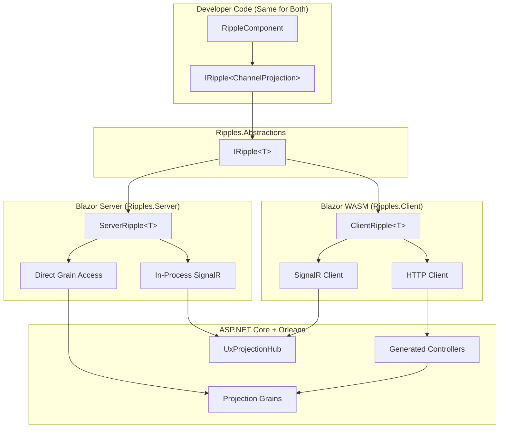

# Phase 7: Ripples – State Management Framework

**Status**: 🔵 Design Complete  
**Priority**: HIGH – Foundation for consistent UX state management

## Goal

Create **Mississippi.Ripples**, a Redux-like state management library with built-in backend integration for both Blazor Server and Blazor WebAssembly. Events flowing downstream create "ripples" of state updates.

## Architecture Overview



## Key Concepts

| Concept | Name | Description |
|---------|------|-------------|
| **Library** | `Mississippi.Ripples` | The state management framework |
| **Update Cycle** | `Ripple` | One complete action → effect → state → notify cycle |
| **Store** | `RippleStore` | The central state container |
| **Effect** | `RippleEffect` | Async side effects (API calls, SignalR) |
| **Base Component** | `RippleComponent` | Blazor component with auto-subscription |

## Dual Hosting Model

### Blazor Server
- **Runs In**: Server process (same as Orleans)
- **Backend Access**: Direct via `IGrainFactory`
- **SignalR**: Already there (UI transport layer)
- **Latency**: Minimal (in-process)
- **Package**: `Ripples.Server`

### Blazor WebAssembly
- **Runs In**: Browser (WASM sandbox)
- **Backend Access**: HTTPS only (generated controllers)
- **SignalR**: Separate client connection
- **Latency**: Network round-trip
- **Package**: `Ripples.Client`

## Project Structure

```
src/
├── Ripples.Abstractions/              # Shared interfaces (netstandard2.1)
│   ├── IRipple.cs                     # Core ripple interface
│   ├── IRippleStore.cs                # Store interface
│   ├── IRippleEffect.cs               # Effect interface
│   ├── Actions/
│   │   ├── SubscribeTo.cs
│   │   ├── Unsubscribe.cs
│   │   └── SendCommand.cs
│   └── State/
│       ├── IProjectionState.cs        # { Data, Version, IsLoading, Error }
│       └── ICommandState.cs
│
├── Ripples/                           # Core store logic (netstandard2.1)
│   ├── RippleStore.cs                 # State management
│   ├── Reducers/                      # Built-in reducers
│   └── Selectors/                     # Built-in selectors
│
├── Ripples.Blazor/                    # Blazor shared (net9.0)
│   ├── RippleComponent.cs             # Base component
│   ├── RippleProvider.razor           # Cascading parameter
│   └── UseRipple.cs                   # Hook-like helper
│
├── Ripples.Server/                    # Blazor Server (net9.0)
│   ├── ServerRipple.cs                # Direct grain access
│   ├── ServerRippleEffect.cs          # In-process effects
│   └── RipplesServerExtensions.cs     # services.AddRipplesServer()
│
├── Ripples.Client/                    # Blazor WASM (net9.0)
│   ├── ClientRipple.cs                # HTTP-based access
│   ├── ClientRippleEffect.cs          # HTTP + SignalR effects
│   ├── SignalRRippleConnection.cs     # SignalR client management
│   └── RipplesClientExtensions.cs     # services.AddRipplesClient()
│
└── Ripples.Generators/                # Source generators (netstandard2.0)
    ├── ProjectionControllerGenerator.cs
    ├── AggregateControllerGenerator.cs
    └── ProjectionRouteRegistryGenerator.cs

├── Ripples.Analyzers/                 # Roslyn analyzers (netstandard2.0)
│   ├── GrainInterfaceAnalyzer.cs      # RP1xxx rules
│   ├── SerializationAnalyzer.cs       # RP2xxx rules
│   ├── ReducerAnalyzer.cs             # RP3xxx rules
│   ├── ComponentAnalyzer.cs           # RP4xxx rules
│   └── CodeFixes/                     # One-click fixes
```

## Tasks

| Task | File | Status |
|------|------|--------|
| 7.0 Architecture Design | [00-architecture.md](./00-architecture.md) | ✅ Design |
| 7.1 Ripples Abstractions | [01-abstractions.md](./01-abstractions.md) | ⬜ Not Started |
| 7.2 Core Store Implementation | [02-core-store.md](./02-core-store.md) | ⬜ Not Started |
| 7.3 Blazor Integration | [03-blazor-integration.md](./03-blazor-integration.md) | ⬜ Not Started |
| 7.4 Server Implementation | [04-server-implementation.md](./04-server-implementation.md) | ⬜ Not Started |
| 7.5 Client Implementation | [05-client-implementation.md](./05-client-implementation.md) | ⬜ Not Started |
| 7.6 Source Generators | [06-source-generators.md](./06-source-generators.md) | ⬜ Not Started |
| 7.7 Composable Projections | [07-composable-projections.md](./07-composable-projections.md) | 🔵 Design |
| 7.8 Migration from Cascade Sample | [08-migration.md](./08-migration.md) | ⬜ Not Started |
| 7.9 Developer Experience Guide | [09-developer-experience.md](./09-developer-experience.md) | 🔵 Design |
| 7.10 Source Generator Spec | [10-source-generator-spec.md](./10-source-generator-spec.md) | 🔵 Design |
| 7.11 Tutorial: First Feature | [11-tutorial-first-feature.md](./11-tutorial-first-feature.md) | 🔵 Design |
| 7.12 Attribute Design (Revised) | [12-attribute-design-revised.md](./12-attribute-design-revised.md) | 🔵 Design |
| 7.13 Analyzers & Code Fixes | [13-analyzers-and-code-fixes.md](./13-analyzers-and-code-fixes.md) | 🔵 Design |

## Acceptance Criteria

- [ ] `IRipple<T>` interface works identically in Server and WASM
- [ ] Source generators create controllers from grain attributes
- [ ] `ProjectionRouteRegistry` generated for WASM URL construction
- [ ] Composable projections (list → detail) work efficiently
- [ ] Subscription lifecycle managed correctly (subscribe/unsubscribe on mount/unmount)
- [ ] `<RippleView>` component handles Loading/Error/Content states
- [ ] Command dispatchers generated for type-safe command invocation
- [ ] **10-minute UX goal**: New feature achievable in ~10 minutes
- [ ] L0 tests for all core logic
- [ ] Cascade sample migrated to use Ripples

## New Projects

- `src/Ripples.Abstractions/`
- `src/Ripples/`
- `src/Ripples.Blazor/`
- `src/Ripples.Server/`
- `src/Ripples.Client/`
- `src/Ripples.Generators/`
- `src/Ripples.Analyzers/`
- `tests/Ripples.L0Tests/`
- `tests/Ripples.Server.L0Tests/`
- `tests/Ripples.Client.L0Tests/`
- `tests/Ripples.Analyzers.L0Tests/`

## Key Design Decisions

1. **Same Interface, Different Implementations**: Developer writes `IRipple<T>` once, works in both Server and WASM.
2. **Server: Direct Grain Access**: Zero overhead when collocated with Orleans.
3. **WASM: HTTP + SignalR**: Only option for browser, uses generated controllers.
4. **Generate Controllers Always**: Required for WASM, useful for Server (testing, external access).
5. **Route Registry Generated**: WASM needs to know paths at compile time.
6. **Composable Projections**: Support list-of-IDs projections with per-row detail projections.
7. **10-Minute UX Goal**: Developers should go from "I need a feature" to "working UI" in ~10 minutes.
8. **`<RippleView>` Component**: Declarative loading/error/content states eliminate boilerplate.
9. **`[UxAggregate]` Generator**: Generates command controllers and type-safe dispatchers.
10. **Atomic Design Integration**: Clear component hierarchy (Atoms → Molecules → Organisms → Pages).
11. **Attribute Placement by Domain Nature**:
    - `[UxAggregate]` on **grain interface** - the grain IS the actor
    - `[UxProjection]` on **projection record** - the record IS the data product
    - `BrookName` inside `[UxProjection]` - all projection config in one place
12. **Analyzers for Guardrails**: Compile-time rules enforce patterns (RP1xxx-RP8xxx diagnostics).
13. **Grain Base Reads From Attributes**: `UxProjectionGrainBase<T>` reads config from `T`'s attributes automatically.

