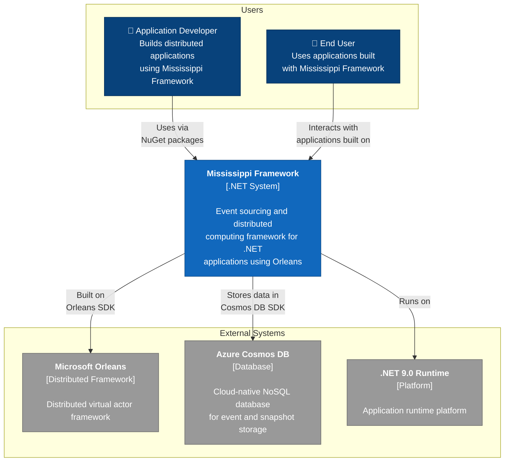

# C1: System Context Diagram

This diagram shows the Mississippi Framework and how it interacts with external systems and users.

## Key Elements

- **Mississippi Framework**: The core system providing event sourcing, CQRS, and distributed computing capabilities
- **Application Developer**: Uses the framework to build scalable distributed applications
- **End User**: Consumes applications built with Mississippi
- **Microsoft Orleans**: Foundation for distributed computing and virtual actors
- **Azure Cosmos DB**: Persistent storage for events and snapshots
- **.NET 9.0 Runtime**: Execution platform
