# C2: Container Diagram

This diagram shows the major containers (deployable units) within the Mississippi Framework and how they interact.

```mermaid
graph TB
    Developer["👤 Application Developer"]
    
    subgraph Mississippi["Mississippi Framework"]
        subgraph Core["Core Infrastructure"]
            CoreLib["<b>Core</b><br/>[Container: C# / .NET 9.0]<br/><br/>Core abstractions and utilities"]
            Hosting["<b>Hosting</b><br/>[Container: C# / .NET 9.0]<br/><br/>Application hosting and DI"]
            AspNet["<b>AspNetCore.Orleans</b><br/>[Container: ASP.NET Core]<br/><br/>Orleans web integration"]
        end
        
        subgraph EventSourcing["Event Sourcing Subsystem"]
            Brooks["<b>Brooks</b><br/>[Container: Orleans]<br/><br/>Event stream storage"]
            Aggregates["<b>Aggregates</b><br/>[Container: Orleans]<br/><br/>DDD aggregate management"]
            Projections["<b>Projections</b><br/>[Container: Orleans]<br/><br/>Read model projections"]
            Snapshots["<b>Snapshots</b><br/>[Container: Orleans]<br/><br/>Aggregate snapshots"]
            Reducers["<b>Reducers</b><br/>[Container: .NET]<br/><br/>State reduction"]
            Effects["<b>Effects</b><br/>[Container: .NET]<br/><br/>Side effect handling"]
            Serialization["<b>Serialization</b><br/>[Container: .NET]<br/><br/>Event serialization"]
            UxProjections["<b>UX Projections</b><br/>[Container: Orleans]<br/><br/>UI projections"]
        end
        
        subgraph Storage["Storage Providers"]
            BrooksCosmos["<b>Brooks.Cosmos</b><br/>[Container: Cosmos SDK]<br/><br/>Event stream storage"]
            SnapshotsCosmos["<b>Snapshots.Cosmos</b><br/>[Container: Cosmos SDK]<br/><br/>Snapshot storage"]
            CoreCosmos["<b>Core.Cosmos</b><br/>[Container: Cosmos SDK]<br/><br/>Cosmos utilities"]
        end
    end
    
    subgraph Samples["Sample Applications"]
        ApiApp["<b>Crescent API App</b><br/>[ASP.NET Core]"]
        ConsoleApp["<b>Crescent Console App</b><br/>[.NET]"]
        WebApp["<b>Crescent Web App</b><br/>[Blazor]"]
    end
    
    Orleans["<b>Microsoft Orleans</b><br/>[External System]"]
    Cosmos["<b>Azure Cosmos DB</b><br/>[External Database]"]
    
    Developer -->|Uses| CoreLib
    Developer -->|Uses| Hosting
    Developer -->|Uses| AspNet
    
    ApiApp -->|Uses| Hosting
    ApiApp -->|Uses| AspNet
    ApiApp -->|Uses| Aggregates
    ConsoleApp -->|Uses| Hosting
    ConsoleApp -->|Uses| Aggregates
    WebApp -->|Uses| AspNet
    WebApp -->|Uses| UxProjections
    
    Hosting -->|Uses| CoreLib
    AspNet -->|Integrates with| Orleans
    
    Aggregates -->|Uses| Brooks
    Aggregates -->|Uses| Reducers
    Aggregates -->|Uses| Snapshots
    Aggregates -->|Uses| Serialization
    
    Projections -->|Reads from| Brooks
    Projections -->|Uses| Effects
    
    UxProjections -->|Reads from| Brooks
    UxProjections -->|Uses| Snapshots
    
    Brooks -->|Uses| Serialization
    Brooks -->|Persists via| BrooksCosmos
    Snapshots -->|Persists via| SnapshotsCosmos
    
    BrooksCosmos -->|Uses| CoreCosmos
    SnapshotsCosmos -->|Uses| CoreCosmos
    BrooksCosmos -->|Writes to| Cosmos
    SnapshotsCosmos -->|Writes to| Cosmos
    
    classDef person fill:#08427B,stroke:#052E56,color:#fff
    classDef container fill:#1168BD,stroke:#0B4884,color:#fff
    classDef external fill:#999,stroke:#666,color:#fff
    
    class Developer person
    class CoreLib,Hosting,AspNet,Brooks,Aggregates,Projections,Snapshots,Reducers,Effects,Serialization,UxProjections,BrooksCosmos,SnapshotsCosmos,CoreCosmos,ApiApp,ConsoleApp,WebApp container
    class Orleans,Cosmos external
```

## Key Containers

### Core Infrastructure
- **Core**: Foundation abstractions and utilities
- **Hosting**: Application startup and DI configuration
- **AspNetCore.Orleans**: Web application integration

### Event Sourcing Components
- **Brooks**: Event stream storage with append-only logs
- **Aggregates**: Domain aggregates with command handling
- **Projections**: Read model generation from events
- **Snapshots**: Performance optimization via state snapshots
- **Reducers**: Event sequence to state transformation
- **Effects**: Async side effect coordination
- **Serialization**: JSON-based event serialization
- **UX Projections**: UI-optimized read models

### Storage Providers
- **Brooks.Cosmos**: Cosmos DB event stream storage
- **Snapshots.Cosmos**: Cosmos DB snapshot storage
- **Core.Cosmos**: Shared Cosmos DB utilities

### Sample Applications
- **Crescent API App**: REST API example
- **Crescent Console App**: CLI example
- **Crescent Web App**: Blazor web UI example
