# C3: Component Diagram

This diagram shows the internal components of the Event Sourcing subsystem within the Mississippi Framework.

```mermaid
graph TB
    subgraph Aggregates["Aggregates Container"]
        AggGrain["<b>IAggregateGrain</b><br/>[Orleans Interface]<br/><br/>Aggregate root grain<br/>for command handling"]
        CmdHandler["<b>Command Handlers</b><br/>[C# Classes]<br/><br/>Process commands<br/>and produce events"]
        EventReg["<b>Event Type Registry</b><br/>[C# Service]<br/><br/>Maps event types<br/>to names"]
        SnapReg["<b>Snapshot Type Registry</b><br/>[C# Service]<br/><br/>Maps snapshot types<br/>to names"]
        AggFactory["<b>Aggregate Factory</b><br/>[C# Service]<br/><br/>Creates aggregate<br/>instances"]
    end
    
    subgraph Brooks["Brooks Container"]
        BrookDef["<b>Brook Definition</b><br/>[C# Interface]<br/><br/>Defines stream<br/>structure"]
        BrookEvent["<b>Brook Event</b><br/>[C# Record]<br/><br/>Immutable event<br/>with metadata"]
        BrookPos["<b>Brook Position</b><br/>[Value Object]<br/><br/>Position in stream"]
        BrookStorage["<b>Brook Storage Provider</b><br/>[C# Interface]<br/><br/>Abstract storage<br/>operations"]
    end
    
    subgraph Reducers["Reducers Container"]
        Reducer["<b>IReducer</b><br/>[C# Interface]<br/><br/>Reduces events<br/>to state"]
        ReducerEngine["<b>Reducer Engine</b><br/>[C# Service]<br/><br/>Orchestrates<br/>state reduction"]
        FoldFunc["<b>Fold Functions</b><br/>[C# Functions]<br/><br/>Pure state<br/>transformations"]
    end
    
    subgraph Snapshots["Snapshots Container"]
        SnapGrain["<b>Snapshot Grain</b><br/>[Orleans Grain]<br/><br/>Manages aggregate<br/>snapshots"]
        SnapStore["<b>Snapshot Storage</b><br/>[C# Interface]<br/><br/>Abstract snapshot<br/>persistence"]
        SnapStrategy["<b>Snapshot Strategy</b><br/>[C# Service]<br/><br/>Determines when<br/>to snapshot"]
    end
    
    subgraph Projections["Projections Container"]
        ProjGrain["<b>Projection Grain</b><br/>[Orleans Grain]<br/><br/>Processes events<br/>into read models"]
        ProjHandler["<b>Event Handlers</b><br/>[C# Classes]<br/><br/>Transform events<br/>to projections"]
        ProjStore["<b>Projection Storage</b><br/>[C# Interface]<br/><br/>Stores read models"]
    end
    
    subgraph Effects["Effects Container"]
        Effect["<b>IEffect</b><br/>[C# Interface]<br/><br/>Side effect<br/>definition"]
        EffectRunner["<b>Effect Runner</b><br/>[C# Service]<br/><br/>Executes<br/>side effects"]
        EffectHandler["<b>Effect Handlers</b><br/>[C# Classes]<br/><br/>Implement specific<br/>effects"]
    end
    
    subgraph Serialization["Serialization Container"]
        Serializer["<b>Event Serializer</b><br/>[C# Service]<br/><br/>Serializes/deserializes<br/>events"]
        JsonProvider["<b>JSON Provider</b><br/>[C# Service]<br/><br/>System.Text.Json<br/>implementation"]
        TypeMapping["<b>Type Mapping</b><br/>[C# Service]<br/><br/>Maps CLR types<br/>to storage names"]
    end
    
    subgraph UxProj["UX Projections Container"]
        UxGrain["<b>UX Projection Grain</b><br/>[Orleans Grain]<br/><br/>UI-optimized<br/>projections"]
        UxHandler["<b>UX Event Handlers</b><br/>[C# Classes]<br/><br/>Transform events<br/>for UI"]
        UxStore["<b>UX Projection Store</b><br/>[C# Interface]<br/><br/>Stores UI<br/>projections"]
    end
    
    %% Internal relationships
    AggGrain -->|Delegates to| CmdHandler
    CmdHandler -->|Uses| EventReg
    AggFactory -->|Creates| AggGrain
    AggGrain -->|Uses| SnapReg
    
    BrookEvent -->|Contains| BrookPos
    BrookStorage -->|Uses| BrookDef
    BrookStorage -->|Stores/Retrieves| BrookEvent
    
    ReducerEngine -->|Executes| Reducer
    Reducer -->|Implements with| FoldFunc
    
    SnapGrain -->|Persists via| SnapStore
    SnapGrain -->|Uses| SnapStrategy
    
    ProjGrain -->|Delegates to| ProjHandler
    ProjHandler -->|Updates| ProjStore
    
    EffectRunner -->|Executes| Effect
    EffectHandler -->|Implements| Effect
    
    Serializer -->|Uses| JsonProvider
    Serializer -->|Uses| TypeMapping
    
    UxGrain -->|Delegates to| UxHandler
    UxHandler -->|Updates| UxStore
    
    %% Cross-container relationships
    CmdHandler -->|Appends events to| BrookStorage
    AggGrain -->|Reduces state with| ReducerEngine
    AggGrain -->|Loads/saves via| SnapGrain
    ReducerEngine -->|Deserializes with| Serializer
    
    ProjGrain -->|Reads events from| BrookStorage
    ProjHandler -->|Triggers| EffectRunner
    
    UxGrain -->|Reads events from| BrookStorage
    UxGrain -->|May use| SnapStore
    
    classDef component fill:#85BBF0,stroke:#5D82A8,color:#000
    
    class AggGrain,CmdHandler,EventReg,SnapReg,AggFactory,BrookDef,BrookEvent,BrookPos,BrookStorage,Reducer,ReducerEngine,FoldFunc,SnapGrain,SnapStore,SnapStrategy,ProjGrain,ProjHandler,ProjStore,Effect,EffectRunner,EffectHandler,Serializer,JsonProvider,TypeMapping,UxGrain,UxHandler,UxStore component
```

## Key Components

### Aggregates Container
- **IAggregateGrain**: Orleans grain interface for aggregate roots
- **Command Handlers**: Execute business logic and produce domain events
- **Event Type Registry**: Maps event types to stable storage identifiers
- **Snapshot Type Registry**: Maps snapshot types to stable identifiers
- **Aggregate Factory**: Creates configured aggregate instances

### Brooks Container (Event Storage)
- **Brook Definition**: Defines stream structure and partitioning
- **Brook Event**: Immutable event record with metadata
- **Brook Position**: Position tracking in event stream
- **Brook Storage Provider**: Abstract interface for storage backends

### Reducers Container
- **IReducer**: Interface for state reduction logic
- **Reducer Engine**: Orchestrates event replay and state building
- **Fold Functions**: Pure functions for state transformation

### Snapshots Container
- **Snapshot Grain**: Manages periodic aggregate snapshots
- **Snapshot Storage**: Abstract persistence interface
- **Snapshot Strategy**: Determines snapshot frequency

### Projections Container
- **Projection Grain**: Processes events into read models
- **Event Handlers**: Transform events to projection updates
- **Projection Storage**: Persists read models

### Effects Container
- **IEffect**: Side effect contract
- **Effect Runner**: Executes effects asynchronously
- **Effect Handlers**: Implement specific side effects (email, notifications, etc.)

### Serialization Container
- **Event Serializer**: Core serialization logic
- **JSON Provider**: System.Text.Json implementation
- **Type Mapping**: CLR type to storage name translation

### UX Projections Container
- **UX Projection Grain**: UI-optimized projections
- **UX Event Handlers**: Transform events for UI consumption
- **UX Projection Store**: Stores UI-friendly data structures

## Component Interactions

1. **Command Processing**: Commands → Command Handlers → Events → Brook Storage
2. **State Reduction**: Events → Reducer Engine → Fold Functions → Current State
3. **Snapshot Management**: State → Snapshot Strategy → Snapshot Grain → Snapshot Storage
4. **Read Model Updates**: Events → Projection Grain → Event Handlers → Projection Storage
5. **Side Effects**: Events → Effect Runner → Effect Handlers → External Systems
6. **UI Projections**: Events → UX Grain → UX Handlers → UX Store
