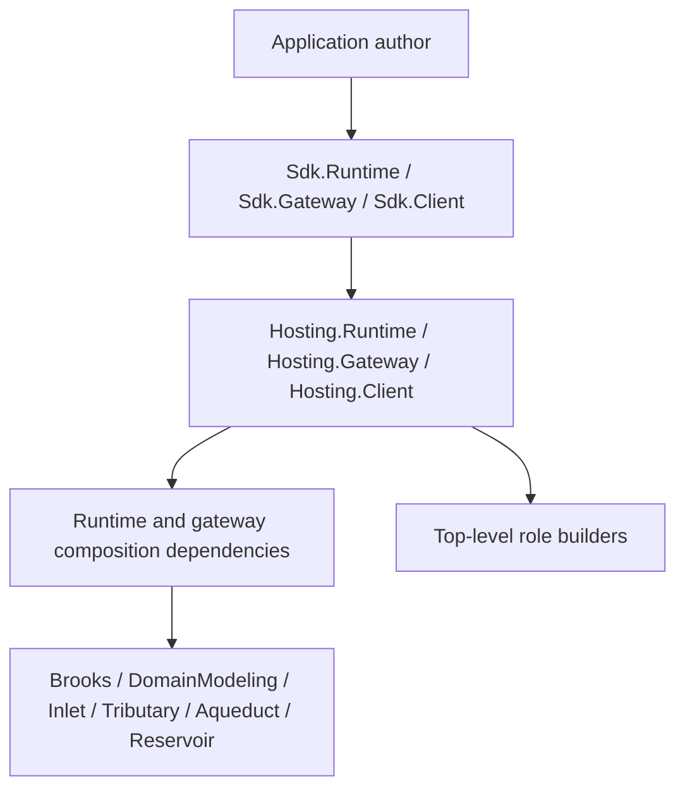

# ADR-0001: Assign Hosting Package Ownership for Role Builders

## Context and Problem Statement

The revised builder rollout needs one clear semantic owner for each top-level role builder. The open question is whether role-builder APIs and the runtime or gateway composition dependencies should live in `Hosting.*`, in `Sdk.*`, or be split across both, because the answer sets the package boundary that application authors and future maintainers will treat as canonical.

## Decision Drivers

- Keep package ownership aligned with API ownership.
- Preserve `Sdk.*` as thin convenience packages rather than orchestration homes.
- Match the existing `Hosting.Client` precedent so the builder family reads as one product line.
- Keep generators, Spring proof hosts, and docs aligned to one supported role-entry story.
- Avoid a split ownership model that is hard to explain and harder to maintain.

## Considered Options

- Put top-level role builders and role-composition dependencies in `Hosting.*`, with `Sdk.*` remaining thin aggregators.
- Keep top-level role builders and role-composition dependencies in `Sdk.*`.
- Put public builders in `Hosting.*` but leave the bulk of runtime and gateway composition dependencies in `Sdk.*`.

## Decision Outcome

Chosen option: "Put top-level role builders and role-composition dependencies in `Hosting.*`, with `Sdk.*` remaining thin aggregators", because the package that owns the public role-builder surface should also own the concrete host-composition dependencies and orchestration logic behind that surface.

### Consequences

- Good, because `Hosting.Runtime`, `Hosting.Gateway`, and `Hosting.Client` become the authoritative semantic homes for role composition.
- Good, because `Sdk.*` stays lightweight and predictable for application authors.
- Good, because runtime and gateway dependency relocation makes package boundaries match the confirmed architecture instead of historical accident.
- Bad, because runtime and gateway project references need to move, which is a breaking packaging change for the rollout slice.
- Bad, because branch-local ADR numbering is provisional until the branch is rebased onto the latest `main` during merge preparation.

### Confirmation

Compliance will be confirmed by the implementation slices moving runtime and gateway composition references into `Hosting.Runtime` and `Hosting.Gateway`, keeping `Sdk.Runtime` and `Sdk.Gateway` thin, and updating Spring and generated code to reference the hosting-owned role builders as the supported entry points.

## Pros and Cons of the Options

### Put top-level role builders and role-composition dependencies in `Hosting.*`, with `Sdk.*` remaining thin aggregators

This makes the public role-builder APIs and their concrete composition dependencies live in the same package family.

- Good, because ownership is explicit and teachable.
- Good, because it follows the concrete `Hosting.Client` precedent already present in the repo.
- Neutral, because `Sdk.*` still exists for convenience packaging and analyzer aggregation.
- Bad, because it requires dependency relocation work in the rollout.

### Keep top-level role builders and role-composition dependencies in `Sdk.*`

This would make the convenience package also own the concrete composition implementation.

- Good, because it minimizes near-term package shuffling.
- Bad, because it turns `Sdk.*` into an implementation owner instead of a thin app-author package.
- Bad, because it diverges from the hosting-family design already established by `Hosting.Client`.

### Put public builders in `Hosting.*` but leave the bulk of runtime and gateway composition dependencies in `Sdk.*`

This splits API ownership from dependency ownership.

- Good, because it reduces immediate project-reference churn.
- Bad, because it leaves the semantic owner unable to fully own the implementation boundary behind its public API.
- Bad, because it creates a harder-to-explain split that future contributors would have to rediscover.

## More Information

- [Solution design](../../../../.thinking/2026-03-24-mississippi-builder-rollout/03-architecture/solution-design.md)
- [Architecture revision notes](../../../../.thinking/2026-03-24-mississippi-builder-rollout/03-architecture/architecture-revision-notes.md)
- [Decision log](../../../../.thinking/2026-03-24-mississippi-builder-rollout/decision-log.md)
- [ADR-0002](0002-standardize-runtime-host-entry-shape.md)
