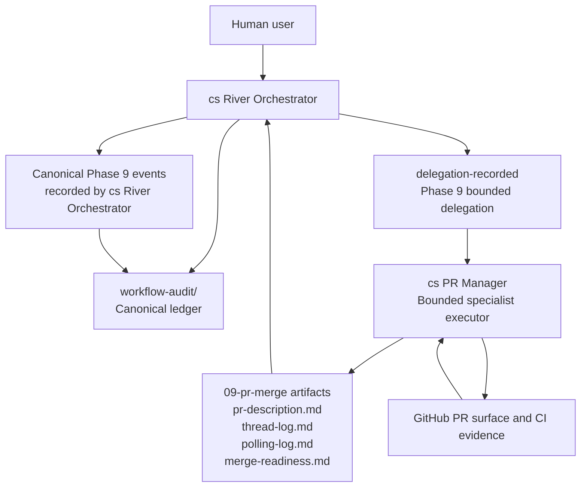

# ADR-0001: Keep A Single Canonical Writer With Bounded Phase 9 Delegation

## Context and Problem Statement

The Clean Squad refactor removes the Phase 8 to Phase 9 canonical ownership handoff and replaces it with a single-writer model. The design question is: how should the workflow preserve specialist PR execution in Phase 9 without keeping a second canonical authority center or weakening the audit trail?

The previous split made the workflow harder to teach, harder to recover, and harder to audit because canonical ownership changed exactly where PR creation, polling, review-thread handling, and merge-readiness work became most operationally dense. The refactor needs to preserve reviewer-significant Phase 9 detail, keep publication and merge-readiness judgment with `cs River Orchestrator`, and avoid inventing unnecessary runtime or schema complexity.

## Decision Drivers

- A single canonical authority is easier to reason about than a phase-specific writer handoff.
- Reviewer-significant Phase 9 work must remain explicit in the canonical ledger.
- `cs PR Manager` must remain available as a specialist for PR-surface execution.
- The change should stay focused on ownership-coupled normative artifacts and avoid unnecessary schema or runtime expansion.
- Recovery, blocked-state handling, and merge-readiness evaluation should not depend on a writer-transfer edge case.

## Considered Options

- Keep `cs River Orchestrator` as the sole canonical writer and delegate bounded Phase 9 execution to `cs PR Manager`.
- Preserve the existing Phase 9 canonical handoff to `cs PR Manager`.
- Allow shared canonical writing in Phase 9, with both `cs River Orchestrator` and `cs PR Manager` appending workflow facts.

## Decision Outcome

Chosen option: "Keep `cs River Orchestrator` as the sole canonical writer and delegate bounded Phase 9 execution to `cs PR Manager`", because it removes the ownership split at the root while preserving Phase 9 specialization, explicit provenance, and a coherent audit model.

### Consequences

- Good, because one role now owns canonical workflow facts from intake through merge readiness, which simplifies audit, recovery, and training.
- Good, because `cs PR Manager` remains useful where it is strongest: PR creation, polling, review-thread handling, PR-surface updates, and evidence gathering.
- Good, because publication decisions, stale-summary invalidation, blocked-state recording, and merge-readiness judgment stay with the same authority that owns the rest of the run.
- Bad, because `cs River Orchestrator` must now record more Phase 9 facts explicitly instead of relying on a handoff boundary.
- Bad, because reviewers must follow delegation and `causedBy` links to understand who executed Phase 9 specialist work.
- Bad, because all ownership-coupled workflow documents must be updated together; partial adoption would leave the contract contradictory.

### Confirmation

Compliance with this ADR will be confirmed by reviewing the ownership-coupled normative files for these invariants:

- `workflow-audit/` has exactly one canonical writer for all nine phases.
- Phase 9 specialist work starts with a `delegation-recorded` event that names `cs PR Manager` and sets `details.expectedOutputPath` plus the related `details.*` expected artifact fields.
- `cs PR Manager` no longer has canonical-writing authority.
- `state.json` remains runtime support only and does not gain secondary-writer or delegate ownership fields.
- The workflow text and Mermaid mirror express the same ownership model.

## Pros and Cons of the Options

### Keep `cs River Orchestrator` as the sole canonical writer and delegate bounded Phase 9 execution to `cs PR Manager`

This option keeps one canonical authority for the full workflow while letting a specialist execute bounded PR work under explicit delegation.

- Good, because it resolves the split-authority model directly instead of masking it.
- Good, because it preserves specialist execution without making PR-surface work the source of canonical truth.
- Neutral, because the existing event envelope can express the necessary provenance without changing the decision itself.
- Bad, because the River Orchestrator contract becomes more explicit and therefore more demanding in Phase 9.

### Preserve the existing Phase 9 canonical handoff to `cs PR Manager`

This option keeps the current authority transfer at the start of PR and merge work.

- Good, because it keeps the current specialist role semantics familiar.
- Bad, because the workflow still changes canonical authority at the exact point where recovery and audit pressure are highest.
- Bad, because publication and merge-readiness authority remain split from the rest of the workflow owner.
- Bad, because blocked startup and handoff semantics stay as special cases that must be taught and recovered separately.

### Allow shared canonical writing in Phase 9, with both `cs River Orchestrator` and `cs PR Manager` appending workflow facts

This option keeps cs River Orchestrator involved in Phase 9 while also letting the specialist write canonical events directly.

- Good, because it preserves direct specialist reporting in the ledger.
- Bad, because it creates two authority centers for the same phase and weakens append ownership clarity.
- Bad, because concurrency, sequencing, and provenance rules become harder to explain and verify.
- Bad, because it introduces a precedent for multi-writer canonical ledgers that the broader workflow does not need.

## More Information

This ADR is based on the solution design and Three Amigos synthesis prepared for the canonical Clean Squad orchestrator refactor.

The underlying solution design described the single canonical writer pattern for workflow events, clarified the distinct responsibilities of `cs River Orchestrator` and `cs PR Manager`, and analyzed failure and recovery scenarios around Phase 9 delegation.

The Three Amigos synthesis captured cross-functional agreement on keeping a single canonical writer while allowing bounded Phase 9 delegation to a specialist without introducing multi-writer ledger semantics.

Related durable references:

- Published workflow contract: `.github/clean-squad/WORKFLOW.md`
- ADR authoring mechanics, template, and lifecycle rules: `.github/instructions/adr.instructions.md`

The decision to reuse the existing event envelope for delegated provenance was intentionally kept inside this ADR rather than published as a separate record, because the current design does not show an independently justified architectural fork on schema shape.
