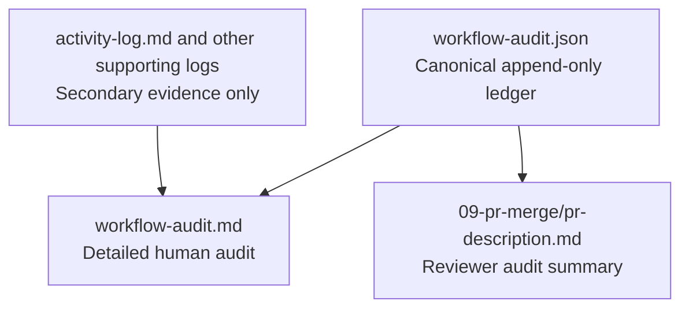

# ADR-0001: Use a Canonical Workflow Audit Ledger for Clean Squad Execution

## Context and Problem Statement

The Clean Squad execution-audit enhancement needs a trustworthy way to prove which agents ran, in what order, what they produced, how long the run spent active or waiting, and where the run deviated from the declared workflow. The design explicitly rejects relying on narrative logs or hand-authored PR prose as the source of truth, because those artifacts are helpful evidence but not a canonical conformance ledger.

## Decision Drivers

- Reviewer trust depends on one authoritative execution record rather than multiple hand-maintained summaries.
- The detailed audit and the PR-facing audit summary must stay consistent as the run evolves.
- Clean Squad shared state already lives under `.thinking/<task>/`, so the audit source should remain local to that boundary.
- The solution must prove conformance and timing without turning Clean Squad into a generic telemetry platform.

## Considered Options

- Store one canonical append-only ledger in `.thinking/<task>/workflow-audit.json` and derive all human-readable audit outputs from it.
- Reconstruct audit results from `activity-log.md`, `handover-log.md`, `decision-log.md`, and PR logs without introducing a new canonical ledger.
- Maintain separate Markdown audit documents as primary artifacts and keep them synchronized by convention.

## Decision Outcome

Chosen option: "Store one canonical append-only ledger in `.thinking/<task>/workflow-audit.json` and derive all human-readable audit outputs from it", because the design requires one authoritative execution record from which both the detailed audit and the PR-facing reviewer summary can be regenerated without drift.

### Consequences

- Good, because `workflow-audit.json` becomes the single source of truth for execution facts, timing boundaries, and deviations.
- Good, because `workflow-audit.md` and the PR audit section can be regenerated from the same authoritative data.
- Good, because supporting logs remain useful evidence without carrying canonical responsibility.
- Bad, because the enhancement introduces a new persistent artifact and a compilation path that must remain schema-stable enough for downstream tooling.
- Bad, because any gap in the ledger now blocks a trustworthy audit even if narrative logs exist.

### Confirmation

Compliance is confirmed when the task folder contains `workflow-audit.json` as the append-only source of truth, `workflow-audit.md` is compiled from that ledger, and the PR-facing audit section is generated from the same ledger rather than hand-maintained prose.

## Pros and Cons of the Options

### Store one canonical append-only ledger in `.thinking/<task>/workflow-audit.json` and derive all human-readable audit outputs from it

This option introduces a dedicated authoritative artifact and treats all Markdown reports as derived views.

- Good, because authority is explicit and easy to verify.
- Good, because derived outputs can be refreshed after new events without rewriting history.
- Neutral, because it adds a small amount of structure to the existing task folder model.
- Bad, because ledger shape and derivation rules now become part of the architectural contract.

### Reconstruct audit results from `activity-log.md`, `handover-log.md`, `decision-log.md`, and PR logs without introducing a new canonical ledger

This option keeps existing files only and infers the execution history later.

- Good, because it avoids adding a new artifact.
- Bad, because the design explicitly concludes that current logs are only supporting evidence, not a canonical conformance ledger.
- Bad, because timing, deviations, and PR summaries would depend on inference across multiple files.

### Maintain separate Markdown audit documents as primary artifacts and keep them synchronized by convention

This option makes human-readable documents authoritative.

- Good, because the outputs are easy for humans to read directly.
- Bad, because parallel authoritative documents can diverge.
- Bad, because the design explicitly rejects hand-authored PR prose as a trustworthy audit source.

## More Information

- This ADR is the foundation for [ADR-0002](0002-assign-canonical-audit-ledger-writes-to-orchestration-boundaries.md), [ADR-0003](0003-evaluate-execution-conformance-against-the-clean-squad-workflow-contract.md), and [ADR-0004](0004-measure-execution-time-with-explicit-audit-intervals.md).
- Repository evidence: `.thinking/2026-03-24-clean-squad-audit-trail/03-architecture/solution-design.md`
- Workflow contract: `.github/clean-squad/WORKFLOW.md`
