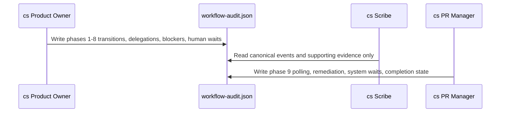

# ADR-0002: Assign Canonical Audit Ledger Writes to Orchestration Boundaries

## Context and Problem Statement

The execution-audit enhancement must capture real workflow boundaries without creating ambiguity about who is allowed to append canonical execution facts. The design explicitly rejects letting every agent write directly to the canonical ledger, because that would increase burden and drift, and instead aligns ledger ownership with the actors that control the orchestration surfaces being measured.

## Decision Drivers

- Canonical execution facts should be written only by the actor that owns the boundary being measured.
- Audit ownership must stay narrow enough to avoid conflicting event writers and historical drift.
- The Scribe needs read-only authority so derived reports do not mutate canonical history.
- Phase 9 review activity is owned by the PR Manager rather than the Product Owner.

## Considered Options

- Let the Product Owner own Phases 1 to 8, let the PR Manager own Phase 9, and make the Scribe read-only for canonical history.
- Allow every participating Clean Squad agent to append canonical events directly.
- Make the Scribe the only writer by reconstructing execution history from supporting artifacts after the fact.

## Decision Outcome

Chosen option: "Let the Product Owner own Phases 1 to 8, let the PR Manager own Phase 9, and make the Scribe read-only for canonical history", because the design wants canonical events written only by the actor that controls the corresponding orchestration boundary.

### Consequences

- Good, because canonical ownership matches real workflow responsibility.
- Good, because the Scribe can compile reports without the risk of rewriting execution history.
- Good, because Phase 9 review-loop timing and deviations remain under the PR Manager, which already owns that workflow surface.
- Bad, because the Product Owner and PR Manager must emit explicit boundary events consistently or downstream derivation becomes incomplete.
- Bad, because some supporting agents may still need their work reflected indirectly through Product Owner or PR Manager events rather than writing facts themselves.

### Confirmation

Compliance is confirmed when canonical append operations are limited to Product Owner and PR Manager workflow boundaries, the Scribe reads but does not mutate the canonical ledger, and derived artifacts describe the same event history.

## Pros and Cons of the Options

### Let the Product Owner own Phases 1 to 8, let the PR Manager own Phase 9, and make the Scribe read-only for canonical history

This option aligns audit authorship with Clean Squad orchestration boundaries.

- Good, because authority is clear at every phase boundary.
- Good, because Phase 9 remains consistent with existing PR Manager responsibilities.
- Neutral, because it preserves the Scribe as a compiler rather than a historian of reconstructed facts.
- Bad, because boundary emitters become a mandatory part of workflow discipline.

### Allow every participating Clean Squad agent to append canonical events directly

This option distributes canonical event writing across the full roster.

- Good, because individual agents could record their own work directly.
- Bad, because the design explicitly rejects this due to increased burden and drift risk.
- Bad, because it weakens the link between workflow ownership and audit authority.

### Make the Scribe the only writer by reconstructing execution history from supporting artifacts after the fact

This option centralizes writing in the compiler.

- Good, because it reduces the number of canonical writers.
- Bad, because the resulting ledger would be reconstructed rather than captured at the boundary where execution actually occurred.
- Bad, because timing and wait semantics would become inferential instead of explicit.

## More Information

- Related foundational decision: [ADR-0001](0001-use-a-canonical-workflow-audit-ledger-for-clean-squad-execution.md)
- Related derivation and conformance decisions: [ADR-0003](0003-evaluate-execution-conformance-against-the-clean-squad-workflow-contract.md) and [ADR-0004](0004-measure-execution-time-with-explicit-audit-intervals.md)
- Repository evidence: `.thinking/2026-03-24-clean-squad-audit-trail/03-architecture/solution-design.md`
