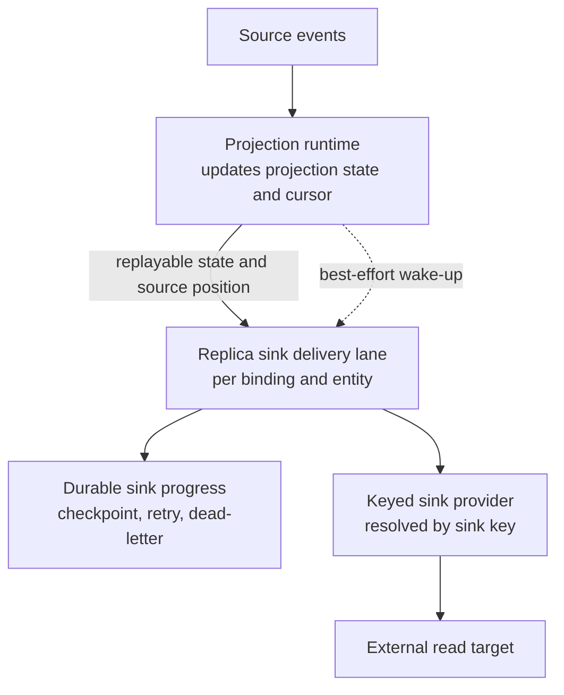

# ADR-0002: Use Named, Versioned Replica Sinks With Durable Out-of-Band Delivery

## Context and Problem Statement

Mississippi needs a projection-driven way to publish external read models without turning projection updates into synchronous dual writes or best-effort side effects. The design question is: how should replica sinks support multiple named destinations, same-kind providers, explicit contract versioning, and durable recovery while keeping projection correctness independent of sink availability?

Named sink routing, provider-neutral target metadata, and side-by-side contract versions are core requirements, not adoption polish. Recovery must survive restart and replay, newly added sinks must backfill through existing rebuild or replay seams, and operators need backlog, retry, dead-letter, and health visibility from the first implementation slice.

The following diagram shows the decision's main point: the projection path remains authoritative for state and source position, while replica delivery runs out-of-band with its own durable progress tracking.

## Decision Drivers

- Projection updates must stay successful even when a replica target is slow, unavailable, or misconfigured.
- Multiple named sinks, including multiple registrations of the same provider kind, must coexist safely in one host.
- External contract identity must be explicit and versioned so side-by-side rollout and replay-safe migration are possible.
- Recovery should reuse existing projection cursor and replay seams instead of introducing a second correctness source.
- Minimum first-slice operability requires per-sink backlog, retry, dead-letter, and health visibility.

## Considered Options

- Named, versioned, provider-neutral replica sinks with durable out-of-band delivery derived from replayable projection state.
- In-band projection writes to external targets.
- Best-effort asynchronous effects with provider-kind routing and implicit contract identity.

## Decision Outcome

Chosen option: "Named, versioned, provider-neutral replica sinks with durable out-of-band delivery derived from replayable projection state", because it is the only option that satisfies same-kind multi-registration, explicit contract versioning, replay-safe recovery, and non-blocking projection success without coupling correctness to sink availability.

Replica sink bindings will be declared by projection metadata that names a sink key and a provider-neutral `targetName`. Runtime resolution will use the sink key, not provider kind. External contracts will use explicit versioned identity, and mapped replica contracts will be the preferred production path while direct projection replication remains an explicit convenience path.

Delivery will run in a durable out-of-band lane per binding and entity. That lane will persist committed source position, bootstrap progress, retry schedule, and dead-letter state, while deriving desired external state from existing projection cursor and replay seams. Live updates may send best-effort wake-ups to reduce lag, but correctness will depend on replayable projection state plus durable sink progress rather than on wake-up delivery surviving restart.

`LatestState` will be the default write mode. `History` remains part of the public model but should be rejected by startup validation in the first implementation slice until a dedicated durable implementation is added.

### Consequences

- Good, because the main projection path no longer blocks on external store availability and one unhealthy sink does not block sibling sinks.
- Good, because named sink keys and explicit contract versions allow multiple same-kind providers and side-by-side `V1` and `V2` rollouts without accidental overwrite.
- Good, because newly added sinks can backfill through existing rebuild or replay seams instead of introducing a second import pipeline.
- Bad, because runtime must own durable checkpoint, retry, bootstrap cutover, and dead-letter behavior.
- Bad, because provider authors must implement idempotent writes and version isolation.
- Bad, because the first slice must defer `History` delivery behavior even though the public model already acknowledges it.

### Confirmation

Compliance with this ADR will be confirmed through code review and automated tests that verify these outcomes:

- startup validation fails for duplicate bindings, missing sink registrations, missing mappers, missing contract identity, and unsupported write modes
- provider resolution uses `sinkKey` with keyed DI and named options, including multiple registrations of the same provider kind
- delivery is at-least-once and replay-safe, with committed positions and retry state surviving restart
- newly added sinks can catch up through rebuild or replay without blocking main projection success
- observability exposes per-sink backlog, retry, dead-letter, and health signals

## Pros and Cons of the Options

### Named, versioned, provider-neutral replica sinks with durable out-of-band delivery derived from replayable projection state

This option treats projection cursor and replay state as the durable source of truth for what should exist externally and persists only sink progress plus failure-handling state.

- Good, because it separates projection correctness from sink availability while still giving durable recovery.
- Good, because it supports named sink routing, same-kind multi-registration, and side-by-side contract versions.
- Neutral, because it requires more runtime orchestration than a best-effort effect pattern.
- Bad, because it adds durable checkpoint, retry, and dead-letter state plus a small bootstrap-to-live cutover state machine.

### In-band projection writes to external targets

This option performs the replica write as part of the main projection path or makes the projection path the owner of a separate sink queue.

- Good, because the control flow appears simpler on paper.
- Bad, because sink failures, latency, or provisioning issues would directly threaten projection success.
- Bad, because it couples projection correctness to external target availability and complicates replay and backfill semantics.

### Best-effort asynchronous effects with provider-kind routing and implicit contract identity

This option reuses non-durable fire-and-forget patterns and resolves providers by provider kind or inferred contract names.

- Good, because it is quick to prototype.
- Bad, because non-durable wake-ups cannot guarantee retry or recovery after restart.
- Bad, because provider-kind routing fails the same-kind multi-registration requirement.
- Bad, because implicit CLR-name identity is not stable enough for side-by-side version rollout.

## More Information

This ADR is grounded in the projection replication sinks solution design, the C4 context, container, and component views, and the Three Amigos synthesis prepared for this work item.

Relevant adjacent content:

- [ADR index](index.md)

No earlier ADR is superseded by this decision.
