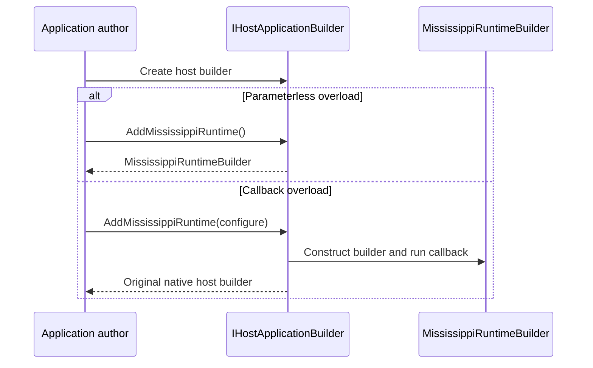

# ADR-0002: Standardize the Runtime Host Entry Shape

## Context and Problem Statement

The runtime role needs a public startup shape that is consistent with the client precedent, works for non-web and web-backed silo hosts, and remains discoverable for application authors. The decision to make is which host contract and overload pattern should define the runtime entry point so the role stays fluent without collapsing back to `IServiceCollection`-first composition.

## Decision Drivers

- Support `IHostApplicationBuilder` semantics for both non-web and web-backed runtime hosts.
- Keep the role-entry experience aligned with the existing client builder pattern.
- Preserve fluent builder composition without forcing callers into raw service registration APIs.
- Keep the final public shape easy to teach in Spring, docs, and generated code.
- Avoid long-lived compatibility shims on a pre-1.0 branch.

## Considered Options

- Standardize on `IHostApplicationBuilder` semantics with two overloads: a parameterless overload returning `MississippiRuntimeBuilder` and a callback overload returning the original native host builder.
- Expose only a callback-based overload on the native host builder and return the native host builder every time.
- Keep runtime composition centered on `IServiceCollection` role-level extension methods.

## Decision Outcome

Chosen option: "Standardize on `IHostApplicationBuilder` semantics with two overloads: a parameterless overload returning `MississippiRuntimeBuilder` and a callback overload returning the original native host builder", because it gives runtime the same builder-first ergonomics as the rest of the family while preserving access to the underlying host builder when authors need to continue host-specific setup.

### Consequences

- Good, because runtime, gateway, and client can converge on one recognizable entry-shape pattern.
- Good, because web-backed runtime hosts such as Spring still fit the same conceptual model.
- Good, because generated domain extensions can target `MississippiRuntimeBuilder` directly and remain fluent.
- Bad, because the rollout must delete or retire older role-level `IServiceCollection` onboarding paths in touched areas.
- Bad, because the generic callback overload shape needs careful implementation to preserve the native builder type.

### Confirmation

Compliance will be confirmed when the runtime hosting package exposes the two overloads described in the architecture, generated domain methods return `MississippiRuntimeBuilder`, and Spring runtime startup composes through the builder-first API rather than `IServiceCollection` role-entry methods.

## Pros and Cons of the Options

### Standardize on `IHostApplicationBuilder` semantics with two overloads

This option treats runtime composition as a host-builder concern while preserving fluent role-builder ergonomics.

- Good, because it supports both generic host and web-backed host scenarios.
- Good, because it mirrors the client family's established two-overload shape.
- Neutral, because advanced callers still retain their native builder for host-specific work after the callback overload returns.
- Bad, because it is a breaking API shift for touched runtime onboarding paths.

### Expose only a callback-based overload on the native host builder and return the native host builder every time

This option removes the parameterless builder-returning entry point.

- Good, because it keeps the public surface smaller.
- Bad, because it makes fluent role-builder composition less discoverable.
- Bad, because it breaks family consistency with the client precedent.

### Keep runtime composition centered on `IServiceCollection` role-level extension methods

This option preserves the existing service-registration-first seam.

- Good, because it minimizes initial refactoring.
- Bad, because it cannot represent Orleans host attachment as part of the role boundary.
- Bad, because it keeps the repo on the legacy role-level entry shape the rollout is explicitly removing.

## More Information

- Internal branch working notes informed this proposal but are intentionally not linked from the published ADR set.
- [ADR-0001](0001-assign-hosting-package-ownership-for-role-builders.md)
- [ADR-0003](0003-make-runtime-builder-the-only-orleans-silo-attachment-owner.md)
