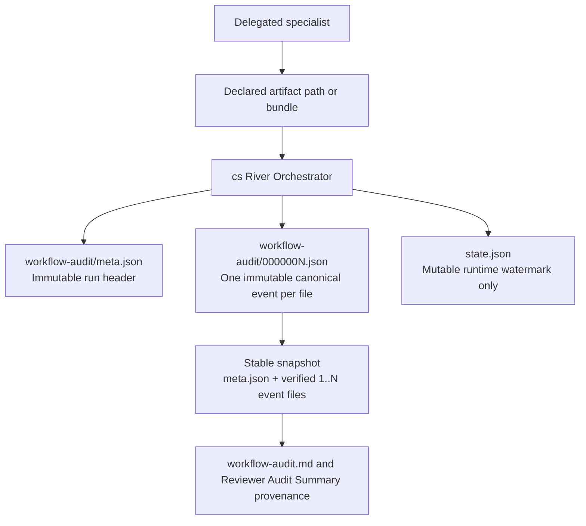

# ADR-0002: Use A Directory-Based Workflow Audit Ledger And File-First Delegated Handoff

## Context and Problem Statement

The Clean Squad workflow previously stored the canonical audit trail in one
mutable `workflow-audit.json` file. Live governed runs already demonstrate that
this file grows large enough to make append, reread, and delegated-context
transfer unnecessarily expensive, even before merge-ready completion.

The same workflow also allows delegated specialists to hand back too much
substantive content inline. The design question is: how should the workflow
reduce append and handoff cost without weakening one-writer ownership,
sequence-based chronology, provenance, stable snapshots, or reviewer-facing
freshness semantics?

## Decision Drivers

- Canonical appends should create one small immutable file, not rewrite one
  growing ledger document.
- Stable snapshots and `ledgerDigest` must remain deterministic and fail closed.
- `state.json` should stay the only mutable runtime cursor.
- Delegated specialists should pass substantive outputs back through artifact
  paths, not large inline payloads.
- The change should be a clean storage-contract cutover rather than a
  dual-format compatibility burden.

## Considered Options

- Keep the single `workflow-audit.json` ledger and continue allowing large
  delegated inline pass-back.
- Use `workflow-audit/` with immutable `meta.json`, one immutable seven-digit
  event file per `sequence`, and file-first delegated handoff.
- Add dual-format compatibility or segmented subfolders in the first cut.

## Decision Outcome

Chosen option: "Use `workflow-audit/` with immutable `meta.json`, one
immutable seven-digit event file per `sequence`, and file-first delegated
handoff", because it reduces append and handoff cost while preserving the
existing one-writer, sequence-first, provenance-bound trust model.

### Consequences

- Good, because canonical append cost becomes one-file creation plus a watermark
  update instead of a whole-ledger rewrite.
- Good, because corruption blast radius shrinks from the entire ledger body to a
  single event file.
- Good, because delegated specialists now return compact metadata while durable
  outputs live at explicit artifact paths.
- Good, because stable snapshots and `ledgerDigest` remain explicit through
  `meta.json` plus a verified contiguous `1..N` file set.
- Bad, because ownership-coupled workflow docs, prompts, and mirrors must all
  update together.
- Bad, because pre-cutover single-file ledger runs become historical-only and
  cannot be resumed in place.
- Bad, because callers must validate bundle-path containment and immutable-path
  lineage instead of assuming one mutable output location.

### Confirmation

Compliance with this ADR will be confirmed by reviewing the updated workflow and
prompt surfaces for these invariants:

- `workflow-audit/` is flat and contains only `meta.json` plus seven-digit event
  files.
- `state.json.audit.currentSequence` matches the highest durable canonical event
  file or `0` when only `meta.json` exists.
- `cs Scribe` compiles derived audit artifacts from `meta.json` plus the
  verified contiguous `1..N` event-file set captured at a stable watermark.
- Delegated specialists write substantive outputs to declared paths or bundle
  directories and return only concise metadata plus artifact paths.
- `cs River Orchestrator` validates returned artifact existence and containment
  before canonical completion.
- Resume fails closed when a pre-cutover single-file `workflow-audit.json`
  ledger is encountered.

## Pros and Cons of the Options

### Keep the single `workflow-audit.json` ledger and continue allowing large delegated inline pass-back

This option preserves the existing physical layout and handoff behavior.

- Good, because it avoids immediate contract churn.
- Good, because no new snapshot or filename rules are needed.
- Bad, because every append still rewrites a growing canonical file.
- Bad, because delegated inline payloads keep context size and duplication high.
- Bad, because the storage model keeps the largest failure blast radius.

### Use `workflow-audit/` with immutable `meta.json`, one immutable seven-digit event file per `sequence`, and file-first delegated handoff

This option keeps the canonical semantics but changes the physical ledger shape
and delegated pass-back contract.

- Good, because appends become smaller, simpler, and easier to validate.
- Good, because the stable snapshot contract stays explicit and auditable.
- Good, because delegated outputs become path-addressable artifacts with clearer
  lineage.
- Bad, because all workflow mirrors and prompts must move together.

### Add dual-format compatibility or segmented subfolders in the first cut

This option would introduce additional migration or storage-organization logic
immediately.

- Good, because historical data could remain resumable for longer.
- Neutral, because segmented layouts may help only after much larger scale.
- Bad, because dual-format support adds recovery and validation complexity
  before the new baseline is proven.
- Bad, because extra subfolder structure is unnecessary for the first cut and
  would increase contract surface area.

## More Information

This ADR is intentionally narrow and complements
[ADR-0001](0001-single-canonical-writer-with-bounded-phase-9-delegation.md).
ADR-0001 keeps canonical ownership singular; this ADR defines the physical
ledger shape and delegated pass-back model that singular owner uses.

Related durable references:

- Published workflow contract: [WORKFLOW.md](../../../../.github/clean-squad/WORKFLOW.md)
- ADR authoring rules: [adr.instructions.md](../../../../.github/instructions/adr.instructions.md)
