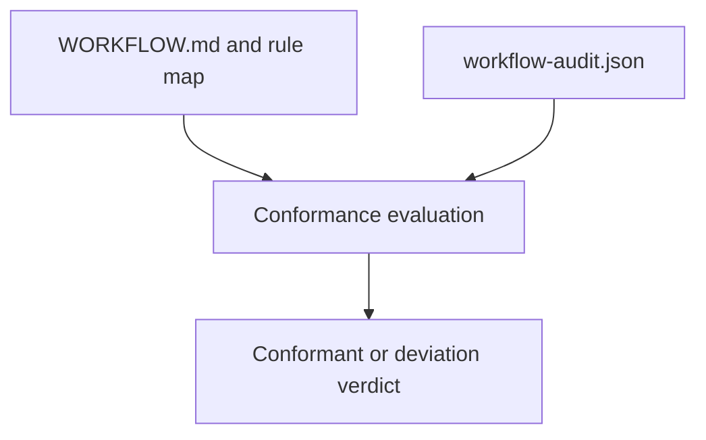

# ADR-0003: Evaluate Execution Conformance Against the Clean Squad Workflow Contract

## Context and Problem Statement

The audit enhancement is supposed to prove not only what happened, but whether the observed execution conformed to the declared Clean Squad workflow. The design treats `.github/clean-squad/WORKFLOW.md` as the authoritative contract, rejects using `.github/clean-squad/WORKFLOW.mermaid.md` as a conformance source, and requires explicit rule types for required phases, optional branches, repeatable loops, allowed declines, and roster constraints.

## Decision Drivers

- Clean Squad needs evidence-based workflow conformance rather than narrative confidence.
- The workflow contains optional branches, repeatable loops, and allowed deviations that must be modeled explicitly.
- The authoritative workflow source must be stable and textual, not a diagram mirror.
- Reviewers need both machine-checkable findings and reviewer-language explanations.

## Considered Options

- Evaluate runs against `.github/clean-squad/WORKFLOW.md` plus an explicit rule model for transitions, optional phases, loops, and reason codes.
- Judge conformance primarily from the visual workflow mirror in `.github/clean-squad/WORKFLOW.mermaid.md`.
- Record execution history only and leave conformance interpretation to manual review.

## Decision Outcome

Chosen option: "Evaluate runs against `.github/clean-squad/WORKFLOW.md` plus an explicit rule model for transitions, optional phases, loops, and reason codes", because the design requires a contract-driven conformance verdict grounded in the authoritative workflow document and the actual audit ledger.

### Consequences

- Good, because conformance becomes explicit, repeatable, and reviewable.
- Good, because allowed skips, retries, loopbacks, and declined comments can be represented as justified deviations instead of false failures.
- Good, because the system can distinguish `conformant`, `conformant-with-deviations`, `non-conformant`, and `untrusted` outcomes.
- Bad, because workflow changes now require corresponding conformance-rule updates to avoid drift.
- Bad, because incomplete evidence or invalid chronology can legitimately downgrade a run to `untrusted`.

### Confirmation

Compliance is confirmed when conformance evaluation binds each run to the authoritative workflow contract, validates sequence and timestamps, checks allowed transitions and reason codes, and produces explicit verdicts and findings from the canonical ledger.

## Pros and Cons of the Options

### Evaluate runs against `.github/clean-squad/WORKFLOW.md` plus an explicit rule model for transitions, optional phases, loops, and reason codes

This option makes workflow conformance a contract-driven derivation step.

- Good, because it uses the same textual workflow source that governs the Clean Squad process.
- Good, because it supports precise reasoning about optional branches and repeatable loops.
- Neutral, because it may optionally include a workflow fingerprint to bind long-running tasks to the workflow version they started with.
- Bad, because the rule model becomes another artifact that must stay aligned with the workflow.

### Judge conformance primarily from the visual workflow mirror in `.github/clean-squad/WORKFLOW.mermaid.md`

This option treats the diagram mirror as authoritative.

- Good, because diagrams are fast for humans to scan.
- Bad, because the design explicitly states that `WORKFLOW.md` is authoritative and `WORKFLOW.mermaid.md` is only a visual mirror.
- Bad, because diagram-only semantics are too weak for rule-driven validation.

### Record execution history only and leave conformance interpretation to manual review

This option stops at chronology and avoids formal workflow verdicts.

- Good, because it lowers implementation effort.
- Bad, because the enhancement objective explicitly requires comparing actual execution against the declared workflow and flagging deviations.
- Bad, because reviewer confidence would depend on manual interpretation instead of a derived verdict.

## More Information

- Related foundational decision: [ADR-0001](0001-use-a-canonical-workflow-audit-ledger-for-clean-squad-execution.md)
- Repository evidence: `.thinking/2026-03-24-clean-squad-audit-trail/03-architecture/solution-design.md`
- Workflow contract: `.github/clean-squad/WORKFLOW.md`
