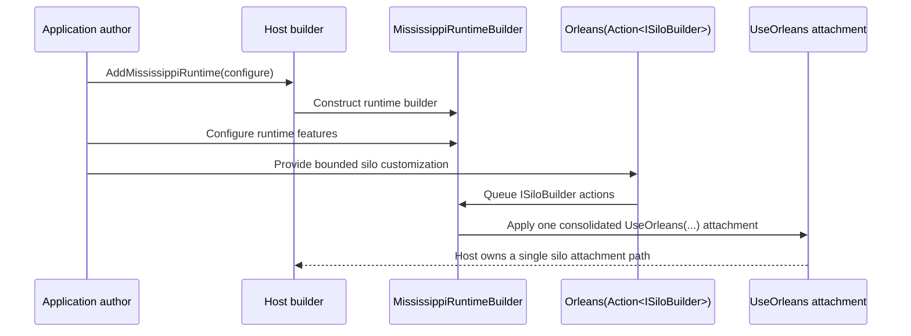

# ADR-0003: Make the Runtime Builder the Only Orleans Silo Attachment Owner

## Context and Problem Statement

Runtime composition spans both dependency injection and Orleans silo configuration, so a service-only runtime builder would leave a critical part of the role boundary outside the role owner. The decision is whether Mississippi should let callers attach Orleans directly at the host level or require `MississippiRuntimeBuilder` to own a single consolidated silo attachment with only a bounded extensibility hook.

## Decision Drivers

- Keep the runtime role boundary responsible for both DI composition and Orleans silo attachment.
- Prevent duplicate or conflicting `UseOrleans(...)` attachments on the same host.
- Preserve advanced extensibility without sending callers back to raw host-builder composition as the primary path.
- Make host-mode validation possible at the runtime-builder boundary.
- Keep the public story coherent for docs, Spring, and generated runtime methods.

## Considered Options

- Make `MississippiRuntimeBuilder` the single role-level owner of Orleans silo attachment and expose a bounded `Orleans(Action<ISiloBuilder>)` hook.
- Let callers compose runtime services through Mississippi but attach Orleans directly on the host builder.
- Expose raw Orleans host-builder access as the standard advanced path and treat Mississippi runtime composition as DI-only sugar.

## Decision Outcome

Chosen option: "Make `MississippiRuntimeBuilder` the single role-level owner of Orleans silo attachment and expose a bounded `Orleans(Action<ISiloBuilder>)` hook", because the runtime role cannot be a real top-level composition boundary if a caller must leave the role API to complete the silo attachment that defines the runtime itself.

### Consequences

- Good, because runtime becomes a complete role boundary instead of a partial wrapper.
- Good, because Mississippi can validate duplicate usage, conflicting host modes, and unsupported direct Orleans composition earlier.
- Good, because advanced callers still get controlled access to `ISiloBuilder` customization.
- Bad, because some previously possible raw host-builder patterns become unsupported after cutover.
- Bad, because the implementation must queue and apply Orleans actions carefully to preserve exactly one consolidated attachment.

### Confirmation

Compliance will be confirmed when runtime hosting applies exactly one `UseOrleans(...)` attachment, exposes the bounded `Orleans(Action<ISiloBuilder>)` hook on `MississippiRuntimeBuilder`, and rejects conflicting direct Orleans attachment in the Spring proof host and builder validation tests.

## Pros and Cons of the Options

### Make `MississippiRuntimeBuilder` the single role-level owner of Orleans silo attachment and expose a bounded `Orleans(Action<ISiloBuilder>)` hook

This option keeps all supported runtime composition inside the runtime role boundary.

- Good, because it matches the architectural requirement that runtime owns both service registration and silo attachment.
- Good, because it creates one supported seam for advanced Orleans customization.
- Neutral, because low-level subsystem primitives can still exist without being the official onboarding story.
- Bad, because it requires explicit validation and migration of legacy attachment paths.

### Let callers compose runtime services through Mississippi but attach Orleans directly on the host builder

This option splits runtime composition across two owners.

- Good, because it preserves maximum host-builder freedom.
- Bad, because it leaves the runtime role boundary incomplete.
- Bad, because it makes duplicate-attachment and conflicting-mode validation much harder to reason about.

### Expose raw Orleans host-builder access as the standard advanced path and treat Mississippi runtime composition as DI-only sugar

This option makes Mississippi a partial convenience layer.

- Good, because it keeps Mississippi thin.
- Bad, because it does not solve the central role-boundary problem the rollout is addressing.
- Bad, because it undermines the builder-first public story in docs, generators, and Spring.

## More Information

- Internal branch working notes informed this proposal but are intentionally not linked from the published ADR set.
- [ADR-0002](0002-standardize-runtime-host-entry-shape.md)
- [ADR-0004](0004-reject-same-host-runtime-and-gateway-composition-in-this-rollout.md)
