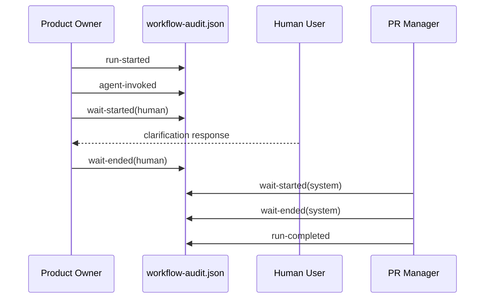

# ADR-0004: Measure Execution Time with Explicit Audit Intervals

## Context and Problem Statement

The execution-audit enhancement must report elapsed time, active agent time, human-wait time, and system-wait time while explicitly excluding wait time from active-agent duration. The design rejects inferring timing from narrative gaps and instead requires explicit interval open and close rules, non-overlapping timing buckets, and an `untrusted` outcome when timing boundaries are incomplete or inconsistent.

## Decision Drivers

- The requirements explicitly call for four timing buckets with human wait excluded from active agent time.
- Timing needs to be trustworthy enough for reviewer-facing summaries and conformance judgments.
- Explicit waits are necessary to distinguish user latency from agent work and PR polling or CI waits.
- Incomplete timing must reduce confidence rather than silently producing misleading totals.

## Considered Options

- Use explicit audit interval events to calculate `elapsedTotal`, `activeAgentTotal`, `humanWaitTotal`, and `systemWaitTotal`.
- Infer timing from gaps between narrative log entries and agent handoffs.
- Report only total elapsed time and omit bucketed timing.

## Decision Outcome

Chosen option: "Use explicit audit interval events to calculate `elapsedTotal`, `activeAgentTotal`, `humanWaitTotal`, and `systemWaitTotal`", because the design requires trusted timing totals that do not confuse human or system waits with active agent work.

### Consequences

- Good, because active-agent duration excludes human-response latency and poll or CI waits.
- Good, because bucket invariants make timing quality auditable.
- Good, because unmatched waits or overlapping intervals can be surfaced as `untrusted` instead of silently corrupting totals.
- Bad, because emitters must record interval boundaries precisely for the timing model to work.
- Bad, because incomplete interval data can block a clean conformance verdict.

### Confirmation

Compliance is confirmed when timing is computed only from explicit interval events, bucket overlap is rejected, unmatched waits are surfaced as incomplete timing, and reviewer summaries report the four required totals from the canonical ledger.

## Pros and Cons of the Options

### Use explicit audit interval events to calculate `elapsedTotal`, `activeAgentTotal`, `humanWaitTotal`, and `systemWaitTotal`

This option treats timing as a formal derivation from canonical execution facts.

- Good, because it satisfies the stated requirement for four distinct timing buckets.
- Good, because it protects agent-duration metrics from user and system latency.
- Neutral, because it depends on the same canonical ledger introduced by [ADR-0001](0001-use-a-canonical-workflow-audit-ledger-for-clean-squad-execution.md).
- Bad, because it requires stricter event discipline than free-form narrative logs.

### Infer timing from gaps between narrative log entries and agent handoffs

This option estimates timing after the fact.

- Good, because it avoids extra timing events.
- Bad, because the design explicitly rejects inferring timing from narrative gaps.
- Bad, because it cannot reliably distinguish active work from human or system waiting.

### Report only total elapsed time and omit bucketed timing

This option simplifies timing to a single number.

- Good, because it is easy to compute.
- Bad, because it fails the stated requirement to track four timing buckets.
- Bad, because it cannot explain whether long duration came from agent work, human response time, or system waits.

## More Information

- Related foundational decision: [ADR-0001](0001-use-a-canonical-workflow-audit-ledger-for-clean-squad-execution.md)
- Related conformance decision: [ADR-0003](0003-evaluate-execution-conformance-against-the-clean-squad-workflow-contract.md)
- Repository evidence: `.thinking/2026-03-24-clean-squad-audit-trail/03-architecture/solution-design.md`
