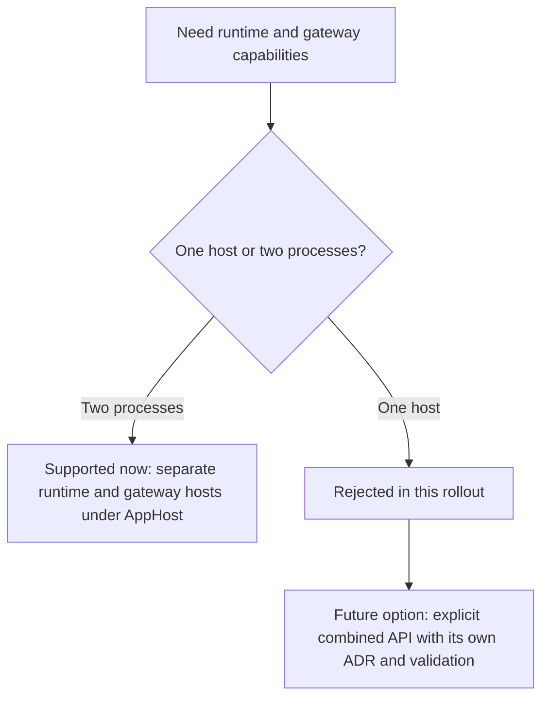

# ADR-0004: Reject Same-Host Runtime and Gateway Composition in This Rollout

## Context and Problem Statement

The rollout needs an explicit host-mode policy for runtime and gateway composition. The question is whether Mississippi should allow callers to chain runtime and gateway role builders on the same host during this migration, or reject that topology and require separate runtime and gateway processes under AppHost orchestration until a future explicit combined API exists.

## Decision Drivers

- Keep runtime as the single role-level owner of Orleans silo attachment.
- Avoid combining silo and gateway client-edge modes on one host during the same migration.
- Preserve a clear, teachable preferred topology for Spring and docs.
- Prevent a second large design problem from expanding the rollout scope.
- Reserve same-process composition for a future explicit API if real demand appears.

## Considered Options

- Reject same-host runtime-plus-gateway composition in this rollout and support separate runtime and gateway processes under AppHost orchestration.
- Allow callers to chain runtime and gateway role builders on one host as an implicit supported mode.
- Design and ship a dedicated combined runtime-plus-gateway host API in the same rollout.

## Decision Outcome

Chosen option: "Reject same-host runtime-plus-gateway composition in this rollout and support separate runtime and gateway processes under AppHost orchestration", because it preserves a single, operationally safe topology while the builder family is being migrated and avoids silently combining conflicting Orleans host modes on one process.

### Consequences

- Good, because the rollout has one preferred full-stack story: separate runtime and gateway processes coordinated under AppHost.
- Good, because validation can fail fast when callers attempt unsupported mixed host modes.
- Good, because future same-process support, if needed, will require an explicit API and ADR instead of accidental composition.
- Bad, because single-process experimentation is no longer supported through implicit role-builder chaining.
- Bad, because callers who want same-host composition must wait for a later design slice or build unsupported custom composition outside the official role story.

### Confirmation

Compliance will be confirmed when runtime and gateway builders register mutually exclusive host-mode markers, same-host chaining fails with targeted `InvalidOperationException` messages, and the Spring proof remains split into separate runtime and gateway processes under one AppHost orchestration.

## Pros and Cons of the Options

### Reject same-host runtime-plus-gateway composition in this rollout and support separate runtime and gateway processes under AppHost orchestration

This option fixes the supported topology for the rollout.

- Good, because it keeps the migration scope bounded.
- Good, because it makes the supported deployment model explicit.
- Neutral, because a future combined mode is still possible through a new API and ADR.
- Bad, because it deliberately leaves one topology unsupported for now.

### Allow callers to chain runtime and gateway role builders on one host as an implicit supported mode

This option makes same-process composition available immediately without a new API.

- Good, because it offers maximum short-term flexibility.
- Bad, because it undermines runtime's single-owner role over silo attachment.
- Bad, because it normalizes a mixed host mode before the product has designed or validated that topology.

### Design and ship a dedicated combined runtime-plus-gateway host API in the same rollout

This option acknowledges same-host composition as a first-class feature now.

- Good, because it would make the combined topology explicit instead of accidental.
- Bad, because it adds a second major architecture and validation problem to a rollout that is already changing the builder family.
- Bad, because it delays the simpler, already-confirmed separate-process migration path.

## More Information

- Internal branch working notes informed this proposal but are intentionally not linked from the published ADR set.
- [ADR-0003](0003-make-runtime-builder-the-only-orleans-silo-attachment-owner.md)
