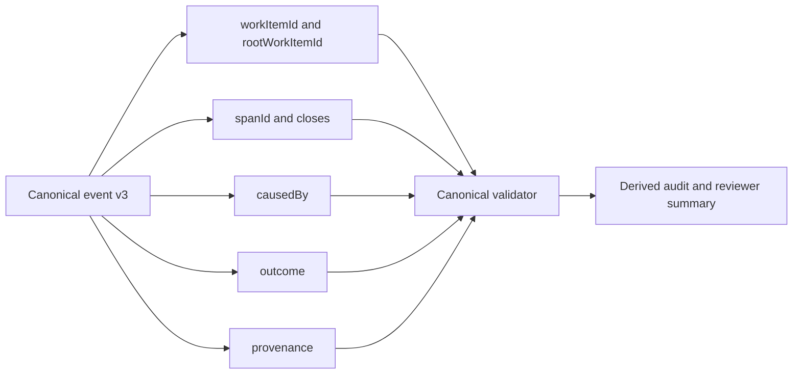

# ADR-0005: Adopt a Semantics-First Canonical Event Envelope for Clean Squad Audit v3

## Context and Problem Statement

The stronger Clean Squad event model exists because the chronology-first ledger shape cannot reliably answer the questions reviewers care about: what unit of work an event belongs to, whether an action is a retry or a supersession, what directly caused it, which span it closes, and whether the claim is backed by canonical provenance. The solution design therefore shifts the canonical contract from sequence-plus-summary inference to an explicit semantic envelope built around `workItemId`, `rootWorkItemId`, `spanId`, `causedBy`, `closes`, `outcome`, and `provenance`.

## Decision Drivers

- Reviewer-significant facts must be carried by canonical fields, not inferred from sequence order or prose summaries.
- Retries, repetitions, and supersessions need a stable lineage model that preserves root context while distinguishing bounded attempts.
- The validator needs deterministic inputs for causality, closure, terminal disposition, and provenance checks.
- Derived outputs must fail closed when canonical meaning is missing instead of reconstructing meaning from supporting logs.

## Considered Options

- Adopt a semantics-first v3 canonical event envelope with explicit lineage, direct cause, exact closure, terminal outcomes, and provenance.
- Keep the chronology-first event envelope and continue deriving meaning from `sequence`, timestamps, and `summary` text.
- Move semantic relationships into separate reconstruction tables or downstream compiler logic while keeping the event envelope minimal.

## Decision Outcome

Chosen option: "Adopt a semantics-first v3 canonical event envelope with explicit lineage, direct cause, exact closure, terminal outcomes, and provenance", because the stronger audit model only becomes trustworthy when the ledger itself carries the meaning needed for validation and publication.

### Consequences

- Good, because each meaningful event now states its unit of work, its retry lineage, its direct cause, its closure pairing, and its terminal disposition explicitly.
- Good, because the validator can reject orphan spans, ambiguous closures, broken retry continuity, and unsupported claims without reading narrative text.
- Good, because schema version `clean-squad-workflow-audit/v3` clearly marks the branch-local contract break from the weaker chronology-first model.
- Bad, because canonical writers must supply more structured data consistently for every meaningful event.
- Bad, because historical v2 examples become intentionally insufficient for trust-sensitive derivation until they are migrated.

### Confirmation

Compliance is confirmed when v3 ledger examples and prompts require `workItemId`, `rootWorkItemId`, `spanId`, `causedBy`, `closes`, `outcome`, and `provenance` wherever the writer obligation rules mark them as mandatory, and when validation no longer allows reviewer-significant meaning to be recovered from chronology or prose alone.

## Pros and Cons of the Options

### Adopt a semantics-first v3 canonical event envelope with explicit lineage, direct cause, exact closure, terminal outcomes, and provenance

This option makes semantic meaning a first-class property of each canonical event.

- Good, because it gives downstream validation and derived publication a stable contract.
- Good, because it distinguishes retries and supersessions without losing the root work lineage.
- Neutral, because it preserves `sequence` as the chronology authority while narrowing what chronology is allowed to explain.
- Bad, because append discipline becomes stricter for Product Owner and PR Manager writers.

### Keep the chronology-first event envelope and continue deriving meaning from `sequence`, timestamps, and `summary` text

This option preserves the weaker model and leans on downstream interpretation.

- Good, because it minimizes immediate prompt and example changes.
- Bad, because chronology and narrative text cannot prove direct cause, exact closure, or artifact lineage.
- Bad, because it leaves reviewer trust dependent on inference instead of canonical facts.

### Move semantic relationships into separate reconstruction tables or downstream compiler logic while keeping the event envelope minimal

This option keeps events small and pushes meaning elsewhere.

- Good, because it reduces per-event payload size.
- Bad, because it splits canonical meaning across multiple places instead of keeping the ledger self-describing.
- Bad, because it makes recovery and verification depend on reconstruction logic rather than event-local facts.

## More Information

- This ADR extends [ADR-0001](0001-use-a-canonical-workflow-audit-ledger-for-clean-squad-execution.md), [ADR-0002](0002-assign-canonical-audit-ledger-writes-to-orchestration-boundaries.md), [ADR-0003](0003-evaluate-execution-conformance-against-the-clean-squad-workflow-contract.md), and [ADR-0004](0004-measure-execution-time-with-explicit-audit-intervals.md).
- Related follow-on decisions: [ADR-0006](0006-retain-a-coarse-event-taxonomy-and-enforce-semantics-through-a-writer-obligation-matrix.md), [ADR-0007](0007-model-artifact-lifecycle-separately-from-evidence-bindings.md), and [ADR-0008](0008-gate-derived-audit-publication-on-validator-backed-trust-and-freshness.md).
- Source design evidence: `.thinking/2026-03-24-clean-squad-audit-event-model/03-architecture/solution-design.md`
