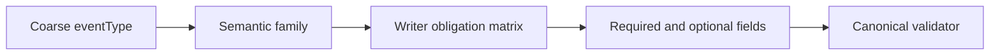

# ADR-0006: Retain a Coarse Event Taxonomy and Enforce Semantics Through a Writer Obligation Matrix

## Context and Problem Statement

The stronger event model needs richer meaning, but the solution design explicitly rejects solving that gap with a large event-type explosion. Instead, the architecture preserves the current coarse `eventType` vocabulary and layers a writer obligation matrix on top of it so semantic families such as lifecycle starts, lifecycle terminals, causal links, artifact transitions, and publication-state events each declare the fields that must be present for the event to be trustworthy.

## Decision Drivers

- The current event-type vocabulary is already embedded in prompts, examples, and prior design work.
- The semantic gap is about missing obligations, not about missing labels alone.
- Validation needs a stable, explicit rule source for per-family required fields and invalid omissions.
- The architecture should add meaning without forcing a disruptive, branch-wide proliferation of narrowly scoped event types.

## Considered Options

- Preserve the coarse `eventType` vocabulary and enforce richer meaning through semantic families and a writer obligation matrix.
- Encode every distinct semantic situation as a separate, finer-grained `eventType`.
- Keep the coarse vocabulary but make the new semantic fields mostly optional and rely on writer discretion.

## Decision Outcome

Chosen option: "Preserve the coarse `eventType` vocabulary and enforce richer meaning through semantic families and a writer obligation matrix", because the design needs stronger semantics with minimal taxonomy churn and deterministic validation rules.

### Consequences

- Good, because prompts and examples can evolve around a stable vocabulary instead of relearning dozens of new event labels.
- Good, because the validator has one explicit rule matrix for which fields each semantic family must provide.
- Good, because the architecture can add new semantic obligations without turning the event catalog into the primary modeling mechanism.
- Bad, because meaning is now distributed across `eventType`, semantic family, and matrix rules rather than encoded in a single field.
- Bad, because prompt, validator, and documentation changes must stay aligned with the obligation matrix to prevent drift.

### Confirmation

Compliance is confirmed when event validation uses a documented obligation matrix to determine required fields by semantic family, and when new examples show reviewer-significant events failing validation if those per-family obligations are missing.

## Pros and Cons of the Options

### Preserve the coarse `eventType` vocabulary and enforce richer meaning through semantic families and a writer obligation matrix

This option keeps the label set relatively stable while moving semantic precision into rules.

- Good, because it minimizes prompt churn across the branch.
- Good, because it directly addresses the real problem of missing obligations and invalid omissions.
- Neutral, because some semantic interpretation now depends on the matrix instead of the event label alone.
- Bad, because reviewers and implementers must read both the label and the matrix to understand the full rule set.

### Encode every distinct semantic situation as a separate, finer-grained `eventType`

This option pushes meaning into a much larger taxonomy.

- Good, because a single field can describe more of the event meaning.
- Bad, because the solution design explicitly rejects a large new event-type surface.
- Bad, because every prompt, fixture, and validation path would need a larger coordinated rewrite.

### Keep the coarse vocabulary but make the new semantic fields mostly optional and rely on writer discretion

This option keeps both taxonomy and rules loose.

- Good, because it is easy for writers in the short term.
- Bad, because reviewer-significant semantics would remain inconsistently present.
- Bad, because the validator could not distinguish harmless omissions from trust-breaking omissions deterministically.

## More Information

- This ADR depends on [ADR-0005](0005-adopt-a-semantics-first-canonical-event-envelope-for-clean-squad-audit-v3.md).
- Related artifact and publication decisions: [ADR-0007](0007-model-artifact-lifecycle-separately-from-evidence-bindings.md) and [ADR-0008](0008-gate-derived-audit-publication-on-validator-backed-trust-and-freshness.md).
- Source design evidence: `.thinking/2026-03-24-clean-squad-audit-event-model/03-architecture/solution-design.md`
