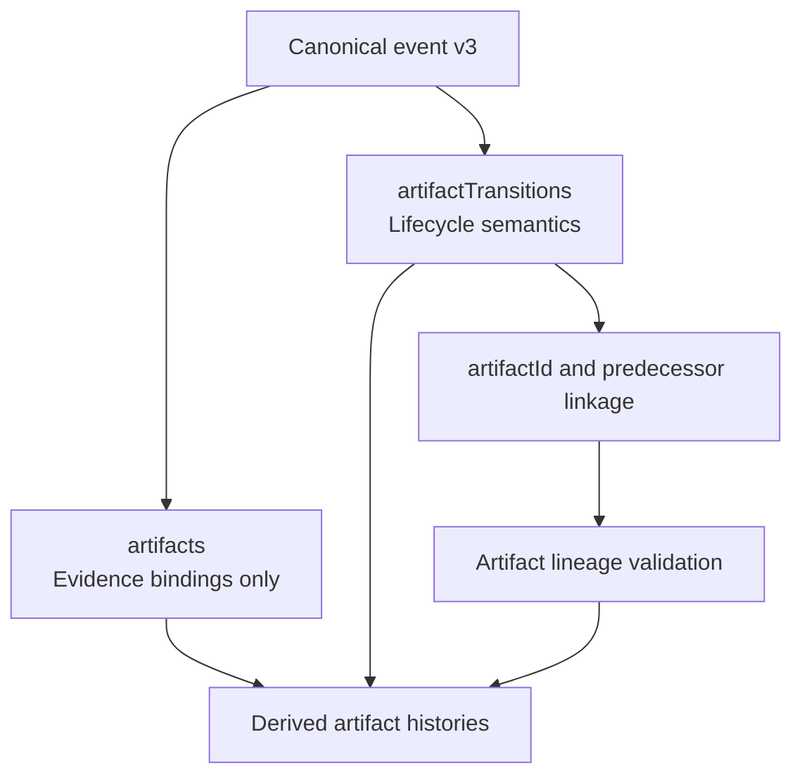

# ADR-0007: Model Artifact Lifecycle Separately from Evidence Bindings

## Context and Problem Statement

The stronger event model must explain both what evidence supports a claim and how business artifacts change over time. The solution design concludes that the existing `artifacts` array should remain an evidence-binding mechanism for files, digests, URIs, and immutable references, while artifact lifecycle meaning such as creation, revision, acceptance, rejection, replacement, supersession, and omission must move into a separate `artifactTransitions` structure with stable artifact identity and predecessor linkage.

## Decision Drivers

- Evidence provenance and artifact business state answer different questions and cannot safely share one overloaded field.
- Reviewers need explicit artifact lineage for replacement, supersession, and omission claims.
- The validator must be able to reject broken artifact histories independently of file evidence quality.
- Derived audits should describe artifact histories from canonical structure, not by interpreting path changes or prose summaries.

## Considered Options

- Add `artifactTransitions` as a distinct canonical structure and keep `artifacts` for evidence bindings only.
- Continue using `artifacts` as the only artifact-related field and infer lifecycle semantics from changed paths, digests, or summaries.
- Describe artifact lifecycle only in narrative summaries and derived Markdown output.

## Decision Outcome

Chosen option: "Add `artifactTransitions` as a distinct canonical structure and keep `artifacts` for evidence bindings only", because the architecture needs explicit artifact lineage without conflating supporting evidence with business-state transitions.

### Consequences

- Good, because artifact history becomes a first-class canonical concept with stable identity and predecessor references.
- Good, because evidence bindings can stay focused on file and external-reference provenance.
- Good, because validator findings can distinguish broken lineage from missing or weak evidence.
- Bad, because event payloads become slightly larger and writers must manage a second artifact-related field.
- Bad, because older examples that only attached files cannot claim artifact lifecycle semantics until migrated.

### Confirmation

Compliance is confirmed when artifact state changes are recorded in `artifactTransitions`, `artifacts` is used only for evidence bindings, and validation rejects lineage claims that lack stable artifact identity or predecessor linkage.

## Pros and Cons of the Options

### Add `artifactTransitions` as a distinct canonical structure and keep `artifacts` for evidence bindings only

This option separates provenance from lifecycle semantics.

- Good, because it preserves a clean model boundary between evidence and state transitions.
- Good, because artifact histories can be rendered and validated directly from canonical structure.
- Neutral, because event writers now carry both evidence and lifecycle payloads when both are relevant.
- Bad, because migration requires reauthoring examples that previously used files as implicit lifecycle signals.

### Continue using `artifacts` as the only artifact-related field and infer lifecycle semantics from changed paths, digests, or summaries

This option keeps one field and relies on interpretation.

- Good, because it minimizes schema growth.
- Bad, because it overloads evidence provenance with lifecycle meaning the field was never designed to carry.
- Bad, because replacement and supersession become narrative or heuristic inferences instead of canonical facts.

### Describe artifact lifecycle only in narrative summaries and derived Markdown output

This option keeps the ledger focused on files and lets reports explain state.

- Good, because it is simple for writers.
- Bad, because derived outputs would be claiming lineage that the ledger itself cannot validate.
- Bad, because artifact history would become untrustworthy whenever prose and evidence diverge.

## More Information

- This ADR depends on [ADR-0005](0005-adopt-a-semantics-first-canonical-event-envelope-for-clean-squad-audit-v3.md).
- Publication trust depends on this separation through [ADR-0008](0008-gate-derived-audit-publication-on-validator-backed-trust-and-freshness.md).
- Source design evidence: `.thinking/2026-03-24-clean-squad-audit-event-model/03-architecture/solution-design.md`
