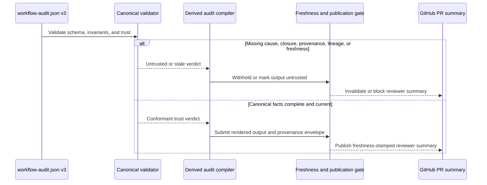

# ADR-0008: Gate Derived Audit Publication on Validator-Backed Trust and Freshness

## Context and Problem Statement

The stronger event model is not only a storage contract; it also changes what the system is allowed to publish to reviewers. The solution design requires `workflow-audit.md` and the Reviewer Audit Summary to be downstream of canonical facts only, to fail closed when cause, closure, provenance, or artifact lineage would need to be inferred, and to invalidate reviewer-facing publication immediately when HEAD, required CI identity, or reviewer-meaningful canonical fields change.

## Decision Drivers

- Reviewer trust depends on canonical completeness, not on a best-effort narrative reconstruction.
- Publication must become stale immediately when reviewer-meaningful canonical facts, HEAD, or required CI identity change.
- The Scribe may compile and render derived artifacts, but must not repair or invent canonical facts.
- The PR-surface summary is a high-trust output and therefore needs stronger gating than a generic informational report.

## Considered Options

- Publish derived audit artifacts only behind validator-backed trust and freshness checks, and invalidate reviewer-facing output immediately on relevant deltas.
- Publish best-effort summaries with warning text when canonical semantics are incomplete or stale.
- Allow the Scribe or PR Manager to repair missing meaning from prose, logs, or chronology before publishing.

## Decision Outcome

Chosen option: "Publish derived audit artifacts only behind validator-backed trust and freshness checks, and invalidate reviewer-facing output immediately on relevant deltas", because the feature’s core value is reviewer trust, and that trust is lost if publication is allowed to degrade into narrative repair.

### Consequences

- Good, because reviewer-facing output can only exist when the canonical ledger is both semantically complete enough and fresh enough to support it.
- Good, because stale summaries are invalidated immediately on reviewer-meaningful canonical changes, HEAD changes, or CI identity changes.
- Good, because derived outputs remain downstream of canonical facts and corroborating evidence instead of becoming a second source of truth.
- Bad, because some runs will intentionally withhold reviewer summaries until the canonical record is repaired or refreshed.
- Bad, because publication now depends on a stricter validator and freshness gate that writers and publishers must honor consistently.

### Confirmation

Compliance is confirmed when validation rejects trust-sensitive derived publication whenever `causedBy`, `closes`, `outcome`, `artifactTransitions`, or `provenance` would need inference, and when reviewer summaries are invalidated on HEAD or required CI identity changes until a fresh publication event is recorded.

## Pros and Cons of the Options

### Publish derived audit artifacts only behind validator-backed trust and freshness checks, and invalidate reviewer-facing output immediately on relevant deltas

This option treats trust and freshness as publication prerequisites.

- Good, because it keeps reviewer output aligned with the canonical ledger instead of narrative repair.
- Good, because it provides a deterministic publication rule for the PR Manager and Scribe.
- Neutral, because detailed audit output may still exist with explicit gaps while the PR summary remains blocked.
- Bad, because it raises the operational cost of incomplete or late canonical updates.

### Publish best-effort summaries with warning text when canonical semantics are incomplete or stale

This option prioritizes availability over trust.

- Good, because reviewers would see something even when the ledger is incomplete.
- Bad, because warning text does not prevent consumers from treating reconstructed claims as authoritative.
- Bad, because it directly contradicts the fail-closed trust posture in the solution design.

### Allow the Scribe or PR Manager to repair missing meaning from prose, logs, or chronology before publishing

This option lets downstream actors fill semantic gaps.

- Good, because it could reduce blocked publications in the short term.
- Bad, because it creates a second source of truth outside the canonical ledger.
- Bad, because it breaks the rule that supporting artifacts may corroborate but may not repair missing canonical facts.

## More Information

- This ADR depends on [ADR-0005](0005-adopt-a-semantics-first-canonical-event-envelope-for-clean-squad-audit-v3.md) and is reinforced by [ADR-0007](0007-model-artifact-lifecycle-separately-from-evidence-bindings.md).
- It extends the earlier trust posture from [ADR-0001](0001-use-a-canonical-workflow-audit-ledger-for-clean-squad-execution.md) and the workflow-conformance posture from [ADR-0003](0003-evaluate-execution-conformance-against-the-clean-squad-workflow-contract.md).
- Source design evidence: `.thinking/2026-03-24-clean-squad-audit-event-model/03-architecture/solution-design.md`
