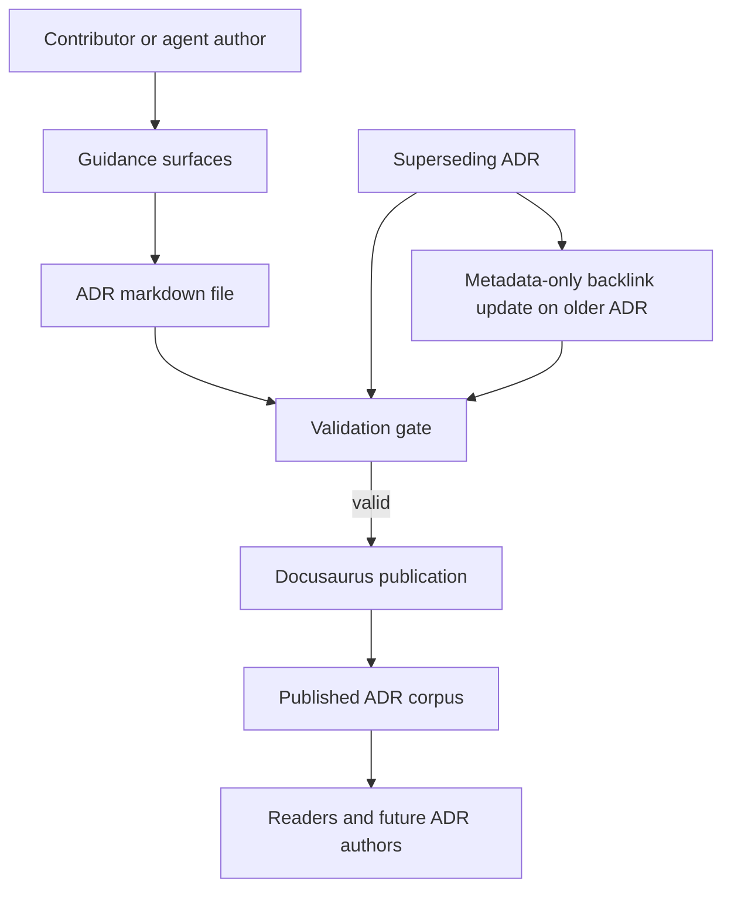

# ADR 2026-03-25: Redesign ADR Governance Publication Model

## Context and Problem Statement

The current repository ADR model couples identity, filename, ordering, and cross-reference semantics to a shared sequential number. It also allows merged ADRs to remain `proposed`, which means the published corpus can require later mutation just to express the final decision outcome.

That model does not scale cleanly under parallel pull requests. The repository needs an ADR governance model that lets new ADRs merge without renumbering choreography, keeps merged ADRs final at the point of merge, preserves deterministic Docusaurus ordering, remains readable to humans, and supports supersession without rewriting accepted ADR bodies.

## Decision Drivers

- Parallel PR flow must not require renumbering or merge-order coordination.
- A merged ADR must already be final and must not need a later status-only edit.
- Docusaurus ordering must remain deterministic.
- Readers must still be able to discover ADRs by date and title.
- Supersession must preserve history while allowing narrow metadata-only updates.
- Migration risk must stay bounded.
- Instructions, templates, overview pages, prompts, and validation must converge on one model.

## Considered Options

- Keep the legacy sequential numbering model with rebase-time renumbering and later status mutation.
- Move to date-based filenames but keep the filename as canonical identity and continue using status text to express supersession.
- Adopt a new governance model with explicit frontmatter identity, human-readable timestamped filenames, derived ordering, final-only merged statuses, explicit supersession metadata, and staged legacy backfill.

## Decision Outcome

Chosen option: "Adopt a new governance model with explicit frontmatter identity, human-readable timestamped filenames, derived ordering, final-only merged statuses, explicit supersession metadata, and staged legacy backfill", because it removes the root merge hazard, makes merged ADRs final as published, preserves deterministic ordering, and creates a machine-checkable supersession model without forcing risky full-corpus renaming.

### Consequences

- Good, because ADR identity is no longer coupled to merge order or filename renumbering.
- Good, because new ADRs become final records at merge time, which restores immutability as an operational rule instead of a post-merge aspiration.
- Good, because supersession becomes explicit metadata that validators can check for reciprocity, cycles, and missing targets.
- Good, because legacy migration can be staged instead of requiring a risky repository-wide rename.
- Bad, because the repository will temporarily contain a mixed corpus of legacy and new-model ADRs.
- Bad, because instructions, overview pages, templates, prompts, and validation must all be updated together for full adoption.
- Bad, because contributors must learn to reference ADRs by linked title and date rather than by sequential ADR number.

### Confirmation

Compliance with this ADR will be confirmed when the repository adopts validation and guidance updates that enforce these rules:

- New ADRs use immutable frontmatter `id` as canonical identity.
- New ADR filenames use the date-and-time slug pattern and are not treated as canonical identity.
- New ADR `sidebar_position` values are derived from `created_at_utc` and validated.
- Merged ADR `status` values are final-only and do not include `proposed`.
- Supersession uses reciprocal `supersedes` and `superseded_by` metadata.
- Older ADR body content remains immutable except for bounded metadata-only supersession updates.
- Instructions, templates, overview pages, prompts, and docs build outputs agree on the same model.

## Pros and Cons of the Options

### Keep the legacy sequential numbering model with rebase-time renumbering and later status mutation

This option preserves the current repository contract.

- Good, because it is familiar to current authors.
- Good, because it requires the least immediate documentation change.
- Bad, because parallel PRs still race on numbering, filenames, sidebar positions, and links.
- Bad, because merged ADRs can still be published in a non-final state.
- Bad, because supersession remains tied to lifecycle text rather than explicit machine-checkable metadata.

### Move to date-based filenames but keep the filename as canonical identity and continue using status text to express supersession

This option reduces some renumbering pressure without fully decoupling the model.

- Good, because filenames become more readable and less merge-order dependent.
- Neutral, because it partially improves author experience without changing the full lifecycle model.
- Bad, because canonical identity is still coupled to a mutable human-facing artifact.
- Bad, because it leaves the repository without an explicit, durable supersession graph.
- Bad, because merged ADRs can still need later status mutation.

### Adopt a new governance model with explicit frontmatter identity, human-readable timestamped filenames, derived ordering, final-only merged statuses, explicit supersession metadata, and staged legacy backfill

This option separates identity, filename, ordering, lifecycle, and supersession into explicit contracts.

- Good, because it fixes the merge-safety problem at the architectural level instead of adding more process around it.
- Good, because it preserves human readability while making the rules machine-checkable.
- Good, because it allows a low-risk staged migration for legacy ADRs.
- Bad, because the first phase leaves a mixed legacy and new-model corpus.
- Bad, because the repository must add or update validation to keep the model from drifting.

## More Information

This ADR is grounded in the 2026-03-25 architecture redesign artifacts for ADR governance, which established the repository-wide contract for identity, ordering, lifecycle, supersession, migration, and validation.

Current repository evidence for the legacy model appears in these published documents:

- [ADR overview](./index.md)
- [ADR-0001](./0001-single-canonical-writer-with-bounded-phase-9-delegation.md)

External reference:

- [MADR 4.0.0 specification](https://adr.github.io/madr/)
