# Architecture Overview

Mississippi is an **event-driven framework** that seamlessly connects your domain logic to the user interface. Once you define your aggregates, projections, commands, reducers, and events, the UX can subscribe to them without additional plumbing.

## Data Flow

Mississippi applications follow two primary data flows: **reading data** (subscriptions) and **writing data** (commands).

### Read Flow: UX Subscriptions

When the UX needs data, it subscribes through Inlet, which manages real-time updates via SignalR:

```mermaid
flowchart LR
    UX["🖥️ UX Component<br/>(Blazor)"]
    Reservoir["📦 Reservoir<br/>(Local State Store)"]
    Inlet["🌊 Inlet<br/>(Subscription Manager)"]
    SignalR["⚡ SignalR<br/>(Real-time Transport)"]
    Server["🖧 Server API<br/>(ASP.NET Core)"]
    Projection["👁️ Projection Grain<br/>(Read Model)"]
    Brooks["📚 Brooks<br/>(Event Store)"]
    Cosmos["☁️ Cosmos DB<br/>(Storage)"]

    UX -->|"1. Dispatch Action"| Reservoir
    Reservoir -->|"2. Triggers Subscription"| Inlet
    Inlet <-->|"3. Subscribe & Stream"| SignalR
    SignalR <-->|"4. Real-time Updates"| Server
    Server -->|"5. Query Projection"| Projection
    Projection -->|"6. Read Events"| Brooks
    Brooks -->|"7. Persisted Events"| Cosmos
    
    style UX fill:#e1f5fe
    style Reservoir fill:#f3e5f5
    style Inlet fill:#e8f5e9
    style SignalR fill:#fff3e0
    style Server fill:#fce4ec
    style Projection fill:#e0f2f1
    style Brooks fill:#f9fbe7
    style Cosmos fill:#e3f2fd
```



**Step-by-step:**

1. **UX fires an action** - Component dispatches an action to subscribe to a piece of state
2. **Inlet manages subscription** - Sits above Reservoir and handles the subscription lifecycle
3. **SignalR connection** - Subscription travels over SignalR for real-time updates
4. **Server processes request** - ASP.NET Core API receives the subscription
5. **Projection provides data** - Read-optimized projection grain computes the current state
6. **Brooks supplies events** - Event store provides the event stream
7. **Cosmos DB storage** - Events are persisted in Cosmos DB

The client is automatically updated whenever the projection state changes.

### Write Flow: Commands and Events

When the UX needs to change data, it dispatches an action that triggers an effect, which calls an API:

```mermaid
flowchart LR
    UX["🖥️ UX Component<br/>(Blazor)"]
    Action["📨 Action<br/>(Write Intent)"]
    Effect["⚙️ Effect<br/>(Side Effect Handler)"]
    API["🌐 HTTP API<br/>(REST Endpoint)"]
    Command["📝 Command<br/>(Business Intent)"]
    Handler["🎯 Command Handler<br/>(Validation Logic)"]
    Aggregate["🏛️ Aggregate<br/>(Business Logic)"]
    Event["📋 Event<br/>(Fact)"]
    Brooks["📚 Brooks<br/>(Event Store)"]
    Stream["🔄 Orleans Stream<br/>(BrookCursorMoved)"]
    Projection["👁️ Projection Grain<br/>(Read Model)"]
    
    UX -->|"1. Dispatch Action"| Action
    Action -->|"2. Triggers"| Effect
    Effect -->|"3. HTTP POST"| API
    API -->|"4. Creates Command"| Command
    Command -->|"5. Executes"| Handler
    Handler -->|"6. Validates & Produces"| Event
    Event -->|"7. Appends to Stream"| Aggregate
    Aggregate -->|"8. Persists"| Brooks
    Brooks -->|"9. Publishes Event"| Stream
    Stream -->|"10. Updates"| Projection
    Projection -.->|"11. Notifies Subscribers"| UX
    
    style UX fill:#e1f5fe
    style Action fill:#f3e5f5
    style Effect fill:#fff8e1
    style API fill:#fce4ec
    style Command fill:#e8f5e9
    style Handler fill:#fff3e0
    style Aggregate fill:#e0f2f1
    style Event fill:#f9fbe7
    style Brooks fill:#e3f2fd
    style Stream fill:#fff3e0
    style Projection fill:#e0f2f1
```



**Step-by-step:**

1. **User action** - Component dispatches a write action (e.g., "Create Channel")
2. **Effect handles it** - Reservoir effect intercepts the action
3. **API call** - Effect makes an HTTP POST to the server API
4. **Command created** - API endpoint creates a command object (e.g., `CreateChannel`)
5. **Handler executes** - Command handler validates business rules
6. **Event produced** - Handler returns one or more events (e.g., `ChannelCreated`)
7. **Aggregate persists** - Aggregate grain writes events to its stream
8. **Brooks stores** - Event store persists events to Cosmos DB
9. **Stream publishes** - Orleans stream publishes `BrookCursorMovedEvent`
10. **Projection updates** - Projection grains subscribed to the stream rebuild their state
11. **Loop complete** - Inlet subscribers are notified via SignalR, updating the UX

## Core Value Proposition

**Define the domain logic once, subscribe everywhere:**

When you define your domain model—aggregates, projections, commands, reducers, and events—the UX can automatically subscribe to it without writing additional synchronization code. Mississippi handles the plumbing:

- ✅ **Event sourcing** - Domain events are the source of truth
- ✅ **Real-time updates** - Changes flow automatically to subscribed clients
- ✅ **Optimistic UI** - Local state updates immediately while server processes
- ✅ **Type safety** - End-to-end C# with compile-time verification
- ✅ **Testability** - Pure functions (reducers) and isolated effects

## Cascade Reference Implementation

The [Cascade sample application](https://github.com/Gibbs-Morris/mississippi/tree/main/samples/Cascade) demonstrates this architecture in practice:

### Domain Layer (`Cascade.Domain`)

- **Aggregates**: `ChannelAggregate`, `ConversationAggregate`, `UserAggregate`
- **Commands**: `CreateChannel`, `SendMessage`, `RegisterUser`
- **Events**: `ChannelCreated`, `MessageSent`, `UserRegistered`
- **Handlers**: `CreateChannelHandler`, `SendMessageHandler`, `RegisterUserHandler`
- **Reducers**: `ChannelCreatedReducer`, `MessageSentReducer`, `UserRegisteredReducer`
- **Projections**: `ChannelSummaryProjection`, `ChannelMessagesProjection`, `UserProfileProjection`

### Client Layer (`Cascade.Client`)

- **Reservoir State**: `ChatState` (authentication, UI state)
- **Effects**: API call handlers for commands
- **Components**: Blazor components that subscribe via Inlet

### Server Layer (`Cascade.Server`)

- **API Endpoints**: Minimal APIs that accept commands
- **Orleans Hosting**: Silo hosting aggregate and projection grains
- **SignalR Hub**: `MessageHub` for real-time communication

### Example Flow: Creating a Channel

```csharp
// 1. UX dispatches action
Dispatch(new CreateChannelAction { Name = "General" });

// 2. Effect calls API
await Http.PostAsJsonAsync("/api/channels/general", new { Name = "General" });

// 3. API executes command
var result = await grain.ExecuteAsync(new CreateChannel 
{ 
    ChannelId = "general", 
    Name = "General",
    CreatedBy = userId 
});

// 4. Handler produces event
return OperationResult.Ok(new[] { new ChannelCreated { ... } });

// 5. Aggregate writes to Brooks (Cosmos DB)

// 6. Orleans stream publishes BrookCursorMovedEvent

// 7. Projection updates
var projection = await projectionGrain.GetAsync();

// 8. Inlet notifies subscribers via SignalR

// 9. UX automatically re-renders with new data
```

## Next Steps

- [Reservoir Overview](./reservoir/index.md) - Learn about the Redux-inspired state management
- Event Sourcing Guide - Understand aggregates, commands, and events (coming soon)
- Projections Guide - Build read-optimized views (coming soon)
- Inlet Overview - Master real-time subscriptions (coming soon)
