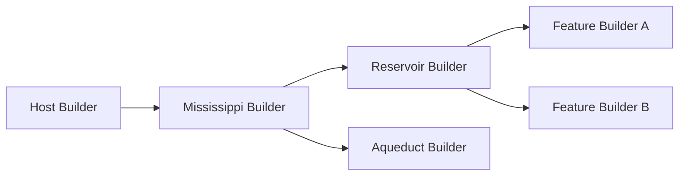

# Builder Pattern

## Overview

Mississippi uses a hierarchical builder pattern for all service registration. Instead of exposing `IServiceCollection` directly, each host type (client, server, silo) provides a typed builder that encapsulates DI registration behind a fluent API. Framework libraries extend these builders with their own sub-builders, creating a composable tree of registration calls.

## Problem

Registering services directly on `IServiceCollection` creates several issues at scale:

- **No discoverability** — Consumers must know which extension methods to call and in what order.
- **Leaked internals** — Public access to `IServiceCollection` lets consumers register or replace internal services.
- **Fragile testing** — Tests that depend on raw DI setup reproduce production wiring instead of testing behavior.
- **No composition** — Flat extension methods cannot express parent-child relationships between libraries.

## How Builders Solve This

The builder pattern introduces a typed wrapper around `IServiceCollection` that each library extends with domain-specific methods.



Each builder in the tree:

1. Accepts a parent builder (or `IServiceCollection`) in its constructor.
2. Exposes domain-specific `Add*` methods that register services internally.
3. Delegates `ConfigureServices` calls up to the parent when direct DI access is needed.
4. Returns itself for fluent chaining.

## The Base Contract

All Mississippi builders implement [`IMississippiBuilder<TBuilder>`](https://github.com/Gibbs-Morris/mississippi/blob/main/src/Common.Abstractions/Builders/IMississippiBuilder.cs):

```csharp
public interface IMississippiBuilder<out TBuilder>
    where TBuilder : IMississippiBuilder<TBuilder>
{
    TBuilder ConfigureOptions<TOptions>(Action<TOptions> configure)
        where TOptions : class;

    TBuilder ConfigureServices(Action<IServiceCollection> configure);
}
```

| Method | Purpose |
|--------|---------|
| `ConfigureOptions<TOptions>` | Registers an options configuration delegate via `IServiceCollection.Configure<T>` |
| `ConfigureServices` | Provides controlled access to the underlying `IServiceCollection` |

The curiously recurring template pattern (CRTP) ensures each derived builder returns its own type for chaining, not the base interface.

## Builder Hierarchy

Mississippi defines three host-level builder interfaces, each extending the base:

| Interface | Host Type | Entry Point |
|-----------|-----------|-------------|
| [`IMississippiClientBuilder`](https://github.com/Gibbs-Morris/mississippi/blob/main/src/Common.Abstractions/Builders/IMississippiClientBuilder.cs) | Blazor WebAssembly or generic host client | `builder.AddMississippiClient()` |
| [`IMississippiServerBuilder`](https://github.com/Gibbs-Morris/mississippi/blob/main/src/Common.Abstractions/Builders/IMississippiServerBuilder.cs) | ASP.NET Core server (API, SignalR) | `builder.AddMississippiServer()` |
| [`IMississippiSiloBuilder`](https://github.com/Gibbs-Morris/mississippi/blob/main/src/Common.Abstractions/Builders/IMississippiSiloBuilder.cs) | Orleans silo (grain hosting) | `siloBuilder.AddMississippiSilo()` |

Libraries attach to these builders with extension methods that return their own sub-builders:

```csharp
// Reservoir attaches to the client builder
IReservoirBuilder reservoir = mississippi.AddReservoir();

// Aqueduct attaches to the server builder
IAqueductServerBuilder aqueduct = mississippi.AddAqueduct();
```

([ReservoirBuilderExtensions.AddReservoir](https://github.com/Gibbs-Morris/mississippi/blob/main/src/Reservoir/ReservoirBuilderExtensions.cs#L20-L28),
[AqueductBuilderExtensions.AddAqueduct](https://github.com/Gibbs-Morris/mississippi/blob/main/src/Aqueduct/AqueductBuilderExtensions.cs#L23-L30))

## Sub-Builders

Sub-builders do not implement `IMississippiBuilder<T>` directly. They define their own interface with domain-specific methods and delegate service registration to their parent.

### Reservoir Example

[`IReservoirBuilder`](https://github.com/Gibbs-Morris/mississippi/blob/main/src/Reservoir.Abstractions/Builders/IReservoirBuilder.cs) is a sub-builder of `IMississippiClientBuilder`:

```csharp
public interface IReservoirBuilder
{
    IReservoirBuilder AddFeature<TState>(Action<IReservoirFeatureBuilder<TState>> configure)
        where TState : class, IFeatureState, new();

    IReservoirBuilder AddMiddleware<TMiddleware>()
        where TMiddleware : class, IMiddleware;

    IReservoirBuilder ConfigureServices(Action<IServiceCollection> configure);
}
```

Its implementation holds a reference to the parent `IMississippiClientBuilder` and delegates `ConfigureServices`:

```csharp
public sealed class ReservoirBuilder : IReservoirBuilder
{
    private readonly IMississippiClientBuilder parent;

    public ReservoirBuilder(IMississippiClientBuilder parent)
    {
        this.parent = parent;
        AddStore(); // Registers IStore on construction
    }

    public IReservoirBuilder ConfigureServices(Action<IServiceCollection> configure)
    {
        parent.ConfigureServices(configure);
        return this;
    }
}
```

([ReservoirBuilder](https://github.com/Gibbs-Morris/mississippi/blob/main/src/Reservoir/Builders/ReservoirBuilder.cs))

### Nested Feature Builders

Sub-builders can define their own child builders. [`IReservoirFeatureBuilder<TState>`](https://github.com/Gibbs-Morris/mississippi/blob/main/src/Reservoir.Abstractions/Builders/IReservoirFeatureBuilder.cs) is a child of `IReservoirBuilder`:

```csharp
reservoir.AddFeature<CounterState>(feature =>
{
    feature.AddReducer<IncrementAction>(CounterReducers.Increment);
    feature.AddReducer<DecrementAction>(CounterReducers.Decrement);
    feature.AddActionEffect<SaveCounterEffect>();
});
```

The callback receives a `ReservoirFeatureBuilder<TState>` that delegates service registration to the `IReservoirBuilder` parent.

([ReservoirFeatureBuilder](https://github.com/Gibbs-Morris/mississippi/blob/main/src/Reservoir/Builders/ReservoirFeatureBuilder.cs))

## Domain Registration Wrappers

Each application domain (e.g., the Spring banking sample) defines an `AddSpringDomain()` extension method on the relevant builder type. These wrappers aggregate all registrations for that domain into a single call:

```csharp
// Silo: registers aggregates, sagas, and projections
mississippi.AddSpringDomain();

// Server: registers DTO-to-command mappers
mississippi.AddSpringDomain();

// Client: registers Reservoir features for each aggregate and saga
reservoir.AddSpringDomain();
```

These wrappers are scaffolded by hand or generated by Inlet source generators. The result is the same: one call per domain per host type.

([SpringDomainSiloRegistrations](https://github.com/Gibbs-Morris/mississippi/blob/main/samples/Spring/Spring.Silo/Registrations/SpringDomainSiloRegistrations.cs),
[SpringDomainServerRegistrations](https://github.com/Gibbs-Morris/mississippi/blob/main/samples/Spring/Spring.Server/Registrations/SpringDomainServerRegistrations.cs),
[SpringDomainClientRegistrations](https://github.com/Gibbs-Morris/mississippi/blob/main/samples/Spring/Spring.Client/Registrations/SpringDomainClientRegistrations.cs))

## Benefits

### Discoverability

IntelliSense shows only the methods relevant to the current host type. A silo developer sees `AddEventSourcing`, `AddCosmosBrookStorageProvider`, and `AddSpringDomain` — not unrelated client-side methods.

### Encapsulation

Internal service registrations are hidden behind builder methods. Consumers cannot accidentally replace framework services because `IServiceCollection` is not publicly exposed.

### Testability

Tests use the same builder API as production code. No special test-only DI setup is required:

```csharp
// Production
IMississippiClientBuilder mississippi = builder.AddMississippiClient();
IReservoirBuilder reservoir = mississippi.AddReservoir();
reservoir.AddFeature<CounterState>(feature =>
{
    feature.AddReducer<IncrementAction>(CounterReducers.Increment);
});

// Test — identical API, different host
ServiceCollection services = new();
MississippiClientBuilder mississippi = new(services);
IReservoirBuilder reservoir = mississippi.AddReservoir();
reservoir.AddFeature<CounterState>(feature =>
{
    feature.AddReducer<IncrementAction>(CounterReducers.Increment);
});
```

### Composability

Libraries compose naturally. Reservoir attaches to the client builder. Aqueduct attaches to the server builder. Each library owns its sub-tree of registrations without conflicting with others.

### Scalability

Adding a new domain is one extension method per host type. The `Program.cs` for each host stays concise regardless of how many aggregates, sagas, or projections the domain contains.

## Writing a Builder (Framework Extenders)

To add a new builder to the Mississippi hierarchy:

1. **Define the interface** in an abstractions project:

```csharp
public interface IMyLibraryBuilder
{
    IMyLibraryBuilder AddWidget<TWidget>() where TWidget : class, IWidget;
    IMyLibraryBuilder ConfigureServices(Action<IServiceCollection> configure);
}
```

2. **Implement the builder** in the implementation project:

```csharp
public sealed class MyLibraryBuilder : IMyLibraryBuilder
{
    private readonly IMississippiServerBuilder parent;

    public MyLibraryBuilder(IMississippiServerBuilder parent)
    {
        this.parent = parent;
    }

    public IMyLibraryBuilder AddWidget<TWidget>() where TWidget : class, IWidget
    {
        ConfigureServices(services => services.AddTransient<IWidget, TWidget>());
        return this;
    }

    public IMyLibraryBuilder ConfigureServices(Action<IServiceCollection> configure)
    {
        parent.ConfigureServices(configure);
        return this;
    }
}
```

3. **Add the entry-point extension method**:

```csharp
public static class MyLibraryBuilderExtensions
{
    public static IMyLibraryBuilder AddMyLibrary(this IMississippiServerBuilder builder)
    {
        return new MyLibraryBuilder(builder);
    }
}
```

### Rules for Builder Authors

- Interface goes in `*.Abstractions`; implementation goes in the main project.
- Delegate `ConfigureServices` to the parent builder — do not hold a direct `IServiceCollection` reference unless the builder is a root builder.
- Return `this` from every method for fluent chaining.
- Use `ArgumentNullException.ThrowIfNull` on all public parameters.
- Register infrastructure services in the constructor when they are always required (e.g., `ReservoirBuilder` registers `IStore` in its constructor).

## Learn More

- [Host Builders](./host-builders.md) — Client, server, and silo builder specifics with `Program.cs` examples
- [Reservoir Overview](../client-state-management/reservoir.md) — Sub-builder for client-side state management
- [Event Sourcing Sagas](../event-sourcing-sagas.md) — Silo builder usage for saga registration

## Source Code

| Package | Purpose |
|---------|---------|
| [`Mississippi.Common.Abstractions`](https://github.com/Gibbs-Morris/mississippi/tree/main/src/Common.Abstractions/Builders) | Builder interfaces (`IMississippiBuilder<T>`, `IMississippiClientBuilder`, etc.) |
| [`Mississippi.Sdk.Client`](https://github.com/Gibbs-Morris/mississippi/tree/main/src/Sdk.Client/Builders) | `MississippiClientBuilder` implementation |
| [`Mississippi.Sdk.Server`](https://github.com/Gibbs-Morris/mississippi/tree/main/src/Sdk.Server/Builders) | `MississippiServerBuilder` implementation |
| [`Mississippi.Sdk.Silo`](https://github.com/Gibbs-Morris/mississippi/tree/main/src/Sdk.Silo/Builders) | `MississippiSiloBuilder` implementation |
| [`Mississippi.Reservoir`](https://github.com/Gibbs-Morris/mississippi/tree/main/src/Reservoir/Builders) | `ReservoirBuilder` and `ReservoirFeatureBuilder` |
| [`Mississippi.Aqueduct`](https://github.com/Gibbs-Morris/mississippi/tree/main/src/Aqueduct/Builders) | `AqueductServerBuilder` |
