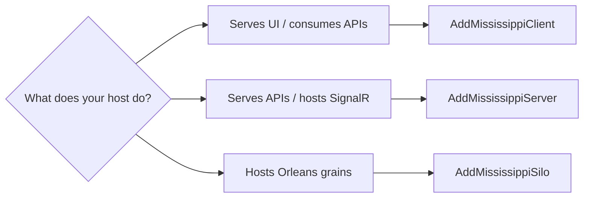

# Host Builders

## Overview

Mississippi defines three host-level builders that match the three deployment roles in a distributed application. Each builder wraps the host's service collection and provides the attachment point for framework libraries.

| Builder | Host Role | Wraps |
|---------|-----------|-------|
| `IMississippiClientBuilder` | Blazor / generic host client | `IServiceCollection` |
| `IMississippiServerBuilder` | ASP.NET Core API server | `IServiceCollection` |
| `IMississippiSiloBuilder` | Orleans silo (grain hosting) | `ISiloBuilder` |

## Client Builder

Use `IMississippiClientBuilder` in Blazor WebAssembly or generic host applications that consume server-side data.

### Entry Point

```csharp
// Blazor WebAssembly
WebAssemblyHostBuilder builder = WebAssemblyHostBuilder.CreateDefault(args);
IMississippiClientBuilder mississippi = builder.AddMississippiClient();
```

```csharp
// Generic host
HostApplicationBuilder builder = Host.CreateApplicationBuilder(args);
IMississippiClientBuilder mississippi = builder.AddMississippiClient();
```

([MississippiClientBuilderExtensions](https://github.com/Gibbs-Morris/mississippi/blob/main/src/Sdk.Client/MississippiClientBuilderExtensions.cs))

### What Attaches Here

| Library | Extension Method | Returns |
|---------|-----------------|---------|
| Reservoir (state management) | `mississippi.AddReservoir()` | `IReservoirBuilder` |
| Inlet Client (real-time projections) | `mississippi.AddInletClient()` | `IReservoirBuilder` |

### Full Client Example (Spring Sample)

```csharp
WebAssemblyHostBuilder builder = WebAssemblyHostBuilder.CreateDefault(args);
IMississippiClientBuilder mississippi = builder.AddMississippiClient();

// Inlet wires Reservoir + SignalR projection fetching
IReservoirBuilder reservoir = mississippi.AddInletClient();

// Domain registration — one call registers all client features
reservoir.AddSpringDomain();

// Built-in Reservoir features
reservoir.AddReservoirBlazorBuiltIns();

// DevTools (development only)
reservoir.AddReservoirDevTools(options =>
{
    options.Enablement = ReservoirDevToolsEnablement.Always;
    options.Name = "Spring Sample";
});
```

([Spring.Client Program.cs](https://github.com/Gibbs-Morris/mississippi/blob/main/samples/Spring/Spring.Client/Program.cs))

### Implementation

`MississippiClientBuilder` holds an `IServiceCollection` and delegates both `ConfigureOptions` and `ConfigureServices` to it:

```csharp
public sealed class MississippiClientBuilder : IMississippiClientBuilder
{
    private readonly IServiceCollection services;

    public MississippiClientBuilder(IServiceCollection services)
    {
        ArgumentNullException.ThrowIfNull(services);
        this.services = services;
    }

    public IMississippiClientBuilder ConfigureOptions<TOptions>(Action<TOptions> configure)
        where TOptions : class
    {
        services.Configure(configure);
        return this;
    }

    public IMississippiClientBuilder ConfigureServices(Action<IServiceCollection> configure)
    {
        configure(services);
        return this;
    }
}
```

([MississippiClientBuilder](https://github.com/Gibbs-Morris/mississippi/blob/main/src/Sdk.Client/Builders/MississippiClientBuilder.cs))

## Server Builder

Use `IMississippiServerBuilder` in ASP.NET Core applications that serve APIs, host SignalR hubs, or act as an Orleans client.

### Entry Point

```csharp
WebApplicationBuilder builder = WebApplication.CreateBuilder(args);
IMississippiServerBuilder mississippi = builder.AddMississippiServer();
```

```csharp
// Generic host (non-web server)
HostApplicationBuilder builder = Host.CreateApplicationBuilder(args);
IMississippiServerBuilder mississippi = builder.AddMississippiServer();
```

([MississippiServerBuilderExtensions](https://github.com/Gibbs-Morris/mississippi/blob/main/src/Sdk.Server/MississippiServerBuilderExtensions.cs))

### What Attaches Here

| Library | Extension Method | Returns |
|---------|-----------------|---------|
| Aqueduct (SignalR backplane) | `mississippi.AddAqueduct()` | `IAqueductServerBuilder` |
| Inlet Server (projection updates) | `mississippi.AddInletServer()` | `IMississippiServerBuilder` |
| Aggregate support | `mississippi.AddAggregateSupport()` | `IMississippiServerBuilder` |
| UX Projections | `mississippi.AddUxProjections()` | `IMississippiServerBuilder` |

### Full Server Example (Spring Sample)

```csharp
WebApplicationBuilder builder = WebApplication.CreateBuilder(args);
IMississippiServerBuilder mississippi = builder.AddMississippiServer();

// Orleans client (Aspire injects clustering config)
builder.UseOrleansClient(clientBuilder => clientBuilder.AddActivityPropagation());

// Framework infrastructure
mississippi.AddAggregateSupport();
mississippi.AddUxProjections();
mississippi.AddInletServer();
mississippi.ScanProjectionAssemblies(typeof(BankAccountBalanceProjection).Assembly);

// Domain registration — one call registers all server mappers
mississippi.AddSpringDomain();
```

([Spring.Server Program.cs](https://github.com/Gibbs-Morris/mississippi/blob/main/samples/Spring/Spring.Server/Program.cs))

### Implementation

`MississippiServerBuilder` follows the same pattern as the client builder — it holds `IServiceCollection` directly:

```csharp
public sealed class MississippiServerBuilder : IMississippiServerBuilder
{
    private readonly IServiceCollection services;

    public MississippiServerBuilder(IServiceCollection services)
    {
        ArgumentNullException.ThrowIfNull(services);
        this.services = services;
    }

    public IMississippiServerBuilder ConfigureOptions<TOptions>(Action<TOptions> configure)
        where TOptions : class
    {
        services.Configure(configure);
        return this;
    }

    public IMississippiServerBuilder ConfigureServices(Action<IServiceCollection> configure)
    {
        configure(services);
        return this;
    }
}
```

([MississippiServerBuilder](https://github.com/Gibbs-Morris/mississippi/blob/main/src/Sdk.Server/Builders/MississippiServerBuilder.cs))

## Silo Builder

Use `IMississippiSiloBuilder` inside the Orleans silo configuration callback. This builder wraps `ISiloBuilder` instead of `IServiceCollection` because Orleans silo services are registered through the silo builder.

### Entry Point

```csharp
builder.UseOrleans(siloBuilder =>
{
    IMississippiSiloBuilder mississippi = siloBuilder.AddMississippiSilo();
    // ...
});
```

([MississippiSiloBuilderExtensions](https://github.com/Gibbs-Morris/mississippi/blob/main/src/Sdk.Silo/MississippiSiloBuilderExtensions.cs))

### What Attaches Here

| Library | Extension Method | Returns |
|---------|-----------------|---------|
| Inlet Silo (projection subscriptions) | `mississippi.AddInletSilo()` | `IMississippiSiloBuilder` |
| Event Sourcing | `mississippi.AddEventSourcing(...)` | `IMississippiSiloBuilder` |
| Snapshot Caching | `mississippi.AddSnapshotCaching()` | `IMississippiSiloBuilder` |
| Cosmos Brook Storage | `mississippi.AddCosmosBrookStorageProvider(...)` | `IMississippiSiloBuilder` |
| Cosmos Snapshot Storage | `mississippi.AddCosmosSnapshotStorageProvider(...)` | `IMississippiSiloBuilder` |

### Full Silo Example (Spring Sample)

```csharp
builder.UseOrleans(siloBuilder =>
{
    siloBuilder.AddActivityPropagation();
    siloBuilder.UseAqueduct(options => options.StreamProviderName = "StreamProvider");

    IMississippiSiloBuilder mississippi = siloBuilder.AddMississippiSilo();

    // Domain registration — one call registers all aggregates, sagas, projections
    mississippi.AddSpringDomain();

    // Framework infrastructure
    mississippi.AddInletSilo();
    mississippi.ScanProjectionAssemblies(typeof(BankAccountBalanceProjection).Assembly);
    mississippi.AddEventSourcing(options => options.OrleansStreamProviderName = "StreamProvider");
    mississippi.AddSnapshotCaching();

    // Storage providers
    mississippi.AddCosmosBrookStorageProvider(options =>
    {
        options.CosmosClientServiceKey = sharedCosmosKey;
        options.DatabaseId = "spring-db";
        options.ContainerId = "events";
    });

    mississippi.AddCosmosSnapshotStorageProvider(options =>
    {
        options.CosmosClientServiceKey = sharedCosmosKey;
        options.DatabaseId = "spring-db";
        options.ContainerId = "snapshots";
    });
});
```

([Spring.Silo Program.cs](https://github.com/Gibbs-Morris/mississippi/blob/main/samples/Spring/Spring.Silo/Program.cs))

### Implementation

`MississippiSiloBuilder` wraps `ISiloBuilder` and accesses services through `ISiloBuilder.Services`:

```csharp
public sealed class MississippiSiloBuilder : IMississippiSiloBuilder
{
    private ISiloBuilder SiloBuilder { get; }

    public MississippiSiloBuilder(ISiloBuilder siloBuilder)
    {
        ArgumentNullException.ThrowIfNull(siloBuilder);
        SiloBuilder = siloBuilder;
    }

    public IMississippiSiloBuilder ConfigureOptions<TOptions>(Action<TOptions> configure)
        where TOptions : class
    {
        SiloBuilder.Services.Configure(configure);
        return this;
    }

    public IMississippiSiloBuilder ConfigureServices(Action<IServiceCollection> configure)
    {
        configure(SiloBuilder.Services);
        return this;
    }
}
```

([MississippiSiloBuilder](https://github.com/Gibbs-Morris/mississippi/blob/main/src/Sdk.Silo/Builders/MississippiSiloBuilder.cs))

:::note ISiloBuilder vs IServiceCollection
The silo builder wraps `ISiloBuilder` because Orleans requires grain-related services to be registered through the silo builder. The `ConfigureServices` method accesses `ISiloBuilder.Services` to provide the same `IServiceCollection`-based API as the other builders.
:::

## Domain Registration Wrappers

Each host-type builder has a corresponding domain registration wrapper. These wrappers aggregate all registrations for a bounded context into a single `Add<Domain>Domain()` call.

### Silo Wrapper

Registers aggregates, sagas, and projections:

```csharp
public static IMississippiSiloBuilder AddSpringDomain(this IMississippiSiloBuilder builder)
{
    builder.AddBankAccountAggregate();
    builder.AddTransactionInvestigationQueueAggregate();
    builder.AddMoneyTransferSaga();
    builder.AddBankAccountBalanceProjection();
    builder.AddBankAccountLedgerProjection();
    builder.AddFlaggedTransactionsProjection();
    builder.AddMoneyTransferStatusProjection();
    return builder;
}
```

([SpringDomainSiloRegistrations](https://github.com/Gibbs-Morris/mississippi/blob/main/samples/Spring/Spring.Silo/Registrations/SpringDomainSiloRegistrations.cs))

### Server Wrapper

Registers DTO-to-command mappers for API controllers:

```csharp
public static IMississippiServerBuilder AddSpringDomain(this IMississippiServerBuilder builder)
{
    builder.ConfigureServices(services =>
    {
        services.AddBankAccountAggregateMappers();
        services.AddBankAccountBalanceProjectionMappers();
        services.AddBankAccountLedgerProjectionMappers();
        services.AddFlaggedTransactionsProjectionMappers();
        services.AddMoneyTransferStatusProjectionMappers();
    });
    return builder;
}
```

([SpringDomainServerRegistrations](https://github.com/Gibbs-Morris/mississippi/blob/main/samples/Spring/Spring.Server/Registrations/SpringDomainServerRegistrations.cs))

### Client Wrapper

Registers Reservoir features for each aggregate and saga:

```csharp
public static IReservoirBuilder AddSpringDomain(this IReservoirBuilder builder)
{
    builder.AddBankAccountAggregateFeature();
    builder.AddMoneyTransferSagaFeature();
    builder.AddProjectionsFeature();
    return builder;
}
```

([SpringDomainClientRegistrations](https://github.com/Gibbs-Morris/mississippi/blob/main/samples/Spring/Spring.Client/Registrations/SpringDomainClientRegistrations.cs))

### Source Generation

Inlet source generators can scaffold these wrappers automatically by scanning the domain project for aggregates, sagas, and projections. The generators produce the same code structure as the hand-written wrappers.

| Generator | Target Builder | Package |
|-----------|---------------|---------|
| `DomainSiloRegistrationGenerator` | `IMississippiSiloBuilder` | `Mississippi.Inlet.Silo.Generators` |
| `DomainServerRegistrationGenerator` | `IMississippiServerBuilder` | `Mississippi.Inlet.Server.Generators` |
| `DomainClientRegistrationGenerator` | `IReservoirBuilder` | `Mississippi.Inlet.Client.Generators` |

## Choosing the Right Builder



| If your project... | Use |
|--------------------|----|
| Is a Blazor WebAssembly app | `AddMississippiClient()` on `WebAssemblyHostBuilder` |
| Is a generic host client | `AddMississippiClient()` on `HostApplicationBuilder` |
| Serves HTTP APIs or SignalR hubs | `AddMississippiServer()` on `WebApplicationBuilder` |
| Hosts Orleans grains (aggregates, sagas) | `AddMississippiSilo()` on `ISiloBuilder` |

:::warning Multiple roles in one host
Some hosts serve multiple roles. The Spring sample's silo host uses `WebApplicationBuilder` for health check endpoints but registers Mississippi services through `ISiloBuilder.AddMississippiSilo()` because its primary role is grain hosting.
:::

## Testing with Builders

Builders simplify test setup by accepting a plain `IServiceCollection`:

```csharp
[Fact]
public void ReducerUpdatesState()
{
    // Arrange — use the same builder API as production
    ServiceCollection services = new();
    MississippiClientBuilder mississippi = new(services);
    IReservoirBuilder reservoir = mississippi.AddReservoir();
    reservoir.AddFeature<CounterState>(feature =>
    {
        feature.AddReducer<IncrementAction>(CounterReducers.Increment);
    });

    ServiceProvider provider = services.BuildServiceProvider();
    IStore store = provider.GetRequiredService<IStore>();

    // Act
    store.Dispatch(new IncrementAction());

    // Assert
    Assert.Equal(1, store.GetState<CounterState>().Count);
}
```

Tests do not need to know which internal services the builder registers. They compose registration calls identically to `Program.cs` and assert on behavior.

## Summary

| Concept | Description |
|---------|-------------|
| `IMississippiClientBuilder` | Client-side builder for Blazor and generic host apps |
| `IMississippiServerBuilder` | Server-side builder for ASP.NET Core apps |
| `IMississippiSiloBuilder` | Silo builder for Orleans grain hosts |
| Domain wrappers | `Add<Domain>Domain()` extension methods that aggregate registrations |
| Source generation | Inlet generators scaffold domain wrappers from the domain project |

## Next Steps

- [Builder Pattern](./builder-pattern.md) — General pattern, sub-builders, and how to write your own
- [Reservoir Overview](../client-state-management/reservoir.md) — Client state management sub-builder
- [Event Sourcing Sagas](../event-sourcing-sagas.md) — Silo builder usage for saga registration
