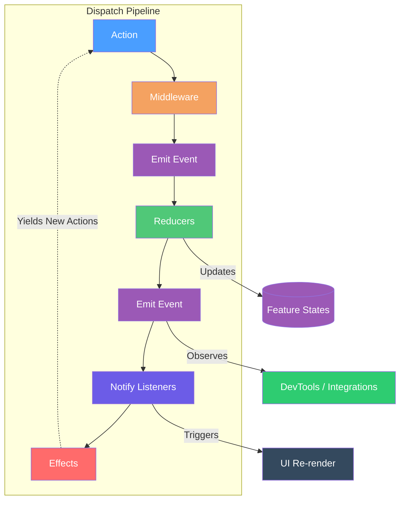

# Reservoir

## Overview

Reservoir is a Redux-inspired state management library in the Mississippi framework. It manages local feature states using a dispatch pipeline defined by [`IStore`](https://github.com/Gibbs-Morris/mississippi/blob/main/src/Reservoir.Abstractions/IStore.cs) and inspired by [Redux](https://redux.js.org/) and [Flux](https://facebookarchive.github.io/flux/).

Use this page as an orientation page for Reservoir. Use the child pages for specific contracts, task guidance, and testing details.

## Core Components

Reservoir consists of six core components that work together to manage application state:

| Component | Purpose |
|-----------|---------|
| **Action** | Records that describe what happened or what the user intends (actions should be immutable) ([IAction](https://github.com/Gibbs-Morris/mississippi/blob/main/src/Reservoir.Abstractions/Actions/IAction.cs)) |
| **Action Reducer** | Pure functions that transform state based on actions ([IActionReducer](https://github.com/Gibbs-Morris/mississippi/blob/main/src/Reservoir.Abstractions/IActionReducer.cs)) |
| **Selector** | Pure functions that derive computed values from state with optional memoization ([Selectors](./reference/selectors.md)) |
| **Action Effect** | Handlers for async side effects (API calls, navigation, timers) ([IActionEffect](https://github.com/Gibbs-Morris/mississippi/blob/main/src/Reservoir.Abstractions/IActionEffect%7BTState%7D.cs)) |
| **Feature State** | State slices representing distinct areas of the application (feature states should be immutable) ([IFeatureState](https://github.com/Gibbs-Morris/mississippi/blob/main/src/Reservoir.Abstractions/State/IFeatureState.cs)) |
| **Store** | Central container that manages feature states and coordinates dispatch ([IStore](https://github.com/Gibbs-Morris/mississippi/blob/main/src/Reservoir.Abstractions/IStore.cs)) |

## How It Works

When a user interaction or system event occurs, an action is dispatched to the store. The store processes the action through a pipeline:

1. **Action Dispatched**: An [`IAction`](https://github.com/Gibbs-Morris/mississippi/blob/main/src/Reservoir.Abstractions/Actions/IAction.cs) is dispatched to the [`IStore`](https://github.com/Gibbs-Morris/mississippi/blob/main/src/Reservoir.Abstractions/IStore.cs).

2. **Middleware Pipeline**: Actions pass through registered [`IMiddleware`](https://github.com/Gibbs-Morris/mississippi/blob/main/src/Reservoir.Abstractions/IMiddleware.cs) components for logging, analytics, or transformation.

3. **Store Events**: The store emits [`StoreEventBase`](./reference/store.md#observable-store-events) events through `IStore.StoreEvents`, enabling external integrations (like [DevTools](./reference/devtools.md)) to observe activity via composition.

4. **Reducers Execute**: The store invokes [`IRootReducer<TState>`](https://github.com/Gibbs-Morris/mississippi/blob/main/src/Reservoir.Abstractions/IRootReducer.cs) for each feature state. Matching reducers produce new immutable state.

5. **Listeners Notified**: Subscribed listeners (via `Store.Subscribe()`) are notified synchronously after the action is processed.

6. **Effects Triggered**: [`IRootActionEffect<TState>`](https://github.com/Gibbs-Morris/mississippi/blob/main/src/Reservoir.Abstractions/IRootActionEffect.cs) dispatches to matching effects asynchronously. Effects can yield new actions, continuing the cycle.

## Why Use Reservoir

- reducers keep synchronous state transitions explicit
- effects isolate asynchronous side effects
- selectors keep derived logic reusable and testable
- middleware handles cross-cutting behavior without moving that logic into components

## Built-In Surfaces

Reservoir includes documentation for both its core state-management pieces and the Blazor-specific integration surfaces that sit on top of them.

Use the child pages for details on:

- actions, reducers, effects, selectors, feature state, store, and middleware
- `StoreComponent` and the built-in Blazor features
- testing patterns and DevTools integration

## Learn More

- [Actions](./reference/actions.md) — Define and organize actions
- [Reducers](./reference/reducers.md) — Write pure reducer functions
- [Effects](./reference/effects.md) — Handle async side effects
- [Feature State](./reference/feature-state.md) — Design modular state slices
- [Store](./reference/store.md) — See the store contract and dispatch behavior
- [Middleware](./reference/middleware.md) — Handle cross-cutting concerns
- [StoreComponent](./reference/store-component.md) — Integrate Reservoir with Blazor components
- [Selectors](./reference/selectors.md) — Derive computed values from state
- [Built-in Navigation](./reference/built-in-navigation.md) — Look up the built-in navigation feature
- [Built-in Lifecycle](./reference/built-in-lifecycle.md) — Look up the built-in lifecycle feature
- [DevTools](./reference/devtools.md) — Enable Redux DevTools integration
- [Testing](./how-to/testing.md) — Test reducers, effects, selectors, and built-in features
