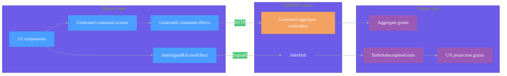

# Inlet

## Overview

Inlet is Mississippi's client-server synchronization layer for event-sourced aggregates and projections. It uses source generators to create REST controllers, DTOs, and client-side actions from domain attributes, and it uses a SignalR hub to push projection updates to connected clients.

The generator entry points are the domain attributes:

- [GenerateAggregateEndpointsAttribute](https://github.com/Gibbs-Morris/mississippi/blob/main/src/Inlet.Generators.Abstractions/GenerateAggregateEndpointsAttribute.cs)
- [GenerateCommandAttribute](https://github.com/Gibbs-Morris/mississippi/blob/main/src/Inlet.Generators.Abstractions/GenerateCommandAttribute.cs)
- [GenerateProjectionEndpointsAttribute](https://github.com/Gibbs-Morris/mississippi/blob/main/src/Inlet.Generators.Abstractions/GenerateProjectionEndpointsAttribute.cs)
- [ProjectionPathAttribute](https://github.com/Gibbs-Morris/mississippi/blob/main/src/Inlet.Abstractions/ProjectionPathAttribute.cs)

The runtime subscription hub is [InletHub](https://github.com/Gibbs-Morris/mississippi/blob/main/src/Inlet.Server/InletHub.cs).

## Architecture



## Key APIs

| API | Purpose | Source |
| --- | --- | --- |
| `AddInletClient()` | Registers client-side Inlet services. | [InletClientRegistrations](https://github.com/Gibbs-Morris/mississippi/blob/main/src/Inlet.Client/InletClientRegistrations.cs) |
| `AddInletBlazorSignalR(...)` | Registers the SignalR action effect and projection fetcher wiring. | [InletBlazorRegistrations](https://github.com/Gibbs-Morris/mississippi/blob/main/src/Inlet.Client/InletBlazorRegistrations.cs) |
| `AddInletServer(...)` | Registers Inlet server services and hub infrastructure. | [InletServerRegistrations](https://github.com/Gibbs-Morris/mississippi/blob/main/src/Inlet.Server/InletServerRegistrations.cs) |
| `MapInletHub()` | Maps the SignalR hub (default path `/hubs/inlet`). | [InletServerRegistrations](https://github.com/Gibbs-Morris/mississippi/blob/main/src/Inlet.Server/InletServerRegistrations.cs) |
| `SubscribeAsync(...)` / `UnsubscribeAsync(...)` | Hub methods used for projection subscriptions. | [InletHub](https://github.com/Gibbs-Morris/mississippi/blob/main/src/Inlet.Server/InletHub.cs) |

## Minimal wiring (Spring sample)

### Client

```csharp
builder.Services.AddInletClient();
builder.Services.AddInletBlazorSignalR(signalR => signalR
    .WithHubPath("/hubs/inlet")
    .ScanProjectionDtos(typeof(BankAccountBalanceProjectionDto).Assembly));
```

([Spring.Client/Program.cs](https://github.com/Gibbs-Morris/mississippi/blob/main/samples/Spring/Spring.Client/Program.cs))

### Server

```csharp
builder.Services.AddControllers();
builder.Services.AddInletServer();
builder.Services.ScanProjectionAssemblies(typeof(BankAccountBalanceProjection).Assembly);

var app = builder.Build();

app.MapControllers();
app.MapInletHub();
```

([Spring.Server/Program.cs](https://github.com/Gibbs-Morris/mississippi/blob/main/samples/Spring/Spring.Server/Program.cs))

## Generated surface area

| Tier | Output | Source |
| --- | --- | --- |
| Client | Command actions, lifecycle actions, effects, aggregate state, and reducers. | [CommandClientActionsGenerator](https://github.com/Gibbs-Morris/mississippi/blob/main/src/Inlet.Client.Generators/CommandClientActionsGenerator.cs), [CommandClientActionEffectsGenerator](https://github.com/Gibbs-Morris/mississippi/blob/main/src/Inlet.Client.Generators/CommandClientActionEffectsGenerator.cs), [CommandClientStateGenerator](https://github.com/Gibbs-Morris/mississippi/blob/main/src/Inlet.Client.Generators/CommandClientStateGenerator.cs), [CommandClientReducersGenerator](https://github.com/Gibbs-Morris/mississippi/blob/main/src/Inlet.Client.Generators/CommandClientReducersGenerator.cs) |
| Client | Projection DTOs annotated with `[ProjectionPath]`. | [ProjectionClientDtoGenerator](https://github.com/Gibbs-Morris/mississippi/blob/main/src/Inlet.Client.Generators/ProjectionClientDtoGenerator.cs) |
| Server | Aggregate controllers and command DTOs. | [AggregateControllerGenerator](https://github.com/Gibbs-Morris/mississippi/blob/main/src/Inlet.Server.Generators/AggregateControllerGenerator.cs), [CommandServerDtoGenerator](https://github.com/Gibbs-Morris/mississippi/blob/main/src/Inlet.Server.Generators/CommandServerDtoGenerator.cs) |
| Server | Projection controllers, DTOs, and mappers. | [ProjectionEndpointsGenerator](https://github.com/Gibbs-Morris/mississippi/blob/main/src/Inlet.Server.Generators/ProjectionEndpointsGenerator.cs) |
| Silo | Aggregate and projection registration extensions. | [AggregateSiloRegistrationGenerator](https://github.com/Gibbs-Morris/mississippi/blob/main/src/Inlet.Silo.Generators/AggregateSiloRegistrationGenerator.cs), [ProjectionSiloRegistrationGenerator](https://github.com/Gibbs-Morris/mississippi/blob/main/src/Inlet.Silo.Generators/ProjectionSiloRegistrationGenerator.cs) |

## Learn More

- [Domain Definitions](./domain-definitions.md) — Defining aggregates and projections
- [Attributes](./attributes.md) — All available Inlet attributes
- [Source Generation](./source-generation.md) — What code gets generated
- [Client Projections](./client-projections.md) — Subscribing to real-time updates
- [Client Aggregates](./client-aggregates.md) — Dispatching commands
- [Server](./server.md) — Generated APIs and Orleans integration

