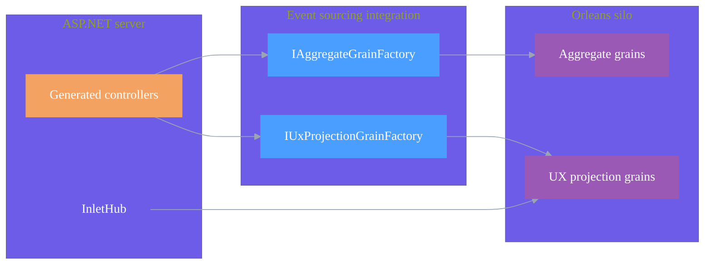

# Server Configuration

## Overview

The server tier hosts generated REST controllers for commands and projections, plus the SignalR hub for real-time updates. This page focuses on the Inlet-related wiring and the generated controller surface area.

## Architecture



## Basic Setup

### Minimal Server Configuration

```csharp
var builder = WebApplication.CreateBuilder(args);

builder.Services.AddControllers();
builder.Services.AddJsonSerialization();
builder.Services.AddAggregateSupport();
builder.Services.AddUxProjections();

builder.Services.AddInletServer();
builder.Services.ScanProjectionAssemblies(typeof(BankAccountBalanceProjection).Assembly);

var app = builder.Build();

app.MapControllers();
app.MapInletHub();
```

([Spring.Server/Program.cs](https://github.com/Gibbs-Morris/mississippi/blob/main/samples/Spring/Spring.Server/Program.cs))

## Service Registration

### Required Services

| Method | Purpose |
|--------|---------|
| `AddJsonSerialization()` | Registers the JSON serialization provider |
| `AddAggregateSupport()` | Registers aggregate infrastructure services |
| `AddUxProjections()` | Registers UX projection infrastructure services |
| `AddInletServer()` | Registers Inlet server services and hub infrastructure |

### AddInletServer

Registers services needed for projection subscriptions:

```csharp
builder.Services.AddInletServer();
```

### ScanProjectionAssemblies

Discovers projection types and registers their paths:

```csharp
builder.Services.ScanProjectionAssemblies(
    typeof(BankAccountBalanceProjection).Assembly,
    typeof(OtherProjection).Assembly
);
```

## Generated Controllers

### Aggregate Controllers

For each aggregate with `[GenerateAggregateEndpoints]`, a controller is generated:

The aggregate controller generator emits controllers that inherit from `AggregateControllerBase<TAggregate>` with routes of the form:

```text
api/aggregates/{routePrefix}/{entityId}
```

([AggregateControllerGenerator.cs](https://github.com/Gibbs-Morris/mississippi/blob/main/src/Inlet.Server.Generators/AggregateControllerGenerator.cs))

### Projection Controllers

For each projection with `[GenerateProjectionEndpoints]`:

The projection controller generator emits controllers that inherit from `UxProjectionControllerBase<TProjection, TDto>` with routes of the form:

```text
api/projections/{path}/{entityId}
```

([ProjectionEndpointsGenerator.cs](https://github.com/Gibbs-Morris/mississippi/blob/main/src/Inlet.Server.Generators/ProjectionEndpointsGenerator.cs))

`UxProjectionControllerBase` also provides `/version` and `/at/{version}` endpoints for versioned projection reads.

([UxProjectionControllerBase.cs](https://github.com/Gibbs-Morris/mississippi/blob/main/src/EventSourcing.UxProjections.Api/UxProjectionControllerBase%7BTProjection,TDto%7D.cs))

## InletHub

The `InletHub` handles real-time projection subscriptions.

([InletHub.cs](https://github.com/Gibbs-Morris/mississippi/blob/main/src/Inlet.Server/InletHub.cs))

### Hub Methods

| Method | Description |
|--------|-------------|
| `SubscribeAsync(path, entityId)` | Subscribe to projection updates |
| `UnsubscribeAsync(subscriptionId, path, entityId)` | Unsubscribe from updates |

### Hub Events (Server to Client)

| Event | Description |
|-------|-------------|
| `ProjectionUpdatedAsync` | Projection version updated for path + entity ID |

## Generated Mappers

The projection generator emits DTO mappers and mapper registrations for projections.

([ProjectionEndpointsGenerator.cs](https://github.com/Gibbs-Morris/mississippi/blob/main/src/Inlet.Server.Generators/ProjectionEndpointsGenerator.cs))

## Summary

- Add the Inlet server services and map the hub alongside controllers.
- Generated controllers target aggregate commands and projection reads.
- `InletHub` manages real-time projection subscriptions.

## Next Steps

- [Inlet Overview](./inlet.md) — Return to the main Inlet documentation
- [Source Generation](./source-generation.md) — See how controllers and mappers are generated

