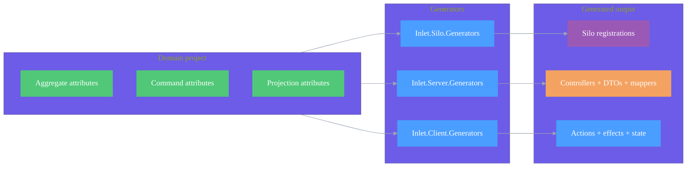

# Source Generation

## Overview

Inlet uses Roslyn source generators to produce infrastructure code at compile time. The generators use the domain attributes documented in [Attributes](./attributes.md).

## Generator Architecture

Inlet's generators are split across three projects, each targeting a different tier:

| Project | Target | Source |
| --- | --- | --- |
| Inlet.Silo.Generators | Orleans silo | [Inlet.Silo.Generators.csproj](https://github.com/Gibbs-Morris/mississippi/blob/main/src/Inlet.Silo.Generators/Inlet.Silo.Generators.csproj) |
| Inlet.Server.Generators | ASP.NET server | [Inlet.Server.Generators.csproj](https://github.com/Gibbs-Morris/mississippi/blob/main/src/Inlet.Server.Generators/Inlet.Server.Generators.csproj) |
| Inlet.Client.Generators | Blazor client | [Inlet.Client.Generators.csproj](https://github.com/Gibbs-Morris/mississippi/blob/main/src/Inlet.Client.Generators/Inlet.Client.Generators.csproj) |

## Command Generation

For each command marked with `[GenerateCommand]`, the generators produce the following artifacts.

### Client-side (Inlet.Client.Generators)

| Output | Notes | Source |
| --- | --- | --- |
| `{Command}Action` + `{Command}ExecutingAction` + `{Command}SucceededAction` + `{Command}FailedAction` | Command action and lifecycle actions. | [CommandClientActionsGenerator](https://github.com/Gibbs-Morris/mississippi/blob/main/src/Inlet.Client.Generators/CommandClientActionsGenerator.cs) |
| `{Command}ActionEffect` | Command effect that posts to `/api/aggregates/{aggregate}/{entityId}/{route}`. | [CommandClientActionEffectsGenerator](https://github.com/Gibbs-Morris/mississippi/blob/main/src/Inlet.Client.Generators/CommandClientActionEffectsGenerator.cs) |
| `{Aggregate}AggregateState` | Feature state derived from `AggregateCommandStateBase`. | [CommandClientStateGenerator](https://github.com/Gibbs-Morris/mississippi/blob/main/src/Inlet.Client.Generators/CommandClientStateGenerator.cs) |
| `{Aggregate}AggregateReducers` | Reducers for executing/failed/succeeded actions. | [CommandClientReducersGenerator](https://github.com/Gibbs-Morris/mississippi/blob/main/src/Inlet.Client.Generators/CommandClientReducersGenerator.cs) |
| `Add{Aggregate}AggregateFeature()` | Registers mappers, reducers, and effects. | [CommandClientRegistrationGenerator](https://github.com/Gibbs-Morris/mississippi/blob/main/src/Inlet.Client.Generators/CommandClientRegistrationGenerator.cs) |

### Server-side (Inlet.Server.Generators)

| Output | Notes | Source |
| --- | --- | --- |
| `{Aggregate}AggregateController` | Derived from `AggregateControllerBase<TAggregate>` with `[Route("api/aggregates/{routePrefix}/{entityId}")]`. | [AggregateControllerGenerator](https://github.com/Gibbs-Morris/mississippi/blob/main/src/Inlet.Server.Generators/AggregateControllerGenerator.cs) |
| `{Command}Dto` + `{Command}Dto` mapper | Command DTOs and mapping to domain commands. | [CommandServerDtoGenerator](https://github.com/Gibbs-Morris/mississippi/blob/main/src/Inlet.Server.Generators/CommandServerDtoGenerator.cs) |

## Projection Generation

For each projection marked with `[GenerateProjectionEndpoints]`:

### Server-side (Inlet.Server.Generators)

| Output | Notes | Source |
| --- | --- | --- |
| `{Projection}Controller` | Derived from `UxProjectionControllerBase<TProjection, TDto>` with `[Route("api/projections/{path}/{entityId}")]`. | [ProjectionEndpointsGenerator](https://github.com/Gibbs-Morris/mississippi/blob/main/src/Inlet.Server.Generators/ProjectionEndpointsGenerator.cs) |
| `{Projection}Dto` | Projection DTO with `required` properties and `[JsonRequired]`. | [ProjectionEndpointsGenerator](https://github.com/Gibbs-Morris/mississippi/blob/main/src/Inlet.Server.Generators/ProjectionEndpointsGenerator.cs) |
| `{Projection}Mapper` + registration | Mapper and registration extension. | [ProjectionEndpointsGenerator](https://github.com/Gibbs-Morris/mississippi/blob/main/src/Inlet.Server.Generators/ProjectionEndpointsGenerator.cs) |

`UxProjectionControllerBase` provides `/version` and `/at/{version}` endpoints for versioned projection reads.

([UxProjectionControllerBase.cs](https://github.com/Gibbs-Morris/mississippi/blob/main/src/EventSourcing.UxProjections.Api/UxProjectionControllerBase%7BTProjection,TDto%7D.cs))

### Client-side projection DTOs

The client generator emits DTOs marked with `[ProjectionPath]` and a positional record signature.

([ProjectionClientDtoGenerator](https://github.com/Gibbs-Morris/mississippi/blob/main/src/Inlet.Client.Generators/ProjectionClientDtoGenerator.cs))

## Silo generation

The silo generator projects are the sources of registration extensions for silo hosts:

([AggregateSiloRegistrationGenerator](https://github.com/Gibbs-Morris/mississippi/blob/main/src/Inlet.Silo.Generators/AggregateSiloRegistrationGenerator.cs))
([ProjectionSiloRegistrationGenerator](https://github.com/Gibbs-Morris/mississippi/blob/main/src/Inlet.Silo.Generators/ProjectionSiloRegistrationGenerator.cs))

## Route conventions

- Aggregate routes are derived from `[GenerateAggregateEndpoints(RoutePrefix = "...")]` and emitted as
  `api/aggregates/{routePrefix}/{entityId}`.
  ([AggregateControllerGenerator](https://github.com/Gibbs-Morris/mississippi/blob/main/src/Inlet.Server.Generators/AggregateControllerGenerator.cs))
- Command routes are derived from `[GenerateCommand(Route = "...")]` and emitted as HTTP verb attributes in the
  aggregate controller.
  ([AggregateControllerGenerator](https://github.com/Gibbs-Morris/mississippi/blob/main/src/Inlet.Server.Generators/AggregateControllerGenerator.cs))
- Projection routes are derived from `[ProjectionPath("...")]` and emitted as
  `api/projections/{path}/{entityId}`.
  ([ProjectionEndpointsGenerator](https://github.com/Gibbs-Morris/mississippi/blob/main/src/Inlet.Server.Generators/ProjectionEndpointsGenerator.cs))

## Summary

- Inlet uses tiered generators for client, server, and silo projects.
- Command generation produces actions, effects, DTOs, and controllers.
- Projection generation produces DTOs, controllers, and mappers driven by `[ProjectionPath]`.

## Next Steps

- [Client Projections](./client-projections.md) — Using generated projection subscriptions
- [Client Aggregates](./client-aggregates.md) — Using generated command actions
- [Server](./server.md) — Wiring up generated server infrastructure

