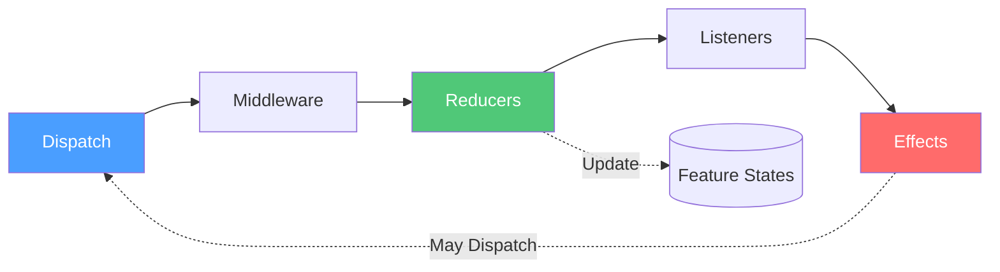
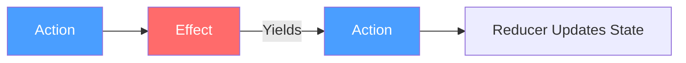

# Actions

Actions are the messages Reservoir processes to update state or run effects. They are the entry point for work handled by the store and its reducers/effects pipeline.
([IAction](https://github.com/Gibbs-Morris/mississippi/blob/main/src/Reservoir.Abstractions/Actions/IAction.cs),
[IStore](https://github.com/Gibbs-Morris/mississippi/blob/main/src/Reservoir.Abstractions/IStore.cs))

## What Is an Action?

An action is a simple, immutable message that represents an event that can trigger state changes or effects. Actions carry only the minimal data needed for reducers and effects to do their work.
([IAction](https://github.com/Gibbs-Morris/mississippi/blob/main/src/Reservoir.Abstractions/Actions/IAction.cs))

```csharp
// Example from Spring sample: a simple action with a payload
internal sealed record SetEntityIdAction(string EntityId) : IAction;
```

Actions implement the [`IAction`](https://github.com/Gibbs-Morris/mississippi/blob/main/src/Reservoir.Abstractions/Actions/IAction.cs) marker interface. The interface describes actions as immutable records that carry minimal data for reducers and effects.

## Why Actions?

Reservoir uses actions to drive state changes and side effects through the store pipeline. This makes it explicit when state can change and keeps reducers/effects focused on the data they receive.
([IStore](https://github.com/Gibbs-Morris/mississippi/blob/main/src/Reservoir.Abstractions/IStore.cs))

## Dispatching Actions

Actions are dispatched to the global [`IStore`](https://github.com/Gibbs-Morris/mississippi/blob/main/src/Reservoir.Abstractions/IStore.cs). The store is the central hub that coordinates all state management.

### From a Blazor Component

If your component inherits from [`StoreComponent`](https://github.com/Gibbs-Morris/mississippi/blob/main/src/Reservoir.Blazor/StoreComponent.cs), use the `Dispatch` method:

```csharp
public class MyComponent : StoreComponent
{
    private void HandleButtonClick()
    {
        Dispatch(new SetEntityIdAction("entity-123"));
    }
    
    private void HandleItemSelected(string itemId)
    {
        Dispatch(new SetEntityIdAction(itemId));
    }
}
```

### From Any Service

Inject `IStore` and call `Dispatch`:

```csharp
public class SelectionService
{
    private IStore Store { get; }
    
    public SelectionService(IStore store)
    {
        Store = store;
    }
    
    public void Select(string entityId)
    {
        Store.Dispatch(new SetEntityIdAction(entityId));
    }
}
```

## The Action Lifecycle

When you dispatch an action, it flows through the store's pipeline:



1. **Middleware** — The action flows through any registered middleware
2. **Reducers** — Synchronous state updates happen here
3. **Listeners** — Subscribers are notified after the action is processed
4. **Effects** — Asynchronous work runs last and can yield more actions

Multiple feature states can have reducers that respond to the same action because the store runs each feature's root reducer when an action is dispatched.
([Store.ReduceFeatureStates](https://github.com/Gibbs-Morris/mississippi/blob/main/src/Reservoir/Store.cs#L236-L271))

## Actions and Effects

Reservoir routes synchronous state changes through reducers and async side effects through action effects. Dispatch an action, and reducers update state immediately while effects handle async work and can dispatch additional actions.
([IStore](https://github.com/Gibbs-Morris/mississippi/blob/main/src/Reservoir.Abstractions/IStore.cs),
[IActionEffect](https://github.com/Gibbs-Morris/mississippi/blob/main/src/Reservoir.Abstractions/IActionEffect%7BTState%7D.cs))



This pattern keeps your components simple—they dispatch actions and render state. All the complex orchestration lives in effects.

## Keep Actions Lean

Actions should carry only the data needed for reducers and effects. The `IAction` documentation emphasizes minimal payloads to keep actions focused on intent.
([IAction](https://github.com/Gibbs-Morris/mississippi/blob/main/src/Reservoir.Abstractions/Actions/IAction.cs))

## Summary

- Actions are immutable records implementing `IAction`
- Dispatch actions to `IStore` to trigger state changes and effects
- Actions flow through middleware → reducers → listeners → effects
- Multiple feature states can respond to the same action

## Next Steps

- [Reducers](./reducers.md) — Learn how reducers transform state based on actions
- [Effects](./effects.md) — Handle async operations triggered by actions
- [Feature State](./feature-state.md) — Organize state into feature slices
- [Store](./store.md) — Understand the central hub that coordinates actions, reducers, and effects
