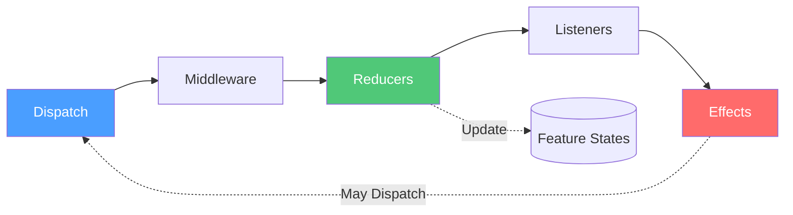
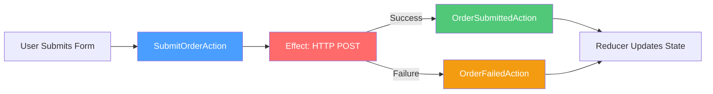

# Actions

Actions are the foundation of Reservoir's state management. Every state change in your application starts with an action.

## What Is an Action?

An action is a simple, immutable message that describes:

- **What happened** — a user clicked a button, a timer fired, a WebSocket message arrived
- **What you intend to do** — submit a form, fetch data, navigate to a page

Actions carry just enough data for reducers and effects to do their work. They don't contain logic—they're pure data.

```csharp
// A simple action with no payload
public sealed record RefreshDataAction : IAction;

// An action with data
public sealed record SelectItemAction(string ItemId) : IAction;

// An action with multiple parameters
public sealed record SubmitOrderAction(string CustomerId, decimal Total, IReadOnlyList<string> ItemIds) : IAction;
```

Actions implement the [`IAction`](https://github.com/Gibbs-Morris/mississippi/blob/main/src/Reservoir.Abstractions/Actions/IAction.cs) marker interface. That's it—no methods to implement, no base class required.

## Why Actions?

Actions provide a **single point of entry** for all state changes. This has several benefits:

| Benefit | Description |
|---------|-------------|
| **Traceability** | Every state change can be logged, debugged, or replayed |
| **Testability** | Actions are trivial to construct in unit tests |
| **Decoupling** | Components don't need to know *how* state changes—just *what* they want |
| **Predictability** | State changes are explicit, not hidden in component code |

## Dispatching Actions

Actions are dispatched to the global [`IStore`](https://github.com/Gibbs-Morris/mississippi/blob/main/src/Reservoir.Abstractions/IStore.cs). The store is the central hub that coordinates all state management.

### From a Blazor Component

If your component inherits from [`StoreComponent`](https://github.com/Gibbs-Morris/mississippi/blob/main/src/Reservoir.Blazor/StoreComponent.cs), use the `Dispatch` method:

```csharp
public class MyComponent : StoreComponent
{
    private void HandleButtonClick()
    {
        Dispatch(new RefreshDataAction());
    }
    
    private void HandleItemSelected(string itemId)
    {
        Dispatch(new SelectItemAction(itemId));
    }
}
```

### From Any Service

Inject `IStore` and call `Dispatch`:

```csharp
public class NavigationService
{
    private IStore Store { get; }
    
    public NavigationService(IStore store)
    {
        Store = store;
    }
    
    public void NavigateTo(string route)
    {
        Store.Dispatch(new NavigateAction(route));
    }
}
```

## The Action Lifecycle

When you dispatch an action, it flows through the store's pipeline:



1. **Middleware** — Cross-cutting concerns (logging, analytics) see the action first
2. **Reducers** — Synchronous state updates happen here
3. **Listeners** — UI components are notified to re-render
4. **Effects** — Asynchronous work (API calls, navigation) runs last

Multiple feature states can have reducers that respond to the same action. When you dispatch `RefreshDataAction`, both `UserState` and `ProductState` could update if they have matching reducers.

## Actions as the Default

In a well-structured Reservoir application, **everything goes through actions**:

| User Intent | Action Pattern |
|-------------|----------------|
| Click a button | Dispatch an action |
| Submit a form | Dispatch an action with form data |
| Call an API | Dispatch an action → Effect makes HTTP call → Effect dispatches result action |
| Handle WebSocket message | Dispatch an action with the message payload |
| Navigate | Dispatch a navigation action |

This means HTTP requests don't happen directly in components. Instead:



This pattern keeps your components simple—they dispatch actions and render state. All the complex orchestration lives in effects.

## Form Submission Example

Here's a practical example of capturing form data and dispatching an action:

```csharp
// The action carries the form data
public sealed record DepositFundsAction(string AccountId, decimal Amount) : IAction;

// The Blazor component
@inherits StoreComponent

<EditForm Model="@formModel" OnValidSubmit="@HandleSubmit">
    <DataAnnotationsValidator />
    
    <div>
        <label>Amount:</label>
        <InputNumber @bind-Value="formModel.Amount" />
        <ValidationMessage For="@(() => formModel.Amount)" />
    </div>
    
    <button type="submit" disabled="@IsSubmitting">
        @(IsSubmitting ? "Submitting..." : "Deposit")
    </button>
</EditForm>

@code {
    private DepositFormModel formModel = new();
    
    // Read submitting state from the store (covered in Feature State docs)
    private bool IsSubmitting => GetState<BankAccountState>().IsSubmitting;
    
    private void HandleSubmit()
    {
        // Dispatch the action with form data
        Dispatch(new DepositFundsAction(AccountId, formModel.Amount));
    }
    
    private class DepositFormModel
    {
        [Range(0.01, 1_000_000, ErrorMessage = "Amount must be positive")]
        public decimal Amount { get; set; }
    }
}
```

The component doesn't make HTTP calls or manage loading states directly. It:

1. Captures user input
2. Validates the form
3. Dispatches an action with the data
4. Reads state from the store to show loading/success/error UI

## Naming Conventions

Good action names describe **what happened** or **what you want**, not implementation details:

| ✅ Good | ❌ Avoid |
|---------|----------|
| `DepositFundsAction` | `CallDepositApiAction` |
| `UserLoggedInAction` | `SetUserStateAction` |
| `OrderSubmittedAction` | `UpdateOrderListAction` |
| `SearchQueryChangedAction` | `TriggerSearchEffectAction` |

### Action Families

For operations with lifecycle states, use a consistent naming pattern:

```csharp
// The initiating action (user intent)
public sealed record DepositFundsAction(string AccountId, decimal Amount) : IAction;

// The "in progress" action (dispatched by effect)
public sealed record DepositFundsExecutingAction(string CommandId, DateTimeOffset Timestamp) : IAction;

// The success action (dispatched by effect)
public sealed record DepositFundsSucceededAction(string CommandId, DateTimeOffset Timestamp) : IAction;

// The failure action (dispatched by effect)
public sealed record DepositFundsFailedAction(
    string CommandId,
    string? ErrorCode,
    string? ErrorMessage,
    DateTimeOffset Timestamp
) : IAction;
```

This pattern lets reducers update state at each stage (show spinner, hide spinner and show result).

## Keep Actions Lean

Actions should carry **only the data needed** for reducers and effects:

```csharp
// ✅ Good: carries just what's needed
public sealed record SelectItemAction(string ItemId) : IAction;

// ❌ Avoid: carrying entire domain objects
public sealed record SelectItemAction(Item FullItemObject) : IAction;
```

If reducers or effects need more data, they can look it up from state or fetch it. Actions should be lightweight and serializable.

## Summary

- Actions are immutable records implementing `IAction`
- Dispatch actions to `IStore` to trigger state changes
- Actions flow through middleware → reducers → listeners → effects
- Multiple feature states can respond to the same action
- Use actions for *everything*—including API calls (via effects)
- Name actions after what happened, not how it's implemented

## Next Steps

Detailed documentation for related components is coming soon:

- **Action Reducers** — Learn how reducers transform state based on actions
- **Action Effects** — Handle async operations triggered by actions
- **Feature State** — Organize state into feature slices
