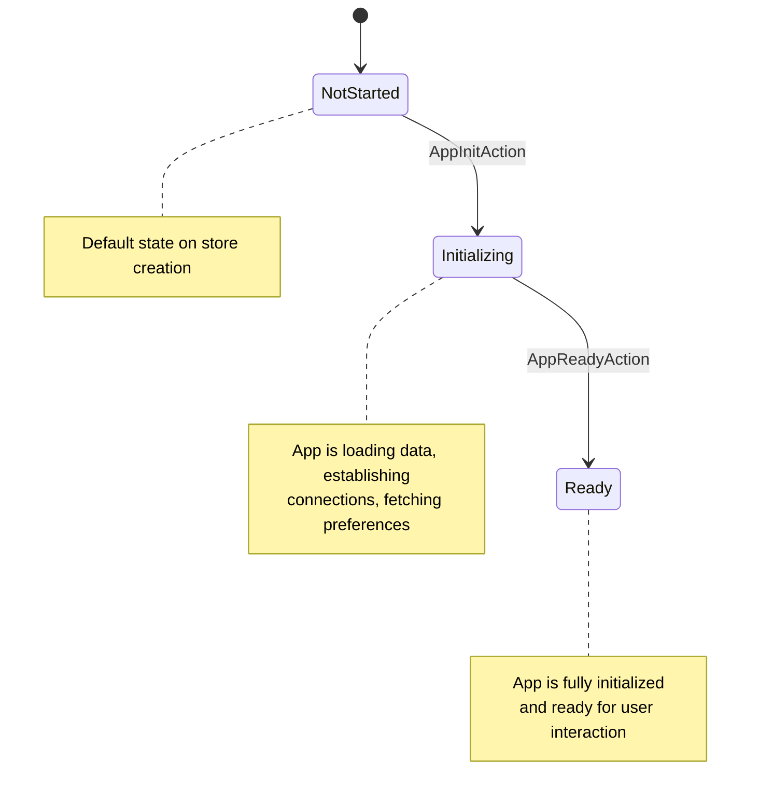

# Built-in Lifecycle

## Overview

The built-in lifecycle feature provides Redux-style application lifecycle state management for Blazor applications. It tracks initialization phases in the store, enabling components to show loading states, prevent user interaction during startup, and measure initialization performance.

## Quick Start

### 1. Register the Feature

```csharp
// Program.cs
builder.Services.AddReservoir();
builder.Services.AddReservoirBlazorBuiltIns(); // Registers navigation + lifecycle
```

Or register lifecycle only:

```csharp
builder.Services.AddReservoir();
builder.Services.AddBuiltInLifecycle();
```

### 2. Dispatch Lifecycle Actions

In your root component (e.g., `MainLayout.razor.cs`):

```csharp
public partial class MainLayout : StoreComponent
{
    [Inject]
    private TimeProvider TimeProvider { get; set; } = default!;
    
    protected override void OnInitialized()
    {
        base.OnInitialized();
        Dispatch(new AppInitAction(TimeProvider.GetUtcNow()));
    }
    
    protected override async Task OnInitializedAsync()
    {
        // Replace with your initialization tasks (load preferences, establish connections, etc.)
        await Task.CompletedTask;
        Dispatch(new AppReadyAction(TimeProvider.GetUtcNow()));
    }
}
```

### 3. React to Lifecycle State

```csharp
public class LoadingOverlay : StoreComponent
{
    private LifecycleState Lifecycle => GetState<LifecycleState>();
    
    protected override void BuildRenderTree(RenderTreeBuilder builder)
    {
        if (Lifecycle.Phase != LifecyclePhase.Ready)
        {
            builder.OpenElement(0, "div");
            builder.AddAttribute(1, "class", "loading-overlay");
            builder.AddContent(2, "Loading...");
            builder.CloseElement();
        }
    }
}
```

## How It Works



1. **NotStarted** — Initial state when the store is created
2. **Initializing** — Entered when `AppInitAction` is dispatched
3. **Ready** — Entered when `AppReadyAction` is dispatched

## Lifecycle Actions

### AppInitAction

Dispatched when the application begins initialization.

```csharp
// In your root component's OnInitialized
Dispatch(new AppInitAction(TimeProvider.GetUtcNow()));
```

| Parameter | Type | Description |
|-----------|------|-------------|
| `InitializedAt` | `DateTimeOffset` | Timestamp when initialization began |

The reducer sets:

- `Phase` → `LifecyclePhase.Initializing`
- `InitializedAt` → the provided timestamp

### AppReadyAction

Dispatched when the application has completed initialization.

```csharp
// After all initialization tasks complete
// Replace with your initialization tasks (load preferences, establish connections, etc.)
await Task.CompletedTask;
Dispatch(new AppReadyAction(TimeProvider.GetUtcNow()));
```

| Parameter | Type | Description |
|-----------|------|-------------|
| `ReadyAt` | `DateTimeOffset` | Timestamp when the app became ready |

The reducer sets:

- `Phase` → `LifecyclePhase.Ready`
- `ReadyAt` → the provided timestamp

## LifecycleState

The [`LifecycleState`](https://github.com/Gibbs-Morris/mississippi/blob/main/src/Reservoir.Blazor/BuiltIn/Lifecycle/State/LifecycleState.cs) feature state tracks lifecycle information:

```csharp
public sealed record LifecycleState : IFeatureState
{
    public static string FeatureKey => "reservoir:lifecycle";
    
    public LifecyclePhase Phase { get; init; } = LifecyclePhase.NotStarted;
    public DateTimeOffset? InitializedAt { get; init; }
    public DateTimeOffset? ReadyAt { get; init; }
}
```

| Property | Description |
|----------|-------------|
| `Phase` | Current lifecycle phase (`NotStarted`, `Initializing`, `Ready`) |
| `InitializedAt` | Timestamp when `AppInitAction` was dispatched |
| `ReadyAt` | Timestamp when `AppReadyAction` was dispatched |

### LifecyclePhase Enum

```csharp
public enum LifecyclePhase
{
    NotStarted = 0,   // App has not started initialization
    Initializing = 1, // App is currently initializing
    Ready = 2         // App is ready for user interaction
}
```

## Common Patterns

### Loading Overlay

Show a loading overlay until the app is ready:

```razor
@inherits StoreComponent

@if (Lifecycle.Phase != LifecyclePhase.Ready)
{
    <div class="loading-overlay">
        <div class="spinner"></div>
        <p>Loading application...</p>
    </div>
}

@code {
    private LifecycleState Lifecycle => GetState<LifecycleState>();
}
```

### Disabled Interactions

Prevent button clicks during initialization:

```razor
@inherits StoreComponent

<button disabled="@(!IsReady)" @onclick="HandleClick">
    Submit
</button>

@code {
    private bool IsReady => GetState<LifecycleState>().Phase == LifecyclePhase.Ready;
    
    private void HandleClick()
    {
        // Only reachable when ready
    }
}
```

### Initialization Performance Metrics

Calculate startup time:

```csharp
public class PerformanceMonitor : StoreComponent
{
    private LifecycleState Lifecycle => GetState<LifecycleState>();
    
    private TimeSpan? StartupDuration =>
        Lifecycle is { InitializedAt: { } init, ReadyAt: { } ready }
            ? ready - init
            : null;
    
    protected override void OnAfterRender(bool firstRender)
    {
        if (firstRender && StartupDuration.HasValue)
        {
            Logger.LogInformation(
                "App startup completed in {Duration}ms",
                StartupDuration.Value.TotalMilliseconds);
        }
    }
}
```

### Conditional Feature Loading

Load features only after the app is ready:

```csharp
public class AnalyticsEffect : IActionEffect<LifecycleState>
{
    public bool CanHandle(IAction action) => action is AppReadyAction;
    
    public async IAsyncEnumerable<IAction> HandleAsync(
        IAction action,
        LifecycleState currentState,
        [EnumeratorCancellation] CancellationToken cancellationToken)
    {
        // Start analytics tracking after app is ready
        await InitializeAnalyticsAsync();
        yield break;
    }
}
```

## Why Caller-Supplied Timestamps?

The lifecycle actions require the caller to provide timestamps rather than generating them internally. This design choice ensures:

1. **Pure Reducers** — Reducers remain pure functions (no side effects like reading system time)
2. **Testability** — Tests can provide deterministic timestamps via `FakeTimeProvider`
3. **Consistency** — Timestamps align with your app's time source (useful for distributed systems)

```csharp
// Production code (inject TimeProvider)
[Inject]
private TimeProvider TimeProvider { get; set; } = default!;

Dispatch(new AppInitAction(TimeProvider.GetUtcNow()));

// Test code with deterministic time
var fakeTime = new FakeTimeProvider(new DateTimeOffset(2024, 1, 1, 12, 0, 0, TimeSpan.Zero));
Dispatch(new AppInitAction(fakeTime.GetUtcNow()));
```

## Testing Lifecycle

Use the [`StoreTestHarness`](https://github.com/Gibbs-Morris/mississippi/blob/main/src/Reservoir.Testing/StoreTestHarness.cs) for unit testing lifecycle reducers:

```csharp
[Fact]
public void AppInitAction_TransitionsToInitializing()
{
    // Arrange
    var timestamp = new DateTimeOffset(2024, 1, 15, 10, 30, 0, TimeSpan.Zero);
    var harness = StoreTestHarnessFactory.ForFeature<LifecycleState>()
        .WithReducer<AppInitAction>(LifecycleReducers.OnAppInit);
    
    // Act & Assert
    harness.CreateScenario()
        .Given(new LifecycleState())
        .When(new AppInitAction(timestamp))
        .ThenState(state =>
        {
            state.Phase.Should().Be(LifecyclePhase.Initializing);
            state.InitializedAt.Should().Be(timestamp);
        });
}

[Fact]
public void AppReadyAction_TransitionsToReady()
{
    // Arrange
    var initTime = new DateTimeOffset(2024, 1, 15, 10, 30, 0, TimeSpan.Zero);
    var readyTime = new DateTimeOffset(2024, 1, 15, 10, 30, 2, TimeSpan.Zero);
    
    var harness = StoreTestHarnessFactory.ForFeature<LifecycleState>()
        .WithReducer<AppInitAction>(LifecycleReducers.OnAppInit)
        .WithReducer<AppReadyAction>(LifecycleReducers.OnAppReady);
    
    // Act & Assert
    harness.CreateScenario()
        .Given(new LifecycleState())
        .When(new AppInitAction(initTime))
        .When(new AppReadyAction(readyTime))
        .ThenState(state =>
        {
            state.Phase.Should().Be(LifecyclePhase.Ready);
            state.InitializedAt.Should().Be(initTime);
            state.ReadyAt.Should().Be(readyTime);
        });
}
```

## Related Documentation

- [Reservoir Overview](reservoir.md) — Core concepts
- [Actions](actions.md) — Action fundamentals
- [Reducers](reducers.md) — State transitions
- [Built-in Navigation](built-in-navigation.md) — Navigation state management
