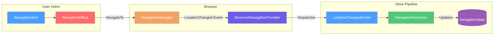

# Built-in Navigation

## Overview

The built-in navigation feature provides Redux-style navigation state management for Blazor applications. It tracks navigation history in the store, allowing components to react to route changes and enabling programmatic navigation through dispatched actions.

## Quick Start

### 1. Register the Feature

```csharp
// Program.cs
builder.Services.AddReservoir();
builder.Services.AddReservoirBlazorBuiltIns(); // Registers navigation + lifecycle
```

Or register navigation only:

```csharp
builder.Services.AddReservoir();
builder.Services.AddBuiltInNavigation();
```

### 2. Add the Navigation Provider

Add the [`ReservoirNavigationProvider`](https://github.com/Gibbs-Morris/mississippi/blob/main/src/Reservoir.Blazor/BuiltIn/Components/ReservoirNavigationProvider.razor) component to your `App.razor`:

```razor
@using Mississippi.Reservoir.Blazor.BuiltIn.Components
<ReservoirNavigationProvider />

<Router AppAssembly="@typeof(App).Assembly">
    <!-- ... -->
</Router>
```

This component subscribes to Blazor's `NavigationManager.LocationChanged` event and dispatches [`LocationChangedAction`](https://github.com/Gibbs-Morris/mississippi/blob/main/src/Reservoir.Blazor/BuiltIn/Navigation/Actions/LocationChangedAction.cs) automatically.

### 3. Navigate via Actions

```csharp
public class MyComponent : StoreComponent
{
    private void HandleNavigation()
    {
        // Navigate to a new page (pushes history entry)
        Dispatch(new NavigateAction("/dashboard"));
    }
}
```

## How It Works



1. **User dispatches a navigation action** (e.g., `NavigateAction`)
2. **NavigationEffect handles the action** by calling `NavigationManager.NavigateTo()`
3. **Browser navigation occurs** and Blazor fires `LocationChanged` event
4. **ReservoirNavigationProvider receives the event** and dispatches `LocationChangedAction`
5. **Reducer updates NavigationState** with the new URI

## Navigation Actions

### NavigateAction

Navigates to a new URI, pushing a new entry onto the browser history stack.

```csharp
// Basic navigation
Dispatch(new NavigateAction("/products"));

// Force full page reload
Dispatch(new NavigateAction("/products", ForceLoad: true));
```

| Parameter | Type | Default | Description |
|-----------|------|---------|-------------|
| `Uri` | `string` | required | The URI to navigate to (relative or same-origin absolute) |
| `ForceLoad` | `bool` | `false` | If true, bypasses client-side routing and forces server reload |

### ReplaceRouteAction

Replaces the current URI in browser history instead of pushing a new entry.

```csharp
// Replace current history entry (back button won't return here)
Dispatch(new ReplaceRouteAction("/checkout/complete"));

// Common use: redirect after form submission
Dispatch(new ReplaceRouteAction("/success", ForceLoad: false));
```

Use cases:
- Redirecting after form submission without allowing "back" to the form
- Updating query parameters for filtering without polluting history
- Correcting a URL after initial navigation

### SetQueryParamsAction

Updates query string parameters on the current URI.

```csharp
// Add or update parameters
Dispatch(new SetQueryParamsAction(
    new Dictionary<string, object?>
    {
        ["page"] = 2,
        ["sort"] = "name"
    }));

// Remove a parameter by setting to null
Dispatch(new SetQueryParamsAction(
    new Dictionary<string, object?>
    {
        ["filter"] = null  // Removes 'filter' from query string
    }));

// Push to history instead of replace
Dispatch(new SetQueryParamsAction(parameters, ReplaceHistory: false));
```

| Parameter | Type | Default | Description |
|-----------|------|---------|-------------|
| `Parameters` | `IReadOnlyDictionary<string, object?>` | required | Query parameters to set (null removes) |
| `ReplaceHistory` | `bool` | `true` | If true, replaces history entry |

### ScrollToAnchorAction

Scrolls to a named anchor element on the current page.

```csharp
// Scroll to element with id="section-2"
Dispatch(new ScrollToAnchorAction("section-2"));

// Replace history entry while scrolling
Dispatch(new ScrollToAnchorAction("section-2", ReplaceHistory: true));
```

This uses Blazor's built-in fragment navigation—no JavaScript interop required.

### LocationChangedAction

Dispatched automatically by `ReservoirNavigationProvider` when navigation completes. You typically don't dispatch this yourself, but you can listen for it in effects.

```csharp
// In an effect - react to any navigation
public bool CanHandle(IAction action) => action is LocationChangedAction;

public async IAsyncEnumerable<IAction> HandleAsync(
    IAction action,
    NavigationState currentState,
    CancellationToken cancellationToken)
{
    if (action is LocationChangedAction { Location: var uri })
    {
        // Track page view, log analytics, etc.
        await TrackPageViewAsync(uri);
    }
    yield break;
}
```

## NavigationState

The [`NavigationState`](https://github.com/Gibbs-Morris/mississippi/blob/main/src/Reservoir.Blazor/BuiltIn/Navigation/State/NavigationState.cs) feature state tracks navigation information:

```csharp
public sealed record NavigationState : IFeatureState
{
    public static string FeatureKey => "reservoir:navigation";
    
    public string? CurrentUri { get; init; }
    public string? PreviousUri { get; init; }
    public bool IsNavigationIntercepted { get; init; }
    public int NavigationCount { get; init; }
}
```

| Property | Description |
|----------|-------------|
| `CurrentUri` | The current absolute URI |
| `PreviousUri` | The previous URI before the last navigation |
| `IsNavigationIntercepted` | True if Blazor intercepted navigation from a link click |
| `NavigationCount` | Number of navigations since store initialization |

### Reading Navigation State

```csharp
public class BreadcrumbComponent : StoreComponent
{
    private NavigationState Navigation => GetState<NavigationState>();
    
    protected override void BuildRenderTree(RenderTreeBuilder builder)
    {
        // Display current route
        builder.AddContent(0, $"Current: {Navigation.CurrentUri}");
        
        // Show back link if there's history
        if (Navigation.PreviousUri is not null)
        {
            builder.AddContent(1, $" | Previous: {Navigation.PreviousUri}");
        }
    }
}
```

## Security Considerations

The navigation effect validates that URIs are same-origin before navigating. External URLs are not supported by the navigation actions—use standard HTML anchors with `target="_blank"` for external links:

```razor
<!-- For external links, use standard HTML -->
<a href="https://external-site.com/docs" target="_blank" rel="noopener noreferrer">
    External Documentation
</a>

<!-- For internal navigation, use actions -->
<button @onclick="@(() => Dispatch(new NavigateAction("/internal-page")))">
    Go to Internal Page
</button>
```

## Testing Navigation

Use the [`StoreTestHarness`](https://github.com/Gibbs-Morris/mississippi/blob/main/src/Reservoir.Testing/StoreTestHarness.cs) for unit testing navigation reducers:

```csharp
[Fact]
public void LocationChangedAction_UpdatesCurrentUri()
{
    // Arrange
    var harness = StoreTestHarnessFactory.ForFeature<NavigationState>()
        .WithReducer<LocationChangedAction>(NavigationReducers.OnLocationChanged);
    
    // Act & Assert
    harness.CreateScenario()
        .Given(new NavigationState())
        .When(new LocationChangedAction("https://example.com/products", false))
        .ThenState(state =>
        {
            state.CurrentUri.Should().Be("https://example.com/products");
            state.NavigationCount.Should().Be(1);
        });
}
```

## Related Documentation

- [Reservoir Overview](reservoir.md) — Core concepts
- [Actions](actions.md) — Action fundamentals
- [Effects](effects.md) — Handling side effects
- [Built-in Lifecycle](built-in-lifecycle.md) — Application lifecycle management
