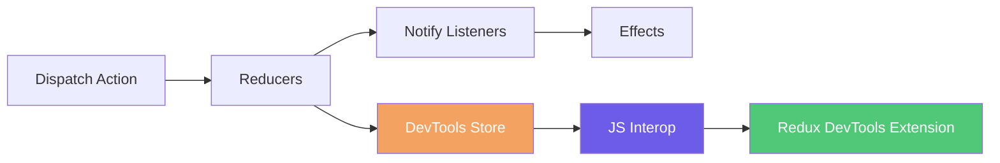

# Redux DevTools Integration

## Overview

Reservoir provides opt-in integration with the [Redux DevTools](https://github.com/reduxjs/redux-devtools) browser extension. When enabled, the DevTools integration reports all dispatched actions and state snapshots, enabling time-travel debugging, state inspection, and action replay.

This page covers registration, configuration options, enablement modes, and the strict time-travel rehydration feature.

## Quick Start

### 1. Register DevTools

Register DevTools after `AddReservoir()` in your `Program.cs`:

```csharp
builder.Services.AddReservoir();
builder.Services.AddReservoirDevTools(options =>
{
    options.Enablement = ReservoirDevToolsEnablement.DevelopmentOnly;
});
```

([ReservoirDevToolsRegistrations.AddReservoirDevTools](https://github.com/Gibbs-Morris/mississippi/blob/main/src/Reservoir.Blazor/ReservoirDevToolsRegistrations.cs#L22-L47))

### 2. Install the Browser Extension

Install the Redux DevTools extension for your browser:

- [Chrome](https://chrome.google.com/webstore/detail/redux-devtools/lmhkpmbekcpmknklioeibfkpmmfibljd)
- [Firefox](https://addons.mozilla.org/en-US/firefox/addon/reduxdevtools/)
- [Edge](https://microsoftedge.microsoft.com/addons/detail/redux-devtools/nnkgneoiohoecpdiaponcejilbhhikei)

### 3. Run Your Application

Open DevTools in your browser and navigate to the Redux tab. You will see actions and state as they are dispatched.

## Enablement Modes

DevTools integration is disabled by default. Use the `Enablement` property to control when integration is active.

### ReservoirDevToolsEnablement Values

```csharp
public enum ReservoirDevToolsEnablement
{
    Off = 0,            // DevTools integration is disabled (default)
    DevelopmentOnly = 1, // Enabled only when IHostEnvironment.IsDevelopment() returns true
    Always = 2,          // Enabled in all environments
}
```

| Value | Behavior |
|-------|----------|
| `Off` | DevTools integration is disabled. No JavaScript interop occurs. This is the default. |
| `DevelopmentOnly` | DevTools integration is enabled only when `IHostEnvironment.IsDevelopment()` returns `true`. Recommended for most applications. |
| `Always` | DevTools integration is enabled in all environments including production. Use with caution. |

([ReservoirDevToolsEnablement](https://github.com/Gibbs-Morris/mississippi/blob/main/src/Reservoir.Blazor/ReservoirDevToolsOptions.cs#L80-L98))

### Example

```csharp
builder.Services.AddReservoirDevTools(options =>
{
    // Only enable in development
    options.Enablement = ReservoirDevToolsEnablement.DevelopmentOnly;
});
```

:::warning
Enabling DevTools in production environments exposes application state to users with browser DevTools access. Use `DevelopmentOnly` or `Off` for production deployments.
:::

## Configuration Options

The `ReservoirDevToolsOptions` class provides configuration for the DevTools integration:

| Option | Type | Default | Description |
|--------|------|---------|-------------|
| `Enablement` | [`ReservoirDevToolsEnablement`](#reservoirdevtoolsenablement-values) | `Off` | Controls when DevTools integration is active. See [Enablement Modes](#enablement-modes). |
| `Name` | `string?` | `null` | Instance name shown in DevTools dropdown when multiple instances exist. |
| `MaxAge` | `int?` | `null` | Maximum number of actions to retain in history. When exceeded, oldest actions are removed. |
| `Latency` | `int?` | `null` | Batching latency in milliseconds. Actions dispatched within this window are batched together. |
| `AutoPause` | `bool?` | `null` | When `true`, pauses recording when DevTools window is not open to reduce overhead. |
| `IsStrictStateRehydrationEnabled` | `bool` | `false` | When `true`, time-travel rejects payloads missing any feature state. See [Strict State Rehydration](#strict-state-rehydration). |
| `ActionSanitizer` | `Func<IAction, object?>?` | `null` | Transform actions before sending. Return `null` to use default serialization. See [Sanitizers](#sanitizers). |
| `StateSanitizer` | `Func<IReadOnlyDictionary<string, object>, object?>?` | `null` | Transform state snapshot before sending. Return `null` to use original. See [Sanitizers](#sanitizers). |

([ReservoirDevToolsOptions](https://github.com/Gibbs-Morris/mississippi/blob/main/src/Reservoir.Blazor/ReservoirDevToolsOptions.cs#L14-L76))

### Example Configuration

```csharp
builder.Services.AddReservoirDevTools(options =>
{
    options.Enablement = ReservoirDevToolsEnablement.DevelopmentOnly;
    options.Name = "My Blazor App";
    options.MaxAge = 50;
});
```

## How It Works

When DevTools integration is enabled, `AddReservoirDevTools` replaces the default `IStore` registration with `ReservoirDevToolsStore`. This store extends the base `Store` and reports actions and state to the Redux DevTools extension via JavaScript interop.



([ReservoirDevToolsStore](https://github.com/Gibbs-Morris/mississippi/blob/main/src/Reservoir.Blazor/ReservoirDevToolsStore.cs#L21-L479))

## Time-Travel Debugging

Redux DevTools supports time-travel debugging, allowing you to jump to previous states, reset, rollback, and import/export state. When you perform these operations in DevTools, the store receives messages and updates its state accordingly.

### Supported Operations

| Operation | Description |
|-----------|-------------|
| **Jump to State** | Navigate to a specific point in action history |
| **Reset** | Return to the initial state |
| **Rollback** | Return to the last committed state |
| **Commit** | Mark current state as the new baseline |
| **Import** | Load state from an exported JSON file |

## Strict State Rehydration

By default, time-travel operations use best-effort rehydration: if a feature state is missing from the incoming payload or fails deserialization, that feature is skipped and the rest are applied. This behavior is forgiving but can lead to inconsistent state.

Enable strict mode to require all registered feature states to be present and valid in the incoming payload:

```csharp
builder.Services.AddReservoirDevTools(options =>
{
    options.Enablement = ReservoirDevToolsEnablement.DevelopmentOnly;
    options.IsStrictStateRehydrationEnabled = true;
});
```

### Strict Mode Behavior

When `IsStrictStateRehydrationEnabled` is `true`:

- Time-travel operations (jump, reset, import) succeed only if ALL registered feature states can be deserialized from the payload
- If any feature state is missing or fails deserialization, the entire operation is rejected
- The current state remains unchanged when rejection occurs

When `IsStrictStateRehydrationEnabled` is `false` (default):

- Missing features are skipped
- Features that fail deserialization are skipped
- Successfully deserialized features are applied

([ReservoirDevToolsStore.ReplaceStateFromJsonDocument](https://github.com/Gibbs-Morris/mississippi/blob/main/src/Reservoir.Blazor/ReservoirDevToolsStore.cs#L330-L395))

### When to Use Strict Mode

Use strict mode when:

- Your application requires all feature states to be in sync
- You want to prevent partial state application that could cause inconsistencies
- You are debugging issues where partial rehydration masks problems

Use best-effort mode (default) when:

- You want maximum flexibility during development
- Your feature states are independently valid
- You are iterating quickly and feature state schemas may change

## Sanitizers

Use sanitizers to transform actions or state before sending to DevTools. This is useful for removing sensitive data (passwords, tokens, PII) or reducing payload size for large states.

### Delegate Signatures

```csharp
// ActionSanitizer: Transform an action before sending to DevTools
Func<IAction, object?>? ActionSanitizer

// StateSanitizer: Transform the state snapshot before sending to DevTools
Func<IReadOnlyDictionary<string, object>, object?>? StateSanitizer
```

### Return Value Semantics

| Return Value | Behavior |
|--------------|----------|
| `null` | Use default serialization (action or state is sent as-is) |
| Any object | The returned object is serialized and sent instead |

### Action Sanitizer

Receives each dispatched `IAction` and can return a replacement object for DevTools display:

```csharp
builder.Services.AddReservoirDevTools(options =>
{
    options.ActionSanitizer = action =>
    {
        // Redact sensitive fields from specific action types
        if (action is LoginAction login)
        {
            return new { type = "LoginAction", username = login.Username, password = "***" };
        }
        
        // Return null to use default serialization for other actions
        return null;
    };
});
```

### State Sanitizer

Receives the full state snapshot (keyed by feature key) and can return a modified snapshot:

```csharp
builder.Services.AddReservoirDevTools(options =>
{
    options.StateSanitizer = state =>
    {
        // Remove entire feature states containing sensitive data
        var sanitized = new Dictionary<string, object>(state);
        sanitized.Remove("auth");
        sanitized.Remove("userProfile");
        return sanitized;
    };
});
```

:::tip
Sanitizers run on every action dispatch. Keep them fast to avoid impacting application performance. Consider caching sanitizer logic or using pattern matching for efficiency.
:::

## Summary

| Concept | Description |
|---------|-------------|
| **Registration** | `AddReservoirDevTools()` after `AddReservoir()` |
| **Enablement** | `Off` (default), `DevelopmentOnly`, or `Always` |
| **Strict mode** | `IsStrictStateRehydrationEnabled` requires all features in time-travel payloads |
| **Sanitizers** | Transform actions/state before sending to DevTools |
| **Time-travel** | Jump, reset, rollback, commit, and import operations are supported |

## Next Steps

- [Store](./store.md) — Understand the central hub that DevTools extends
- [Reservoir Overview](./reservoir.md) — Learn the dispatch pipeline that DevTools observes
- [Testing](./testing.md) — Test reducers and effects without DevTools
