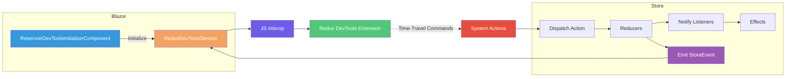
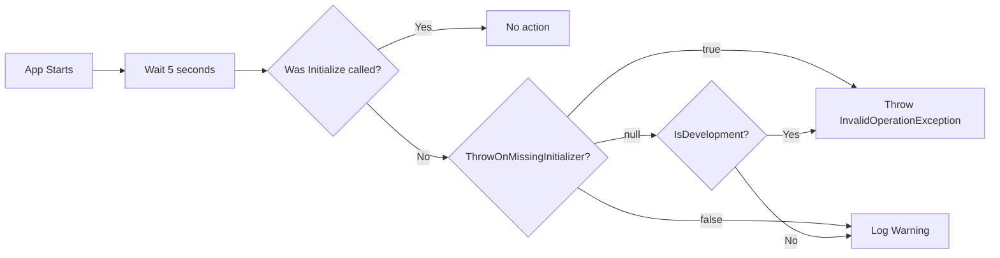

# Redux DevTools Integration

## Overview

Reservoir provides opt-in integration with the [Redux DevTools](https://github.com/reduxjs/redux-devtools) browser extension. When enabled, a background service observes all dispatched actions and state changes, reporting them to DevTools for time-travel debugging, state inspection, and action replay.

This page covers registration, configuration options, enablement modes, the composition architecture, and the strict time-travel rehydration feature.

## Quick Start

### 1. Register DevTools

Register DevTools after `mississippi.AddReservoir()` in your `Program.cs`:

```csharp
IMississippiClientBuilder mississippi = builder.AddMississippiClient();
IReservoirBuilder reservoir = mississippi.AddReservoir();
reservoir.AddReservoirDevTools(options =>
{
    options.Enablement = ReservoirDevToolsEnablement.DevelopmentOnly;
});
```

([ReservoirDevToolsRegistrations.AddReservoirDevTools](https://github.com/Gibbs-Morris/mississippi/blob/main/src/Reservoir.Blazor/ReservoirDevToolsRegistrations.cs#L45-L73))

### 2. Add the Initializer Component

Add `ReservoirDevToolsInitializerComponent` to your `App.razor`:

```razor
@using Mississippi.Reservoir.Blazor

<ReservoirDevToolsInitializerComponent/>

<Router AppAssembly="@typeof(App).Assembly">
    <!-- ... -->
</Router>
```

:::important
This step is required. The component calls `Initialize()` after the Blazor rendering context is available. Without it, DevTools will not connect.
:::

([ReservoirDevToolsInitializerComponent](https://github.com/Gibbs-Morris/mississippi/blob/main/src/Reservoir.Blazor/ReservoirDevToolsInitializerComponent.razor))

### 3. Install the Browser Extension

Install the Redux DevTools extension for your browser:

- [Chrome](https://chrome.google.com/webstore/detail/redux-devtools/lmhkpmbekcpmknklioeibfkpmmfibljd)
- [Firefox](https://addons.mozilla.org/en-US/firefox/addon/reduxdevtools/)
- [Edge](https://microsoftedge.microsoft.com/addons/detail/redux-devtools/nnkgneoiohoecpdiaponcejilbhhikei)

### 4. Run Your Application

Open DevTools in your browser and navigate to the Redux tab. You will see actions and state as they are dispatched.

All examples below assume an `IReservoirBuilder` named `reservoir` created via `builder.AddMississippiClient().AddReservoir()`.

## Enablement Modes

DevTools integration is disabled by default. Use the `Enablement` property to control when integration is active.

### ReservoirDevToolsEnablement Values

```csharp
public enum ReservoirDevToolsEnablement
{
    Off = 0,            // DevTools integration is disabled (default)
    DevelopmentOnly = 1, // Enabled only when IHostEnvironment.IsDevelopment() returns true
    Always = 2,          // Enabled in all environments
}
```

| Value | Behavior |
|-------|----------|
| `Off` | DevTools integration is disabled. No JavaScript interop occurs. This is the default. |
| `DevelopmentOnly` | DevTools integration is enabled only when `IHostEnvironment.IsDevelopment()` returns `true`. Recommended for most applications. |
| `Always` | DevTools integration is enabled in all environments including production. Use with caution. |

([ReservoirDevToolsEnablement](https://github.com/Gibbs-Morris/mississippi/blob/main/src/Reservoir.Blazor/ReservoirDevToolsOptions.cs#L85-L107))

### Example

```csharp
reservoir.AddReservoirDevTools(options =>
{
    // Only enable in development
    options.Enablement = ReservoirDevToolsEnablement.DevelopmentOnly;
});
```

:::warning
Enabling DevTools in production environments exposes application state to users with browser DevTools access. Use `DevelopmentOnly` or `Off` for production deployments.
:::

## Configuration Options

The `ReservoirDevToolsOptions` class provides configuration for the DevTools integration:

| Option | Type | Default | Description |
|--------|------|---------|-------------|
| `Enablement` | [`ReservoirDevToolsEnablement`](#reservoirdevtoolsenablement-values) | `Off` | Controls when DevTools integration is active. See [Enablement Modes](#enablement-modes). |
| `Name` | `string?` | `null` | Instance name shown in DevTools dropdown when multiple instances exist. |
| `MaxAge` | `int?` | `null` | Maximum number of actions to retain in history. When exceeded, oldest actions are removed. |
| `Latency` | `int?` | `null` | Batching latency in milliseconds. Actions dispatched within this window are batched together. |
| `AutoPause` | `bool?` | `null` | When `true`, pauses recording when DevTools window is not open to reduce overhead. |
| `IsStrictStateRehydrationEnabled` | `bool` | `false` | When `true`, time-travel rejects payloads missing any feature state. See [Strict State Rehydration](#strict-state-rehydration). |
| `ThrowOnMissingInitializer` | `bool?` | `null` | Controls error handling when the initializer component is missing. See [Missing Component Detection](#missing-component-detection). |
| `ActionSanitizer` | `Func<IAction, object?>?` | `null` | Transform actions before sending. Return `null` to use default serialization. See [Sanitizers](#sanitizers). |
| `StateSanitizer` | `Func<IReadOnlyDictionary<string, object>, object?>?` | `null` | Transform state snapshot before sending. Return `null` to use original. See [Sanitizers](#sanitizers). |

([ReservoirDevToolsOptions](https://github.com/Gibbs-Morris/mississippi/blob/main/src/Reservoir.Blazor/ReservoirDevToolsOptions.cs#L14-L91))

### Example Configuration

```csharp
reservoir.AddReservoirDevTools(options =>
{
    options.Enablement = ReservoirDevToolsEnablement.DevelopmentOnly;
    options.Name = "My Blazor App";
    options.MaxAge = 50;
});
```

## How It Works

DevTools integration uses composition rather than inheritance. When enabled, `AddReservoirDevTools` registers `ReduxDevToolsService` as a **scoped service** that subscribes to [`IStore.StoreEvents`](./store.md#observable-store-events). The service is initialized via `ReservoirDevToolsInitializerComponent`, which calls `Initialize()` after the Blazor rendering context is available. This approach keeps the store implementation unchanged while allowing external integrations to observe its activity.



### Scoped Service Lifetime

`ReduxDevToolsService` is registered as a **scoped service** to match the lifetime of `IStore`. In Blazor WebAssembly, scoped services are effectively singletons (one scope for the application lifetime). In Blazor Server, each circuit gets its own scope with its own store and DevTools instance.

### Initialization via Component

The `ReservoirDevToolsInitializerComponent` is a renderless Blazor component that:

1. Calls `Initialize()` on first render (when JS interop is available)
2. Calls `Stop()` on disposal to unsubscribe from store events

This design ensures DevTools connects only after the Blazor rendering context is ready, avoiding JavaScript interop errors during server prerendering.

### Connection Logging

When DevTools connects successfully, `ReduxDevToolsService` logs at `Information` level:

> Redux DevTools connected successfully.

If connection fails (e.g., the browser extension is not installed), a `Warning` is logged:

> Failed to connect to Redux DevTools. Ensure the Redux DevTools browser extension is installed and the page is open in a supported browser.

([DevToolsLoggerExtensions](https://github.com/Gibbs-Morris/mississippi/blob/main/src/Reservoir.Blazor/DevToolsLoggerExtensions.cs#L39-L56))

## Missing Component Detection

Reservoir includes a hosted service that detects when DevTools is enabled but the initializer component is missing. This prevents silent failures where DevTools appears to be configured but never connects.

### How Detection Works

After startup, `DevToolsInitializationCheckerService` waits 5 seconds and checks whether `Initialize()` was called. If DevTools is enabled (not `Off`) and initialization has not occurred, the service either throws an exception or logs a warning depending on configuration.



### ThrowOnMissingInitializer Behavior

| Value | Behavior |
|-------|----------|
| `null` (default) | Throws in Development environments; logs a warning in Production. |
| `true` | Always throws an `InvalidOperationException`. |
| `false` | Always logs a warning without throwing. |

### Configuration Example

```csharp
reservoir.AddReservoirDevTools(options =>
{
    options.Enablement = ReservoirDevToolsEnablement.DevelopmentOnly;
    
    // Explicitly control missing-component behavior
    options.ThrowOnMissingInitializer = true; // Always throw
});
```

:::tip
Leave `ThrowOnMissingInitializer` at its default (`null`) to get fail-fast behavior during development while avoiding runtime exceptions in production.
:::

([DevToolsInitializationCheckerService](https://github.com/Gibbs-Morris/mississippi/blob/main/src/Reservoir.Blazor/DevToolsInitializationCheckerService.cs))

### Composition Pattern

1. **Store emits events**: The store publishes [`StoreEventBase`](./store.md#store-event-types) events through `IStore.StoreEvents` during dispatch
2. **DevTools observes**: `ReduxDevToolsService` subscribes to the event stream and reports actions/state to the browser extension
3. **Time-travel via system actions**: Commands from DevTools (jump, reset, rollback) are translated into [system actions](./store.md#system-actions) dispatched to the store

This design maintains unidirectional data flow—even time-travel commands go through `Dispatch()`.

([ReduxDevToolsService](https://github.com/Gibbs-Morris/mississippi/blob/main/src/Reservoir.Blazor/ReduxDevToolsService.cs#L32-L155))

## Time-Travel Debugging

Redux DevTools supports time-travel debugging, allowing you to jump to previous states, reset, rollback, and import/export state. When you perform these operations in DevTools, the `ReduxDevToolsService` translates them into [system actions](./store.md#system-actions) dispatched to the store.

### Supported Operations

| Operation | System Action | Description |
|-----------|---------------|-------------|
| **Jump to State** | `RestoreStateAction` | Navigate to a specific point in action history |
| **Reset** | `ResetToInitialStateAction` | Return to the initial state registered during startup |
| **Rollback** | `RestoreStateAction` | Return to the last committed state snapshot |
| **Commit** | (internal) | Mark current state as the new baseline for rollback |
| **Import** | `RestoreStateAction` | Load state from an exported JSON file |

:::note
System actions are handled directly by the store and do not trigger user-defined reducers or effects. They emit `StateRestoredEvent` to notify observers.
:::

## Strict State Rehydration

By default, time-travel operations use best-effort rehydration: if a feature state is missing from the incoming payload or fails deserialization, that feature is skipped and the rest are applied. This behavior is forgiving but can lead to inconsistent state.

Enable strict mode to require all registered feature states to be present and valid in the incoming payload:

```csharp
reservoir.AddReservoirDevTools(options =>
{
    options.Enablement = ReservoirDevToolsEnablement.DevelopmentOnly;
    options.IsStrictStateRehydrationEnabled = true;
});
```

### Strict Mode Behavior

When `IsStrictStateRehydrationEnabled` is `true`:

- Time-travel operations (jump, reset, import) succeed only if ALL registered feature states can be deserialized from the payload
- If any feature state is missing or fails deserialization, the entire operation is rejected
- The current state remains unchanged when rejection occurs

When `IsStrictStateRehydrationEnabled` is `false` (default):

- Missing features are skipped
- Features that fail deserialization are skipped
- Successfully deserialized features are applied

([ReduxDevToolsService.TryRestoreStateFromJsonDocument](https://github.com/Gibbs-Morris/mississippi/blob/main/src/Reservoir.Blazor/ReduxDevToolsService.cs#L429-L490))

### When to Use Strict Mode

Use strict mode when:

- Your application requires all feature states to be in sync
- You want to prevent partial state application that could cause inconsistencies
- You are debugging issues where partial rehydration masks problems

Use best-effort mode (default) when:

- You want maximum flexibility during development
- Your feature states are independently valid
- You are iterating quickly and feature state schemas may change

## Sanitizers

Use sanitizers to transform actions or state before sending to DevTools. This is useful for removing sensitive data (passwords, tokens, PII) or reducing payload size for large states.

### Delegate Signatures

```csharp
// ActionSanitizer: Transform an action before sending to DevTools
Func<IAction, object?>? ActionSanitizer

// StateSanitizer: Transform the state snapshot before sending to DevTools
Func<IReadOnlyDictionary<string, object>, object?>? StateSanitizer
```

### Return Value Semantics

| Return Value | Behavior |
|--------------|----------|
| `null` | Use default serialization (action or state is sent as-is) |
| Any object | The returned object is serialized and sent instead |

### Action Sanitizer

Receives each dispatched `IAction` and can return a replacement object for DevTools display:

```csharp
reservoir.AddReservoirDevTools(options =>
{
    options.ActionSanitizer = action =>
    {
        // Redact sensitive fields from specific action types
        if (action is LoginAction login)
        {
            return new { type = "LoginAction", username = login.Username, password = "***" };
        }
        
        // Return null to use default serialization for other actions
        return null;
    };
});
```

### State Sanitizer

Receives the full state snapshot (keyed by feature key) and can return a modified snapshot:

```csharp
reservoir.AddReservoirDevTools(options =>
{
    options.StateSanitizer = state =>
    {
        // Remove entire feature states containing sensitive data
        var sanitized = new Dictionary<string, object>(state);
        sanitized.Remove("auth");
        sanitized.Remove("userProfile");
        return sanitized;
    };
});
```

:::tip
Sanitizers run on every action dispatch. Keep them fast to avoid impacting application performance. Consider caching sanitizer logic or using pattern matching for efficiency.
:::

## Summary

| Concept | Description |
|---------|-------------|
| **Architecture** | Scoped service subscribing to `IStore.StoreEvents`, initialized via component |
| **Registration** | `reservoir.AddReservoirDevTools()` after `mississippi.AddReservoir()` |
| **Initialization** | Add `<ReservoirDevToolsInitializerComponent/>` to `App.razor` |
| **Missing Component Detection** | Hosted service checks initialization after 5 seconds; behavior controlled by `ThrowOnMissingInitializer` |
| **Enablement** | `Off` (default), `DevelopmentOnly`, or `Always` |
| **Connection Logging** | Logs `Information` on successful connection; `Warning` on failure |
| **Time-travel** | Commands become system actions (`RestoreStateAction`, `ResetToInitialStateAction`) |
| **Strict mode** | `IsStrictStateRehydrationEnabled` requires all features in time-travel payloads |
| **Sanitizers** | Transform actions/state before sending to DevTools |

## Next Steps

- [Store](./store.md) — Understand the observable store events and system actions that DevTools uses
- [Reservoir Overview](./reservoir.md) — Learn the dispatch pipeline that DevTools observes
- [Testing](./testing.md) — Test reducers and effects without DevTools
